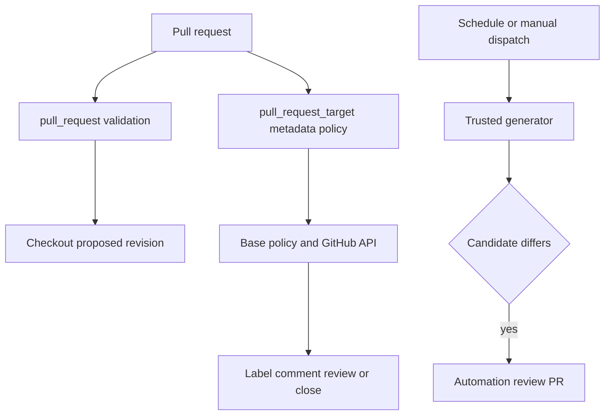
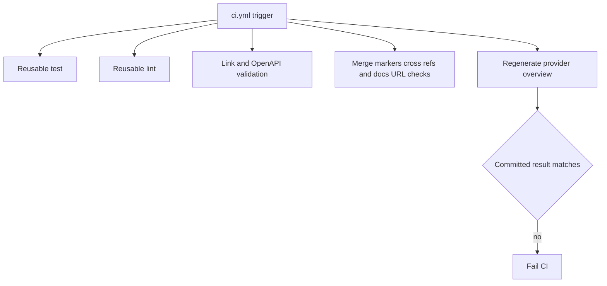
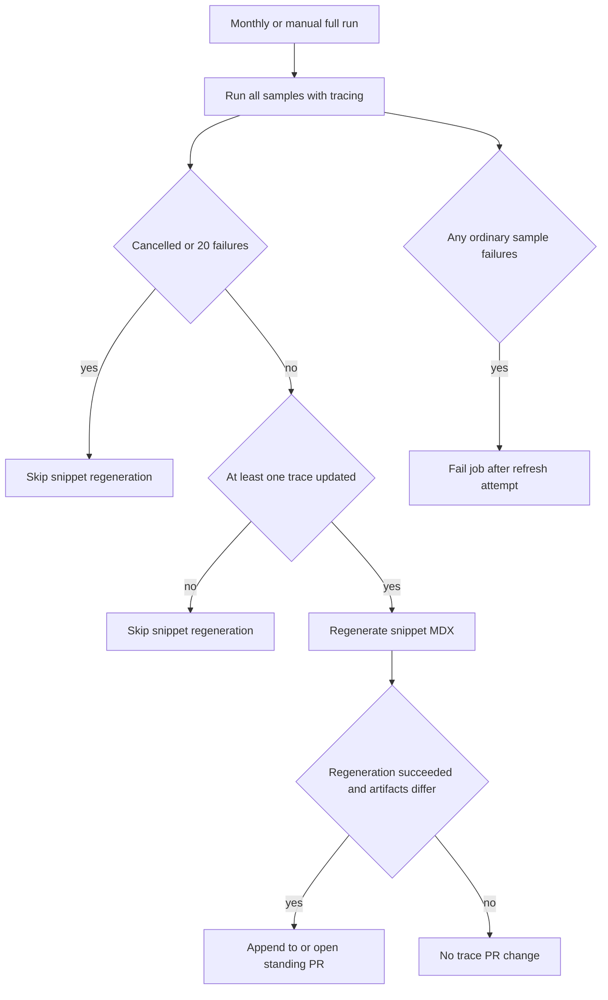

## Trust model

The workflows use three deliberately separate contexts. Keep their boundaries intact.

| Context | Entrypoints | Permitted role | Safety boundary |
| --- | --- | --- | --- |
| Untrusted revision validation | `pull_request` | Check out and validate the proposed revision. | Do not depend on repository secrets or writes while handling fork code. |
| Metadata-only PR automation | `pull_request_target` | Read base-branch policy and GitHub API metadata; label, comment, request review, or close. | Never check out, source, or execute fork-head code. Treat PR values and head-file bytes as data. |
| Trusted maintenance writer | Schedule or `workflow_dispatch` in the repository | Use narrowly granted credentials to generate a branch and review PR. | Preserve no-diff exits, limited paths, and review; package-download PRs are the explicit squash-auto-merge exception. |


```mermaid
flowchart TD
  Pull["Pull request"] --> Validate["pull_request validation"]
  Pull --> Metadata["pull_request_target metadata policy"]
  Validate --> Checkout["Checkout proposed revision"]
  Metadata --> API["Base policy and GitHub API"]
  API --> Mutate["Label comment review or close"]
  Trigger["Schedule or manual dispatch"] --> Writer["Trusted generator"]
  Writer --> Diff{"Candidate differs"}
  Diff -->|"yes"| Review["Automation review PR"]
```

This separates execution of a proposed revision from privileged PR mutation. Do not convert `pull_request_target` into a fork-testing workaround: do not add a head checkout, run a PR file, or construct shell commands from untrusted title, body, branch, or issue-form values.

## PR expectations and core CI

The PR template asks authors to describe the change and related work and, where applicable, confirm local documentation validation, tested examples, root-relative internal links, and navigation updates. Preview deployment is an optional internal-team action.

`ci.yml` runs on PRs, pushes to `main`, and manual dispatch. It fans out to reusable test, lint, and documentation-link checks, plus merge-conflict-marker, cross-reference, external `docs_url`, and generated-file checks. Its concurrency group combines workflow and ref and cancels obsolete runs after a newer push.


```mermaid
flowchart TD
  CI["ci.yml trigger"] --> Test["Reusable test"]
  CI --> Lint["Reusable lint"]
  CI --> Links["Link and OpenAPI validation"]
  CI --> Static["Merge markers cross refs and docs URL checks"]
  CI --> Generated["Regenerate provider overview"]
  Generated --> Match{"Committed result matches"}
  Match -->|"no"| Fail["Fail CI"]
```

This is the CI fan-out; generated-output drift fails rather than being silently repaired in CI.

The reusable test and lint workflows take caller-supplied Python and working-directory inputs, perform shallow checkouts, synchronize the `test` dependency group, and run `make test` or `make lint`. The reusable link workflow instead has read-only `contents` permission and a 20-minute limit, Python and Node setup, and runs Mintlify link and OpenAPI checks.

`check-generated-files` runs `pipeline/tools/partner_pkg_table.py` and fails when `src/oss/python/integrations/providers/overview.mdx` differs. Change `packages.yml` or the generator, regenerate, and commit the output rather than hand-editing the overview. The job bypasses this check for the `bypass-auto-check` label and the expected `github-actions[bot]` package-download PR.

The external-listing gate runs:

```bash
uv run python scripts/refresh_integration_downloads.py --check-docs-urls
```

Useful local counterparts are:

```bash
make test
make lint
make broken-links-with-anchors
make check-cross-refs
uv run python scripts/refresh_integration_downloads.py --check-docs-urls
uv run python pipeline/tools/partner_pkg_table.py
```

## HTML export testing and Linear escalation

`htmltest.yml` is a read-only weekly or manual check. It checks out without persisted credentials, prepares Python, Node 22, Mintlify, and htmltest, and runs `make export-htmltest`. That target builds, exports, unpacks, and checks only external URLs.

`htmltest-linear.yml` does not run the export or inspect its checkout. It reacts to completion of **Htmltest Mint Export** and creates a Linear issue only when the upstream run was scheduled and failed or was cancelled. Manual failures do not create tickets. The issue includes the upstream run URL.

Similarly, `test-code-samples-linear.yml` reacts to **Test Code Samples** only for scheduled failures or cancellations and files a Linear issue with the upstream run URL. It deliberately does not ticket manual or PR runs.

## Metadata-only pull-request automation

### Ownership summary

`pr-welcome-comment.yml` is a `pull_request_target` workflow that reads `.github/OWNERS` from `pr.base.ref` and changed-file metadata through GitHub APIs. It applies last-match ownership rules and can request only opted-in owners other than the PR author, without checking out PR code.

### External integration PRs

`external-integration-pr-comment.yml` is a `pull_request_target` workflow that does not check out or execute PR code. It uses API file metadata and an organization-membership App token to label qualifying external integration PRs, reads added MDX only as bytes to detect featured frontmatter, and otherwise posts an idempotent listing-form redirect before closing the PR.

## Maintainer-approved integration listings

`integration-submission.yml` begins only from manual dispatch or the `integration-run` label, verifies the triggering actor has write-level repository permission before checkout, and prevents duplicate processing with the `integration-automation` label.

After maintainer authorization, it parses issue-form data as untrusted metadata and directs the agent to leave local edits only. Parse, blocker, agent, and no-diff outcomes are reported on the issue, while a real diff alone lets the workflow create and link a review PR.

## Code-sample validation and trace refresh

`test-code-samples.yml` is triggered by changes under `src/code-samples/**` or to its workflow file on a PR, as well as by manual dispatch and the monthly schedule. The test job is explicitly skipped for fork PRs because supported samples need provider secrets. Thus, a fork does not use this workflow as a secret-backed validation path.

A scheduled or manual run sets `run_all=true` and tests every supported sample. For an internal PR, the workflow fetches the PR base, finds the merge base, and selects only changed `src/code-samples/` files with `.py`, `.ts`, `.java`, `.kt`, `.go`, or `.sh` extensions. A workflow-only PR can therefore trigger the workflow but have no selected sample files, in which case the test step reports zero failures and exits successfully. Full runs have a 150-minute limit; PR runs have a 60-minute limit. The job supplies PostgreSQL plus Python, Node, Java/JBang, and Go before invoking `make test-code-samples`.

Monthly and manual full runs set `CODE_SAMPLE_TRACING=1` and use four sample workers. The runner writes its counts to `GITHUB_OUTPUT`: a normal sample failure increments `sample_failures` and makes the runner return nonzero, whereas a sample still rate-limited after retries is reported as skipped. The retry budget defaults to five attempts (including the initial attempt), has increasing delays capped at 120 seconds, and can be tuned through `CODE_SAMPLE_RATE_LIMIT_ATTEMPTS` and `CODE_SAMPLE_RATE_LIMIT_DELAY_SECONDS`.

Trace collection is separate from sample correctness. The runner serializes trace collection and claimed-run tracking while samples execute concurrently. A trace-collection exception is recorded as a warning rather than a sample failure, so it does not itself make the runner fail. For a single-snippet source, collection looks for an unclaimed agent-like root run in the sample time window, makes its trace public, and stores its URL and run metadata in `src/code-samples/trace-links.json`. Multi-snippet sources are recorded as skipped and have stale single-snippet manifest entries removed.

The test step uses `continue-on-error` so the workflow can decide whether a partially failing full run has enough useful trace output to regenerate links. On scheduled or manual runs, it runs `make code-snippets` when the test was not cancelled, fewer than 20 samples failed, and at least one trace entry was updated. It does **not** require a completely successful sample run. The last step still fails the job when the test step failed, so regeneration can produce a reviewable partial refresh without turning a real sample failure into a green workflow.


```mermaid
flowchart TD
  Full["Monthly or manual full run"] --> Samples["Run all samples with tracing"]
  Samples --> Result{"Cancelled or 20 failures"}
  Result -->|"yes"| Skip["Skip snippet regeneration"]
  Result -->|"no"| Traces{"At least one trace updated"}
  Traces -->|"no"| NoTrace["Skip snippet regeneration"]
  Traces -->|"yes"| Snippets["Regenerate snippet MDX"]
  Snippets --> Refresh{"Regeneration succeeded and artifacts differ"}
  Refresh -->|"yes"| TracePR["Append to or open standing PR"]
  Refresh -->|"no"| Noop["No trace PR change"]
  Samples --> Final{"Any ordinary sample failures"}
  Final -->|"yes"| Fail["Fail job after refresh attempt"]
```

This full-run flow shows the partial-failure threshold and the independent final job result.

After successful snippet regeneration, the writer restores a clean tree, then either checks out the open `chore/refresh-code-sample-traces` branch or starts that branch from the current checkout. It compares only `src/code-samples/trace-links.json` and `src/snippets/code-samples` against that branch. With a diff it commits those paths and appends to the open PR; with no open PR it force-pushes the standing branch and opens a review PR. A no-diff refresh exits successfully. The local traced equivalent is `make update-code-sample-traces` and requires `LANGSMITH_API_KEY`.

## Trusted scheduled writers

### Package downloads and hosted-doc candidates

The scheduled package-download workflow keeps generation read-only until a second job consumes its short-lived artifact; when generated package and integration surfaces differ, that job creates a timestamped PR and enables squash auto-merge.

The package-download generator refreshes package counts only when their download timestamp is older than 24 hours, then regenerates the provider overview and integration download tables before artifact handoff. Package-download maintenance creates Linear hosted-documentation candidate tickets only when both the Linear API-key secret and team-key variable are configured; without either value it runs candidate detection in dry-run mode. Hosted-documentation candidate creation checks current external integration download counts against a default 50,000-per-month threshold and skips a duplicate when a matching Linear issue is still open.

### LangSmith OpenAPI refresh

The daily LangSmith OpenAPI refresh reuses its standing branch and appends to an existing open refresh PR, creating a new PR only when no such PR exists and the processed specification changed. The OpenAPI refresh processor fetches only from the allowlisted LangSmith API host and deterministically hides configured internal operations, normalizes visible titles, and groups and orders tags before writing the generated specification.

## Safe-change checklist

1. Keep `pull_request_target` metadata-only: never execute or check out fork-head code.
2. Keep secret-backed code-sample execution off fork PRs; use ordinary validation for fork revisions.
3. Preserve changed-path selection for internal sample PRs and full-run-only tracing; do not accidentally trace or write from untrusted PR execution.
4. Preserve the fewer-than-20-failures and at-least-one-trace conditions before snippet regeneration, while retaining the final failure for ordinary sample failures.
5. Preserve writer no-op behavior and narrow writes: trace and OpenAPI refreshes reuse standing review PRs, while package downloads cross a short-lived artifact boundary.
6. Treat writer PRs as reviewable public-documentation changes even when generation succeeds.

## Related pages

- [CLI Tools](/openwiki/operations/cli-tools.md)
- [Quickstart](/openwiki/quickstart.md)
- [Testing Overview](/openwiki/testing/test-overview.md)
- [Code Sample Lifecycle](/openwiki/workflows/code-sample-lifecycle.md)
- [LangSmith Platform OpenAPI Refresh](/openwiki/workflows/langsmith-openapi-refresh.md)
