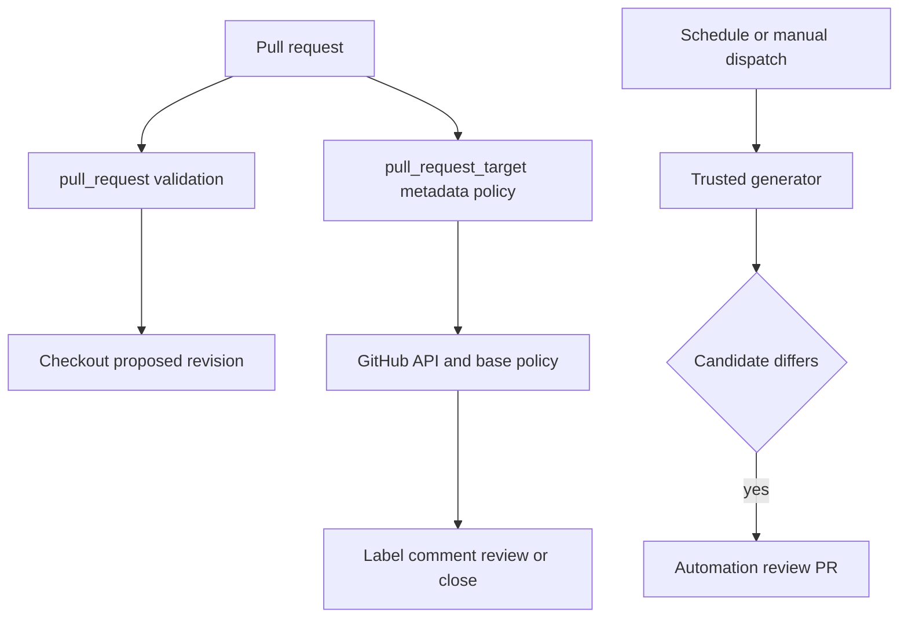
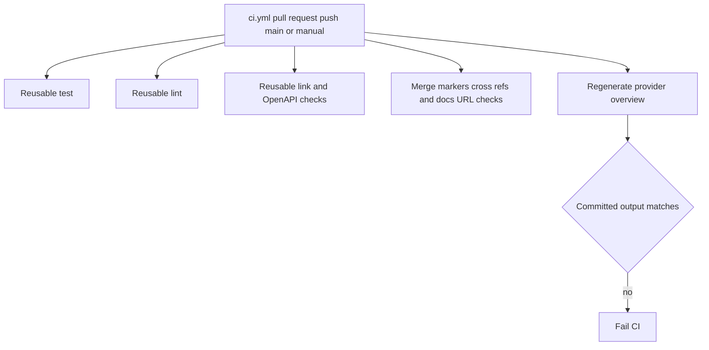
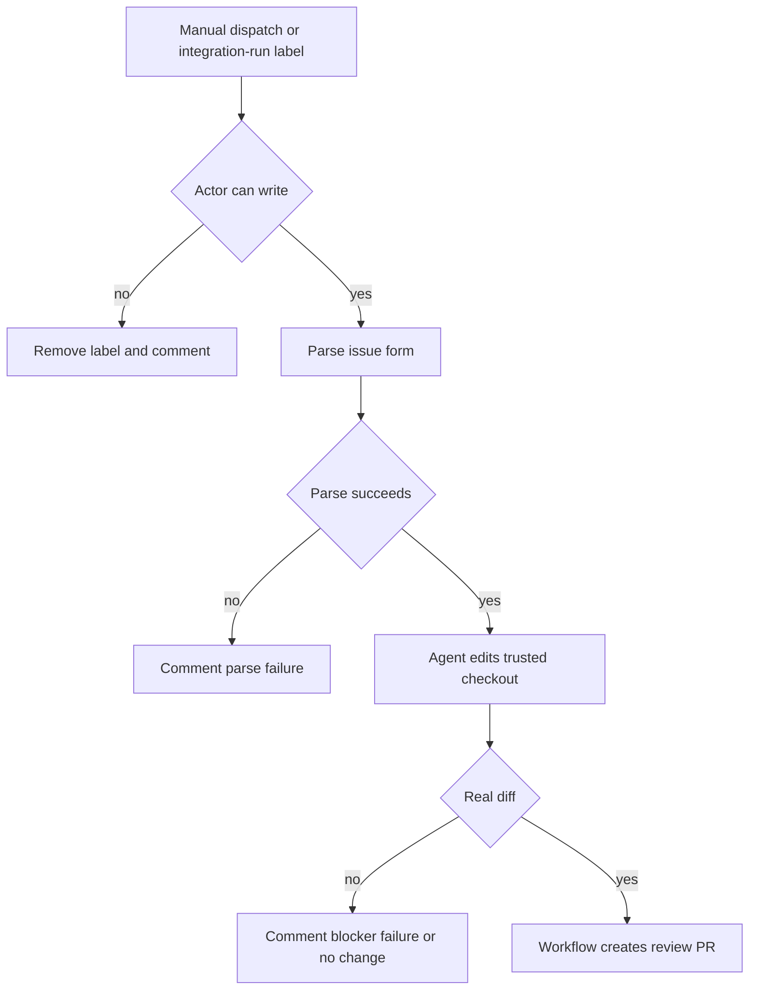
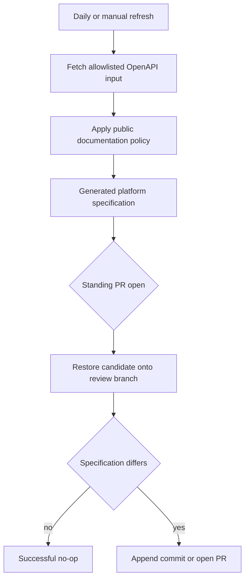

## Trust model and entrypoints

The repository uses three deliberately different execution contexts:

| Context | Entrypoints | What it may do | Boundary |
| --- | --- | --- | --- |
| **Untrusted revision validation** | `pull_request` | Check out and test the proposed revision with read-only validation. | Do not expose secrets or use a repository-writing token for fork code. |
| **Fork-facing metadata automation** | `pull_request_target` | Read base-branch policy and pull-request data through GitHub APIs; label, comment, request review, or close a PR. | **Never check out, source, or execute fork-head code.** Treat PR content as data, not commands. |
| **Trusted maintenance writers** | Schedule or `workflow_dispatch` in the repository | Use explicitly granted secrets or write permissions to generate a candidate branch and PR. | Preserve narrow artifact paths, no-diff exits, and human review (except the explicitly auto-merged package-download PR). |


```mermaid
flowchart TD
  Pull["Pull request"] --> Validate["pull_request validation"]
  Pull --> Target["pull_request_target metadata policy"]
  Validate --> Check["Checkout proposed revision"]
  Target --> API["GitHub API and base policy"]
  API --> Mutate["Label comment review or close"]
  Schedule["Schedule or manual dispatch"] --> Writer["Trusted generator"]
  Writer --> Diff{"Candidate differs"}
  Diff -->|"yes"| Review["Automation review PR"]
```

This shows why validation and privileged PR mutation are separate: only ordinary validation handles the proposed checkout, while target workflows operate on metadata and GitHub API responses.

Do not turn `pull_request_target` into a workaround for testing forks. In particular, do not add `actions/checkout` at the PR head, run a file from the PR, or interpolate untrusted title, body, branch, or issue-form values into a shell command. Put executable checks on `pull_request`; put secret-backed work and repository writes on trusted triggers.

## Core CI: reusable checks and generated outputs

`ci.yml` runs reusable test, lint, and documentation-link workflows plus merge-conflict, cross-reference, external documentation URL, and generated-file checks on pull requests and pushes to main. It also supports manual dispatch. Its concurrency group combines workflow and ref and cancels an earlier in-progress run when a newer push arrives, so feedback follows the current branch or PR head rather than consuming runners on obsolete commits.


```mermaid
flowchart TD
  CI["ci.yml pull request push main or manual"] --> Test["Reusable test"]
  CI --> Lint["Reusable lint"]
  CI --> Links["Reusable link and OpenAPI checks"]
  CI --> Static["Merge markers cross refs and docs URL checks"]
  CI --> Generated["Regenerate provider overview"]
  Generated --> Match{"Committed output matches"}
  Match -->|"no"| Fail["Fail CI"]
```

This is the CI fan-out; a regenerated output mismatch is a failure rather than a signal to manually patch generated documentation.

The reusable test and lint workflows accept a Python version and working directory, take shallow checkouts, synchronize the `test` dependency group, and run `make test` or `make lint`. The link workflow accepts the Python version, has read-only `contents` permission and a 20-minute limit, installs Python dependencies and Node 22/Mintlify, then runs `make broken-links-with-anchors` and `make check-openapi`. These caller interfaces do not declare secret inputs.

`check-generated-files` regenerates `src/oss/python/integrations/providers/overview.mdx` with `pipeline/tools/partner_pkg_table.py` and fails if the committed result differs. Update `packages.yml` or the generator, regenerate, and commit the result; do not hand-edit the generated overview. The check can be bypassed by the `bypass-auto-check` label and skips the expected `github-actions[bot]` package-download update PR.

The independent external-listing gate runs:

```bash
uv run python scripts/refresh_integration_downloads.py --check-docs-urls
```

It validates `docs_url` values before documentation generation: `http(s)` URLs and site-relative paths beginning with one `/` are allowed, while blank, protocol-relative, and unsafe-scheme values are rejected. This check validates the link-target syntax, not remote reachability. See [Integration Listing Automation](/openwiki/workflows/integration-listing-automation.md) for the metadata and generated-table lifecycle.

Useful local equivalents are:

```bash
make test
make lint
make broken-links-with-anchors
make check-cross-refs
uv run python scripts/refresh_integration_downloads.py --check-docs-urls
uv run python pipeline/tools/partner_pkg_table.py
```

## Metadata-only pull-request automation

### Ownership summary

`pr-welcome-comment.yml` runs for non-draft PRs when opened or marked ready for review. It fetches `.github/OWNERS` at `pr.base.ref`, lists changed-file metadata through the GitHub API, and applies CODEOWNERS-style **last matching rule wins** matching. `.github/OWNERS` is intentionally not named `CODEOWNERS`, so GitHub itself does not automatically request reviewers.

A rule may opt into review requests with `# auto-request` or a scoped `# auto-request: @user` suffix. The workflow requests only opted-in owners and never requests the PR author; it posts a grouped ownership summary and falls back to the configured general reviewer only when appropriate. This policy is base-controlled even when the PR comes from a fork.

### External integration pull requests

`external-integration-pr-comment.yml` uses `pull_request_target` for non-draft opened, ready, reopened, and synchronized PRs. It has only `contents: read` and `pull-requests: write`, obtains an organization-membership GitHub App token, and uses `actions/github-script` plus GitHub APIs—there is no checkout step.

The workflow examines changed-file metadata for newly added Python or JavaScript integration files (excluding `TEMPLATE.mdx`) or a change to `scripts/data/integration_external_docs.yaml`. Bot authors are ignored. `open-swe[bot]` is treated as internal; organization membership failures, including non-404 failures, are conservatively treated as external. A qualifying external PR receives the `integration` label if absent.

For a newly added MDX integration page, it may read the file bytes at the PR head through `repos.getContent` solely to recognize frontmatter `featured: true`. That is inspection of untrusted content as data, **not** permission to execute or check it out. If any added integration is featured, the workflow leaves the PR open after labeling. Otherwise it posts at most one marker-tagged comment pointing authors to the integration-listing issue form, then closes an open PR. The marker makes repeated synchronize events idempotent.

## Maintainer-approved integration listing generation

`integration-submission.yml` is a trusted writer with contents, pull-request, and issue write permissions. Opening an issue does not invoke it: it starts only on manual dispatch or when `integration-run` is applied. Before checkout, the workflow verifies that the triggering actor has `admin`, `maintain`, or `write` repository permission. An unauthorized label event removes `integration-run`, comments on the issue, and stops; an existing `integration-automation` label also prevents duplicate processing.

After authorization it checks out the base repository, parses the issue form to JSON, and marks automation in progress. The prompt explicitly classifies submitted fields as untrusted listing metadata, requires local uncommitted edits, and forbids the agent from pushing, opening a PR, or commenting. The workflow—not the agent—owns GitHub mutation. Parse errors, a blocker file, agent failure, and an empty diff are each reported to the issue; only a real diff creates `integration/issue-<number>`, opens a labeled review PR, and links it back to the issue.


```mermaid
flowchart TD
  Event["Manual dispatch or integration-run label"] --> Permit{"Actor can write"}
  Permit -->|"no"| Reject["Remove label and comment"]
  Permit -->|"yes"| Parse["Parse issue form"]
  Parse --> Parsed{"Parse succeeds"}
  Parsed -->|"no"| ParseNote["Comment parse failure"]
  Parsed -->|"yes"| Agent["Agent edits trusted checkout"]
  Agent --> Changed{"Real diff"}
  Changed -->|"no"| NoChange["Comment blocker failure or no change"]
  Changed -->|"yes"| PR["Workflow creates review PR"]
```

This lifecycle requires maintainer authorization before either checkout or agent execution and preserves review as the acceptance boundary.

## Secret-backed sample validation and trace refresh

`test-code-samples.yml` is a `pull_request` workflow limited to changes under `src/code-samples/**` or to its own workflow file, with manual and monthly entrypoints. Although full runs can write a refresh PR, its credential-dependent job explicitly skips fork PRs. Internal PRs select changed supported sample files from the merge base; manual and scheduled runs set `RUN_ALL` and test all samples. The latter have a 90-minute limit rather than the PR job's 60 minutes.

Only monthly and manual full runs set `CODE_SAMPLE_TRACING`. After a successful sample test, they regenerate snippet MDX and compare `src/code-samples/trace-links.json` plus `src/snippets/code-samples` before maintaining the standing `chore/refresh-code-sample-traces` PR. The runner treats a persistent LangSmith HTTP 429 as a skipped sample after up to three attempts; ordinary sample and trace-collection failures fail the run. Public trace publication applies to eligible single-snippet sources: multi-snippet files are recorded as skipped rather than assigned an ambiguous trace.

## Trusted scheduled writers

### Package downloads

`update-package-downloads.yml` runs Sunday at 23:59 UTC or manually. Its read-only `generate-downloads` job updates eligible package counts, regenerates the provider overview and integration table snippets, detects hosted-documentation candidates, and uploads the candidate surfaces as a one-day artifact. Download collection respects the package timestamp: packages updated within the preceding 24 hours are not refreshed again.

Hosted-documentation candidate creation is conditional: the workflow invokes `flag_hosted_docs_candidates.py --create` only when both `LINEAR_API_KEY` and `LINEAR_TEAM_KEY` are configured; otherwise detection is a dry run. The subsequent `commit-downloads` job is the only write-capable job. It consumes the artifact, exits successfully when `packages.yml`, the overview, and snippets have no diff, or creates a timestamped `chore/update-package-downloads-*` PR and requests squash auto-merge.

### LangSmith OpenAPI refresh

`refresh-langsmith-openapi.yml` is a daily 10:00 UTC or manual trusted writer with a 15-minute limit and only contents/pull-request write permissions. It runs `scripts/process_langsmith_openapi.py --write`, which accepts network input only from `api.smith.langchain.com`. The processor marks configured Fleet, internal, and health operations hidden, normalizes operation summaries (including stable Beta/v2 labeling), adds and orders public tag groups, and writes deterministic formatted JSON to `src/langsmith/langsmith-platform-openapi.json`.

The workflow preserves the generated file while resetting the checkout, then uses `chore/refresh-langsmith-openapi` as a standing review branch. If an open PR already uses that head, it restores the candidate on that branch and appends a commit only for a changed specification. Otherwise it exits for no diff or force-pushes the standing branch and opens a new PR. A fetch allowlist, narrow staging of only the generated specification, no-diff success, and the review PR are the safeguards around a changing remote input. See [LangSmith Platform OpenAPI Refresh](/openwiki/workflows/langsmith-openapi-refresh.md) for the public-reference policy.


```mermaid
flowchart TD
  Trigger["Daily or manual refresh"] --> Fetch["Fetch allowlisted OpenAPI input"]
  Fetch --> Process["Apply public documentation policy"]
  Process --> Candidate["Generated platform specification"]
  Candidate --> Existing{"Standing PR open"}
  Existing --> Apply["Restore candidate onto review branch"]
  Apply --> Diff{"Specification differs"}
  Diff -->|"no"| Stop["Successful no-op"]
  Diff -->|"yes"| Update["Append commit or open PR"]
```

This flow maintains one reviewable OpenAPI refresh rather than accumulating daily pull requests.

## Safe-change checklist

1. Keep `pull_request_target` workflows metadata-only: no fork-head checkout, no execution of fork files, and no shell construction from untrusted PR data.
2. Keep secret-backed sample execution off fork PRs; validate fork code through ordinary read-only `pull_request` checks instead.
3. When changing generated documentation, update its source metadata or generator, regenerate it, and retain the CI mismatch check.
4. Preserve the integration-submission ordering: authorization before checkout and agent invocation, agent-local edits only, workflow-owned PR creation only after a real diff.
5. Preserve writer no-op behavior and scope: the package writer transfers a short-lived artifact to its sole write job, while the OpenAPI writer stages only its generated JSON and reuses its standing branch.
6. Review generated writer PRs as changes to public documentation; a successful generator run is not itself publication approval.

## Related pages

- [Testing Overview](/openwiki/testing/test-overview.md)
- [Code Sample Lifecycle](/openwiki/workflows/code-sample-lifecycle.md)
- [Integration Listing Automation](/openwiki/workflows/integration-listing-automation.md)
- [LangSmith Platform OpenAPI Refresh](/openwiki/workflows/langsmith-openapi-refresh.md)
- [Changelog Publication](/openwiki/workflows/changelog-publication.md)
