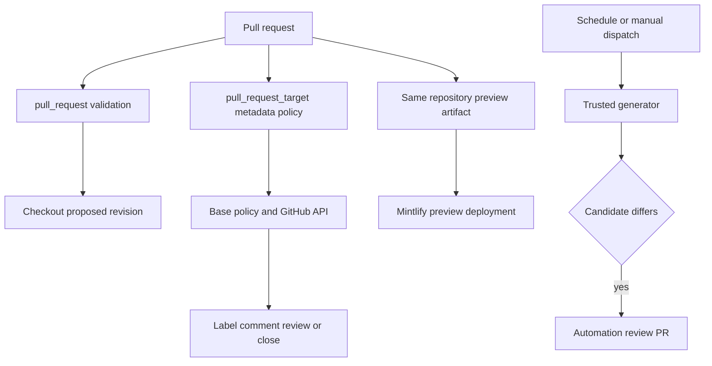
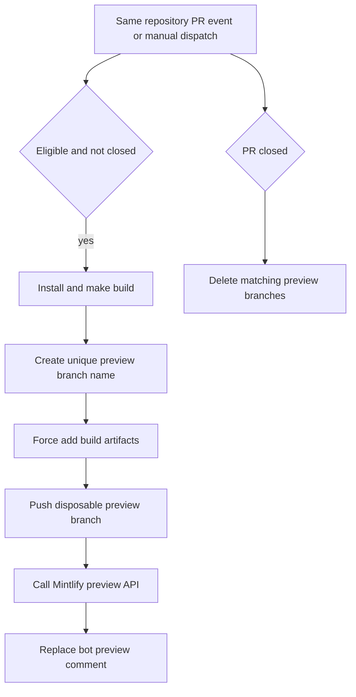

# GitHub Actions and CI/CD

## Trust model

The workflows have distinct execution and authority boundaries. A workflow event is not enough to determine safety: check whether it checks out a contributor revision, has secrets, and can mutate repository or pull-request state.

| Context | Entrypoints | Role | Boundary |
| --- | --- | --- | --- |
| Untrusted revision validation | `pull_request` | Check out and validate the proposed revision. | Do not require repository secrets or write permissions while processing fork code. |
| Metadata-only PR automation | `pull_request_target` | Read the base policy and GitHub API metadata; label, comment, request review, or close. | Never check out, source, or execute PR-head code. Treat PR fields and fetched head-file bytes as data. |
| Internal preview artifact writer | Same-repository PR events and `workflow_dispatch` | Build a disposable deployment artifact and request a Mintlify preview. | Restricted to branches the repository can write; the generated `preview-*` branch is neither source nor a merge target. |
| Trusted maintenance writer | Schedule or repository `workflow_dispatch` | Generate a narrowly scoped change and open or update a review PR. | Preserve no-diff exits, limited paths, and review. Package-download updates are the explicit squash-auto-merge exception. |


```mermaid
flowchart TD
  Pull["Pull request"] --> Validate["pull_request validation"]
  Pull --> Metadata["pull_request_target metadata policy"]
  Pull --> Preview["Same repository preview artifact"]
  Validate --> Checkout["Checkout proposed revision"]
  Metadata --> API["Base policy and GitHub API"]
  API --> Mutate["Label comment review or close"]
  Preview --> Mint["Mintlify preview deployment"]
  Trigger["Schedule or manual dispatch"] --> Writer["Trusted generator"]
  Writer --> Diff{"Candidate differs"}
  Diff -->|"yes"| Review["Automation review PR"]
```

This maps the authority paths rather than treating all pull-request workflows alike. Do not convert a `pull_request_target` workflow into a fork-testing workaround: do not add a head checkout, run a PR file, or construct shell commands from untrusted title, body, branch, or issue-form values.

## Core CI and local equivalents

The PR template asks contributors to describe the change and related work and, where applicable, confirm local documentation validation, tested examples, root-relative internal links, and navigation updates. It identifies preview deployment as an optional internal-team action.

`ci.yml` runs on pull requests, pushes to `main`, and manual dispatch. It fans out to reusable test, lint, and documentation-link checks, plus merge-conflict-marker, cross-reference, external `docs_url`, and generated-file checks. Its concurrency group combines workflow and ref and cancels an obsolete run after a newer push.

The reusable test and lint workflows make shallow checkouts, synchronize the `test` dependency group, and run `make test` or `make lint` using caller-supplied Python and working-directory inputs. The reusable link workflow has read-only `contents` permission, a 20-minute limit, Python and Node setup, and runs Mintlify link and OpenAPI checks.

`check-generated-files` regenerates `src/oss/python/integrations/providers/overview.mdx` with `pipeline/tools/partner_pkg_table.py` and fails on drift. Update `packages.yml` or the generator, regenerate, and commit the output rather than hand-editing the overview. The job can be bypassed by `bypass-auto-check` and automatically skips the expected `github-actions[bot]` package-download update.

Useful local counterparts are:

```bash
make test
make lint
make broken-links-with-anchors
make check-cross-refs
uv run python scripts/refresh_integration_downloads.py --check-docs-urls
uv run python pipeline/tools/partner_pkg_table.py
```

## Mintlify preview-branch lifecycle

`create-preview-branch.yml` runs for opened, synchronized, reopened, and closed PRs, plus manual dispatch. It cancels superseded work per ref. Creation is allowed only for same-repository PRs (or a manual run) and not for a closed PR, because it needs `contents: write`; fork PRs are excluded rather than becoming a secret- or write-backed validation path.


```mermaid
flowchart TD
  Event["Same repository PR event or manual dispatch"] --> Gate{"Eligible and not closed"}
  Gate -->|"yes"| Build["Install and make build"]
  Build --> Name["Create unique preview branch name"]
  Name --> Artifact["Force add build artifacts"]
  Artifact --> Push["Push disposable preview branch"]
  Push --> Deploy["Call Mintlify preview API"]
  Deploy --> Comment["Replace bot preview comment"]
  Event --> Closed{"PR closed"}
  Closed --> Cleanup["Delete matching preview branches"]
```

This is an artifact lifecycle, not a source-branch workflow. The job validates source-branch characters and length, builds the checkout, then creates a collision-resistant `preview-<sanitized-prefix>-<timestamp>-<short-sha>` branch. It force-adds `build/`, commits those artifacts when present, and pushes the branch. The commit explicitly says not to merge the branch to `main`.

After a successful create job, the comment job is the only preview job with `pull-requests: write`. It requires `MINTLIFY_API_KEY`, `MINTLIFY_PROJECT_ID`, and the generated branch, then calls Mintlify's preview endpoint. A malformed JSON response, or an API error without a status ID or preview URL, fails the job. The comment replaces prior bot preview comments and includes the preview URL when returned. It ranks routable changed Markdown files by diff size and exposes at most five deep links; code samples and snippets are excluded from that list.

Closing a PR runs a separate `contents: write` cleanup job. It derives the same six-character alphanumeric source prefix, finds remote `preview-<prefix>-*` branches, and refuses to delete any branch not beginning with `preview-`. This prefix-based cleanup can remove multiple artifacts sharing that prefix, which is acceptable only because preview branches are disposable generated deployments. Never author on, merge, or rely on a preview branch for review history.

Production is a different handoff: `publish.yml` builds on pushes to `main` or manual dispatch, verifies `build/`, copies it under `public/build`, and publishes that directory to the `prod` branch using the workflow token. Like preview branches, `prod` is deployment output rather than an authoring location.

## Metadata-only pull-request automation

`pr-welcome-comment.yml` is a `pull_request_target` workflow that reads `.github/OWNERS` from `pr.base.ref` and changed-file metadata through GitHub APIs. It applies last-match ownership rules and can request only opted-in owners other than the PR author, without checking out PR code.

`external-integration-pr-comment.yml` likewise does not check out or execute PR code. It uses API file metadata and an organization-membership App token to label qualifying external integration PRs, reads added MDX only as bytes to detect featured frontmatter, and otherwise posts an idempotent listing-form redirect before closing the PR.

## Maintainer-approved integration listings

`integration-submission.yml` begins only from manual dispatch or the `integration-run` label, verifies the triggering actor has write-level repository permission before checkout, and prevents duplicate processing with the `integration-automation` label.

After that authorization, it parses issue-form data as untrusted metadata and directs the agent to leave local edits only. Parse, blocker, agent, and no-diff outcomes are reported on the issue; only a real diff permits creation and linking of a review PR.

## Scheduled validation and trace refresh

`htmltest.yml` is a read-only weekly or manual job. It checks out without persisted credentials, prepares Python, Node 22, Mintlify, and htmltest, then runs `make export-htmltest`; that target builds, exports, unpacks, and checks only external URLs. The HTML-export and code-sample Linear workflows react only to scheduled upstream failures or cancellations, create a Linear issue using configured secrets and the upstream run URL, and deliberately do not ticket manual or PR runs.

`test-code-samples.yml` runs for code-sample or workflow-file PR changes, manual dispatch, and monthly schedule. Its credential-dependent job skips fork PRs. An internal PR finds the merge base with its base branch and passes only changed supported files under `src/code-samples` to the runner; manual and scheduled runs test all samples. Full runs have a 150-minute limit, versus 60 minutes for PR runs, and provision PostgreSQL plus Python, Node, Java/JBang, and Go.

Monthly and manual full runs enable LangSmith tracing. The runner retries a LangSmith 429 up to a configurable default of five attempts; persistent rate limiting is a skipped sample, ordinary sample failures fail the runner, and trace-collection failures are warnings. Trace publication is limited to single-snippet source files: multi-snippet files are recorded as skipped, while a selected agent-like LangSmith root run is publicly shared and stored in the trace-link manifest.

The test step continues after failure so a full run with fewer than 20 sample failures and at least one updated trace can regenerate snippets. The final step still fails the job when tests failed. After a successful regeneration, the workflow compares artifacts with `chore/refresh-code-sample-traces`, appending to its open PR or opening it only when the manifest or generated snippets differ.

## Trusted scheduled writers

The scheduled package-download workflow keeps generation read-only until a second job consumes its one-day artifact. It refreshes package counts only when their timestamp is older than 24 hours, regenerates the provider overview and integration tables, and creates a timestamped PR with squash auto-merge only when generated surfaces differ. Hosted-documentation candidate tickets are created only when both Linear configuration values exist; otherwise detection is dry-run. Candidates use a default 50,000-per-month threshold and do not duplicate an open matching Linear issue.

The daily LangSmith OpenAPI refresh processes the specification and reuses `chore/refresh-langsmith-openapi`: it appends to an open refresh PR, or creates one only when no such PR exists and the output changed. The processor fetches only the allowlisted LangSmith API host and deterministically hides configured internal operations, normalizes visible titles, and groups and orders tags before writing the generated specification.

OpenWiki itself is a trusted daily or manual documentation writer. It uses a full-history checkout so `openwiki code --update` can compare against the previously documented commit, receives repository content and PR write permissions, and uses `create-pull-request` to maintain `openwiki/update`. Its PR scope is restricted to `openwiki`, `AGENTS.md`, and its workflow definition; review it as generated documentation rather than allowing it to broaden its write set.

## Safe-change checklist

1. Keep `pull_request_target` automation metadata-only; never check out or execute fork-head code.
2. Keep secret-backed sample execution off fork PRs and preserve changed-path selection for internal PRs.
3. Treat `preview-*` and `prod` as generated deployment artifacts. Do not merge, author on, or use them as durable branch state.
4. Preserve preview eligibility, input validation, unique naming, prefix-only cleanup, and separation of branch write from PR-comment permission.
5. Preserve no-op behavior and narrow write sets for scheduled writers; trace and OpenAPI refreshes reuse standing review PRs, while package downloads cross an artifact boundary.
6. Preserve the trace refresh threshold and final failure semantics: partial refresh does not make ordinary sample failures green.
7. Treat every automation PR as reviewable documentation output, including OpenWiki updates and generated public API changes.

## Related pages

- [Mintlify Integration](/openwiki/integrations/mintlify.md)
- [Quickstart](/openwiki/quickstart.md)
- [Testing Overview](/openwiki/testing/test-overview.md)
- [Integration Listing Automation](/openwiki/workflows/integration-listing-automation.md)
- [LangSmith Platform OpenAPI Refresh](/openwiki/workflows/langsmith-openapi-refresh.md)
