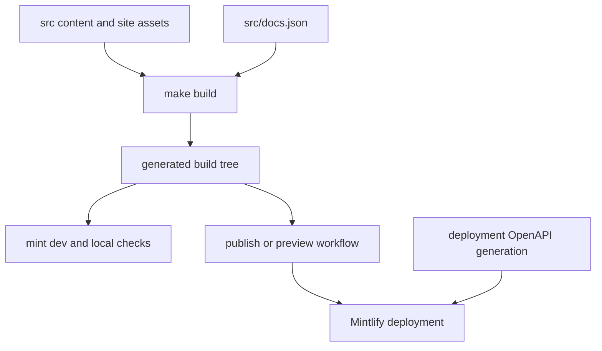

# Mintlify Integration

Mintlify is the renderer and hosting integration for [docs.langchain.com](https://docs.langchain.com). It consumes the regenerated `build/` tree, not the editable `src/` tree. Change source inputs and rebuild; do not patch `build/`.



This shows the renderer handoff: the local pipeline creates the tree Mintlify consumes, while deployment-time OpenAPI generation occurs at the Mintlify boundary.

## Renderer-facing contract

Mintlify is the static site generator responsible for rendering the built documentation from /build/ into docs.langchain.com. The LangChain documentation pipeline produces markdown and MDX output in /build/, and Mintlify reads this output along with site configuration from docs.json to render the final site.

`DocumentationBuilder.build_all` replaces `build/`, emits versioned OSS content under `oss/python/` and `oss/javascript/`, emits the unversioned Deep Agents Code and OpenWiki trees, builds LangSmith content and Managed Deep Agents variants, then copies shared inputs. This makes `src/docs.json`, styles, assets, fonts, snippets, and client JavaScript renderer-facing inputs only after a build.

Site configuration is defined in /src/docs.json (copied to /build/docs.json) using Mintlify's docs.json schema, specifying navigation menus, theme (aspen), fonts (TWK Lausanne for headings, Inter for body), icons (Tabler library), colors, analytics (Google Tag Manager), contextual actions, and URL redirects.

The contract additionally defines branding, appearance, code-block themes, SEO metadata, header resources, banner, footer, and navbar actions. The aspen theme is customized with TWK Lausanne (weight 700) for headings loaded via docs.json, additional font weights declared in /src/style.css via @font-face rules, and Inter for body text. Custom CSS in /src/style.css overrides Mintlify defaults and is injected into page headers via docs.json. It imports IBM Plex Mono for code and applies light/dark typography and component overrides, so visual changes require inspection in Mintlify.

Mintlify renders contextual actions defined in docs.json including built-in options (copy, view) and custom integrations (llms.txt, ChatGPT, Claude, MCP, Cursor, VSCode). These appear in the page header for users to access documentation in external tools or copy URLs.

### Product navigation and paths

`navigation.products` in `docs.json` owns the product menu. Under **PRODUCTS AND SETUP**, it exposes separate entries for:

- **LLM Gateway**, a Beta route/control/observability section with overview, quickstart, API-format, capability, governance, and advanced pages.
- **No-code agents**, the Fleet documentation organized into getting-started, configuration, tools and automation, advanced, and additional-resource groups.
- **Engine**, covering overview, issue workflow, GitHub integration, categories, webhooks, security, and self-hosting.
- **Deep Agents Code**, an unversioned OSS section at `oss/deepagents/code/`. Its expanded Configuration group supplies an explicit root plus credentials, config-file, hooks, and MCP-tools children.

Navigation paths must match builder behavior. Deep Agents Code is built once without a language prefix and is excluded from `/oss/` language-link rewriting. In contrast, ordinary OSS links acquire a Python or JavaScript prefix, and Managed Deep Agents pages are emitted at language-specific LangSmith routes. The builder tests cover these route and rewrite invariants.

### Redirects and OpenAPI

The redirects array in docs.json maps deprecated or reorganized routes to canonical pages, including former LLM Gateway paths and explicit unversioned Managed Deep Agents paths to their Python routes. A route move should reconcile output paths, navigation, inbound links, and any needed redirects.

Three OpenAPI navigation sections have different inputs but one important boundary: Mintlify generates their endpoint documentation during deployment. The configured directories name generated endpoint route spaces; they do **not** name files locally emitted by this repository.

- **Agent Server API** reads the committed `langsmith/agent-server-openapi.json` and declares `langsmith/agent-server-api`.
- **Control Plane API** reads `https://api.host.langchain.com/openapi.json` at deployment rather than a repository-built specification.
- **LangSmith REST API** reads the committed `langsmith/langsmith-platform-openapi.json` and declares `langsmith/smith-api`.

Mintlify is configured with three OpenAPI sections: committed Agent Server and LangSmith REST specifications generate under langsmith/agent-server-api and langsmith/smith-api, while the Control Plane specification is fetched from https://api.host.langchain.com/openapi.json at deployment. The LangSmith REST specification is refreshed daily through a standing update PR workflow.

The refresh workflow runs `scripts/process_langsmith_openapi.py --write`. The script fetches only its allow-listed LangSmith host, marks configured Fleet/internal and health operations hidden, normalizes visible operation titles, groups tags for the generated sidebar, and writes the committed REST specification. The workflow reuses one open `chore/refresh-langsmith-openapi` PR and exits without a commit when the processed specification is unchanged.

`make check-openapi` runs `mint openapi-check` against the local Agent Server input in `build/`. It validates that input, not remote Control Plane availability or deployment-time endpoint generation. This site-level OpenAPI is also distinct from the separately hosted `reference.langchain.com`, whose generated API reference is not built in this repository.

## Local development and validation

The development workflow uses mint dev CLI (a separate global npm binary installed via npm install -g mint@latest) running in the /build/ directory on port 3000. The docs dev command in pipeline/commands/dev.py orchestrates file watching via FileWatcher and launches mint dev as an async subprocess.

`make dev` installs project npm dependencies and invokes the pipeline command. Unless `--skip-build` is supplied, it performs an initial build, watches `src/`, and starts `mint dev --port 3000` from `build/`. An initial build failure prevents startup; a nonzero Mint exit or an unexpected watcher stop fails the command. On interruption, the command shuts down the watcher and terminates the child process.

Run the generated-tree structural checks with:

```bash
make broken-links
make broken-links-with-anchors
make check-openapi
```

The Mint link-check targets build first and run from `build/`, avoiding root-directory parsing of virtual-environment files. They filter known false positives before failing on remaining indented link entries: standalone snippets are importable components rather than standalone pages, deployment-generated OpenAPI routes are absent locally, and anchor mode additionally filters specified SmithDB migration anchors. The reusable link-check workflow uses Node 22, installs or restores the global Mint CLI, applies its KaTeX workaround, then runs the anchor check and Agent Server OpenAPI validation.

Snippet imports in MDX files are expanded by Mintlify at render time; they are not served as standalone pages. The build system processes snippets and stores language-specific versions at /build/snippets/{python|javascript}/, and Mintlify inlines them into importing pages. Versioned pages have their snippet imports rewritten to the corresponding language-specific path; a Python-default copy remains for unversioned consumers.

## Offline export

```bash
make export
make htmltest
# or
make export-htmltest
```

The make export target builds the generated documentation and runs mint export from build/, producing build/export.zip by default. It requires a recent Mint CLI with export support, Node LTS 20 or 22, and an Enterprise Mintlify plan.

Offline export validation unpacks the Mint archive and intentionally uses htmltest only for external URLs because Mintlify export does not emit a complete page set; internal and internal-hash checks are disabled. Therefore, a successful export check does not establish internal navigation correctness; use the generated-tree Mint checks for that purpose.

## Publication and preview operations

The publish workflow runs on pushes to `main` and manual dispatch. It builds `build/`, verifies that directory, copies it into `public/build`, and publishes `public` to `prod` using `peaceiris/actions-gh-pages@v4` and `GITHUB_TOKEN`. Mintlify consumes the published generated build subtree.

The publish.yml GitHub Actions workflow deploys documentation by building /build/ from source, copying it into /public/build/, and pushing to the prod branch using peaceiris/actions-gh-pages@v4. Mintlify monitors the prod branch and automatically redeploys when changes are pushed.

Preview is a separate, least-privilege path. For same-repository pull requests or manual dispatch, the workflow validates the source-branch format and length, builds the documentation, derives a timestamp- and commit-suffixed `preview-*` branch, force-adds `build/`, and pushes it. Fork PRs and closed PRs do not enter this creation job.

The preview workflow builds artifacts for same-repository pull requests, pushes them to a preview branch, and invokes Mintlify's preview API only after validating the required API key, project ID, and branch name; closed pull requests trigger preview-branch cleanup.

The downstream job requires `MINTLIFY_API_KEY`, `MINTLIFY_PROJECT_ID`, and the branch name before POSTing to Mintlify's preview endpoint. It fails on invalid JSON or an API error with neither a status ID nor preview URL, then posts a PR comment with the preview and up to five ranked routable changed-page deep links. On close, cleanup computes the sanitized source prefix and refuses to delete a branch not beginning `preview-`.

## Change checklist

1. Edit `src/` inputs, especially MDX, `src/docs.json`, assets, or `src/style.css`; then run `make build`.
2. For a page or route change, reconcile generated path, product navigation, language behavior, and legacy redirects.
3. Inspect locally with `make dev`; run `make broken-links-with-anchors` for navigation, route, snippet, or reference changes.
4. Run `make check-openapi` after changing the Agent Server input. Treat remote Control Plane retrieval and generated OpenAPI endpoint routes as deployment-time behavior.
5. Use `make export-htmltest` only for its external-link coverage.
6. Use the preview or production workflow to validate the Mintlify publication boundary.

## Related concepts

- [Build system](/openwiki/architecture/build-system.md) — source transformation and generated-tree lifecycle.
- [Source map](/openwiki/architecture/source-map.md) — source paths, URLs, and build output mapping.
- [GitHub Actions](/openwiki/integrations/github-actions.md) — CI, publication, and preview workflows.
- [Adding pages](/openwiki/operations/adding-pages.md) — source, navigation, and route changes.
- [Test overview](/openwiki/testing/test-overview.md) — repository validation layers.
- [Local development](/openwiki/workflows/local-development.md) — developer environment and commands.
