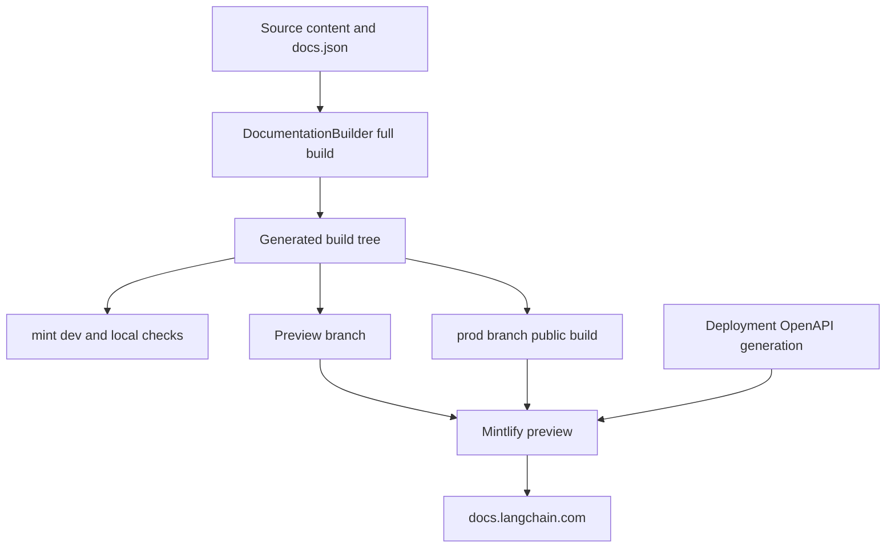

# Mintlify Integration

Mintlify is the rendering and hosting boundary for [docs.langchain.com](https://docs.langchain.com). It consumes the regenerated `build/` tree, not the editable `src/` tree. Make changes in source, rebuild, and never patch `build/` or deployment-generated endpoint pages.



This is the ownership boundary: the builder owns the disposable input tree; Mintlify renders and deploys it. OpenAPI endpoint routes are generated at deployment, so they are neither editable source files nor dependable local build artifacts.

## The build-to-renderer handoff

A full `DocumentationBuilder` build deletes and recreates `build/`. It emits Python and JavaScript OSS variants, unversioned Deep Agents Code and OpenWiki content, ordinary LangSmith content, and language-specific Managed Deep Agents routes; it then copies shared artifacts and creates derived LLM artifacts. `src/docs.json` is copied as `build/docs.json`, which makes the generated tree and configuration a single handoff unit for Mintlify.

This routing affects navigation correctness. Managed Deep Agents pages are emitted only under language-prefixed LangSmith routes, and unversioned routes redirect to Python. Deep Agents Code is instead emitted once at its unprefixed OSS route and is excluded from OSS language-link rewriting. When moving a page, update its source/output assumptions, `docs.json` navigation, and redirects together.

## `docs.json`: renderer and navigation ownership

`src/docs.json` is the Mintlify site contract. It selects the Aspen theme, Tabler icons, TWK Lausanne heading font and Inter body font, colors, Google Tag Manager, contextual actions, redirects, SEO metadata, and page-head assets. Its `head` adds `/style.css` and `ChatLangChainEmbed.js`; the builder carries those shared assets into the generated tree.

`navigation.products` owns the product menu, including the current **PRODUCTS AND SETUP** entries for LLM Gateway, No-code agents, Engine, and Deep Agents Code. Deep Agents Code is an unversioned OSS section. Its expanded **Configuration** group has a `root` route plus child pages, so a navigation edit must preserve both the generated route model and the intended menu hierarchy.

Redirects are also part of this contract. The local Mint checks use `--check-redirects`, meaning a redirect destination must resolve in the generated tree rather than merely being syntactically valid.

## OpenAPI is input configuration, not authored pages

Three OpenAPI configurations have intentionally different lifecycles:

| Section | Mintlify source | Route directory / behavior |
| --- | --- | --- |
| Agent Server API | Committed `src/langsmith/agent-server-openapi.json` | `langsmith/agent-server-api` |
| Control Plane API | `https://api.host.langchain.com/openapi.json` | Remote source fetched at deployment; no directory is configured, so Mintlify uses its default API-reference location. |
| LangSmith REST API | Committed `src/langsmith/langsmith-platform-openapi.json` | `langsmith/smith-api` |

The LangSmith REST input is refreshed daily by automation, which runs `scripts/process_langsmith_openapi.py --write` and opens or updates one standing refresh PR. Mintlify produces the configured endpoint routes at deployment; neither committed specifications nor the builder create endpoint-page source files. The remote Control Plane source is an additional deployment-only dependency.

Accordingly, do not use local `build/`, `make check-openapi`, or a local link pass as evidence that deployment-generated routes exist or that the remote Control Plane specification is available. `make check-openapi` validates only the generated-tree Agent Server specification with `mint openapi-check langsmith/agent-server-openapi.json`.

## Local renderer loop and checks

`make dev` runs the pipeline development command. Unless `--skip-build` is set, it performs an initial full build, starts a `FileWatcher`, and launches `mint dev --port 3000` with `build/` as its working directory. A failed initial build prevents startup; a nonzero Mint exit or an unexpectedly stopped watcher causes failure. Interrupting the command shuts down the watcher and terminates the Mint process, escalating to a kill after its timeout if needed.

For generated-tree validation, run:

```bash
make broken-links
make broken-links-with-anchors
make check-openapi
```

Both link targets rebuild first and run `mint broken-links` from `build/` with redirect checking; the anchor variant adds `--check-anchors`. The filter intentionally removes standalone-snippet report sections, deployment-only OpenAPI destinations, and narrow documented checker false positives, then the Make target fails if actionable indented link entries remain. The focused filter tests ensure that actual failures and non-exempt anchors continue to pass through. CI uses Node 22, runs the anchor-aware target, then validates the Agent Server OpenAPI input.

## Offline export is limited coverage

```bash
make export
make htmltest
# or
make export-htmltest
```

`make export` rebuilds and runs `mint export` from `build/`, producing `build/export.zip` by default. It requires a Mint CLI with export support, Node LTS 20 or 22, and an Enterprise Mintlify plan; Node 25 and later are rejected by the target. `make htmltest` instead validates an existing archive, and `make export-htmltest` runs both sequentially.

The export archive is not a complete site representation. `htmltest-mint-export.yml` deliberately disables internal-link and internal-hash checks while retaining external URL checks and selected asset/metadata checks. A passing export check therefore does not demonstrate valid internal navigation or deployment-generated OpenAPI routes.

## Preview and production publishing boundaries

The publishing workflow runs on `main` pushes or manual dispatch. It builds from source, copies `build/` into `public/build/`, and force-publishes that directory to the `prod` branch. That branch is the production handoff to Mintlify; it is not a contributor-owned source branch.

For same-repository pull requests, the preview workflow installs dependencies, builds the documentation, and creates a collision-resistant `preview-<prefix>-<timestamp>-<sha>` branch containing force-added `build/` artifacts. It rejects unsafe or overlong source-branch names, skips fork pull requests because a push needs write permission, and checks that the generated preview branch does not already exist. The separate preview job validates its API key, project ID, and branch name before POSTing the branch to Mintlify's preview API. It fails if the response is not JSON or reports an error without a status ID or preview URL. When a pull request closes, cleanup only deletes matching `preview-` branches.

## Safe change checklist

1. Edit `src/` inputs, then run `make build`; do not patch `build/` or generated endpoint routes.
2. For a move, reconcile the builder's emitted route, `src/docs.json` navigation, and redirects.
3. Use `make dev` for a local renderer preview, but use Mintlify preview or production to verify deployment-only OpenAPI behavior.
4. Run `make broken-links-with-anchors`; run `make check-openapi` after changing the Agent Server specification.
5. Use `make export-htmltest` for external-resource coverage only, not as a complete-site test.

## Related concepts

- [Build system](/openwiki/architecture/build-system.md) — generated-tree lifecycle and transformations.
- [Source map](/openwiki/architecture/source-map.md) — source paths, URLs, and build output mapping.
- [GitHub Actions](/openwiki/integrations/github-actions.md) — CI, publication, and preview workflows.
- [Reference docs](/openwiki/integrations/reference-docs.md) — OpenAPI and external reference ownership.
- [Adding pages](/openwiki/operations/adding-pages.md) — safe source, navigation, and route changes.
- [Local development](/openwiki/workflows/local-development.md) — local build and preview workflow.
