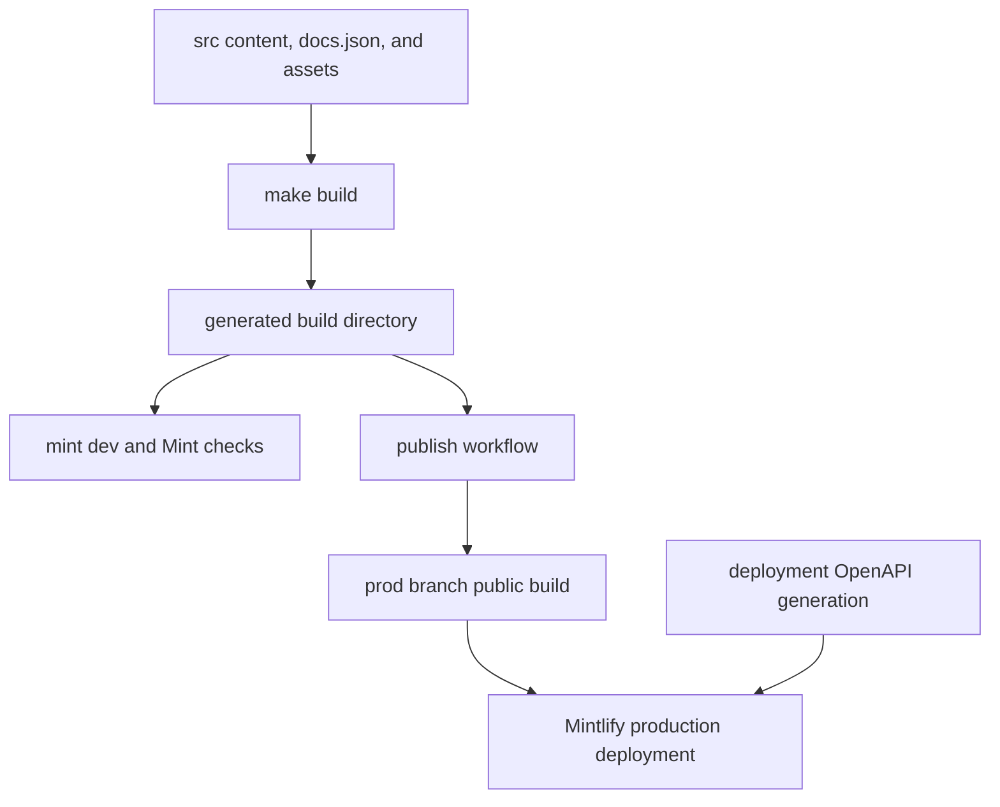

# Mintlify Integration

Mintlify is the renderer and hosting integration for [docs.langchain.com](https://docs.langchain.com). It consumes the regenerated `build/` tree, not the editable `src/` tree. The build pipeline transforms and copies source MDX, configuration, assets, styles, and language-specific content into that tree; contributors must change `src/` and rebuild rather than patch `build/`.



The handoff is from source to a generated tree to Mintlify. Deployment-generated OpenAPI routes are added at the final Mintlify boundary and are deliberately absent from local `build/` output.

## Renderer-facing configuration and navigation

Mintlify is the static site generator responsible for rendering the built documentation from /build/ into docs.langchain.com. The LangChain documentation pipeline produces markdown and MDX output in /build/, and Mintlify reads this output along with site configuration from docs.json to render the final site.

The builder clears and recreates `build/`, produces Python and JavaScript variants for versioned OSS content, produces unversioned Deep Agents Code and OpenWiki content, then copies shared files. Thus `src/docs.json`, `src/style.css`, fonts, images, snippets, and client JavaScript become renderer-facing build inputs. A page listed in navigation or a local OpenAPI source must exist in this generated tree.

Site configuration is defined in /src/docs.json (copied to /build/docs.json) using Mintlify's docs.json schema, specifying navigation menus, theme (aspen), fonts (TWK Lausanne for headings, Inter for body), icons (Tabler library), colors, analytics (Google Tag Manager), contextual actions, and URL redirects.

The same contract sets logos and favicon, color/background and appearance behavior, code-block themes, footer and navbar links, canonical SEO metadata, a banner, and `head` resources. The aspen theme is customized with TWK Lausanne (weight 700) for headings loaded via docs.json, additional font weights declared in /src/style.css via @font-face rules, and Inter for body text. Custom CSS in /src/style.css overrides Mintlify defaults and is injected into page headers via docs.json. It also imports IBM Plex Mono for code and applies light/dark typography and component overrides, so visual changes should be checked in Mintlify.

Mintlify renders contextual actions defined in docs.json including built-in options (copy, view) and custom integrations (llms.txt, ChatGPT, Claude, MCP, Cursor, VSCode). These appear in the page header for users to access documentation in external tools or copy URLs.

### Product menu ownership

`navigation.products` in `docs.json` is the source of truth for the site product menu. It separates the agent-development-lifecycle material from **PRODUCTS AND SETUP**, whose menu includes LangSmith setup and the current product-facing entries:

- **LLM Gateway** is a Beta route/control/observability section. Its direct pages cover the overview, quickstart, and API formats, with grouped Core capabilities, Administration and governance, and Advanced material.
- **No-code agents** contains LangSmith Fleet pages, grouped into Get started, Configure, Tools and automation, Advanced, and Additional resources.
- **Engine** is a compact top-level section for the overview, issue workflow, GitHub integration, categories, webhooks, security, and self-hosted use.
- **Deep Agents Code** is an unversioned OSS section rooted at `oss/deepagents/code/`. Its configuration group explicitly sets `root` and `expanded`, and contains credentials, config-file, hooks, and MCP tools beneath the product pages.

These product entries are not merely labels: their page paths determine Mintlify navigation and must agree with the builder's language behavior. For example, Deep Agents Code is intentionally excluded from `/oss/` language-link rewriting because it has an unversioned output path, whereas Managed Deep Agents content is emitted in Python and JavaScript variants.

### Routes, redirects, and OpenAPI boundaries

The redirects array in docs.json maps deprecated or reorganized URLs to canonical routes. It includes former LLM Gateway paths to the new quickstart, credits, and data-policy pages, and explicit unversioned Managed Deep Agents routes to Python pages. Redirects are therefore part of a safe route move: update navigation, output path, and applicable legacy mappings together.

Three OpenAPI sections are declared in navigation, but their endpoint routes are generated by Mintlify during deployment and are not files that the local builder emits:

- **Agent Server API** uses the committed `langsmith/agent-server-openapi.json` and declares `langsmith/agent-server-api` as its generation directory.
- **Control Plane API** uses `https://api.host.langchain.com/openapi.json`; its specification is remote rather than part of the repository build.
- **LangSmith REST API** uses the committed `langsmith/langsmith-platform-openapi.json` and declares `langsmith/smith-api` as its generation directory. A daily workflow runs `scripts/process_langsmith_openapi.py --write`; it creates or updates one standing refresh PR only when the processed spec changes.

Mintlify is configured with three OpenAPI sections: committed Agent Server and LangSmith REST specifications generate under langsmith/agent-server-api and langsmith/smith-api, while the Control Plane specification is fetched from https://api.host.langchain.com/openapi.json at deployment. The LangSmith REST specification is refreshed daily through a standing update PR workflow.

Use `make check-openapi` to run `mint openapi-check` for the local Agent Server specification from `build/`. It validates that input only; neither it nor a local link check reproduces remote-spec availability or deployment-time OpenAPI route generation.

## Local development and validation

The development workflow uses mint dev CLI (a separate global npm binary installed via npm install -g mint@latest) running in the /build/ directory on port 3000. The docs dev command in pipeline/commands/dev.py orchestrates file watching via FileWatcher and launches mint dev as an async subprocess.

`make dev` installs project npm dependencies and invokes the pipeline command. Unless `--skip-build` is supplied, `dev_command` performs an initial build; it watches `src/`, runs `mint dev --port 3000` in `build/`, forwards Mint output, and shuts down the watcher and child process on interruption. An initial build failure prevents startup; an unexpected watcher stop or nonzero Mint exit fails the command.

For structural validation, run:

```bash
make broken-links
make broken-links-with-anchors
```

The targets build first, invoke `mint broken-links` in `build/`, and fail only when filtered output retains actionable indented link entries. The filter intentionally removes deployment-generated OpenAPI-route false positives and standalone-snippet reports. The reusable workflow uses Node 22, caches or installs the global Mint CLI, applies a KaTeX workaround, then runs the anchor check and Agent Server OpenAPI validation.

Snippet imports in MDX files are expanded by Mintlify at render time; they are not served as standalone pages. The build system processes snippets and stores language-specific versions at /build/snippets/{python|javascript}/, and Mintlify inlines them into importing pages. The builder rewrites imports in versioned pages to those language-specific copies, while retaining a Python-default copy for unversioned consumers.

## Offline export

```bash
make export
make htmltest
# or
make export-htmltest
```

The make export target builds the generated documentation and runs mint export from build/, producing build/export.zip by default. It requires a recent Mint CLI with export support, Node LTS 20 or 22, and an Enterprise Mintlify plan.

Offline export validation unpacks the Mint archive and intentionally uses htmltest only for external URLs because Mintlify export does not emit a complete page set; internal and internal-hash checks are disabled. Passing `make htmltest` therefore does not prove internal navigation. Use Mint's generated-tree link targets for that concern.

## Publication and preview operations

The publish workflow runs for pushes to `main` and manual dispatch. It builds, verifies `build/`, copies it to `public/build`, and force-publishes `public` to `prod` with `peaceiris/actions-gh-pages@v4` and `GITHUB_TOKEN`. Mintlify consumes that generated `build/` subtree from the production branch.

The publish.yml GitHub Actions workflow deploys documentation by building /build/ from source, copying it into /public/build/, and pushing to the prod branch using peaceiris/actions-gh-pages@v4. Mintlify monitors the prod branch and automatically redeploys when changes are pushed.

The preview workflow is intentionally separate. For same-repository pull requests or manual runs, it validates branch input, builds docs, generates a collision-resistant `preview-*` branch, force-adds its `build/` artifacts, and pushes the branch. The next job requires `MINTLIFY_API_KEY`, `MINTLIFY_PROJECT_ID`, and the generated branch name before POSTing to Mintlify's preview endpoint; malformed API responses or an API error without a status or preview URL fail the job. Closing a PR deletes only branches matching its sanitized `preview-` prefix.

The preview workflow builds artifacts for same-repository pull requests, pushes them to a preview branch, and invokes Mintlify's preview API only after validating the required API key, project ID, and branch name; closed pull requests trigger preview-branch cleanup.

## Change checklist

1. Edit `src/` inputs—especially MDX, `src/docs.json`, assets, or `src/style.css`—not `build/`.
2. When moving or adding a page, reconcile its generated path, product-menu placement, and legacy redirect mappings.
3. Run `make build` and `make dev` to inspect the renderer-facing tree.
4. Run `make broken-links-with-anchors` for route, navigation, snippet, or reference changes, and `make check-openapi` for the Agent Server specification.
5. Treat `make export-htmltest` as external-link coverage only. Deployment-generated OpenAPI pages and remote Control Plane behavior require Mintlify deployment validation.
6. Use the production or preview workflow to cross the publication boundary.

## Related concepts

- [Build system](/openwiki/architecture/build-system.md) — source transformation and generated-tree lifecycle.
- [Source map](/openwiki/architecture/source-map.md) — source paths, URLs, and build output mapping.
- [GitHub Actions](/openwiki/integrations/github-actions.md) — CI, publication, and preview workflows.
- [Adding pages](/openwiki/operations/adding-pages.md) — source, navigation, and route changes.
- [CLI tools](/openwiki/operations/cli-tools.md) — local command behavior.
- [Test overview](/openwiki/testing/test-overview.md) — repository validation layers.
