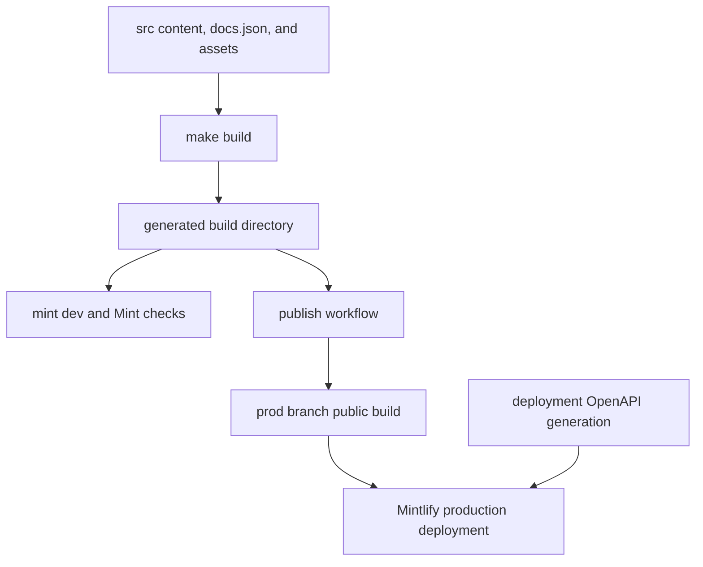

# Mintlify Integration

Mintlify is the renderer and hosting integration for [docs.langchain.com](https://docs.langchain.com). It consumes the regenerated `build/` tree rather than the editable `src/` tree. Change source inputs and rebuild; do not patch generated files.



This shows the source-to-generated-tree handoff. Deployment-generated OpenAPI routes are added at the final Mintlify boundary and deliberately do not exist in local `build/` output.

## Generated-tree contract

Mintlify is the static site generator responsible for rendering the built documentation from /build/ into docs.langchain.com. The LangChain documentation pipeline produces markdown and MDX output in /build/, and Mintlify reads this output along with site configuration from docs.json to render the final site.

A full `DocumentationBuilder` build deletes and recreates `build/`. It emits Python and JavaScript OSS variants, unversioned Deep Agents Code and OpenWiki pages, unversioned LangSmith content, and language-specific Managed Deep Agents routes; it then copies shared artifacts, npm snippet components, and generated `llms.txt` files. This is the renderer-facing contract: a configured page, stylesheet, asset, or local specification must be present in the generated tree.

Managed Deep Agents source pages are emitted only at language-prefixed LangSmith routes, while `docs.json` redirects their unversioned routes to Python. Conversely, Deep Agents Code is emitted once at an unprefixed OSS route and excluded from OSS language-link rewriting. Navigation and redirects must respect those output rules.

Snippet imports in MDX files are expanded by Mintlify at render time; they are not served as standalone pages. The build system processes snippets and stores language-specific versions at `/build/snippets/{python|javascript}/`; versioned pages have their imports rewritten to the matching copy, while unversioned consumers use the Python-default output.

## Renderer configuration and navigation

Site configuration is defined in /src/docs.json (copied to /build/docs.json) using Mintlify's docs.json schema, specifying navigation menus, theme (aspen), fonts (TWK Lausanne for headings, Inter for body), icons (Tabler library), colors, analytics (Google Tag Manager), contextual actions, and URL redirects.

The `head` configuration loads `/style.css` and `ChatLangChainEmbed.js`; it also configures logos, favicon, appearance, code-block themes, footer/navigation links, canonical SEO metadata, and the banner. The aspen theme is customized with TWK Lausanne (weight 700) for headings loaded via docs.json, additional font weights declared in /src/style.css via @font-face rules, and Inter for body text. Custom CSS in /src/style.css overrides Mintlify defaults and is injected into page headers via docs.json.

Mintlify renders contextual actions defined in docs.json including built-in options (copy, view) and custom integrations (llms.txt, ChatGPT, Claude, MCP, Cursor, VSCode). These appear in the page header for users to access documentation in external tools or copy URLs.

`navigation.products` owns the product menu. The current **PRODUCTS AND SETUP** entries include LLM Gateway, No-code agents, Engine, and Deep Agents Code. Deep Agents Code is an unversioned OSS section, and its expanded Configuration group declares both its root page and child pages. When adding or moving a page, reconcile its generated path, this navigation entry, and any redirect together.

The redirects array maps retired or reorganized routes to canonical ones, including former LLM Gateway paths and unversioned Managed Deep Agents paths to Python routes. `make broken-links` and `make broken-links-with-anchors` pass `--check-redirects`, so a redirect destination is part of local route validation.

## OpenAPI: configuration versus local output

Mintlify is configured with three OpenAPI sections: committed Agent Server and LangSmith REST specifications generate under langsmith/agent-server-api and langsmith/smith-api, while the Control Plane specification is fetched from https://api.host.langchain.com/openapi.json at deployment. The LangSmith REST specification is refreshed daily through a standing update PR workflow.

The Agent Server and LangSmith REST entries set `directory` values, but endpoint routes are generated by Mintlify during deployment rather than written by the documentation builder. The Control Plane specification is additionally remote. Therefore local `build/`, local link checking, and `make check-openapi` cannot prove remote-spec availability or deployment-time route generation. `make check-openapi` validates only the generated-tree Agent Server input with `mint openapi-check langsmith/agent-server-openapi.json`.

Mintlify deployment generates endpoint routes for the configured OpenAPI sections, so those routes are absent from local build output and are intentionally filtered from local Mint link checking.

## Local development and focused checks

The development workflow uses mint dev CLI (a separate global npm binary installed via npm install -g mint@latest) running in the /build/ directory on port 3000. The docs dev command in pipeline/commands/dev.py orchestrates file watching via FileWatcher and launches mint dev as an async subprocess.

`make dev` installs project npm dependencies and runs `pipeline dev`. Unless `--skip-build` is set, it builds before starting the watcher and server. An initial build failure stops startup; a nonzero Mint exit or an unexpectedly stopped watcher returns failure. On interruption it shuts down the watcher and terminates, then kills if necessary, the Mint subprocess.

Run the generated-tree checks after route, navigation, snippet, or reference changes:

```bash
make broken-links
make broken-links-with-anchors
make check-openapi
```

Both link targets build first and run `mint broken-links` from `build/`; the anchor variant adds `--check-anchors`. Their filter discards complete standalone-snippet sections, deployment-only OpenAPI paths, and a small set of documented Mint checker false positives, then fails when actionable indented report entries remain. The reusable GitHub workflow uses Node 22, caches or installs the global Mint CLI, applies its KaTeX workaround, and runs the anchor check followed by Agent Server OpenAPI validation.

## Offline export

```bash
make export
make htmltest
# or
make export-htmltest
```

The make export target builds the generated documentation and runs mint export from build/, producing build/export.zip by default. It requires a recent Mint CLI with export support, Node LTS 20 or 22, and an Enterprise Mintlify plan.

Offline export validation unpacks the Mint archive and intentionally uses htmltest only for external URLs because Mintlify export does not emit a complete page set; internal and internal-hash checks are disabled. It still checks selected page assets and metadata, but a passing export check is not evidence that internal navigation works.

## Publishing and previews

The publish.yml GitHub Actions workflow deploys documentation by building /build/ from source, copying it into /public/build/, and pushing to the prod branch using peaceiris/actions-gh-pages@v4. Mintlify monitors the prod branch and automatically redeploys when changes are pushed.

The preview workflow builds artifacts for same-repository pull requests, pushes them to a preview branch, and invokes Mintlify's preview API only after validating the required API key, project ID, and branch name; closed pull requests trigger preview-branch cleanup.

The preview branch name combines a sanitized six-character source-branch prefix, timestamp, and short commit SHA. The workflow refuses invalid or overly long source branch names and avoids forks because it needs write permission. It force-adds the ignored `build/` artifacts, pushes the branch, then POSTs that branch to `https://api.mintlify.com/v1/project/preview/${MINTLIFY_PROJECT_ID}` with the API key. The API response must parse as JSON; an error without either a status ID or preview URL fails the job. Cleanup only deletes branches beginning with the corresponding `preview-` prefix.

## Change checklist

1. Edit `src/` inputs—not `build/`—and run `make build`.
2. For a route move, update output-path assumptions, `src/docs.json` navigation, and redirects together.
3. Use `make dev` to inspect the generated tree in Mint locally.
4. Run `make broken-links-with-anchors`; run `make check-openapi` when changing the local Agent Server specification.
5. Treat `make export-htmltest` as external-link coverage only. Verify remote Control Plane and deployment-generated OpenAPI behavior in Mintlify.
6. Use the production or preview workflow to cross the hosting boundary.

## Related concepts

- [Build system](/openwiki/architecture/build-system.md) — generated-tree lifecycle and transformations.
- [Source map](/openwiki/architecture/source-map.md) — source paths, URLs, and build output mapping.
- [GitHub Actions](/openwiki/integrations/github-actions.md) — CI, publication, and preview workflows.
- [Reference docs](/openwiki/integrations/reference-docs.md) — reference and API-documentation inputs.
- [Adding pages](/openwiki/operations/adding-pages.md) — safe source, navigation, and route changes.
- [Local development](/openwiki/workflows/local-development.md) — local build and preview workflow.
