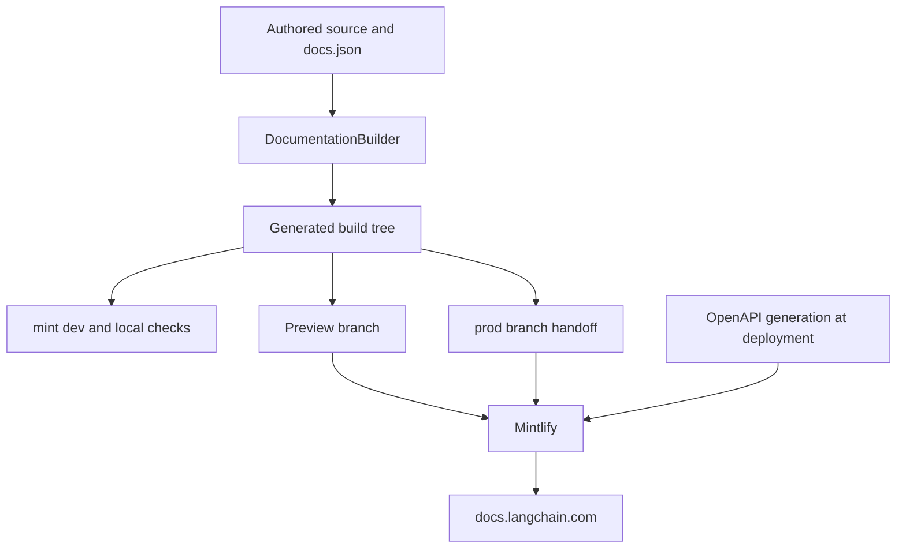

# Mintlify Integration

Mintlify is the rendering and hosting boundary for [docs.langchain.com](https://docs.langchain.com). It consumes the regenerated `build/` tree, not the editable `src/` tree. Edit source inputs, rebuild, and do not patch `build/` or deployment-generated endpoint pages.



This flow separates editable inputs from the generated handoff. Mintlify combines `build/` and deployment-time OpenAPI generation; the endpoint pages it produces are not authored files and cannot be established by inspecting a local build.

## Build-to-renderer handoff

A full `DocumentationBuilder` build deletes and recreates `build/`. It emits Python and JavaScript OSS variants, unversioned Deep Agents Code and OpenWiki content, ordinary LangSmith content, and language-specific Managed Deep Agents routes; it then copies shared artifacts and creates derived LLM artifacts. The copied `build/docs.json` is part of Mintlify's input.

This route model matters when changing navigation:

- **Managed Deep Agents** source pages are emitted only at `/langsmith/python/...` and `/langsmith/javascript/...`; the unversioned routes redirect to Python.
- **Deep Agents Code** is emitted once at `/oss/deepagents/code/...` and is excluded from OSS language-link rewriting. It is not a Python/JavaScript duplicate.
- Ordinary LangSmith pages, including the Engine pages, remain unversioned under `/langsmith/...`.

When moving a page, reconcile its source/output route, its `src/docs.json` navigation entry, and any redirect in one change. See [Source map](/openwiki/architecture/source-map.md), [Versioning](/openwiki/concepts/versioning.md), and [Adding pages](/openwiki/operations/adding-pages.md).

## `src/docs.json`: presentation, navigation, and redirects

`src/docs.json` is the Mintlify configuration source; the builder transports it but does not decide its presentation or menu placement. It declares the Aspen theme, Tabler icons, TWK Lausanne heading font, Inter body font, colors, Google Tag Manager, contextual actions, SEO metadata, head assets, navigation, and redirects. Its `head` includes `/style.css` and `ChatLangChainEmbed.js`, which must be available in the built tree.

Navigation is a projection of generated routes, not a directory listing. In **PRODUCTS AND SETUP**, LLM Gateway, No-code agents, Engine, and Deep Agents Code are separate entries:

- **Engine** is a flat six-page product surface: `langsmith/engine-overview`, `engine`, `engine-github`, `engine-notifications`, `engine-security`, and `engine-self-hosted`. The last route is authored by `src/langsmith/engine-self-hosted.mdx`, even though the product appears as a standalone menu item.
- **Deep Agents Code** is an unversioned OSS section. Its expanded **Configuration** group has `oss/deepagents/code/configuration` as its `root`, with credentials, config file, hooks, and MCP tools as children.

Do not infer a source path from a menu label: for example, No-code agents is backed by the LangSmith Fleet route family. For any menu edit, confirm the route is emitted, place it in the desired hierarchy, and retain existing route compatibility. Redirects are part of the same public contract. The local link targets use `--check-redirects`, so a destination must resolve in the generated tree, not merely parse as JSON.

### Managed Deep Agents redirect contract

Managed Deep Agents pages have a dual language navigation surface, while compatibility URLs select Python. `docs.json` lists matching Python and JavaScript route families in their respective Build tabs, but maps the unversioned overview and individual Managed Deep Agents paths to their Python equivalents. Add a new managed page to both language tabs and add or preserve an unversioned-to-Python redirect when it has a public legacy route. Do not create a duplicate unversioned MDX page merely to satisfy an old URL.

## OpenAPI specifications are inputs, not authored endpoint pages

`docs.json` configures three OpenAPI reference surfaces with different input lifecycles:

| Surface | Mintlify input | Configured route behavior |
| --- | --- | --- |
| Agent Server API | Committed `src/langsmith/agent-server-openapi.json` | `directory: langsmith/agent-server-api` |
| Control Plane API | `https://api.host.langchain.com/openapi.json` | Remote specification fetched at deployment; no `directory` is configured. |
| LangSmith REST API | Committed `src/langsmith/langsmith-platform-openapi.json` | `directory: langsmith/smith-api` |

Mintlify creates the endpoint routes during deployment. Consequently, an endpoint is neither an MDX source file nor a reliable local-build artifact. The Control Plane reference also introduces a remote deployment-time dependency. The LangSmith REST input is refreshed daily by an automation workflow that processes the spec and opens or updates one standing refresh PR.

`make check-openapi` is deliberately narrower: after rebuilding, it runs `mint openapi-check langsmith/agent-server-openapi.json` from `build/`. It does not prove deployment generation of any endpoint reference. Change the committed specification or the OpenAPI configuration rather than inventing generated MDX pages. See [Reference docs](/openwiki/integrations/reference-docs.md) for the boundary with API reference outside this repository.

## Local preview and validation

`make dev` runs the pipeline development command. Unless `--skip-build` is set, it performs an initial full build, starts a `FileWatcher`, and launches `mint dev --port 3000` from `build/`. A failed initial build prevents startup; a nonzero Mint exit or an unexpectedly stopped watcher fails the command. On interruption it stops the watcher and terminates Mint, killing it after the shutdown timeout when necessary.

For generated-tree validation, run:

```bash
make broken-links
make broken-links-with-anchors
make check-openapi
```

Both link targets rebuild first and run `mint broken-links` from `build/` with redirect checking; the anchor variant adds `--check-anchors`. The filter removes standalone-snippet sections because their rewritten OSS links resolve only after import into a page. It also removes deployment-only OpenAPI routes and narrowly defined checker false positives. The target fails only when actionable indented link entries remain. Tests ensure those exclusions do not hide ordinary broken links or non-exempt anchors. CI uses Node 22, runs the anchor-aware target, then validates the Agent Server OpenAPI input.

A local renderer preview and these link checks validate authored output, navigation destinations, and redirects. They cannot validate an OpenAPI endpoint route that Mintlify creates only during deployment. Use a Mintlify preview or production to verify that behavior.

## Offline export is limited coverage

```bash
make export
make htmltest
# or
make export-htmltest
```

`make export` rebuilds and runs `mint export` from `build/`, producing `build/export.zip` by default. It requires a Mint CLI with export support, Node LTS 20 or 22, and an Enterprise Mintlify plan; Node 25 and later are rejected. `make htmltest` validates an existing archive, while `make export-htmltest` runs both sequentially.

The export archive is not a complete site representation. `htmltest-mint-export.yml` disables internal-link and internal-hash checks while retaining external URL checks and selected asset and metadata checks. A passing export check therefore does not establish internal navigation correctness or the presence of deployment-generated OpenAPI routes.

## Preview and production handoff

The publishing workflow runs on `main` pushes or manual dispatch. It builds from source, copies `build/` into `public/build/`, and publishes that directory to the `prod` branch. That branch is the production handoff to Mintlify, not a contributor-owned source branch.

For same-repository pull requests, the preview workflow builds the documentation and creates a collision-resistant `preview-<prefix>-<timestamp>-<sha>` branch containing force-added `build/` artifacts. It skips forks because the job needs write permission, validates source-branch syntax and length, and rejects an existing preview branch. A separate job checks its API key, project ID, and branch name before requesting a Mintlify preview. It fails if the response is not JSON or reports an error without a status ID or preview URL. When a pull request closes, cleanup deletes only matching `preview-` branches.

## Safe change checklist

1. Edit `src/` inputs and `src/docs.json` as appropriate, then run `make build`; never patch `build/` or a deployment-generated endpoint page.
2. Choose the route family before changing navigation: ordinary LangSmith, language-paired Managed Deep Agents, and unversioned Deep Agents Code follow different rules.
3. For a move, update the emitted route, the exact `docs.json` menu location, and redirects together. Add both Managed Deep Agents menu entries and preserve the Python fallback redirect.
4. Use `make dev` to inspect authored output and `make broken-links-with-anchors` to validate routes, anchors, and redirect destinations. Run `make check-openapi` after changing the Agent Server specification.
5. Use a Mintlify preview or production—not local output or export—as the verification boundary for deployment-generated OpenAPI endpoints.
6. Use `make export-htmltest` only for its external-resource coverage, not as a complete-site navigation test.

## Related concepts

- [Source map](/openwiki/architecture/source-map.md) — source paths, URLs, and build output mapping.
- [Versioning](/openwiki/concepts/versioning.md) — language-specific and unversioned route rules.
- [Adding pages](/openwiki/operations/adding-pages.md) — safe source, navigation, and route changes.
- [Quickstart](/openwiki/quickstart.md) — local setup and ownership boundaries.
- [Testing overview](/openwiki/testing/test-overview.md) — validation boundaries and CI coverage.
