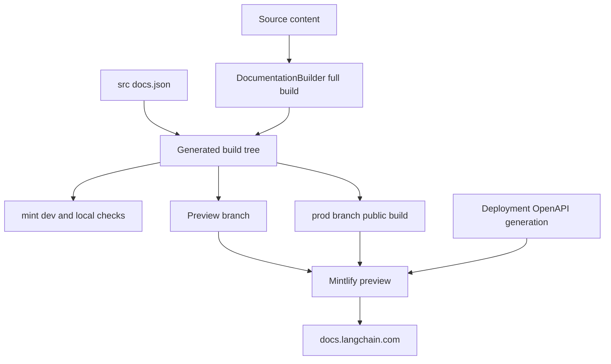

# Mintlify Integration

Mintlify is the rendering and hosting boundary for [docs.langchain.com](https://docs.langchain.com). It consumes the regenerated `build/` tree, not the editable `src/` tree. Edit source inputs, rebuild, and do not patch `build/` or deployment-generated endpoint pages.



This shows the ownership boundary. The builder owns the disposable content tree; `src/docs.json` independently owns Mintlify site configuration and is copied into that tree as `build/docs.json`; Mintlify renders and deploys their combined handoff. OpenAPI endpoint routes are generated at deployment, so they are neither editable source files nor dependable local build artifacts.

## Build-to-renderer handoff

A full `DocumentationBuilder` build deletes and recreates `build/`. It emits Python and JavaScript OSS variants, unversioned Deep Agents Code and OpenWiki content, ordinary LangSmith content, and language-specific Managed Deep Agents routes; it then copies shared artifacts and creates derived LLM artifacts. The result, including the copied `docs.json`, is Mintlify's input.

This route model constrains navigation changes:

- Managed Deep Agents source pages are emitted only at language-prefixed LangSmith routes. The unversioned routes redirect to Python.
- Deep Agents Code is emitted once at its unprefixed OSS route and is excluded from OSS language-link rewriting.

When moving a page, reconcile its source/output route, `src/docs.json` navigation, and redirects in one change. See [Source map](/openwiki/architecture/source-map.md) for route mapping and [Adding pages](/openwiki/operations/adding-pages.md) for authoring procedure.

## `src/docs.json`: Mintlify configuration ownership

`src/docs.json` is the source-owned Mintlify configuration; the builder transports it but does not own its navigation or presentation decisions. It declares the Aspen theme, Tabler icons, TWK Lausanne heading font, Inter body font, colors, Google Tag Manager, contextual actions, redirects, SEO metadata, and head assets. Its `head` includes `/style.css` and `ChatLangChainEmbed.js`; shared-file and npm-copy stages place the required assets in the generated tree.

`navigation.products` defines the product menu. In the current **PRODUCTS AND SETUP** menu, LLM Gateway, No-code agents, Engine, and Deep Agents Code are separate entries. Deep Agents Code is an unversioned OSS section; its expanded **Configuration** group has a `root` route and child pages. A navigation edit must therefore preserve the generated route model as well as the intended menu hierarchy.

Redirects are part of the same Mintlify contract. The local link targets pass `--check-redirects`, so a redirect destination must resolve in the generated tree rather than merely parse as configuration.

## OpenAPI input versus endpoint pages

`docs.json` configures three OpenAPI sections with distinct input lifecycles:

| Section | Mintlify source | Configured route directory / behavior |
| --- | --- | --- |
| Agent Server API | Committed `src/langsmith/agent-server-openapi.json` | `langsmith/agent-server-api` |
| Control Plane API | `https://api.host.langchain.com/openapi.json` | Remote input fetched at deployment; no `directory` is configured. |
| LangSmith REST API | Committed `src/langsmith/langsmith-platform-openapi.json` | `langsmith/smith-api` |

The LangSmith REST input is refreshed daily: automation runs `scripts/process_langsmith_openapi.py --write` and opens or updates one standing refresh PR. Mintlify—not the builder—generates endpoint routes for these sections during deployment. The remote Control Plane specification is consequently an additional deployment-time dependency.

Do not use local `build/`, `make check-openapi`, or a local link pass as evidence that endpoint routes exist. In particular, **local builds do not create Mintlify OpenAPI endpoint pages**. `make check-openapi` validates only the generated-tree Agent Server specification with `mint openapi-check langsmith/agent-server-openapi.json`. For reference ownership beyond this repository, see [Reference docs](/openwiki/integrations/reference-docs.md).

## Local preview and validation

`make dev` runs the pipeline development command. Unless `--skip-build` is set, it performs an initial full build, starts a `FileWatcher`, and launches `mint dev --port 3000` with `build/` as its working directory. A failed initial build prevents startup; a nonzero Mint exit or an unexpectedly stopped watcher makes the command fail. On interruption it shuts down the watcher and terminates Mint, escalating to a kill after its timeout if needed.

For generated-tree validation, run:

```bash
make broken-links
make broken-links-with-anchors
make check-openapi
```

Both link targets rebuild first and run `mint broken-links` from `build/` with redirect checking; the anchor variant adds `--check-anchors`. The filter drops standalone-snippet report sections because their rewritten OSS links resolve only when imported into a page. It also drops deployment-only OpenAPI destinations and narrow documented false positives. The Make target fails only when actionable indented link entries remain. Unit tests verify that snippet and known false-positive exclusions do not hide ordinary broken links or non-exempt anchors. CI uses Node 22, runs the anchor-aware target, then validates the Agent Server OpenAPI input. See [Testing overview](/openwiki/testing/test-overview.md) for broader validation guidance.

## Offline export is limited coverage

```bash
make export
make htmltest
# or
make export-htmltest
```

`make export` rebuilds and runs `mint export` from `build/`, producing `build/export.zip` by default. It requires a Mint CLI with export support, Node LTS 20 or 22, and an Enterprise Mintlify plan; Node 25 and later are rejected by the target. `make htmltest` validates an existing archive, while `make export-htmltest` runs both sequentially.

The export archive is not a complete site representation. `htmltest-mint-export.yml` deliberately disables internal-link and internal-hash checks while retaining external URL checks and selected asset and metadata checks. A passing export check therefore does not demonstrate valid internal navigation or deployment-generated OpenAPI routes.

## Preview and production handoff

The publishing workflow runs on `main` pushes or manual dispatch. It builds from source, copies `build/` into `public/build/`, and publishes that directory to the `prod` branch. That branch is the production handoff to Mintlify, not a contributor-owned source branch.

For same-repository pull requests, the preview workflow installs dependencies, builds the documentation, and creates a collision-resistant `preview-<prefix>-<timestamp>-<sha>` branch containing force-added `build/` artifacts. It rejects unsafe or overlong source-branch names, skips fork pull requests because the workflow needs write permission, and checks that the generated preview branch does not already exist. A separate job validates its API key, project ID, and branch name before POSTing the branch to Mintlify's preview API. It fails if the response is not JSON or reports an error without a status ID or preview URL. When a pull request closes, cleanup deletes only matching `preview-` branches.

## Safe change checklist

1. Edit `src/` inputs and `src/docs.json` as appropriate, then run `make build`; do not patch `build/` or generated endpoint routes.
2. For a move, reconcile the builder's emitted route, `src/docs.json` navigation, and redirects.
3. Use `make dev` for a local renderer preview, but use a Mintlify preview or production to verify deployment-only OpenAPI behavior.
4. Run `make broken-links-with-anchors`; run `make check-openapi` after changing the Agent Server specification.
5. Use `make export-htmltest` for external-resource coverage only, not as a complete-site test.

## Related concepts

- [Source map](/openwiki/architecture/source-map.md) — source paths, URLs, and build output mapping.
- [Reference docs](/openwiki/integrations/reference-docs.md) — OpenAPI and external-reference ownership.
- [Adding pages](/openwiki/operations/adding-pages.md) — safe source, navigation, and route changes.
- [Testing overview](/openwiki/testing/test-overview.md) — validation boundaries and CI coverage.
- [Local development](/openwiki/workflows/local-development.md) — local build and preview workflow.
