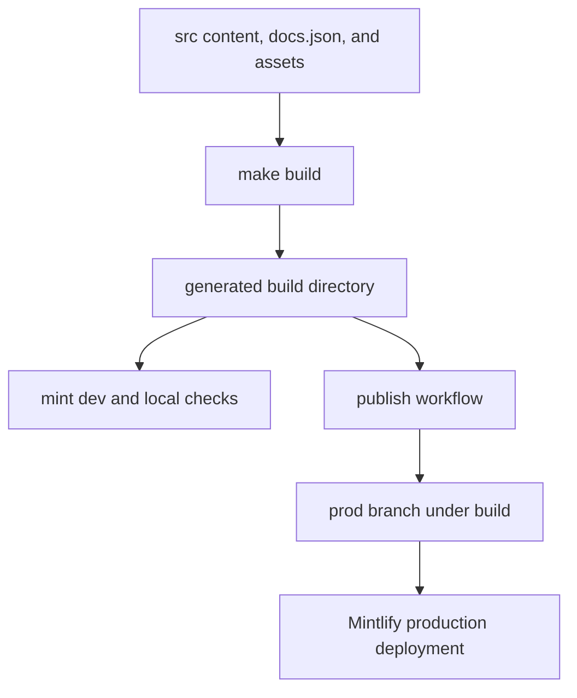

# Mintlify Integration

Mintlify is the renderer and hosting integration for [docs.langchain.com](https://docs.langchain.com). It consumes the generated `build/` tree rather than authoring sources: `src/` is the editable documentation tree, while `build/` is regenerated by the pipeline and must never be edited directly. In particular, Mintlify receives already-preprocessed, versioned MDX, copied assets, and `build/docs.json`.



The diagram shows the generated-tree boundary: content changes flow from `src/` through the builder before either local rendering or publication.

## Rendering boundary and configuration

Mintlify is the static site generator responsible for rendering the built documentation from /build/ into docs.langchain.com. The LangChain documentation pipeline produces markdown and MDX output in /build/, and Mintlify reads this output along with site configuration from docs.json to render the final site.

The build first clears and recreates `build/`, emits Python and JavaScript variants for versioned OSS content, builds selected unversioned content, then copies shared inputs. `docs.json`, `style.css`, fonts, images, snippets, and client JavaScript are shared files, so the editable configuration at `src/docs.json` becomes the Mintlify configuration at `build/docs.json`. This is an ownership boundary: change content, configuration, or styling in `src/` and rerun the build; do not patch generated paths.

Site configuration is defined in /src/docs.json (copied to /build/docs.json) using Mintlify's docs.json schema, specifying navigation menus, theme (aspen), fonts (TWK Lausanne for headings, Inter for body), icons (Tabler library), colors, analytics (Google Tag Manager), contextual actions, and URL redirects.

`docs.json` is the declarative site contract. Besides the navigation hierarchy and page paths, it configures light/dark colors and background, appearance behavior, code-block themes, logos, footer content, SEO canonical metadata, Google Tag Manager, a banner, and injected header resources. A navigation entry or a referenced local OpenAPI file therefore needs to be valid in the generated tree, not merely present in `src/`.

The aspen theme is customized with TWK Lausanne (weight 700) for headings loaded via docs.json, additional font weights declared in /src/style.css via @font-face rules, and Inter for body text. Custom CSS in /src/style.css overrides Mintlify defaults and is injected into page headers via docs.json.

The stylesheet also imports IBM Plex Mono for code, sets typography and light/dark colors, and applies component-specific overrides. Because it is injected with `head` and copied as a shared asset, style changes should be previewed through Mintlify rather than inferred from raw MDX.

Mintlify renders contextual actions defined in docs.json including built-in options (copy, view) and custom integrations (llms.txt, ChatGPT, Claude, MCP, Cursor, VSCode). These appear in the page header for users to access documentation in external tools or copy URLs.

### Routes, redirects, and generated references

The redirects array in docs.json defines URL mappings for deprecated or reorganized pages. Unversioned URLs like /langsmith/managed-deep-agents* redirect to language-specific Python routes, preventing Mintlify from serving orphaned pages outside the navigation structure.

This redirect family matches the builder's lifecycle for Managed Deep Agents: it emits language-specific Python and JavaScript pages rather than an unversioned page. When changing a route, update the navigation and redirect configuration together so legacy URLs continue to land on an emitted canonical page.

Three OpenAPI sections are declared in navigation and Mintlify generates their endpoint pages during deployment, so those generated endpoint pages are absent from the local `build/` tree:

- **Agent Server API** uses the committed `langsmith/agent-server-openapi.json` and generates under `langsmith/agent-server-api`.
- **Control Plane API** references `https://api.host.langchain.com/openapi.json`; the remote specification is fetched at deploy time.
- **LangSmith REST API** uses the committed `langsmith/langsmith-platform-openapi.json` and generates under `langsmith/smith-api`. Its daily refresh workflow runs `scripts/process_langsmith_openapi.py --write`, then creates or updates one standing refresh PR only when the result changes.

Use `make check-openapi` to run `mint openapi-check` for the Agent Server specification from `build/`. Remote availability and Mintlify's deploy-time rendering remain production integration concerns, not artifacts a local build can fully reproduce.

## Local development and validation

The development workflow uses mint dev CLI (a separate global npm binary installed via npm install -g mint@latest) running in the /build/ directory on port 3000. The docs dev command in pipeline/commands/dev.py orchestrates file watching via FileWatcher and launches mint dev as an async subprocess.

`make dev` installs project npm dependencies and invokes the Python pipeline command. Unless `--skip-build` is supplied, `dev_command` performs an initial build; it then watches `src/` to update `build/`, starts `mint dev --port 3000` with `build/` as its working directory, forwards Mint stdout and stderr, and stops both watcher and child process on interruption. An initial build failure prevents the server from starting; an unexpected watcher stop or nonzero Mint exit makes the command fail.

For structural link validation, run:

```bash
make broken-links
make broken-links-with-anchors
```

Both commands build first and run `mint broken-links` in `build/`; the latter adds `--check-anchors`. The wrapper filters expected noise: OpenAPI endpoint pages are generated only during deployment, and snippets are checked by Mintlify as standalone files even though they are designed to be imported. It reports failure only if remaining indented link entries indicate actionable broken links. The reusable CI workflow supplies Node 22, caches/installs the global Mint CLI, applies a KaTeX version workaround when installing it, then runs the anchor check and `make check-openapi`.

Snippet imports in MDX files are expanded by Mintlify at render time; they are not served as standalone pages. The build system processes snippets and stores language-specific versions at /build/snippets/{python|javascript}/, and Mintlify inlines them into importing pages.

## Offline export and external-link check

Use the export workflow only against a fresh generated tree:

```bash
make export
make htmltest
# or
make export-htmltest
```

`make export` depends on `make build` and runs `mint export` from `build/`, where the paths in `docs.json` match the generated language-specific files. Its default archive is `build/export.zip`; pass `MINT_EXPORT_ARGS` to change Mint's output and set the matching `EXPORT_ZIP` for the follow-up check. Export requires a recent global Mint CLI that includes `mint export`, Node LTS 20 or 22 (Node 25 and later are rejected), and an Enterprise Mintlify plan.

`make htmltest` requires `htmltest`, `unzip`, and the export archive. It unpacks the archive under the ignored `build/mint-export-htmltest-unpacked` path (handling a single wrapping directory) and runs `htmltest` with `htmltest-mint-export.yml`. This is deliberately an **external-URL-only** check: Mintlify export does not emit a complete page set, so internal-link and internal-hash checks would be noisy and are disabled. The configuration still checks external anchor links plus image, script, metadata, generic, and refresh targets, limits concurrency and timeout, and ignores known CDN, authentication/WAF, API-root, canonical, and deploy-generated-page noise. Passing it does not establish internal navigation correctness; use Mint's built-tree link checks for that.

## Publication boundary

The publish workflow runs on pushes to `main` and can also be dispatched manually. It installs Python test-group dependencies, runs `make build`, rejects a missing `build/` directory, copies it to `public/build`, and uses `peaceiris/actions-gh-pages@v4` with `GITHUB_TOKEN` to force-update the `prod` branch. Mintlify monitors that production branch and deploys the generated `build/` subtree.

The publish.yml GitHub Actions workflow deploys documentation by building /build/ from source, copying it into /public/build/, and pushing to the prod branch using peaceiris/actions-gh-pages@v4. Mintlify monitors the prod branch and automatically redeploys when changes are pushed.

Preview publishing uses a different boundary. For same-repository pull requests (or manual runs), the preview workflow builds documentation, creates a collision-resistant `preview-*` branch containing forced-added `build/` artifacts, and pushes it. A follow-on job requires `MINTLIFY_API_KEY` and `MINTLIFY_PROJECT_ID`, validates both and the branch name, then calls Mintlify's preview API. On PR closure, the workflow deletes matching preview branches. The production workflow does not call that API or carry Mintlify API credentials; its responsibility ends after publishing the generated branch.

## Change checklist

1. Edit MDX, `src/docs.json`, assets, or `src/style.css`—never `build/`.
2. Run `make build`, then `make dev` to inspect the renderer-facing result.
3. For navigation, route, snippet, or reference changes, run `make broken-links-with-anchors`; run `make check-openapi` when changing the validated Agent Server spec.
4. When validating an offline package, run `make export-htmltest` and interpret it only as external-link coverage.
5. Let the publish or preview workflow move the generated tree across the Mintlify publication boundary.

## Related concepts

- [Build system](/openwiki/architecture/build-system.md) — source transformation and generated-tree lifecycle.
- [Source map](/openwiki/architecture/source-map.md) — source paths, URLs, and build output mapping.
- [GitHub Actions](/openwiki/integrations/github-actions.md) — CI, publication, and preview workflows.
- [Test overview](/openwiki/testing/test-overview.md) — repository-wide validation layers.
- [Local development](/openwiki/workflows/local-development.md) — contributor setup and development workflow.
