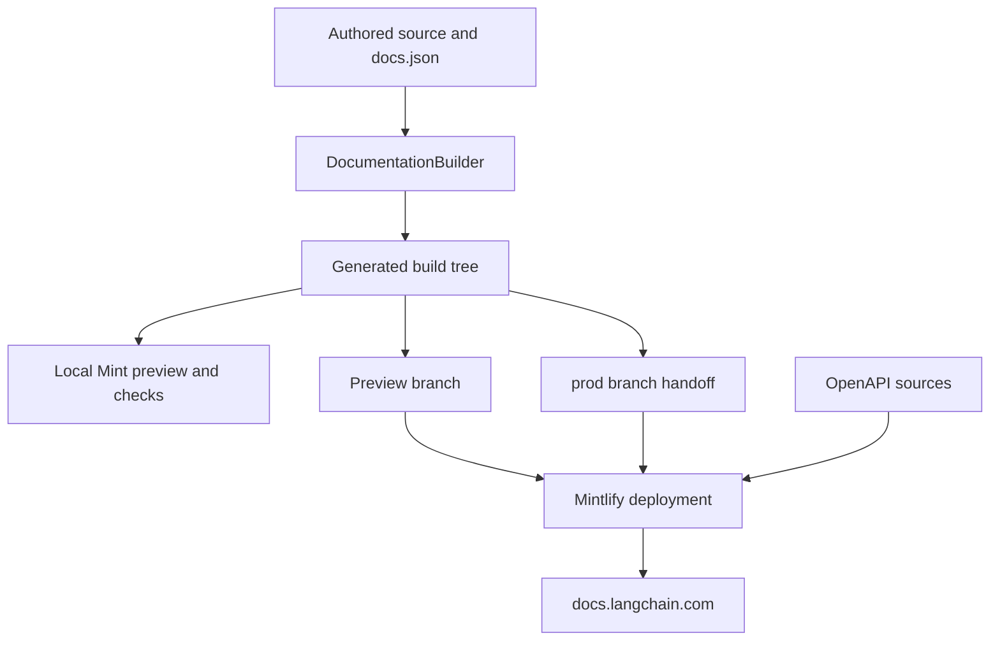

# Mintlify Integration

Mintlify is the rendering and hosting boundary for [docs.langchain.com](https://docs.langchain.com). It consumes the regenerated `build/` tree, not the editable `src/` tree. Edit source inputs, rebuild, and do not patch `build/` or deployment-generated endpoint pages.


```mermaid
flowchart TD
    Source["Authored source and docs.json"] --> Builder["DocumentationBuilder"]
    Builder --> Build["Generated build tree"]
    Build --> Local["Local Mint preview and checks"]
    Build --> Preview["Preview branch"]
    Build --> Production["prod branch handoff"]
    Preview --> Mint["Mintlify deployment"]
    Production --> Mint
    Spec["OpenAPI sources"] --> Mint
    Mint --> Site["docs.langchain.com"]
```

This shows the handoff boundary: the builder produces the tree Mintlify can read, while Mintlify produces configured OpenAPI endpoint pages at deployment. A local build is therefore authoritative for authored output, but not for deployment-generated endpoint routes.

## Build-to-renderer handoff

`DocumentationBuilder.build_all()` removes and recreates `build/`, then emits Python and JavaScript OSS variants, unversioned Deep Agents Code and OpenWiki content, ordinary LangSmith content, and language-specific Managed Deep Agents variants. It subsequently copies shared assets—including `src/docs.json` as `build/docs.json`—and creates the derived LLM files. Mintlify's deploy input is that complete generated tree.

The output route family determines how a navigation change must be made:

- **Managed Deep Agents** files are generated only as `/langsmith/python/...` and `/langsmith/javascript/...`. Compatibility URLs without a language redirect to Python.
- **Deep Agents Code** is generated once at `/oss/deepagents/code/...`, is not duplicated for Python and JavaScript, and is excluded from the general OSS language-link rewrite.
- Other LangSmith pages are generated unversioned under `/langsmith/...`.

When moving a page, reconcile the emitted route, the corresponding `src/docs.json` navigation entry, and redirects together. Do not infer an output route from the source directory or menu label alone.

## `src/docs.json` is the presentation contract

`src/docs.json` is the source Mintlify configuration; the builder transports it but does not own its presentation policy. It selects the Aspen theme, brand colors and assets, Tabler icons, TWK Lausanne heading and Inter body fonts, contextual actions, Google Tag Manager, SEO metadata, head assets, navigation, and redirects. In particular, `/style.css` and `ChatLangChainEmbed.js` named in `head` must be present in the generated tree.

Navigation is an explicit projection of routes, not a directory listing. The **PRODUCTS AND SETUP** menu presents LLM Gateway, No-code agents, Engine, and Deep Agents Code as separate product entries. Engine lists six authored LangSmith routes: overview, issue workflow, GitHub, notifications, security, and self-hosted. Deep Agents Code is an unversioned OSS section; its expanded **Configuration** group uses `oss/deepagents/code/configuration` as the root and lists credentials, config file, hooks, and MCP tools beneath it.

Redirects are part of this public contract. The local checker uses `--check-redirects`, so a redirect destination must resolve in generated output rather than merely be syntactically valid JSON. For Managed Deep Agents, maintain both language-specific menu surfaces and preserve or add an unversioned-to-Python redirect for a public compatibility URL; do not create a duplicate unversioned MDX page just to serve the old route.

## Local generated-tree development and validation

This section is only about what can be evaluated against `build/`; it does **not** validate Mintlify deployment-time generation.

`make dev` runs the pipeline development command. The `mint` executable is a separately installed global npm CLI (`npm install -g mint@latest`). Unless passed `--skip-build`, the command performs a full build, starts a `FileWatcher` over `src/`, and launches `mint dev --port 3000` with `build/` as its working directory. Failure of the initial build prevents startup. After startup, a nonzero Mint exit or an unexpectedly stopped watcher makes the command fail; interruption shuts down the watcher and terminates Mint, escalating to a kill after its timeout if needed.

Run these generated-tree checks after route, navigation, redirect, or Agent Server spec changes:

```bash
make broken-links
make broken-links-with-anchors
make check-openapi
```

Both link targets rebuild first, run `mint broken-links` from `build/`, and enable redirect checking; the anchor variant also enables `--check-anchors`. The filter removes whole standalone snippet report sections because their rewritten OSS links only resolve after a snippet is imported into a page. It also removes known checker false positives and endpoint paths generated only during deployment. The Make targets fail only when actionable indented report entries remain. Unit tests cover the boundary: ordinary broken links and non-exempt anchors remain failures.

`make check-openapi` is narrower than a deploy check: it runs `mint openapi-check langsmith/agent-server-openapi.json` in `build/`. The reusable CI workflow uses Node 22, runs the anchor-aware link check, then this Agent Server input validation. A local preview and those checks can establish authored pages, anchors, navigation targets, and redirects, but cannot establish a Mintlify-created endpoint route.

`make export` is separate, limited coverage. It rebuilds and writes `build/export.zip` by default through `mint export`; it needs a Mint CLI supporting export, Node 20 or 22 rather than Node 25 or newer, and an Enterprise Mintlify plan. `make htmltest` checks an existing archive and `make export-htmltest` does both sequentially. Because Mint export is not a complete page set, its htmltest configuration disables internal path and hash validation. A passing export check does not prove internal navigation or deployment-generated OpenAPI pages.

## Deployment-time OpenAPI behavior

Mintlify generates endpoint routes for OpenAPI configuration during deployment. These pages are not MDX sources and are intentionally absent from local generated-tree validation. Use a Mintlify preview or production to verify them.

| Surface | Mintlify input | Configured deployment behavior |
| --- | --- | --- |
| Agent Server API | Committed `src/langsmith/agent-server-openapi.json` | Generates under `langsmith/agent-server-api`. |
| Control Plane API | `https://api.host.langchain.com/openapi.json` | Mintlify fetches the remote source at deployment; no directory is configured. |
| LangSmith REST API | Committed `src/langsmith/langsmith-platform-openapi.json` | Generates under `langsmith/smith-api`. |

The local broken-link filter excludes these generated route families (and `/api-reference/`) precisely because their absence from `build/` is expected. Do not solve such a report by adding generated MDX pages. Change a committed spec or its `docs.json` OpenAPI configuration instead.

### LangSmith REST spec refresh lifecycle

The committed LangSmith REST input is refreshed daily at 10:00 UTC, or on manual dispatch. The workflow runs `scripts/process_langsmith_openapi.py --write`, which fetches only from the allow-listed `api.smith.langchain.com` host with a 30-second timeout and writes `src/langsmith/langsmith-platform-openapi.json`.

The processor makes the committed spec suitable for public Mintlify reference generation: it marks fleet, internal, and selected health-path operations hidden; assigns human-readable tag groups and orders them; and normalizes operation titles. Visible non-sandbox `/v2/` operations receive a `(v2)` suffix, while recognized beta markers become `(Beta)`. Processing is designed to be repeatable, including title normalization.

If the processed file changed, the workflow reuses the open `chore/refresh-langsmith-openapi` PR when one exists; otherwise it creates that branch and a new PR. Thus daily refreshes append to one standing review rather than creating a PR per run. Review the committed diff as a documentation-surface change: hiding and grouping annotations affect what Mintlify exposes even though endpoint pages themselves are generated later.

## Preview and production handoff

The publishing workflow runs for pushes to `main` or manual dispatch. It builds source, copies `build/` into `public/build/`, and publishes `public/` to the `prod` branch. That branch is the production deployment handoff, not contributor-maintained documentation source.

For same-repository pull requests, the preview workflow builds documentation and pushes force-added `build/` artifacts to a collision-resistant `preview-<prefix>-<timestamp>-<sha>` branch. It skips fork PRs because it requires write access. The workflow validates the source branch character set and maximum length, refuses a preview branch collision, and validates the Mintlify API key, project ID, and branch name before posting to Mintlify's preview endpoint. It rejects a non-JSON response and an error response that supplies neither a status ID nor a preview URL. On pull-request closure, cleanup deletes only branches matching the safe `preview-` prefix.

## Safe change checklist

1. Change `src/` and `src/docs.json`, then run `make build`; never edit `build/` or generated endpoint pages.
2. Choose the output route family before updating a menu: ordinary LangSmith, language-paired Managed Deep Agents, and unversioned Deep Agents Code have different invariants.
3. For a move, change the output route, its precise navigation location, and compatibility redirects together.
4. Use `make dev` and `make broken-links-with-anchors` for local generated-tree behavior; run `make check-openapi` when changing the Agent Server spec.
5. For OpenAPI endpoints, verify the deployment boundary with a Mintlify preview or production—not local output or export.
6. For LangSmith REST API changes, update the committed processed spec through the refresh workflow or run its processor deliberately, then review the public-surface annotations.

## Related concepts

- [Build system](/openwiki/architecture/build-system.md) — build ownership and generated-tree lifecycle.
- [Source map](/openwiki/architecture/source-map.md) — source paths, URLs, and output mapping.
- [Reference docs](/openwiki/integrations/reference-docs.md) — API reference hosted outside this repository.
- [Adding pages](/openwiki/operations/adding-pages.md) — safe source, navigation, and route changes.
- [Testing overview](/openwiki/testing/test-overview.md) — validation boundaries and CI coverage.
