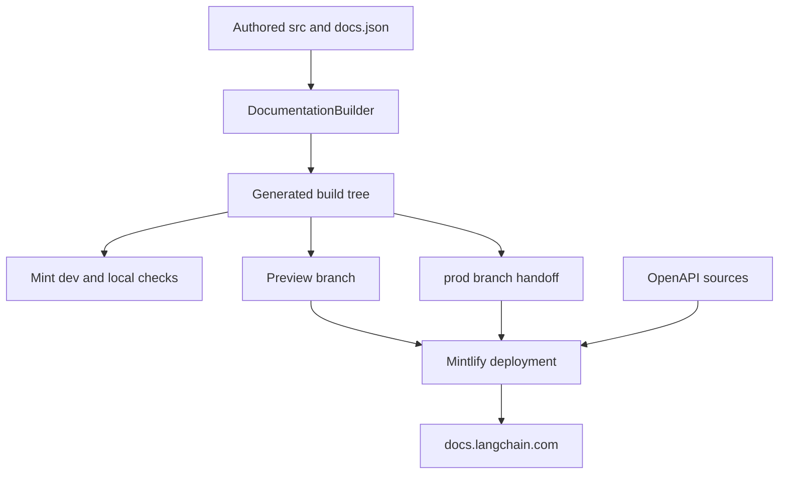

# Mintlify Integration

Mintlify is the rendering and hosting boundary for [docs.langchain.com](https://docs.langchain.com). It consumes `build/`, which is recreated from repository-owned `src/` inputs. Authors change source pages and `src/docs.json`, rebuild, and never patch `build/` or deployment-generated API-reference pages.


```mermaid
flowchart TD
    Source["Authored src and docs.json"] --> Builder["DocumentationBuilder"]
    Builder --> Build["Generated build tree"]
    Build --> Local["Mint dev and local checks"]
    Build --> Preview["Preview branch"]
    Build --> Prod["prod branch handoff"]
    Preview --> Mint["Mintlify deployment"]
    Prod --> Mint
    Specs["OpenAPI sources"] --> Mint
    Mint --> Site["docs.langchain.com"]
```

This shows the ownership boundary: the repository produces the documentation tree, while Mintlify renders it and adds deployment-time artifacts such as configured OpenAPI reference routes.

## Repository inputs and generated handoff

`DocumentationBuilder.build_all()` deletes and recreates `build/`. It emits the Python and JavaScript OSS variants, unversioned Deep Agents Code and OpenWiki pages, unversioned LangSmith pages, and language-specific Managed Deep Agents pages, then copies shared files such as `src/docs.json`. Markdown preprocessing resolves cross-references and conditionals, rewrites versioned links and snippet imports, and appends source-edit links for normal `src/` pages.

Route shape is a build invariant, not a Mintlify navigation convention:

- Ordinary OSS pages are emitted under both `/oss/python/...` and `/oss/javascript/...`.
- Deep Agents Code and OpenWiki are unversioned products under `/oss/deepagents/code/...` and `/oss/openwiki/...`; their links must not receive the ordinary OSS language prefix.
- Managed Deep Agents source pages are emitted only under `/langsmith/python/...` and `/langsmith/javascript/...`. Their unversioned compatibility URLs are redirects to Python, rather than duplicate generated pages.

Consequently, a route move must coordinate source location, emitted route family, `docs.json` navigation, and compatibility redirects. `README.md` identifies `src/` as editable source and `build/` as Mintlify's generated deployment input.

## Navigation and site configuration

`src/docs.json` is the repository-owned Mintlify configuration and is copied into `build/docs.json`. It uses Mintlify's schema to define presentation and behavior, including the Aspen theme, colors and brand assets, Tabler icons, TWK Lausanne and Inter fonts, contextual actions, Google Tag Manager, metadata, `head` assets, navigation, OpenAPI groups, and redirects. Navigation is therefore an explicit route projection, not a directory scan.

Treat redirects as part of the public route contract. The local link targets pass `--check-redirects`, so a redirect destination must resolve in the generated tree. A configuration change that names a local CSS or JavaScript asset also requires that asset to be carried into `build/`.

## Local development and generated-tree checks

`make dev` invokes the pipeline development command. Unless `--skip-build` is set, it first builds the full tree, starts a `FileWatcher` for `src/`, and runs the separately installed `mint` CLI as `mint dev --port 3000` from `build/`. An initial-build failure prevents serving; a nonzero Mint exit or an unexpectedly stopped watcher fails the command. Interrupting it shuts down the watcher and terminates Mint, escalating to a kill after the shutdown timeout.

Use the following after changes to routes, navigation, redirects, or the Agent Server specification:

```bash
make broken-links
make broken-links-with-anchors
make check-openapi
```

Both link commands rebuild and run `mint broken-links` from `build/` with redirect checking; the anchor variant adds `--check-anchors`. The wrapper captures Mint output and fails only if actionable indented report entries remain after filtering. It drops whole standalone snippet sections because language-prefixed snippet links resolve only after import into a page. It also drops known checker false positives, legacy relative paths, and OpenAPI route families that Mintlify creates only at deployment. Tests ensure ordinary links and non-exempt anchors are retained as failures. The reusable CI workflow uses Node 22, runs the anchor-aware command, then validates the Agent Server input with `mint openapi-check langsmith/agent-server-openapi.json`.

These checks establish properties of repository-generated content—authored pages, anchors, redirects, and the checked Agent Server spec—not whether Mintlify served deployment-created routes. `make export` is another limited check: it rebuilds, runs `mint export` from `build/`, and normally writes `build/export.zip`. It requires a Mint CLI supporting export, Node 20 or 22, and an Enterprise plan. Its `htmltest` configuration disables internal path and hash checks because the archive is not a complete page set; a passing export does not establish complete internal navigation.

## Deployment-time OpenAPI references

Mintlify generates reference endpoints from `docs.json` OpenAPI configuration during deployment. They are not repository MDX files, so their absence from local `build/` is expected and is deliberately filtered from local broken-link reports. Verify their rendered behavior on a Mintlify preview or production site.

| Reference surface | Repository or remote input | Mintlify route directory |
| --- | --- | --- |
| Agent Server API | `langsmith/agent-server-openapi.json` in the generated tree | `langsmith/agent-server-api` |
| Control Plane API | `https://api.host.langchain.com/openapi.json` fetched by Mintlify | Not configured in `docs.json` |
| LangSmith REST API | `langsmith/langsmith-platform-openapi.json` in the generated tree | `langsmith/smith-api` |

The LangSmith REST spec is a reviewed repository artifact even though Mintlify renders its endpoint pages. A daily, manually runnable workflow fetches and processes it, then updates one standing `chore/refresh-langsmith-openapi` PR only if the output changed. The processor permits network fetches only from `api.smith.langchain.com`, marks fleet, internal, and selected health operations hidden, groups and orders tags for the public sidebar, and normalizes operation titles—including visible non-sandbox v2 labels. Review that diff as a public documentation change.

## Hosted artifacts: previews and production

A push to `main` or a manual publishing dispatch builds the source tree, copies it to `public/build`, and publishes `public/` to the `prod` branch. That branch is a deployment handoff artifact, not a source branch for authors to edit.

For an eligible same-repository pull request, the preview workflow builds the docs, force-adds `build/` to a collision-resistant `preview-<prefix>-<timestamp>-<sha>` branch, and pushes it. It validates source-branch syntax and length, checks that the generated branch does not already exist, and requires a Mintlify API key, project ID, and branch name before calling Mintlify's preview API. It rejects malformed non-JSON responses and error responses that contain neither a status ID nor a preview URL. Fork PRs are skipped because the workflow needs write permission. On PR closure, cleanup only deletes branches with the safe `preview-` prefix.

## `llms.txt` is a deployed-site check

Mintlify, not this repository, generates `llms.txt` and splits large output into nested `/_llms/` indexes. Thus neither a local build nor a local Mint check can prove their completeness. The scheduled weekly `check-llms-urls.yml` job runs `scripts/check_llms_urls.py` against `https://docs.langchain.com`: it crawls root `llms.txt`, follows same-site nested index links, normalizes linked Markdown landing pages, fetches the sitemap, and fails when a sitemap URL is unreachable from the index. Network requests use a dedicated user agent, a 30-second timeout, and retries for connection-level failures; HTTP errors are not retried. If coverage fails, first ensure no custom `llms.txt` was added to the build, then treat the generated-index gap as a Mintlify issue.

## Safe change checklist

1. Edit `src/` and `src/docs.json`; run `make build`; do not edit `build/`, preview artifacts, or generated OpenAPI pages.
2. Select the output route family before adding navigation: ordinary OSS, unversioned Deep Agents Code/OpenWiki, and language-paired Managed Deep Agents have different invariants.
3. For a move, update the route, its exact navigation entry, and redirects together.
4. Run `make broken-links-with-anchors` for routes, links, anchors, navigation, and redirects; run `make check-openapi` for Agent Server spec changes.
5. Validate configured OpenAPI endpoint pages using a Mintlify preview or production, not only local output or export.
6. Review LangSmith REST spec refreshes as changes to the deployed reference surface.
7. Use the scheduled deployed-site check, or run `python3 scripts/check_llms_urls.py`, to investigate `llms.txt` coverage.

## Related concepts

- [Build system](/openwiki/architecture/build-system.md) — generated-tree lifecycle and build ownership.
- [Source map](/openwiki/architecture/source-map.md) — source-to-output route mapping.
- [GitHub Actions](/openwiki/integrations/github-actions.md) — CI, preview, and publishing automation.
- [Adding pages](/openwiki/operations/adding-pages.md) — source, navigation, and redirect changes.
- [Local development](/openwiki/workflows/local-development.md) — contributor setup and feedback loop.
