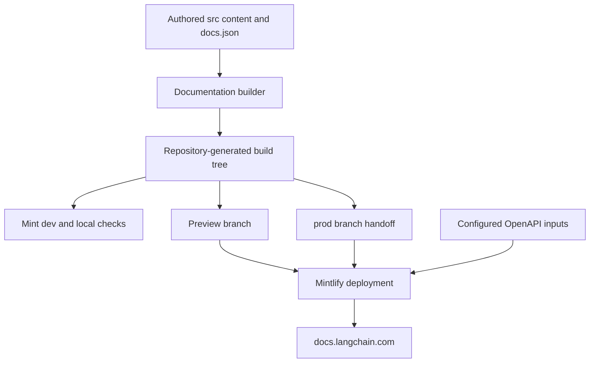

# Mintlify Integration

Mintlify is the static site generator responsible for rendering the built documentation from `/build/` into [docs.langchain.com](https://docs.langchain.com). The LangChain documentation pipeline produces Markdown and MDX output in `/build/`, and Mintlify reads this output along with site configuration from `docs.json` to render the final site. The repository owns authored `src/` content and the reproducible build handoff; Mintlify owns rendering and deployment-time generated artifacts. Do not edit `build/`, hosted preview branches, or Mint-generated endpoint pages.


```mermaid
flowchart TD
    Source["Authored src content and docs.json"] --> Builder["Documentation builder"]
    Builder --> Build["Repository-generated build tree"]
    Build --> Local["Mint dev and local checks"]
    Build --> Preview["Preview branch"]
    Build --> Prod["prod branch handoff"]
    Preview --> Mint["Mintlify deployment"]
    Prod --> Mint
    OpenAPI["Configured OpenAPI inputs"] --> Mint
    Mint --> Site["docs.langchain.com"]
```

This flow distinguishes repository-authored inputs and build output from routes and hosted artifacts Mintlify creates when it deploys.

## Configuration and route contract

Site configuration is defined in `/src/docs.json` (copied to `/build/docs.json`) using Mintlify's `docs.json` schema, specifying navigation menus, theme (`aspen`), fonts (TWK Lausanne for headings, Inter for body), icons (Tabler library), colors, analytics (Google Tag Manager), contextual actions, and URL redirects. Navigation is an explicit configuration projection of output routes, not a directory scan. The configuration also references site assets through its logo, favicon, font, and `head` settings, so a referenced local asset must make the generated tree as well.

Redirects are part of the public route contract. The local link check uses `--check-redirects`, which checks that redirect destinations resolve. A route move therefore needs coordinated changes to the emitted route, its navigation entry, and any compatibility redirect.

The builder enforces several output families before Mintlify sees the tree:

- Ordinary OSS source is emitted for both `/oss/python/...` and `/oss/javascript/...`.
- Managed Deep Agents source pages are emitted only at language-prefixed LangSmith routes, while `docs.json` redirects their unversioned routes to Python; Deep Agents Code is emitted once at an unprefixed OSS route and excluded from OSS language-link rewriting.
- These output rules are build behavior, not a Mintlify convention. Choose the intended family before adding navigation or links.

## Local serving and repository checks

The development workflow uses `mint dev` CLI (a separate global npm binary installed via `npm install -g mint@latest`) running in the `/build/` directory on port 3000. The docs dev command in `pipeline/commands/dev.py` orchestrates file watching via `FileWatcher` and launches `mint dev` as an async subprocess.

The development command performs an initial build unless `--skip-build` is set, fails if that build fails or if Mint exits nonzero or the watcher stops unexpectedly, and shuts down the watcher and Mint subprocess on interruption. With `--skip-build`, a missing tree is only warned about, so it is not a substitute for a successful build.

For route, navigation, redirect, anchor, or Agent Server specification changes, run:

```bash
make broken-links
make broken-links-with-anchors
make check-openapi
```

The Mint link-check targets build first, run from `build/` with redirect checking, filter deployment-time OpenAPI routes, standalone-snippet sections, and documented checker false positives, and fail only for remaining actionable indented link entries. The reusable link-check workflow uses Node 22 and runs the anchor check plus the Agent Server OpenAPI validation. The filter's unit tests verify that snippet-only sections and the known optional SmithDB anchor exclusions are removed while ordinary broken links and non-exempt anchors remain actionable.

These commands validate repository-generated content; they do **not** prove that deployment-generated reference pages were rendered. `make export` is a separate, deliberately limited operation: Mint export rebuilds the documentation and writes `build/export.zip` by default; it requires a Mint CLI with export support, Node 20 or 22 rather than Node 25 or later, and an Enterprise Mintlify plan. `htmltest` validates the exported archive with internal paths and hashes disabled because the export is not a complete page set, so it cannot establish internal navigation correctness.

## OpenAPI reference boundary

Mintlify is configured with three OpenAPI sections: committed Agent Server and LangSmith REST specifications generate under `langsmith/agent-server-api` and `langsmith/smith-api`, while the Control Plane specification is fetched from `https://api.host.langchain.com/openapi.json` at deployment. The Control Plane group intentionally omits a `directory`; the local-filtered `/api-reference/` family is likewise not a repository page tree.

| Reference group | Input ownership | Explicit Mintlify directory |
| --- | --- | --- |
| Agent Server API | Repository-generated `langsmith/agent-server-openapi.json` in the build tree | `langsmith/agent-server-api` |
| Control Plane API | Remote service specification at `https://api.host.langchain.com/openapi.json` | None configured |
| LangSmith REST API | Committed `src/langsmith/langsmith-platform-openapi.json`, copied into the build tree | `langsmith/smith-api` |

Mintlify deployment generates endpoint routes for the configured OpenAPI sections, so those routes are absent from local build output and are intentionally filtered from local Mint link checking. Validate the rendered endpoint surface on a Mintlify preview or production site, rather than treating a local link-check or export result as coverage.

The LangSmith REST specification is refreshed daily through a standing update PR workflow. The scheduled LangSmith OpenAPI refresh writes the processed committed specification, exits without a commit when it is unchanged, and otherwise appends to an existing `chore/refresh-langsmith-openapi` pull request or creates one, ensuring at most one outstanding refresh PR.

The refresh processor accepts only the allow-listed `api.smith.langchain.com` host, hides fleet, internal, and selected health endpoints from public documentation, assigns and orders human-readable tag groups, and normalizes operation titles including visible non-sandbox v2 labels. Treat the resulting PR diff as a change to the public deployed reference surface.

## Hosted preview and production lifecycle

The production publishing workflow builds source on `main` pushes or manual dispatch, copies `build` into `public/build`, and publishes that directory to the `prod` branch. This is a deployment handoff branch, not an authoring location.

The preview workflow builds artifacts for same-repository pull requests, pushes them to a preview branch, and invokes Mintlify's preview API only after validating the required API key, project ID, and branch name; closed pull requests trigger preview-branch cleanup. Preview creation validates source branch syntax and length, creates a collision-resistant preview branch from a sanitized prefix, timestamp, and commit SHA, and fails if the Mintlify preview response is not JSON or reports an error without a status ID or preview URL. Fork pull requests are excluded because the workflow requires permission to push the generated branch; cleanup refuses to delete a branch without the `preview-` prefix.

## Deployed `llms.txt` coverage

Mintlify generates `llms.txt` and nested `/_llms/` indexes only on the deployed site. The weekly coverage job crawls those served indexes from `docs.langchain.com` and compares their same-site page links with `sitemap.xml`, failing when any sitemap page is unreachable from `llms.txt`. This is a hosted-site check, not build output validation.

The deployed `llms.txt` checker uses a dedicated user agent, a 30-second timeout, and up to three attempts for connection-level failures, but lets HTTP errors fail immediately. If it reports a gap, first confirm that no custom `llms.txt` was added to the build; the index-generation issue is otherwise at the Mintlify boundary.

## Safe change checklist

1. Edit `src/` and `src/docs.json`, then run `make build`; do not patch generated `build/` content or Mint-created reference routes.
2. Select the correct output family before updating navigation or links, especially for dual-language OSS and Managed Deep Agents pages.
3. Update a moved route, its navigation entry, and redirects together; run `make broken-links-with-anchors`.
4. Run `make check-openapi` for Agent Server specification changes. Review LangSmith REST refresh PRs as public API documentation changes.
5. Use a Mintlify preview or production to inspect OpenAPI endpoint routes and use `python3 scripts/check_llms_urls.py` (or its scheduled job) for deployed `llms.txt` coverage.

## Related concepts

- [Build system](/openwiki/architecture/build-system.md) — generated-tree lifecycle and build ownership.
- [Source map](/openwiki/architecture/source-map.md) — source-to-output route mapping.
- [GitHub Actions](/openwiki/integrations/github-actions.md) — CI, preview, publishing, and refresh automation.
- [Reference documentation](/openwiki/integrations/reference-docs.md) — external SDK references and the OpenAPI publication boundary.
- [Test overview](/openwiki/testing/test-overview.md) — validation layers and test entry points.
