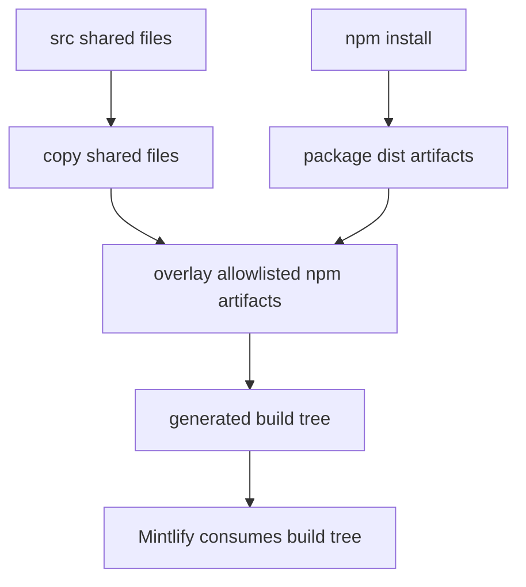
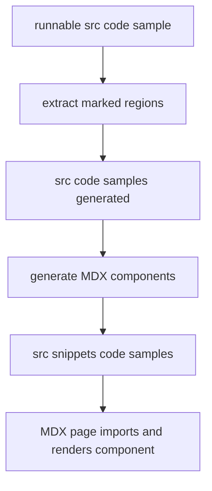

# npm Snippet Components

This documentation site has **two deliberately different snippet systems**:

- **npm-provided UI components** come from the pinned `@langchain/docs-sandbox` package and are overlaid into the disposable `build/` tree. They implement interactive embeds such as `PatternEmbed` and `ExampleEmbed`.
- **Generated code-sample snippets** start as runnable files in `src/code-samples/`, are extracted into an ignored intermediate directory, and become MDX components under `src/snippets/code-samples/`.
- **Authored snippets** are MD/MDX (and, where needed, JSX/TSX) maintained directly under `src/snippets/`. They are shared documentation inputs, not package artifacts or generated sample outputs.

These ownership boundaries determine where a change belongs. Do not edit `node_modules/`, `build/`, `src/code-samples-generated/`, or generated MDX in `src/snippets/code-samples/`: those are dependency-owned or derived outputs. Update the package upstream for UI behavior, an authored snippet for authored prose, or the runnable sample for a generated code block.

## npm component overlay

The project declares `@langchain/docs-sandbox` as `^0.0.24`; the lockfile resolves version `0.0.24`. The builder copies an explicit allowlist from `node_modules/@langchain/docs-sandbox/dist/`, rather than publishing the package directory wholesale:

| Package artifact | Generated destination | Consumer |
| --- | --- | --- |
| `PatternEmbed.jsx` | `build/snippets/pattern-embed.jsx` | MDX import from `/snippets/pattern-embed.jsx` |
| `ExampleEmbed.jsx` | `build/snippets/example-embed.jsx` | MDX import from `/snippets/example-embed.jsx` |
| `ChatLangChainEmbed.js` | `build/ChatLangChainEmbed.js` | Deferred root script configured in `src/docs.json` |

The allowlists are the compatibility contract. To expose a new package artifact, publish it upstream and add a source-name-to-destination-name mapping to the relevant builder map. A renamed or removed `dist/` file likewise requires a mapping change and a generated-site check.

For example, pages use stable generated URLs rather than package filesystem paths:

```jsx
import { PatternEmbed } from "/snippets/pattern-embed.jsx"

<PatternEmbed pattern="branching-chat" />
```

```jsx
import { ExampleEmbed } from "/snippets/example-embed.jsx"

<ExampleEmbed example="copilotkit" minHeight={700} />
```

The supported `pattern` and `example` identifiers are a package contract. When changing a page, use identifiers supported by the installed package version.

## Build order and precedence

`make build` installs npm dependencies, then invokes the Python build command, which constructs `DocumentationBuilder(src, build)` and calls `build_all()`. That operation recreates `build/`, emits routed documentation, copies shared source files, overlays npm artifacts, and finally generates the LLM indexes.



This shows the authoritative order for a full build: npm artifacts are copied **after** shared files. Thus an allowlisted package file wins over a same-destination fallback copied from `src/snippets/`; the installed package is the owner of the final mapped asset. The overlay uses `shutil.copy2`, creates `build/snippets/`, and keeps component filenames stable at the destinations above.

The overlay is intentionally non-fatal. If `dist/` is missing, it warns to run `npm install` and returns. If one expected allowlisted file is absent, it warns and continues with the others. A successful build therefore does not prove all embeds are present; inspect the relevant outputs and rendered page after dependency or mapping changes.

### Language routing

The builder rewrites only imports from `/snippets/` that end in `.md` or `.mdx` when emitting a versioned page. It redirects them to `/snippets/python/` or `/snippets/javascript/`, while retaining an already scoped Markdown path. JSX/TSX imports do not match the rewrite, so one npm component serves both language variants.

Markdown snippets have a separate output contract: the original generated path is a Python-resolved default for unversioned consumers, and copies are emitted under both `/snippets/python/` and `/snippets/javascript/`. This applies to authored and generated Markdown snippets alike after they are in `src/snippets/`; it does not turn generated MDX into an authoring surface.

## Generated code-sample snippets

`make code-snippets` is independent of the npm overlay. It first runs `scripts/extract_code_snippets.py`, then `scripts/generate_code_snippet_mdx.py`:



The diagram shows the editable-to-derived lifecycle; the two output directories are not competing component sources. The extractor scans Python, TypeScript, Java, Kotlin, Go, and shell sources under `src/code-samples/`, ignoring `node_modules`. A block between `:snippet-start: <id>` and `:snippet-end:` becomes a generated file named `<source-basename>.snippet.<id>.<ext>`. It recognizes comment syntax appropriate to the language, removes nested `:remove-start:`/`:remove-end:` regions, dedents the retained body, and normalizes its output to Unix newlines with at most one trailing newline. An unclosed snippet or removal region makes extraction fail.

Use removal markers for executable setup, assertions, or cleanup that proves the example but should not appear in the documentation. For example, `mcp-multimodal-tool-content.py` exposes one marked example while excluding its local FastMCP server and runner; `mcp-tool-results.py` exposes separate error-handling and metadata snippets while excluding test scaffolding. The MCP Tools page imports the resulting components by their stable generated names and renders them in the appropriate sections.

The generator reads the extracted intermediates and writes fenced MDX to `src/snippets/code-samples/`. It supports Python, TypeScript, Java, Kotlin, Go, and shell fences. A snippet may supply a first-line `:codegroup-tab:` label and optional `:codegroup-fence-mods:` directive; the directives are removed from displayed code. For eligible Python and TypeScript Deep Agents samples, it can instead produce a seven-provider `<CodeGroup>` by replacing a general agent model string; `# KEEP MODEL` or `// KEEP MODEL` preserves the next model occurrence, and provider-specific chat or embedding models are not expanded. When a trace URL for the snippet is present in the trace manifest, the generator appends the trace link.

### Refresh scope and generated-state behavior

Without `CODE_SNIPPET_SOURCES`, extraction removes generated source-language files from `src/code-samples-generated/` and rebuilds them from every supported sample. With `CODE_SNIPPET_SOURCES` set to space-separated repository-relative source paths, it validates that each path is a supported file beneath `src/code-samples/`, deletes outputs only for those source stems, and leaves other generated stems intact. This makes focused iteration possible, but a full run is the correct cleanup operation after renames, deleted markers, or broad changes.

```bash
make code-snippets
```

For a focused refresh:

```bash
CODE_SNIPPET_SOURCES="src/code-samples/langchain/mcp-tool-results.py" make code-snippets
```

Do not hand-edit the MDX generated by this command. Edit the marked runnable source, execute its focused sample check when applicable, regenerate, and review the generated MDX diff and consuming page. The generator does not delete stale MDX files in `src/snippets/code-samples/`; when a snippet ID or source is renamed or removed, remove or update obsolete derived MDX deliberately as part of the source change.

## Verification and safe changes

1. **Package UI changes:** publish the `@langchain/docs-sandbox` change, update dependency and lock state, then run `make build`. Confirm `build/snippets/pattern-embed.jsx`, `build/snippets/example-embed.jsx`, or `build/ChatLangChainEmbed.js` as relevant, and inspect the rendered Mintlify route. This detects missing installs, changed `dist/` names, mapping omissions, MDX resolution, and browser loading.
2. **Authored Markdown snippets:** edit `src/snippets/` directly and build both language variants if a versioned page consumes the snippet. Confirm the import targets the appropriate language-specific Markdown copy; a JSX component import should remain shared.
3. **Runnable code samples:** edit `src/code-samples/`, run the focused sample command such as `make test-code-samples FILES="src/code-samples/langchain/mcp-tool-results.py"`, then run `make code-snippets`. Run `tests/unit_tests/test_generate_code_snippet_mdx.py` when changing model-expansion behavior. Review the generated MDX and its consumer instead of modifying the derivative.
4. **Builder changes:** the focused builder tests cover Markdown import rewriting and preservation of JSX imports, as well as local TSX copying. They do not directly test `_copy_npm_snippets()`; add fixture coverage for package copying, precedence, or warning behavior when changing that method.
5. **Link validation:** `make broken-links-with-anchors` depends on `build`, runs Mintlify's broken-link check with anchors and redirects from `build/`, filters known exclusions, and fails when filtered output retains indented link entries. It checks structural links, not embed behavior, so it complements rather than replaces rendered-route inspection.

For broader build ownership, see [Build System Architecture](/openwiki/architecture/build-system.md); for Mintlify operation, [Mintlify Integration](/openwiki/integrations/mintlify.md); for sample authoring and trace refresh, [Code Sample Lifecycle](/openwiki/workflows/code-sample-lifecycle.md); and for test layers, [Test Overview](/openwiki/testing/test-overview.md).
