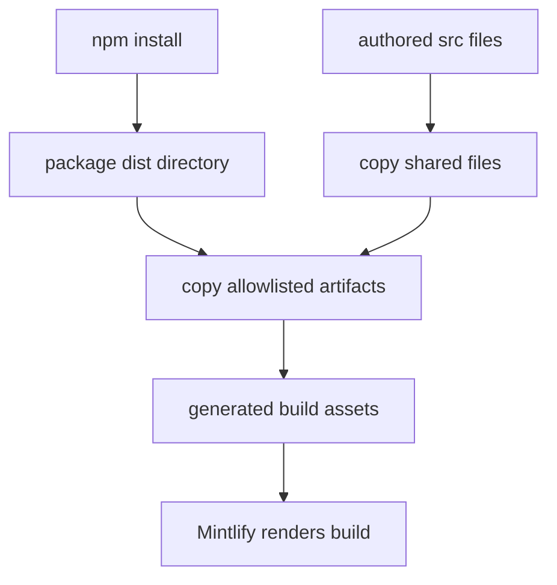

# NPM Snippet Components

`@langchain/docs-sandbox` is the package boundary for selected interactive documentation components. The project declares `^0.0.24`, and `package-lock.json` resolves it to `0.0.24`. The builder allowlist—not the package directory as a whole—determines which package artifacts become site assets. Neither `node_modules/` nor `build/` is editable component source: the former is dependency-owned and the latter is disposable generated output.

## Published component contract

The builder copies only named artifacts from the package `dist/` directory:

| Package artifact | Generated destination | Render consumer |
| --- | --- | --- |
| `PatternEmbed.jsx` | `build/snippets/pattern-embed.jsx` | MDX imports `/snippets/pattern-embed.jsx` |
| `ExampleEmbed.jsx` | `build/snippets/example-embed.jsx` | MDX imports `/snippets/example-embed.jsx` |
| `ChatLangChainEmbed.js` | `build/ChatLangChainEmbed.js` | The deferred script in `src/docs.json` |

This mapping is the compatibility contract between the published package and the documentation build. To expose a new package artifact, publish it upstream and add an explicit source-name-to-output-name entry to the applicable builder map; changing the dependency alone does not expose a new file. Conversely, a changed or removed `dist/` filename needs a mapping update and a generated-site check.

`src/docs.json` loads `/ChatLangChainEmbed.js` with `defer`, making the root artifact a renderer-facing site configuration dependency. The JSX artifacts are resolved from the shared `/snippets/` URL space by MDX imports.

## Full-build overlay lifecycle

`make build` runs `npm install` before invoking the Python build command. That command creates `DocumentationBuilder(src, build)` and calls `build_all()`. A full build removes any prior `build/` directory, emits routed documentation, copies shared files, overlays npm artifacts, then generates the LLM indexes.



This flow shows the full-build handoff from package installation and authored source to the generated tree Mintlify consumes.

`_copy_npm_snippets()` locates `node_modules/@langchain/docs-sandbox/dist/` beside the configured source directory and creates `build/snippets/`. It copies mapped JSX files there and mapped script files to the build root with `shutil.copy2`. Because it runs after `_copy_shared_files()`, an installed package artifact overwrites a same-named source-tree fallback already copied from `src/snippets/`. The later package artifact is authoritative for a mapped destination; do not patch either fallback or generated output to change package behavior.

### Non-fatal installation failures

The overlay intentionally does not fail the build when its inputs are unavailable. If the package `dist/` directory is absent, it warns that `npm install` is required and returns. If a particular allowlisted artifact is absent, it warns and continues with other entries. Therefore a successful builder exit does not establish that every interactive component is present. A source fallback copied earlier may remain when an overlay file is missing, but that does not validate the published package contract.

## MDX consumption and language routing

MDX pages import stable generated paths, never `node_modules` or a `build/` filesystem path. Representative consumers use:

```jsx
import { PatternEmbed } from "/snippets/pattern-embed.jsx"

<PatternEmbed pattern="branching-chat" />
```

```jsx
import { ExampleEmbed } from "/snippets/example-embed.jsx"

<ExampleEmbed example="copilotkit" minHeight={700} />
```

`PatternEmbed` appears in versioned OSS frontend pages, while `ExampleEmbed` appears in LangChain frontend integration pages. The observed calls supply a `pattern` or `example` identifier and, for the example, `minHeight`. Supported identifiers and component behavior belong to the pinned published package; repository-side page changes should use values that version supports.

Language-specific rewriting applies only to `/snippets/` imports ending in `.md` or `.mdx`. During a versioned build it redirects those Markdown snippets to `/snippets/python/` or `/snippets/javascript/`; imports already scoped to either directory remain unchanged. JSX and TSX component imports do not match this rewrite, so a single `PatternEmbed.jsx` or `ExampleEmbed.jsx` serves all language variants. Local JSX/TSX files under `src/snippets/` are also shared inputs, but a mapped package artifact overwrites a local file at the same generated destination.

Markdown snippets follow a separate three-output contract: the original path contains Python-resolved links for unversioned consumers, while `/snippets/python/` and `/snippets/javascript/` contain the respective language-resolved copies. See [Markdown Preprocessing Pipeline](/openwiki/concepts/preprocessing.md) for that mechanism and [Versioned Content](/openwiki/workflows/versioned-content.md) for route behavior.

## Safe changes and verification boundary

1. **Change the correct owner.** Change component implementation in `@langchain/docs-sandbox`, publish it, and update the dependency lock state. Change this repository's mapping only for artifact names or destinations, and change MDX only for integrations that import stable `/snippets/` URLs.
2. **Use a clean full build.** Run `make build`, which installs dependencies and recreates `build/`. Confirm each relevant mapped output exists: `build/snippets/pattern-embed.jsx`, `build/snippets/example-embed.jsx`, or `build/ChatLangChainEmbed.js`. This detects a missing installation, changed `dist/` filename, or absent mapping.
3. **Check rendered consumers.** Inspect affected routes in Mintlify after the clean build. For a versioned page, inspect both Python and JavaScript outputs: component imports remain shared `/snippets/...jsx`, while Markdown snippet imports are language-scoped. Also inspect an unversioned consumer when one is affected. This is the boundary that verifies file presence, MDX resolution, browser loading, and the chosen identifiers and dimensions together.
4. **Run structural checks where applicable.** `make broken-links-with-anchors` depends on `build`, runs `mint broken-links --check-anchors --check-redirects` from `build/`, filters the report, and fails only if filtered output still contains indented link entries. It is useful for page, anchor, and redirect changes but does not replace rendered component inspection.
5. **Keep focused tests aligned with the boundary.** `tests/unit_tests/test_builder.py` verifies Markdown-import language rewriting, preservation of an already scoped Markdown import, and that a `PatternEmbed` JSX import is unchanged. It also verifies copying a local TSX snippet. It has no direct test for `_copy_npm_snippets()`; a mapping, overwrite-precedence, or warning-semantics change should add a fixture that creates the package `dist/` directory beside the fixture source and asserts the mapped generated files.

The focused tests protect routing and local shared-file behavior. A clean dependency installation plus rendered Mintlify consumers is required to validate the dependency-owned package artifacts end to end. For generated-tree ownership and Mintlify operation, see [Build System Architecture](/openwiki/architecture/build-system.md), [Mintlify Integration](/openwiki/integrations/mintlify.md), [Documentation CLI Tools](/openwiki/operations/cli-tools.md), and [Builder Test Guidance](/openwiki/testing/builder-tests.md).
