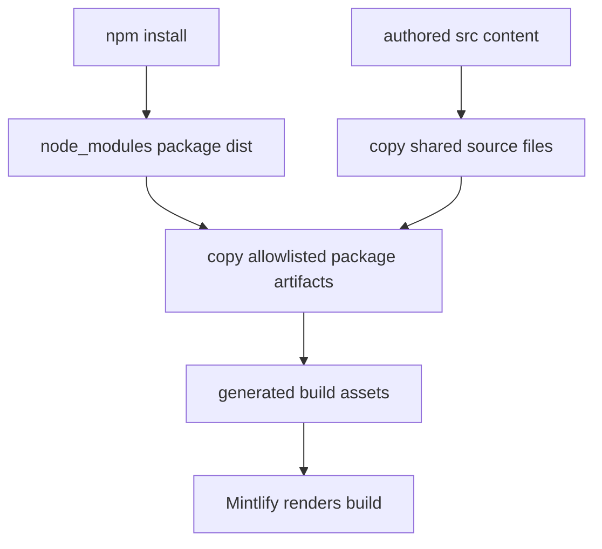

# NPM Snippet Components

`@langchain/docs-sandbox` is the package boundary for selected interactive documentation components. The documentation repository declares the package as `^0.0.23`; the lockfile resolves the current installation to `0.0.23`. The builder, not MDX authors or Mintlify configuration, determines which package artifacts become site assets. Generated files under `build/` are deployable output and must not be edited as component source.

## Published component contract

The builder has an explicit allowlist rather than copying the package's entire `dist/` directory:

| Package artifact | Generated destination | Consumer |
| --- | --- | --- |
| `PatternEmbed.jsx` | `build/snippets/pattern-embed.jsx` | MDX import from `/snippets/pattern-embed.jsx` |
| `ExampleEmbed.jsx` | `build/snippets/example-embed.jsx` | MDX import from `/snippets/example-embed.jsx` |
| `ChatLangChainEmbed.js` | `build/ChatLangChainEmbed.js` | Site-wide deferred script configured in `src/docs.json` |

This mapping is the compatibility contract between the published package and the documentation build. Adding a package artifact has two required integration changes: publish it in the package and add an explicit source-name-to-output-name entry to the appropriate builder mapping. Updating the dependency without a mapping does not expose a new artifact to the site.

`src/docs.json` injects `/ChatLangChainEmbed.js` with `defer`, so the root-level allowlisted file is a site configuration dependency. The two JSX artifacts are instead imported by MDX and resolved from the shared `/snippets/` URL space.

## Copy boundary and lifecycle

`make build` first runs `npm install` and then invokes the Python build command, which instantiates `DocumentationBuilder(src, build)` and calls `build_all()`. A full build deletes and recreates `build/`, emits routed documentation, copies shared source files, overlays package components, and only then produces the LLM indexes.



This shows the full-build overlay: package artifacts are copied after shared source files and become the generated assets Mintlify consumes.

The package source is `node_modules/@langchain/docs-sandbox/dist/`, located relative to the parent of the configured source directory. `_copy_npm_snippets()` creates `build/snippets/`, copies each configured artifact with metadata preservation, and logs the result. It runs after `_copy_shared_files()`, deliberately replacing a source-tree file at the same generated destination when the package artifact is available. That ordering establishes package ownership of these named generated components without treating a copied `build/` file as editable source.

### Failure semantics

The overlay is deliberately non-fatal. If the package `dist/` directory is absent, the builder logs a warning telling the operator to run `npm install` and returns. If an individual allowlisted file is absent, it logs a warning and continues with the remaining entries. Consequently, a successful builder process alone does not prove that every interactive component was installed: inspect the generated destinations or render the dependent page after a package or mapping change. A same-named source artifact copied earlier can remain when an overlay source is missing, but it is not a substitute for changing the published component contract.

## Authoring MDX consumers

MDX pages consume only the stable generated import paths, not `node_modules` paths and not `build/` filesystem paths. Representative pages use:

```jsx
import { PatternEmbed } from "/snippets/pattern-embed.jsx"

<PatternEmbed pattern="branching-chat" />
```

```jsx
import { ExampleEmbed } from "/snippets/example-embed.jsx"

<ExampleEmbed example="copilotkit" minHeight={700} />
```

`PatternEmbed` is used by both versioned OSS frontend pages and the language-agnostic Deep Agents Code content; the observed calls provide a `pattern` identifier and sometimes `minHeight`. `ExampleEmbed` is used by LangChain frontend integration pages with an `example` identifier and `minHeight`. The implementation and the set of supported identifiers live in the published package, so repository changes should limit themselves to using values supported by the pinned package version rather than assuming undocumented props or editing a copied artifact.

The language-specific import rewrite applies only to imports ending in `.md` or `.mdx`. It redirects those Markdown snippets to `/snippets/python/` or `/snippets/javascript/` in language-targeted output. Imports of `.jsx` and `.tsx` components—including the two package paths above—remain unchanged, so one shared component serves every emitted language variant. Local JSX/TSX files that authors intentionally place under `src/snippets/` are also shared build inputs, but they are a separate source-owned mechanism; for a mapped sandbox destination, the later package overlay wins when installed.

For Markdown snippet processing and its three emitted variants, see [Markdown Preprocessing Pipeline](/openwiki/concepts/preprocessing.md). For the overall generated-tree ownership model, see [Build System Architecture](/openwiki/architecture/build-system.md) and [Mintlify Integration](/openwiki/integrations/mintlify.md).

## Safe change and validation workflow

1. **Change the right owner.** For behavior inside `PatternEmbed`, `ExampleEmbed`, or `ChatLangChainEmbed`, make and publish the change in `@langchain/docs-sandbox`; then update the dependency lock state and builder mapping here when needed. For a page integration, edit the MDX page and import the stable `/snippets/` path.
2. **Build from a clean dependency installation.** Run `make build`. It installs npm dependencies, recreates `build/`, and performs the overlay. Confirm the expected files exist at `build/snippets/pattern-embed.jsx`, `build/snippets/example-embed.jsx`, or `build/ChatLangChainEmbed.js` as applicable. This catches an absent package directory, a changed `dist/` filename, or a missing mapping.
3. **Inspect every relevant route.** Versioned MDX consumers need both Python and JavaScript output checked; their component import remains `/snippets/...jsx`, while ordinary Markdown snippet imports are language-scoped. Also inspect unversioned consumers when applicable. Use Mintlify local development to verify that the component renders with the intended identifiers and dimensions.
4. **Check generated links and anchors.** Run `make broken-links-with-anchors` when the change affects a page or its anchors. It rebuilds first and runs Mintlify from `build/`. Its filter intentionally excludes standalone snippets because their absolute links are valid when imported, not necessarily when checked as pages.
5. **Run focused unit coverage for builder behavior.** `tests/unit_tests/test_builder.py` asserts that Markdown snippet imports gain Python or JavaScript prefixes, already-prefixed imports remain unchanged, and a `PatternEmbed` JSX import is not rewritten. It also verifies that a local TSX snippet is copied as a shared artifact. When changing the overlay mapping or its error behavior, add a direct `_copy_npm_snippets()` fixture test; the existing focused tests do not exercise the npm package copy itself.

The focused builder tests are complementary to a rendered preview: string-rewrite tests protect language routing, while a clean build and Mintlify preview validate package installation, file presence, MDX resolution, and browser rendering.
