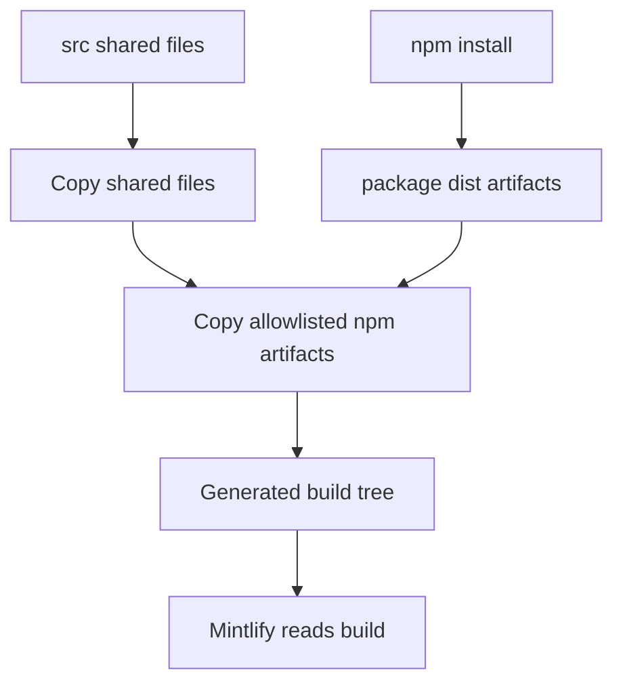

# NPM Snippet Components

`@langchain/docs-sandbox` owns a small set of interactive documentation assets. The documentation repository consumes those assets at build time rather than maintaining their implementation in `src/`: `package.json` declares `^0.0.24` and the lockfile resolves `0.0.24`. The package has peer dependencies on React and Zod, which are supplied by the documentation runtime rather than bundled by this integration.

This is distinct from authored Markdown snippets under `src/snippets/`. The latter are normal source inputs; the npm package is an explicit, allowlisted overlay. Do not edit `node_modules/` or `build/`: a dependency install or full build replaces both relevant inputs and outputs.

## Entry point and artifact contract

`make build` runs `npm install` before `uv run pipeline build`. The build command constructs `DocumentationBuilder` with `src` and `build` and calls `build_all()`. During that full build, `_copy_npm_snippets()` reads `node_modules/@langchain/docs-sandbox/dist/` relative to the repository root (the parent of `src`) and copies only the following mappings:

| Package `dist/` artifact | Generated location | How it is consumed |
| --- | --- | --- |
| `PatternEmbed.jsx` | `build/snippets/pattern-embed.jsx` | MDX imports `/snippets/pattern-embed.jsx` |
| `ExampleEmbed.jsx` | `build/snippets/example-embed.jsx` | MDX imports `/snippets/example-embed.jsx` |
| `ChatLangChainEmbed.js` | `build/ChatLangChainEmbed.js` | `src/docs.json` loads `/ChatLangChainEmbed.js` with `defer` |

The two class-level mapping dictionaries are the extension point and compatibility boundary. Publishing a new package file alone does not expose it to the site: add a deliberate source-to-destination mapping, decide whether it belongs under `build/snippets/` or at the site root, and add coverage for the output contract. Conversely, a package rename or removal must be reflected in the mapping and in consuming MDX/configuration.

Representative pages use the generated public paths, not package paths:

```jsx
import { PatternEmbed } from "/snippets/pattern-embed.jsx"

<PatternEmbed pattern="branching-chat" />
```

```jsx
import { ExampleEmbed } from "/snippets/example-embed.jsx"

<ExampleEmbed example="copilotkit" minHeight={700} />
```

The `pattern` and `example` values are component-package contracts. Confirm an identifier is supported by the installed package version when changing a page.

## Overlay lifecycle and precedence

A full build deletes and recreates `build/`, emits the versioned and unversioned documentation families, copies shared source files, and then applies the npm overlay. `shutil.copy2` preserves file metadata while overwriting its destination. Therefore, if `src/snippets/` contains a source-tree fallback at the same mapped destination, the installed package copy is authoritative in the finished build.


```mermaid
flowchart TD
    Install["npm install"] --> Dist["package dist artifacts"]
    Source["src shared files"] --> Shared["Copy shared files"]
    Shared --> Overlay["Copy allowlisted npm artifacts"]
    Dist --> Overlay
    Overlay --> Output["Generated build tree"]
    Output --> Mint["Mintlify reads build"]
```

This flow shows the full-build ordering that gives the package overlay precedence over source-tree copies.

The integration is deliberately best-effort rather than a build gate:

- If the package `dist/` directory does not exist, `_copy_npm_snippets()` logs a warning instructing the user to run `npm install` and returns.
- If an individual mapped artifact is absent, it logs a warning and continues copying the remaining mapped files.
- Consequently, a successful pipeline build does not prove that interactive embeds exist. After dependency or mapping changes, inspect the expected `build/` files and render the consuming route.

## Language routing relationship

The language-specific snippet rewriter operates only on `/snippets/` imports ending in `.md` or `.mdx`. For a Python or JavaScript documentation variant it rewrites an unscoped Markdown import to `/snippets/python/...` or `/snippets/javascript/...`; it leaves an already scoped Markdown path unchanged. Markdown snippets are emitted as a Python-default original path plus Python and JavaScript copies.

Npm component imports end in `.jsx`, so they do not match that rewrite. `PatternEmbed` and `ExampleEmbed` therefore remain single shared assets under `build/snippets/` for both language variants. This distinction is intentional: do not introduce language-scoped component imports unless the builder and artifact contract are changed together.

## Verification and test coverage

For a package upgrade or mapping change, use a full build rather than relying on incremental preview behavior:

```bash
make build
```

Then verify the expected generated artifact, the importing MDX route, and—in the root-script case—the deferred script entry in `build/docs.json`. See [Build System Architecture](/openwiki/architecture/build-system.md) for full-build and watcher boundaries, [Local Development Workflow](/openwiki/workflows/local-development.md) for preview operation, and [Builder Tests](/openwiki/testing/builder-tests.md) for fixture conventions.

The focused builder tests verify language rewriting of Markdown snippet imports, preservation of a `.jsx` import, preservation of an already language-scoped Markdown import, and copying of a local TSX snippet component. They contain no direct test of `_copy_npm_snippets()` itself. Changes to package copying should add isolated fixtures for mapped-file output, source-copy overwrite precedence, and warnings for a missing package directory or individual artifact.
