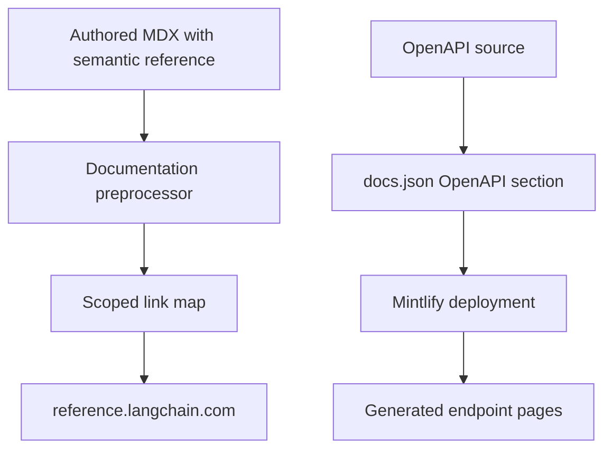

## Boundary and ownership

`docs.langchain.com` is this repository's authored-documentation and build pipeline. Generated API reference for LangChain, LangGraph, LangSmith, Deep Agents, and integration packages is a separate service at [reference.langchain.com](https://reference.langchain.com/python/), with distinct [Python](https://reference.langchain.com/python/) and [JavaScript/TypeScript](https://reference.langchain.com/javascript/) sites. It is not an output of this repository; do not attempt to fix a missing generated reference page or signature by changing this docs build.

This repository does own two related integration layers:

1. authored Markdown/MDX can name an SDK symbol semantically and let preprocessing produce the external reference URL; and
2. `src/docs.json` declares three Mintlify OpenAPI sections for product HTTP APIs. Two specs are committed here; the Control Plane spec remains external.



This shows the separate external-reference-link and OpenAPI-generated-page paths.

## Semantic links in authored documentation

Use `@[ClassName]` for the first useful mention of an SDK class, method, or function rather than hard-coding a `reference.langchain.com` URL. The supported forms include a default title, a custom title, and a code-formatted default title:

```markdown
@[StateGraph]
@[Build a graph][StateGraph]
@[`StateGraph`]
```

The autolink preprocessor recognizes these forms and substitutes a Markdown link from the current scope's `SCOPE_LINK_MAPS` entry. For example, in Python scope `@[StateGraph]` resolves to the mapped Python reference URL. `LINK_MAPS` supplies scoped `host` and symbol-to-path entries, and `_enumerate_links` combines relative paths with the host while leaving absolute mapping values intact.

Scope is selected from the preprocessing default (normally the target language) and changes at a `:::python` or `:::js` fence. Autolinking runs before conditional rendering. References inside ordinary fenced code blocks are deliberately not changed; a backslash-escaped reference such as `\@[StateGraph]` remains literal after the escape is removed. An unresolved reference logs an informational message with source location and remains `@[...]` in rendered input rather than becoming a guessed URL. The special `global` scope currently falls back to Python and logs an error, so authored content should use explicit language fences when a symbol differs by language.

### Keep maps and source in sync

`make check-cross-refs` is the strict authoring guardrail. It scans Markdown and MDX under `src/`, reuses the same reference and fence patterns as the preprocessor, and exits nonzero for unresolved symbols. It ignores ordinary code blocks, escaped references, `snippets/code-samples/`, and `node_modules`.

The checker derives default scope from the source path: `oss/python/` is Python, `oss/javascript/` is JavaScript, shared `oss/` content is checked in **both** scopes, and non-OSS content is Python. Shared, unfenced content must therefore resolve in every scope it will be built for—not merely one. Add or correct an entry in `pipeline/preprocessors/link_map.py`, or move a language-specific reference inside the appropriate fence, before merging. Unit tests cover known and unknown references, scoped and shared files, code/escaped exclusions, custom titles, and multiple references on one line.

## Mintlify OpenAPI sections

`src/docs.json` is the configuration boundary between a spec source and Mintlify-generated endpoint pages. The configured sections are:

| Section | Navigation location | Spec source and lifecycle | Generated path |
| --- | --- | --- | --- |
| Agent Server API | Deploy → Get started → Reference | `src/langsmith/agent-server-openapi.json`, committed; updated by `langgraph-api` PRs named `Update Agent ServerOpenAPI spec for API version X.Y.Z` | `/langsmith/agent-server-api/` |
| Control Plane API | Deploy → Get started → Reference | `https://api.host.langchain.com/openapi.json`, fetched at deployment; no local file | `/api-reference/` |
| LangSmith REST API | Monitor → Reference | `src/langsmith/langsmith-platform-openapi.json`, committed and refreshed automatically | `/langsmith/smith-api/` |

Mintlify generates endpoint pages for these sections at deployment. They are not source MDX pages and are not present in the local `build/` directory in the same way as authored pages. The external Control Plane spec should be treated as service-owned rather than copied into this repository.

### Agent Server validation

The Agent Server spec is a committed OpenAPI 3.1.0 document. Before merging its update PR, run:

```bash
make check-openapi
```

The target first builds the documentation, then invokes `mint openapi-check langsmith/agent-server-openapi.json` from `build/`. Despite its general name and historical guidance to validate either committed spec, the current target validates **only the Agent Server spec**. It is also run by the link-check workflow. Validate any additional spec with an appropriate explicit tool or extend the target deliberately; do not claim that this command checks all three sources.

### LangSmith REST refresh and public-doc shaping

Do **not** hand-edit `src/langsmith/langsmith-platform-openapi.json`. At 10:00 UTC daily, or on manual dispatch, the refresh workflow runs `uv run python scripts/process_langsmith_openapi.py --write`. The script fetches only `https://api.smith.langchain.com/openapi.json`: its host allow-list and 30-second timeout prevent the normal refresh path from requesting an arbitrary host. A local `--input` can be used for controlled preview or test data, and omission of `--write` prints the transformed JSON instead of replacing the committed file.

The processing step makes a raw service spec suitable for public navigation. It marks operations hidden when their tag, exact path, or path prefix denotes fleet, internal, infrastructure, or health functionality; adds or updates tags and their human-readable `x-group` values; sorts groups; and normalizes operation titles, including visible v2 labels. The transformation is designed to be repeatable: existing Beta/v2 markers are stripped before normalized markers are added.

After generating the candidate, the workflow preserves it while it checks out the standing `chore/refresh-langsmith-openapi` branch. With an open PR it appends a commit; otherwise it starts the branch and opens one. If the spec has no diff, it exits without a commit. The automated commit records that fleet and internal endpoints were filtered, so reviewers should review the generated diff rather than manually editing around it.

## Link-check exceptions

`make broken-links` and `make broken-links-with-anchors` build first, run Mintlify from `build/`, and pass the report through `scripts/filter_mint_broken_links.py`. The command fails only when filtered output still contains indented link entries.

The filter removes reports for the deployment-generated OpenAPI destinations `/langsmith/agent-server-api/`, `/langsmith/smith-api`, and `/api-reference/`. It also drops whole snippet report sections because snippets are checked standalone even though their rewritten links resolve when imported, and it suppresses a small set of legacy relative-path false positives. With `--check-anchors`, it additionally suppresses three known SmithDB-migration anchor false positives; other anchor failures remain visible. These are narrow operational exceptions, not permission to ignore ordinary authored-page failures. Focused unit tests confirm that excluded reports disappear while a genuine unresolved `/oss/` link and a non-exempt anchor remain.

## Reporting and change decisions

For an issue on the external generated reference site—such as a missing page, broken generated link, incorrect signature, or stale content—open the repository's [Reference Documentation issue](https://github.com/langchain-ai/docs/issues/new?template=04-reference-docs.yml). The template captures issue type, language, product, page URL, and a detailed description, then routes the report to the reference-docs maintainers. The repair belongs in the separate reference-generation tooling.

Use this repository for a missing semantic map entry, incorrect Markdown preprocessing behavior, Mintlify navigation configuration, or a committed OpenAPI refresh/Agent Server change. Keep those ownership boundaries intact: semantic links make authored docs resilient to reference URL changes, while automated OpenAPI inputs and deploy-time generation prevent hand-maintained endpoint pages from drifting.

## Related documentation

- [Source map](/openwiki/architecture/source-map.md) — source ownership and build outputs.
- [Preprocessing](/openwiki/concepts/preprocessing.md) — ordered documentation transformations.
- [GitHub Actions](/openwiki/integrations/github-actions.md) — scheduled automation conventions.
- [Cross-reference operations](/openwiki/operations/cross-references.md) — diagnosing and maintaining internal references.
- [Test overview](/openwiki/testing/test-overview.md) — test layers and commands.
