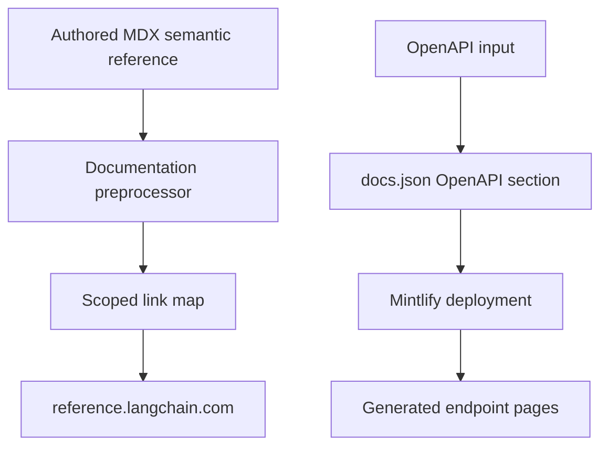

## Boundary and ownership

`docs.langchain.com` is this repository's authored documentation and build pipeline. Generated API reference for LangChain, LangGraph, LangSmith, and integration packages is hosted separately at [reference.langchain.com](https://reference.langchain.com/python/), with distinct [Python](https://reference.langchain.com/python/) and [JavaScript/TypeScript](https://reference.langchain.com/javascript/) sites. Reference generation scripts and output are not in this repository. Report missing generated pages, broken generated links, or incorrect signatures through the Reference Documentation issue template rather than attempting to repair the generated reference service here.

This repository owns two adjacent integrations:

1. Authored Markdown or MDX can name an SDK symbol semantically; preprocessing resolves it to an external reference URL.
2. `src/docs.json` connects OpenAPI inputs to Mintlify navigation; Mintlify generates their endpoint pages at deployment.



This shows the separate routes from semantic SDK links to the external reference service and from OpenAPI inputs to deployment-generated endpoint pages.

## Semantic links in authored documentation

Use `@[ClassName]` for a useful first mention of an SDK class, method, or function instead of hard-coding a reference URL. The supported forms are:

```markdown
@[StateGraph]
@[Build a graph][StateGraph]
@[`StateGraph`]
```

The autolink preprocessor looks up the symbol in `SCOPE_LINK_MAPS`. That mapping is assembled from language-specific `LINK_MAPS`: relative paths are prefixed with the scope's host, while absolute mapped URLs are retained. Python and JavaScript scopes therefore resolve the same authored marker to the appropriate reference site.

Autolinking precedes conditional rendering. It starts in the page's default language scope, changes scope at `:::python` and `:::js` fences, and resets to the default scope at a bare `:::`. Ordinary fenced code is not transformed. An escaped marker such as `\@[StateGraph]` remains literal after its escape is removed. If a name is absent, the preprocessor logs an info-level message with its source location and retains `@[...]`; it does not guess a URL. The exceptional `global` scope falls back to Python and logs an error, so authors should use explicit language fences where a symbol differs by language.

### Validate symbolic references

Run:

```bash
make check-cross-refs
```

The checker scans Markdown and MDX under `src/` using the same reference and fence patterns. It ignores ordinary code fences, escaped references, `snippets/code-samples/`, and `node_modules`. `oss/python/` is checked in Python scope, `oss/javascript/` in JavaScript scope, shared `oss/` files in both, and other content in Python scope. An unfenced marker in shared OSS content must resolve in **every** scope in which that source is built. Add a mapping to `pipeline/preprocessors/link_map.py`, correct the marker, or put language-specific usage in the relevant fence. CI runs this target, and focused tests cover scopes, custom titles, backticks, multiple references, and exclusions.

## Mintlify OpenAPI sections

`src/docs.json` is the configuration boundary between an OpenAPI input and Mintlify-generated endpoint pages. Its three LangSmith sections have intentionally different lifecycles:

| Section | Navigation | Input lifecycle | Generated destination |
| --- | --- | --- | --- |
| Agent Server API | Deploy → Get started → Reference | Committed `src/langsmith/agent-server-openapi.json`; updates arrive from `langgraph-api` PRs titled `Update Agent ServerOpenAPI spec for API version X.Y.Z`. | `/langsmith/agent-server-api/` |
| Control Plane API | Deploy → Get started → Reference | Service-owned `https://api.host.langchain.com/openapi.json`, fetched at deployment; no local file. | `/api-reference/` |
| LangSmith REST API | Observe → Reference | Committed `src/langsmith/langsmith-platform-openapi.json`, refreshed by automation. | `/langsmith/smith-api/` |

Because Mintlify creates endpoint pages at deployment, those pages are absent from local `build/`. This is distinct from the separately operated SDK reference site. Do not copy the remote Control Plane specification into the repository.

### Agent Server validation

Before merging an Agent Server specification update, run:

```bash
make check-openapi
```

The target builds the documentation and runs `mint openapi-check langsmith/agent-server-openapi.json` from `build/`; despite its general name, it currently validates only the Agent Server specification. The CI link-check workflow invokes this target. Validate another specification explicitly or deliberately extend the target rather than assuming it covers every OpenAPI input.

### LangSmith REST refresh and public-doc shaping

Do **not** hand-edit `src/langsmith/langsmith-platform-openapi.json`. At 10:00 UTC each day, or when manually dispatched, the refresh workflow runs:

```bash
uv run python scripts/process_langsmith_openapi.py --write
```

Without `--input`, the processor fetches `https://api.smith.langchain.com/openapi.json`; its host allow-list and 30-second timeout constrain that network path. `--input` supports a local spec for controlled preview or testing, `--output` selects an output path, and omitting `--write` prints transformed JSON to standard output instead of writing it.

The transformation marks fleet, internal, infrastructure, and health operations hidden; applies human-readable `x-group` tag headings; orders tag groups; and normalizes operation summaries, including visible `(v2)` labels. It removes existing Beta and v2 markers before applying normalized markers, so repeated processing is idempotent.

After producing the candidate, the workflow stores it while restoring the checkout, then checks out the standing `chore/refresh-langsmith-openapi` branch. It appends to that branch's open PR when present; otherwise it creates the branch and PR. If the generated committed file has no diff, it exits without committing. **Review the generated refresh diff; never hand-edit the automated output.**

## Link-check exceptions

`make broken-links` and `make broken-links-with-anchors` build first, run Mintlify from `build/`, and filter its report through `scripts/filter_mint_broken_links.py`. They fail only when filtered output still has an indented link entry.

The filter excludes reports for deployment-generated OpenAPI destinations `/langsmith/agent-server-api/`, `/langsmith/smith-api`, and `/api-reference/`; drops whole snippet report sections because their rewritten links resolve after import rather than when checked standalone; and suppresses selected legacy relative-path false positives. Anchor mode additionally suppresses only the named SmithDB migration anchors `traces-query`, `runs-query`, and `exceptions`. Other links and anchors remain failures. Focused tests verify that a genuine unresolved `/oss/` link and a non-exempt anchor survive filtering.

## Reporting and change decisions

Use the [Reference Documentation issue](https://github.com/langchain-ai/docs/issues/new?template=04-reference-docs.yml) for externally generated reference-content problems. It requires issue type, language, and a detailed description, and records product plus an optional reference-page URL for routing.

Change this repository for missing semantic-map entries, preprocessing or validation behavior, Mintlify navigation, the committed Agent Server spec, or a reviewed LangSmith refresh diff. Keep the boundary explicit: semantic links avoid per-page external URLs, while committed, remotely sourced, and deployment-generated OpenAPI inputs keep HTTP endpoint references out of hand-authored pages.

## Related documentation

- [Source map](/openwiki/architecture/source-map.md) — documentation-source and navigation ownership.
- [GitHub Actions](/openwiki/integrations/github-actions.md) — scheduled automation conventions.
- [Cross-reference operations](/openwiki/operations/cross-references.md) — diagnosing and maintaining semantic links.
- [Test overview](/openwiki/testing/test-overview.md) — test-suite organization.
