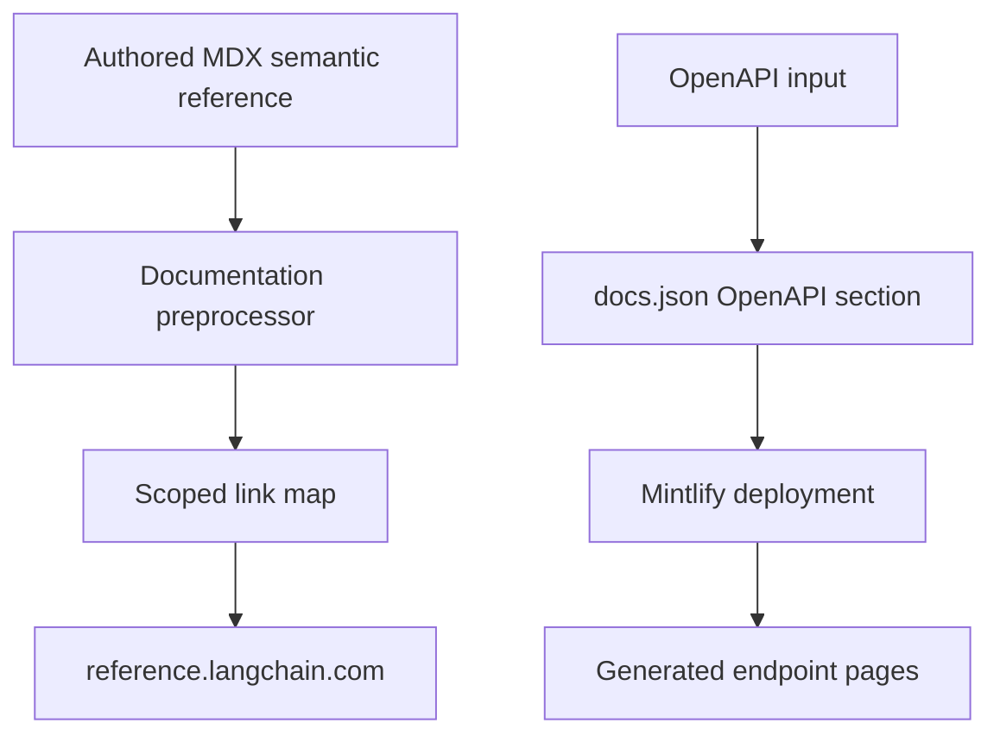
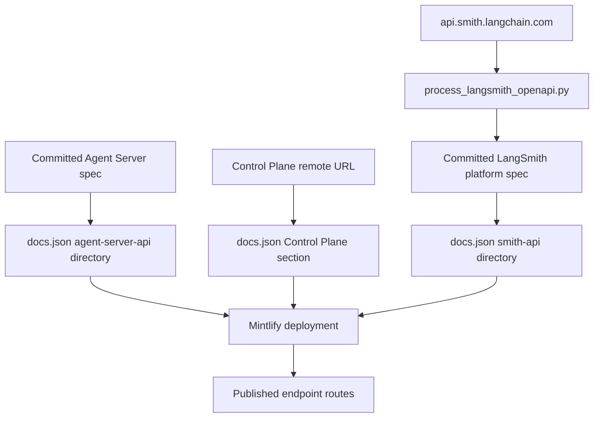

# Reference Documentation Integration

## Boundary and ownership

This repository builds the authored `docs.langchain.com` documentation. Generated API reference for LangChain, LangGraph, LangSmith, and integration packages is operated separately at [reference.langchain.com](https://reference.langchain.com/python/), with distinct [Python](https://reference.langchain.com/python/) and [JavaScript/TypeScript](https://reference.langchain.com/javascript/) sites. Its generation tooling and output do not live here. Do not treat `reference.langchain.com` as repository-built content or repair its generated pages in this repository.

The repository owns two adjacent but distinct integrations:

1. Markdown and MDX authors use semantic SDK references, which the documentation preprocessor resolves to external reference URLs.
2. `src/docs.json` supplies Mintlify with OpenAPI inputs and route directories; Mintlify creates the corresponding endpoint pages at deployment.



This shows separate publication paths: semantic SDK links leave the repository for the external reference service, while OpenAPI inputs become Mintlify endpoint routes only during deployment.

## Semantic SDK links

Use `@[ClassName]` for a useful first mention of an SDK class, method, or function instead of hard-coding an API-reference URL. Supported forms include:

```markdown
@[StateGraph]
@[Build a graph][StateGraph]
@[`StateGraph`]
```

The autolink preprocessor resolves the symbol through `SCOPE_LINK_MAPS`, built from language-specific link maps. Relative mappings are prefixed with their scope host and absolute mapped URLs are retained, so Python and JavaScript can resolve the same marker to their respective reference sites. Add a new eligible symbol at this registry boundary rather than duplicating a destination URL in every authored page.

Autolinking happens before conditional rendering. Processing starts in the page's default scope, switches at `:::python` or `:::js`, and returns to the default scope at a bare `:::`. Normal fenced code is not transformed, and an escaped reference such as `\@[StateGraph]` remains literal after the escape is removed. An absent mapping produces an info-level message with file and line and leaves `@[...]` unchanged rather than guessing a URL. The unsupported `global` scope falls back to Python and logs an error, so language-specific symbols should be placed in explicit fences.

### Validate semantic references

Run:

```bash
make check-cross-refs
```

The checker scans Markdown and MDX below `src/` using the preprocessor's reference and fence patterns. It ignores ordinary code fences, escaped markers, `snippets/code-samples/`, and `node_modules`. It checks `oss/python/` in Python scope, `oss/javascript/` in JavaScript scope, shared `oss/` content in both scopes, and other content in Python scope. An unfenced marker in a shared OSS file must resolve in **all** scopes in which that file builds; a fence narrows the requirement to its language. The command exits nonzero for unresolved markers. Add the appropriate mapping, correct the marker, or make language-specific content explicit.

This source-level check is separate from Mintlify's rendered-site link check: successful rendering does not establish that every authored semantic name is mapped, especially when a language branch is omitted from one output.

## LangSmith OpenAPI publication

`src/docs.json` is the configuration boundary between each OpenAPI source and Mintlify route generation. The three LangSmith sections deliberately have different source lifecycles:

| Section | Source lifecycle | Mintlify route directory |
| --- | --- | --- |
| Agent Server API | Committed `src/langsmith/agent-server-openapi.json`; updates arrive in `langgraph-api` PRs titled `Update Agent ServerOpenAPI spec for API version X.Y.Z`. | `langsmith/agent-server-api` |
| Control Plane API | Service-owned `https://api.host.langchain.com/openapi.json`, fetched at deployment; there is no local specification. | Mintlify default route directory (`/api-reference/`) |
| LangSmith REST API | Committed `src/langsmith/langsmith-platform-openapi.json`, produced by scheduled refresh automation. | `langsmith/smith-api` |



This distinguishes committed inputs, a deployment-fetched input, and the transformed daily LangSmith input before Mintlify publishes endpoint routes. The generated endpoint pages are not present in local `build/`. Do not copy the Control Plane specification into the repository, and do not hand-author generated endpoint output.

### Agent Server validation

Before merging an Agent Server spec change, run:

```bash
make check-openapi
```

The target first builds the documentation, then runs `mint openapi-check langsmith/agent-server-openapi.json` from `build/`. Despite its general target name, it currently validates **only** the Agent Server specification. The reusable link-check workflow invokes this target after anchor-aware link checking. Validate a different specification explicitly, or intentionally extend the target; do not assume this command covers all OpenAPI inputs.

### LangSmith REST refresh and public shaping

Do **not** hand-edit `src/langsmith/langsmith-platform-openapi.json`. The refresh workflow runs daily at 10:00 UTC and can also be dispatched manually:

```bash
uv run python scripts/process_langsmith_openapi.py --write
```

Without `--input`, the processor fetches `https://api.smith.langchain.com/openapi.json`. Its network fetch accepts only the allow-listed host `api.smith.langchain.com` and uses a 30-second timeout. `--input` accepts a controlled local source, `--output` selects the destination, and without `--write` the transformed JSON is printed to standard output for preview.

The processor shapes the upstream source for public Mintlify documentation: it hides operations selected by fleet, internal or infrastructure, low-value, health, and path rules; annotates tags with human-readable `x-group` headings; adds absent tag definitions; and orders groups for the generated sidebar. It normalizes operation summaries, including consistent Beta and visible `(v2)` markers. Reprocessing strips existing trailing markers before applying them, making title normalization idempotent.

After generating a candidate, the workflow saves it temporarily, restores the checkout, and checks out `chore/refresh-langsmith-openapi`. If that branch has an open PR, it fetches the branch and appends a commit; otherwise it creates the branch and PR. It exits without a commit when the committed spec has no diff. Review the automated refresh result; if it needs changing, modify the declared upstream source or processor rules and regenerate rather than editing the output by hand.

## Filtered link checks

`make broken-links` and `make broken-links-with-anchors` build first, run Mintlify from `build/`, filter the report with `scripts/filter_mint_broken_links.py`, and fail only if filtered output still contains an indented link entry. The CI reusable workflow uses the anchor-aware target and then runs the Agent Server OpenAPI check.

The filter deliberately removes known non-actionable reports:

- all OpenAPI-generated destinations under `/langsmith/agent-server-api/`, `/langsmith/smith-api`, and `/api-reference/`, which do not exist in the local build;
- entire `snippets/` report sections, because Mint checks snippets as standalone files even though their rewritten `/oss/` links resolve when imported;
- selected legacy relative-path reports for `../langchain/`, `../integrations/`, and `../langgraph/local-server`.

With `--check-anchors`, it additionally removes only the SmithDB migration anchors `traces-query`, `runs-query`, and `exceptions`. It does not suppress other anchors or other broken links. Focused tests preserve this boundary by asserting that genuine failures and non-exempt anchors remain after filtering, while cross-reference tests cover scope selection, supported marker forms, and exclusions.

## Reporting and safe changes

For missing pages, broken links, or incorrect signatures on the external SDK reference site, use the [Reference Documentation issue](https://github.com/langchain-ai/docs/issues/new?template=04-reference-docs.yml). The form requires issue type, language, and a detailed description; it also collects product and an optional reference-page URL to route the report.

Change this repository when the issue is an authored semantic marker, a scoped map entry, preprocessing or validation behavior, `docs.json` OpenAPI configuration, an Agent Server spec update, or a reviewed automated LangSmith refresh result. Keep the ownership boundary intact: fix external SDK reference content in its own generation system, retain committed and remote OpenAPI inputs as configured, and let Mintlify generate endpoint routes at deployment.

## Related documentation

- [Source map](/openwiki/architecture/source-map.md) — documentation-source and navigation ownership.
- [Mintlify](/openwiki/integrations/mintlify.md) — renderer and deployment boundary.
- [Adding pages](/openwiki/operations/adding-pages.md) — placing authored guides beside generated navigation entries.
- [Quickstart](/openwiki/quickstart.md) — local setup and documentation-preview entrypoints.
