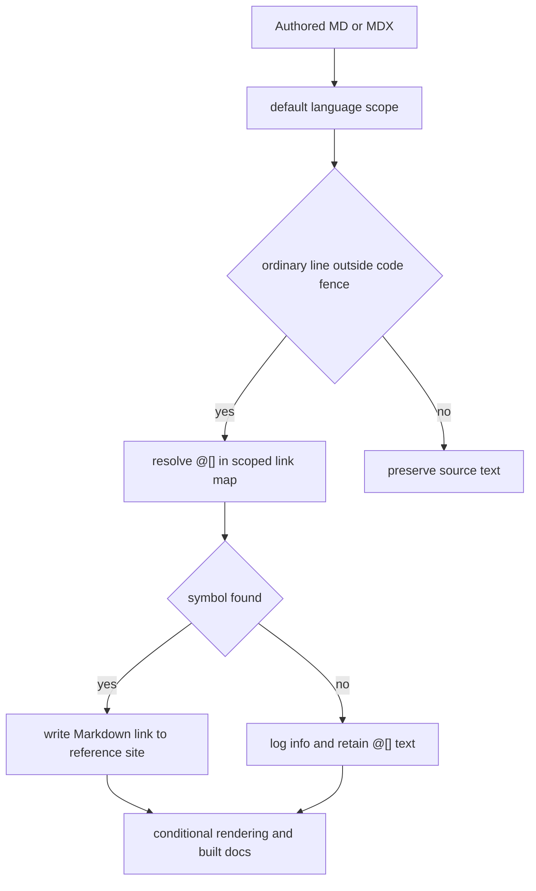

## Boundary and ownership

This repository builds the authored `docs.langchain.com` site on Mintlify. It does **not** build the generated SDK reference: `reference.langchain.com` is separately generated and deployed for [Python](https://reference.langchain.com/python/) and [JavaScript/TypeScript](https://reference.langchain.com/javascript/), covering LangChain, LangGraph, LangSmith, and integration packages. Consequently, fix a missing reference page, a rendered signature, or generated reference content through the Reference Documentation issue template rather than by changing this documentation build.

The boundary has two integrations:

- An authored page uses semantic `@[]` references that the preprocessing pipeline resolves to the external reference site.
- `src/docs.json` configures Mintlify to generate three API endpoint sections from OpenAPI sources. The generated endpoint routes are a deployment-time concern, not authored MDX pages.

## Symbol links: author the name, not the URL

Use `@[Symbol]` on an appropriate first mention rather than hard-coding a `reference.langchain.com` URL:

```markdown
Use @[StateGraph] to define a graph.
@[state management][StateGraph]
@[`StateGraph`]
```

The first form uses the symbol as the link label; the second supplies a custom title; and the third preserves code formatting in the generated label. Prefixing the syntax with a backslash (`\@[StateGraph]`) deliberately leaves it literal after the escape is removed. References inside backtick or tilde fenced code blocks are also left unchanged, so examples do not unexpectedly acquire links.

`LINK_MAPS` is the registry owned by `pipeline/preprocessors/link_map.py`. Each entry supplies a `host`, `scope`, and symbol-to-path mapping; `_enumerate_links()` expands relative paths against the host into `SCOPE_LINK_MAPS` for `python` and `js`. The maps include SDK, integration, Deep Agents, and MCP symbols. Some map values are already absolute URLs, which permits intentional cross-site or cross-language destinations.



This shows the autolink decision before the page reaches built documentation.

### Scope and failure behavior

`preprocess_markdown()` selects its target language from its argument or `TARGET_LANGUAGE` (defaulting to `python`) and, unless overridden, passes that language as the default autolink scope. `replace_autolinks()` walks the source line by line. An unescaped `:::python` or `:::js` fence changes the scope for following ordinary lines; a bare closing fence restores the default. A `global` scope is currently an error condition that falls back to Python rather than consulting a true combined map.

A lookup miss is intentionally non-fatal during rendering: it logs the source location, symbol, and scope at info level and returns the original `@[]` text. This prevents a partial link from being fabricated, but means a normal build alone is not a sufficient authoring gate. An unclosed code fence also leaves the remainder of the file in code-block mode and suppresses subsequent replacements.

Run the dedicated validation after adding or moving symbols:

```bash
make check-cross-refs
```

`scripts/check_cross_refs.py` scans Markdown and MDX under `src/`, sharing the renderer's reference and fence patterns. It excludes `snippets/code-samples/` and `node_modules`, ignores escaped references and code blocks, and fails with every unresolved file, line, symbol, and scope. Its path rules are significant for safe authoring: `oss/python/` checks Python, `oss/javascript/` checks JavaScript, shared `oss/` checks **both**, and other content checks Python. A language fence overrides the active scope; therefore an unfenced shared page may only use a key present in both maps. Focused autolink and checker tests cover code-fence protection, escapes, titled links, path-derived scopes, and shared-scope resolution.

For the broader transformation ordering and conditional-rendering rules, see [Markdown Transformation and Cross-Reference Semantics](/openwiki/concepts/preprocessing.md).

## Mintlify OpenAPI sections

`src/docs.json` is the integration point between the site navigation and Mintlify OpenAPI generation.

| Documentation section | Navigation location | Spec source | Generated route family | Ownership and update model |
| --- | --- | --- | --- | --- |
| Agent Server API | Deploy → Get started → Reference | `src/langsmith/agent-server-openapi.json` | `langsmith/agent-server-api` | Committed; updates arrive in PRs from `langgraph-api`. |
| Control Plane API | Deploy → Get started → Reference | `https://api.host.langchain.com/openapi.json` | Mintlify default route | Remote; fetched at deploy time, with no local copy. |
| LangSmith REST API | Monitor → Reference | `src/langsmith/langsmith-platform-openapi.json` | `langsmith/smith-api` | Committed generated artifact; refreshed by scheduled automation. |

Mintlify generates endpoint pages at deploy time, so these routes are not normal local authored output. `make broken-links` builds first, runs `mint broken-links` from `build/`, then uses `scripts/filter_mint_broken_links.py` before deciding whether reported indented link lines remain. The filter deliberately drops reports for Agent Server, LangSmith REST, and Control Plane generated routes, as well as standalone snippet sections and certain known legacy relative paths. Do not treat these excluded reports as proof that arbitrary endpoint links are valid; they are a targeted workaround for resources unavailable to the local checker.

### Agent Server and Control Plane lifecycle

The Agent Server spec is repository content, but its upstream ownership is `langgraph-api`. Update PRs are conventionally titled `Update Agent ServerOpenAPI spec for API version X.Y.Z`. Before merging such a change, run:

```bash
make check-openapi
```

This target first builds the documentation and then invokes `mint openapi-check` specifically on the **built Agent Server** specification. It is not a validator for every configured OpenAPI source. The Control Plane section has no equivalent checked-in spec: its `openapi.source` is the remote control-plane URL and Mintlify fetches it at deployment.

### LangSmith REST refresh: generated and curated for public docs

Do **not** manually edit `src/langsmith/langsmith-platform-openapi.json`. At 10:00 UTC daily (and on manual dispatch), the refresh workflow runs `uv run python scripts/process_langsmith_openapi.py --write`. The script fetches only from the allow-listed `api.smith.langchain.com` host over TLS with a 30-second timeout, then writes the repository artifact.

Before serialization, the processor marks fleet, internal, infrastructure, and health-style operations hidden using tags and exact/prefix path rules; it adds or updates tag metadata so Mintlify can group public endpoints under human-readable headings; standardizes operation titles; and labels applicable visible v2 operations. Processing is designed to be repeatable: title normalization removes existing Beta/v2 markers before adding its canonical suffixes.

The workflow copies the freshly processed artifact aside, restores the checkout, and then either checks out the existing `chore/refresh-langsmith-openapi` branch for its open PR or starts that branch from the current checkout. If the artifact has not changed it exits without a commit. Otherwise it commits only the spec and appends to the standing PR, or force-pushes a branch left from a merged PR before creating a new one. This keeps one refresh PR outstanding and makes the committed spec a reviewed public-docs projection rather than a raw service export.

## Operational decision guide

| Change or symptom | Correct owner and action |
| --- | --- |
| A docs page needs an SDK symbol link | Add `@[symbol]`, put language-specific usage in a language fence where needed, update `link_map.py` for the required scope(s), then run `make check-cross-refs`. |
| A generated SDK reference page or signature is wrong | File the Reference Documentation issue template; reference-site generation is outside this repository. |
| Agent Server endpoints changed | Take the upstream `langgraph-api` spec PR and run `make check-openapi`. |
| Control Plane endpoints changed | Change the upstream control-plane service/spec; there is no local spec to edit. |
| LangSmith REST endpoints or presentation changed | Change the refresh processor's public-doc policy if appropriate, or let the scheduled workflow refresh the artifact. Never hand-edit `src/langsmith/langsmith-platform-openapi.json`. |
| Local broken-link output names OpenAPI endpoint routes | Confirm it is one of the documented deployment-time exclusions; investigate any remaining filtered output. |

Related context: [source ownership map](/openwiki/architecture/source-map.md), [GitHub Actions](/openwiki/integrations/github-actions.md), [integration catalog](/openwiki/workflows/integration-catalog.md), and [testing overview](/openwiki/testing/test-overview.md).
