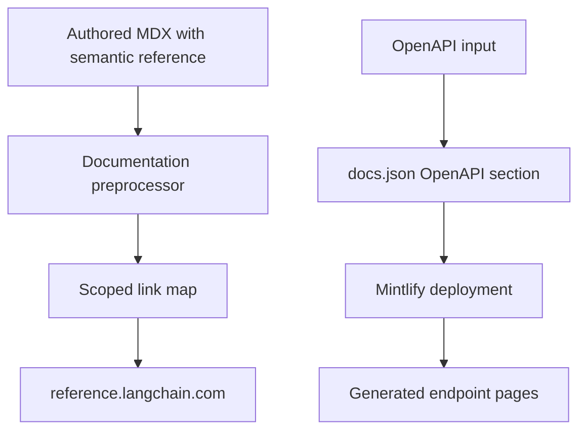

## Boundary and ownership

`docs.langchain.com` is this repository's hand-authored documentation and build pipeline. Generated API reference for LangChain, LangGraph, LangSmith, and integrations is deployed separately at [reference.langchain.com](https://reference.langchain.com/python/), with distinct [Python](https://reference.langchain.com/python/) and [JavaScript/TypeScript](https://reference.langchain.com/javascript/) sites. It is **not** built from this repository: no reference-generation scripts or output live here. Do not try to repair a missing generated reference page or an incorrect signature by changing this documentation build.

This repository owns two adjacent integration layers:

1. Markdown and MDX authors can name an SDK symbol semantically; preprocessing turns it into an external reference URL.
2. `src/docs.json` configures Mintlify OpenAPI sections for product HTTP APIs. Mintlify creates their endpoint pages when it deploys.



This diagram separates authored semantic links to the external SDK-reference service from OpenAPI endpoint pages generated during deployment.

## Semantic links in authored documentation

Use `@[ClassName]` for the first useful mention of an SDK class, method, or function instead of hard-coding a `reference.langchain.com` URL. Supported forms include a default title, custom title, and code-formatted default title:

```markdown
@[StateGraph]
@[Build a graph][StateGraph]
@[`StateGraph`]
```

The autolink preprocessor substitutes a Markdown link from the current scope's `SCOPE_LINK_MAPS` entry. `LINK_MAPS` holds a host and symbol-to-path mapping for each scope, while `_enumerate_links` prefixes relative paths with that host and retains absolute mapped URLs. The Python and JavaScript maps therefore direct symbols such as `StateGraph`, `ChatOpenAI`, and `@traceable` to their respective external reference pages.

Scope starts with the target language and changes at `:::python` or `:::js` fences. Autolinking runs before conditional rendering. References in ordinary fenced code blocks are not changed, and a backslash-escaped reference such as `\@[StateGraph]` remains literal after its escape is removed. An unresolved reference produces an info-level message with its source location and stays `@[...]` rather than receiving a guessed URL. The unhandled `global` scope falls back to Python and logs an error, so use explicit language fences where a symbol differs by language.

### Keep maps and source in sync

`make check-cross-refs` is the strict authoring guardrail. It scans Markdown and MDX beneath `src/`, reuses the autolink and fence patterns, and exits nonzero for unresolved symbols. It ignores ordinary fenced code, escaped references, `snippets/code-samples/`, and `node_modules`.

The checker derives its default scope from the file path: `oss/python/` uses Python, `oss/javascript/` uses JavaScript, shared `oss/` content is checked in **both** scopes, and non-OSS content uses Python. An unfenced reference in shared content must resolve in every scope in which it is built, not merely one. Fix an entry in `pipeline/preprocessors/link_map.py`, or put a language-specific reference inside the appropriate fence, before merging. Focused tests cover scope selection, shared files, custom-title and backtick forms, multiple references, and the code, escaped-reference, and code-sample exclusions.

## Mintlify OpenAPI sections

`src/docs.json` is the configuration boundary between an OpenAPI input and Mintlify-generated endpoint pages. The three configured sections have deliberately different input lifecycles:

| Section | Navigation location | Input ownership and lifecycle | Generated path |
| --- | --- | --- | --- |
| Agent Server API | Deploy → Get started → Reference | `src/langsmith/agent-server-openapi.json` is committed. Updates arrive in `langgraph-api` PRs titled `Update Agent ServerOpenAPI spec for API version X.Y.Z`. | `/langsmith/agent-server-api/` |
| Control Plane API | Deploy → Get started → Reference | `https://api.host.langchain.com/openapi.json` is remotely fetched at deployment; there is no local committed file. | `/api-reference/` |
| LangSmith REST API | Monitor → Reference | `src/langsmith/langsmith-platform-openapi.json` is committed and refreshed by automation. | `/langsmith/smith-api/` |

Mintlify generates these endpoint pages at deployment, so they do not exist in local `build/` output. The remote Control Plane input remains service-owned; do not copy it into this repository. This deploy-time generation is separate from the external `reference.langchain.com` SDK-reference build.

### Agent Server validation

Before merging an Agent Server spec update, run:

```bash
make check-openapi
```

The target first builds the documentation, then invokes `mint openapi-check langsmith/agent-server-openapi.json` from `build/`. Despite its general name and older guidance that mentions either committed spec, the current target validates **only** the Agent Server specification. The link-check workflow invokes this target. Validate an additional specification explicitly or deliberately extend the target; do not assume it checks all three inputs.

### LangSmith REST refresh and public-doc shaping

Do **not** hand-edit `src/langsmith/langsmith-platform-openapi.json`. Daily at 10:00 UTC, and when manually dispatched, the refresh workflow runs:

```bash
uv run python scripts/process_langsmith_openapi.py --write
```

Without `--input`, the script fetches only `https://api.smith.langchain.com/openapi.json`. Its host allow-list and 30-second timeout prevent the normal refresh route from requesting an arbitrary host. `--input` accepts controlled local preview or test data; without `--write`, the transformed JSON is printed instead of replacing the committed file.

The processing step shapes the service specification for public Mintlify navigation: it hides operations identified by fleet, internal, infrastructure, or health tags and paths; adds or updates human-readable `x-group` tag values; orders tag groups; and normalizes operation titles, including visible v2 labels. It removes existing Beta and v2 markers before adding normalized markers, making repeated processing idempotent.

After generating a candidate, the workflow saves it while it resets the checked-out file, then checks out the standing `chore/refresh-langsmith-openapi` branch. It appends to that branch's open PR when one exists; otherwise it creates the branch and PR. If the regenerated committed file has no diff, it exits without a commit. Review the generated diff rather than manually editing the result.

## Link-check exceptions

`make broken-links` and `make broken-links-with-anchors` build first, run Mintlify from `build/`, then filter its report through `scripts/filter_mint_broken_links.py`. The command fails only when filtered output still contains indented link entries.

The filter removes reports for deployment-generated OpenAPI destinations `/langsmith/agent-server-api/`, `/langsmith/smith-api`, and `/api-reference/`. It also drops whole snippet report sections, because snippets are checked standalone even though their rewritten links resolve when imported, and suppresses selected legacy relative-path false positives. In anchor mode it additionally suppresses only three named SmithDB migration anchor false positives; other anchor failures remain visible. These are narrow operational exceptions, not permission to ignore authored-page failures. Focused tests verify that exclusions disappear while a genuine unresolved `/oss/` link and a non-exempt anchor remain.

## Reporting and change decisions

For a problem with generated external reference content—such as a missing page, broken generated link, incorrect signature, or stale content—open the repository's [Reference Documentation issue](https://github.com/langchain-ai/docs/issues/new?template=04-reference-docs.yml). The template records the issue type, language, product, optional page URL, and detailed description so reference-docs maintainers can route it. The repair belongs in the separate reference-generation tooling.

Use this repository for a missing semantic-map entry, incorrect Markdown preprocessing behavior, Mintlify navigation configuration, or a committed OpenAPI refresh or Agent Server change. Keep the boundary explicit: semantic links let authored docs avoid hard-coded SDK-reference URLs, while committed, refreshed, and deploy-time OpenAPI inputs keep endpoint-page generation out of hand-authored documentation.

## Related documentation

- [Source map](/openwiki/architecture/source-map.md) — source ownership and build outputs.
- [GitHub Actions](/openwiki/integrations/github-actions.md) — scheduled automation conventions.
- [Mintlify](/openwiki/integrations/mintlify.md) — Mintlify configuration and deployment.
- [Cross-reference operations](/openwiki/operations/cross-references.md) — diagnosing and maintaining internal references.
