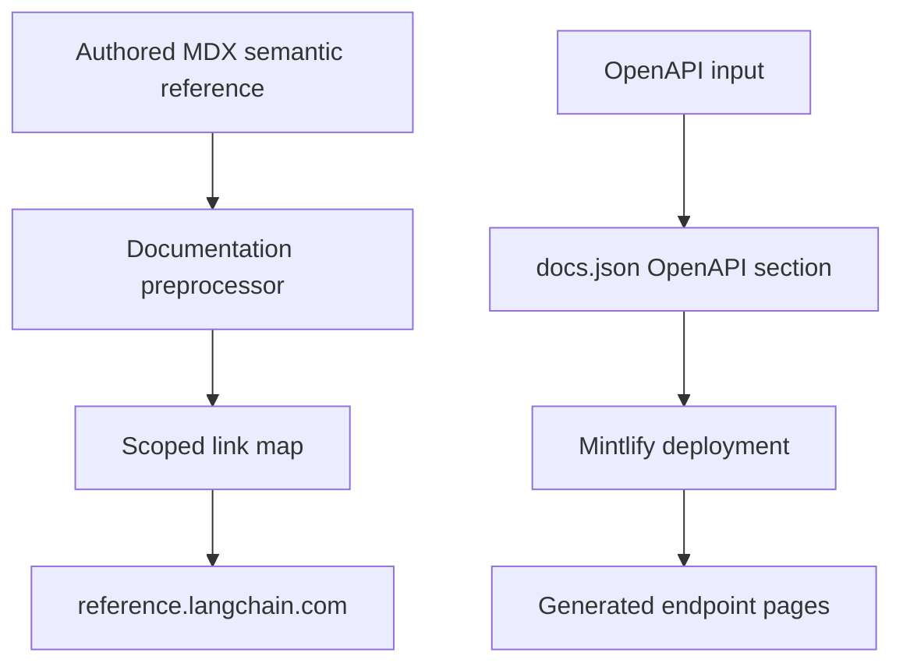
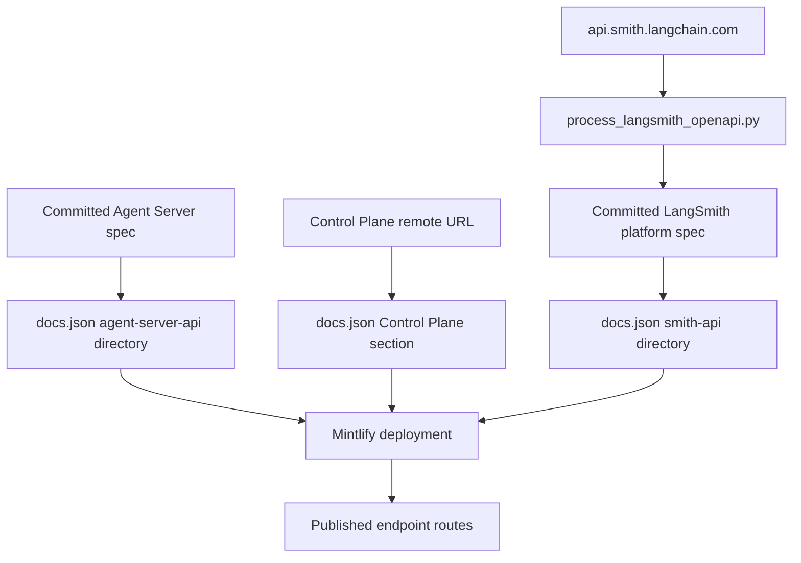

# Reference Documentation Integration

## Ownership boundary

This repository builds authored documentation for `docs.langchain.com`. Generated API reference for LangChain, LangGraph, LangSmith, and integration packages is operated separately at [reference.langchain.com](https://reference.langchain.com/python/), with distinct [Python](https://reference.langchain.com/python/) and [JavaScript/TypeScript](https://reference.langchain.com/javascript/) sites. Its generator and generated output are not in this repository. Do not represent external SDK reference as authored MDX here, and report missing pages, broken links, or incorrect signatures through the [Reference Documentation issue](https://github.com/langchain-ai/docs/issues/new?template=04-reference-docs.yml) rather than trying to repair generated reference content locally.

The repository has two related integration responsibilities:

1. It turns semantic SDK markers in authored Markdown/MDX into links to the external reference sites.
2. It configures OpenAPI inputs in `src/docs.json`; Mintlify creates their endpoint pages at deployment. Those endpoint pages are not authored MDX in this repository.


```mermaid
flowchart TD
  Author["Authored MDX semantic reference"] --> Preprocess["Documentation preprocessor"]
  Preprocess --> Map["Scoped link map"]
  Map --> External["reference.langchain.com"]
  Spec["OpenAPI input"] --> Config["docs.json OpenAPI section"]
  Config --> Deploy["Mintlify deployment"]
  Deploy --> Pages["Generated endpoint pages"]
```

This shows the separate publication paths: semantic links resolve to an external service, while configured OpenAPI inputs become endpoint routes only when Mintlify deploys.

## Scoped semantic SDK links

Use a semantic marker for an SDK class, method, or function instead of hard-coding an API-reference URL. The supported forms are:

```markdown
@[StateGraph]
@[Build a graph][StateGraph]
@[`StateGraph`]
```

The preprocessor looks up the name in `SCOPE_LINK_MAPS`. The map is assembled from Python and JavaScript link registries: relative destinations receive their scope's host, while absolute destinations remain unchanged. Add or repair an eligible SDK target at this registry boundary rather than duplicating a destination across authored pages.

Autolinking runs before conditional rendering. Processing starts in the page default scope, switches after `:::python` or `:::js`, and returns to that default after a bare `:::`. Ordinary fenced code blocks are left untouched. An escaped marker such as `\@[StateGraph]` remains literal after its escape is removed. If a name is absent in the active scope, the preprocessor logs an info-level message with location and retains the marker rather than inventing a URL. The unhandled `global` scope falls back to Python and logs an error; use explicit language fences for language-specific symbols.

### Source-level validation

Run the semantic-reference check when changing markers or a link-map entry:

```bash
make check-cross-refs
```

The checker scans Markdown and MDX below `src/`, sharing the preprocessor's marker and fence patterns. It ignores ordinary code blocks, escaped markers, `snippets/code-samples/`, and `node_modules`. It validates `oss/python/` in Python scope, `oss/javascript/` in JavaScript scope, shared `oss/` files in both scopes, and other content in Python scope. An unfenced marker in shared OSS content must resolve in **every** scope in which that file is built; a language fence narrows the requirement. The command exits nonzero for unresolved names.

This source check is intentionally distinct from Mintlify's rendered-site link checking: a successful rendered-link check does not prove that every source marker resolved in every build scope.

## LangSmith OpenAPI inputs

`src/docs.json` is the handoff from OpenAPI input to Mintlify route generation. The three LangSmith sections have different source lifecycles:

| Section | Input lifecycle | Mintlify route directory |
| --- | --- | --- |
| Agent Server API | Committed `src/langsmith/agent-server-openapi.json`; updates arrive in `langgraph-api` PRs titled `Update Agent ServerOpenAPI spec for API version X.Y.Z`. | `langsmith/agent-server-api` |
| Control Plane API | Service-owned `https://api.host.langchain.com/openapi.json`, fetched at deployment; no local specification is committed. | Mintlify default (`/api-reference/`) |
| LangSmith REST API | Committed `src/langsmith/langsmith-platform-openapi.json`, regenerated by scheduled automation. | `langsmith/smith-api` |


```mermaid
flowchart TD
  AgentSpec["Committed Agent Server spec"] --> AgentConfig["docs.json agent-server-api directory"]
  ControlSpec["Control Plane remote URL"] --> ControlConfig["docs.json Control Plane section"]
  SmithService["api.smith.langchain.com"] --> Processor["process_langsmith_openapi.py"]
  Processor --> SmithSpec["Committed LangSmith platform spec"]
  SmithSpec --> SmithConfig["docs.json smith-api directory"]
  AgentConfig --> Mintlify["Mintlify deployment"]
  ControlConfig --> Mintlify
  SmithConfig --> Mintlify
  Mintlify --> Routes["Published endpoint routes"]
```

The diagram distinguishes committed inputs, a deployment-fetched input, and the curated LangSmith input. Mintlify-generated endpoint pages do not exist in the local `build/` output. Do not copy the Control Plane specification into the repository or hand-author endpoint pages.

### Agent Server validation

For an Agent Server specification change, run:

```bash
make check-openapi
```

This target builds the documentation and runs `mint openapi-check langsmith/agent-server-openapi.json` from `build/`. Despite its broad name, it currently validates **only** the Agent Server specification. The reusable link-check workflow runs the anchor-aware link check and then invokes this target. Validate another specification explicitly or extend the target deliberately; do not infer coverage of the platform or remote Control Plane input.

## LangSmith REST specification refresh

`src/langsmith/langsmith-platform-openapi.json` is a generated, committed Mintlify input. Do **not** edit it by hand. The processor normally fetches `https://api.smith.langchain.com/openapi.json`; network fetching permits only the allow-listed `api.smith.langchain.com` host and uses a 30-second timeout. For controlled reproduction and policy work, `--input` reads a local JSON file. `--output` selects a path, `--write` is required to write it, and without `--write` the transformed JSON is printed to standard output.

```bash
uv run python scripts/process_langsmith_openapi.py --write
```

The processor applies public-documentation policy before the artifact becomes Mintlify input:

- It sets `x-hidden: true` on operations selected by configured fleet, internal, infrastructure, low-value, health, and path rules, and hides matching top-level tags.
- It applies human-readable `x-group` values to known tags, adds definitions for tags that occur only on operations, and sorts the resulting tag list by the configured group order.
- It normalizes operation summaries, including sentence case and visible `(Beta)` and `(v2)` labels. It removes prior trailing markers before applying them, so repeated processing is idempotent.

Change the upstream service description where it owns the truth, or modify these processor rules and regenerate. Do not manually patch an individual generated operation or tag.

### Scheduled review lifecycle

The refresh workflow runs daily at 10:00 UTC and also supports manual dispatch. It generates the specification, saves the candidate temporarily, restores the checkout, then looks for an open `chore/refresh-langsmith-openapi` PR. If one exists, the workflow fetches its branch and appends a commit; otherwise it creates the branch and PR. It restores the candidate onto that branch and exits without a commit if the specification has no diff. This keeps one standing review PR rather than opening a daily queue.

Review a refresh as a public API documentation change: check newly visible or hidden operations, title/version labels, and group placement. The processor or fetch can fail before producing a candidate—for example for a disallowed host, network/TLS/timeout failure, invalid JSON, or a shell/GitHub failure. A no-diff result is a successful no-op.

## Rendered link checks and their limits

`make broken-links` and `make broken-links-with-anchors` build first, run Mintlify in `build/`, filter the report with `scripts/filter_mint_broken_links.py`, and fail when filtered output still contains an indented link report. The reusable CI workflow uses the anchor-aware command and then performs the Agent Server OpenAPI check.

The filter deliberately removes reports that cannot be validated from the local build:

- OpenAPI-generated destinations under `/langsmith/agent-server-api/`, `/langsmith/smith-api`, and `/api-reference/`;
- complete `snippets/` report sections, because Mint checks standalone snippets even though rewritten `/oss/` links resolve when imported;
- selected legacy relative-path reports for `../langchain/`, `../integrations/`, and `../langgraph/local-server`.

With `--check-anchors`, it additionally removes only the SmithDB migration anchors `traces-query`, `runs-query`, and `exceptions`. Other anchors and ordinary broken links remain failures. Consequently, local link and OpenAPI checks do not prove that Mintlify rendered every deployment-generated LangSmith REST endpoint; inspect a deployment preview or the published site for that surface.

Focused tests protect these boundaries. Cross-reference checker tests cover Python and JavaScript scopes, shared files, unresolved/custom-title/backtick/multiple markers, and exclusions. Broken-link filter tests assert that genuine failures and non-exempt anchors survive filtering.

## Safe change guide

- Fix an external SDK reference page or signature in the external reference-generation system; use the dedicated issue form, which requires issue type, language, and description and accepts product and reference-page routing information.
- Fix an authored semantic link by changing its marker, scope fence, or central link-map entry, then run `make check-cross-refs`.
- Change a LangSmith API reference by selecting the correct OpenAPI ownership boundary: Agent Server committed input, Control Plane remote source, or the regenerated LangSmith REST artifact. Do not create MDX for generated endpoint pages.
- For a platform refresh policy change, update `scripts/process_langsmith_openapi.py`, regenerate, review the standing PR, and verify the deployment-generated result.

## Related documentation

- [Preprocessing](/openwiki/concepts/preprocessing.md) — build-time source transformations.
- [Mintlify](/openwiki/integrations/mintlify.md) — renderer and deployment boundary.
- [Cross-References](/openwiki/operations/cross-references.md) — detailed semantic-link authoring and validation.
- [Testing Overview](/openwiki/testing/test-overview.md) — repository validation layers.
- [LangSmith Platform OpenAPI Refresh](/openwiki/workflows/langsmith-openapi-refresh.md) — refresh workflow and processor policy.
