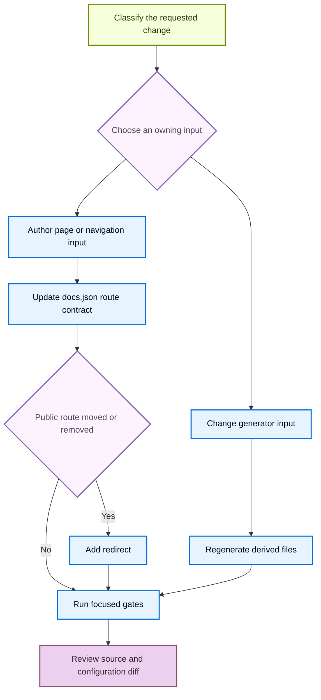

# Adding and Maintaining Documentation Pages

A safe documentation change begins with the input that owns the content. `src/` contains manually authored pages and configuration, while `build/` is a disposable rendering result. Navigation and redirects in `src/docs.json` define public-route contracts, so a move or removal is incomplete until both source ownership and route compatibility have been addressed.



This flow distinguishes editable inputs from generated artifacts and makes a public-route change an explicit compatibility decision.

## Choose an owner before adding a page

`src/docs.json` is the navigation authority. Its current structure is product → menu item → optional dropdown → tab → nested page group; labels are not reliable directory names. For example, the **No-code agents** menu is sourced from `src/langsmith/fleet/`. Find the existing neighboring route in `docs.json` before deciding where a page belongs.

| Requested content | Owning input and output rule |
| --- | --- |
| Ordinary shared OSS content, including LangChain, LangGraph, and most Deep Agents pages | Author under `src/oss/`. One source produces `/oss/python/...` and `/oss/javascript/...`; use `:::python` and `:::js` only for differing content. |
| Python- or TypeScript-only OSS content | Author under `src/oss/python/` or `src/oss/javascript/`, respectively, and add only that language's route. |
| OpenWiki or Deep Agents Code | Author under `src/oss/openwiki/` or `src/oss/deepagents/code/`. Each produces one unversioned route. |
| Ordinary LangSmith product documentation | Author under `src/langsmith/`; it produces `/langsmith/...`. Choose the lifecycle or setup menu based on the subject, not merely the directory. |
| Managed Deep Agents | Use direct `src/langsmith/managed-deep-agents*.mdx` pages. They produce both `/langsmith/python/...` and `/langsmith/javascript/...` routes. |
| Provider or component integration guide | Use the corresponding language and component directory below `src/oss/{python,javascript}/integrations/`. Its `integration:` frontmatter is also an input to generated discovery tables. |
| Reusable prose or runnable code | Use an authored snippet under `src/snippets/` or a testable source under `src/code-samples/`, as appropriate. Do not treat derived snippet MDX as the authoring surface. |

The builder clears `build/`, creates Python and JavaScript variants for versioned OSS, then builds OpenWiki, Deep Agents Code, and ordinary LangSmith content as separate unversioned surfaces. Conditional fences in shared OSS resolve for the target language, and ordinary unprefixed `/oss/...` links are rewritten to that output language. OpenWiki and Deep Agents Code are excluded from the rewrite and resolve conditional content as Python; link to them with `/oss/openwiki/...` and `/oss/deepagents/code/...`, without a language prefix. Do not edit `build/` to repair any of these results.

Managed Deep Agents is the LangSmith exception: the builder excludes its direct source files from ordinary unversioned LangSmith output and emits the two language routes. Keep redirects from legacy unversioned Managed Deep Agents URLs to the Python route where `docs.json` declares them.

## Add or revise an authored route

Follow this sequence for a new authored page:

1. Inspect adjacent source files and the intended `docs.json` group. Create the `.md` or `.mdx` file under its selected owner, with plain-text `title` and `description` frontmatter. Descriptions must not contain Markdown.
2. Add the extensionless source-relative path to the matching `pages` array. For example, `src/langsmith/sandboxes.mdx` is `"langsmith/sandboxes"`. Preserve the current product, menu, dropdown, tab, and group placement rather than inferring it from a label.
3. Add each output route required by the owner: both language entries for shared OSS and Managed Deep Agents, only the applicable entry for language-specific integrations, and the single unversioned entry for OpenWiki or Deep Agents Code.
4. For a new page group, make its index route the first page. For an existing integration component, add the guide to that component's `index.mdx`; change `docs.json` only when adding a component group.
5. Use root-relative internal routes. Do not manually place `/python/` or `/javascript/` in an ordinary OSS link, because preprocessing supplies the target prefix. Search for inbound fragment links before renaming a heading, since its anchor changes.

The repository requires a `src/docs.json` navigation update when adding a page, and its removed-pages check also confirms that every declared page has an existing `.mdx` or `.md` source. A shared OSS source is a valid source for either corresponding Python or JavaScript navigation route.

## Preserve routes when moving or retiring pages

Use the mover to relocate a source file and repair qualifying **relative file links**, but do not mistake it for route migration:

```bash
uv run docs mv src/langsmith/evaluation.mdx src/langsmith/deploy/evaluation.mdx --dry-run
```

`--dry-run` previews without writes. A non-dry run records the move in `link_changes.jsonl`, scans Markdown, MDX, and notebook Markdown cells below `src/`, moves the source, and recalculates relative links inside the moved file. It does not update `src/docs.json`, public root-relative route strings, navigation, or redirects. Review the preview and then search for the old public route.

Update the navigation path in the same change. When a published route changes or disappears, add a redirect in `docs.json` to the closest maintained successor:

```json
{
  "source": "/langsmith/evaluation",
  "destination": "/langsmith/deploy/evaluation"
}
```

A shared OSS or Managed Deep Agents move can require a redirect for every old language route. The removed-pages checker compares base and proposed navigation; if a removed navigation page no longer has source, it requires a matching redirect. A `:path*` redirect can cover a route family. Removing a page from navigation while retaining its source does not trigger that redirect requirement, but it is still a deliberate reachability decision.

## Change generated content through its owner

### Code samples and snippet MDX

Runnable samples belong in `src/code-samples/`. `make code-snippets` first extracts marked regions to `src/code-samples-generated/`, then `scripts/generate_code_snippet_mdx.py` scans supported Python, TypeScript, Java, Kotlin, Go, and shell intermediates and writes imported MDX to `src/snippets/code-samples/`. The generator can create a language fence, honor code-group presentation directives, expand eligible Deep Agents model strings to provider tabs, and attach a trace link from the manifest. Those results are derivative artifacts: edit and test the sample, then regenerate and review all changed snippet MDX.

```bash
make test-code-samples FILES="src/code-samples/path/to/sample.py"
make code-snippets
```

Run a source sample before publishing it. A sample that requires provider credentials or another unavailable dependency may not be locally executable; report that limitation rather than hand-editing its generated display code.

### Provider and integration listings

A hosted integration guide's `integration:` frontmatter and `scripts/data/integration_external_docs.yaml` jointly own component discovery tables. The refresh process scans supported Python and JavaScript component directories, uses hosted guides for internal links, and uses an external row's `docs_url` for its link. Update the guide frontmatter or external-data record, not the generated `src/snippets/oss/*-downloads.mdx` tables.

```bash
uv run python scripts/refresh_integration_downloads.py --check-docs-urls
uv run python scripts/refresh_integration_downloads.py --write
```

The URL check accepts `https://`, `http://`, and a single-slash site-relative URL. It rejects protocol-relative URLs and unsafe schemes, protecting the generated link surface. Run it before refresh when changing external metadata.

### LangSmith OpenAPI surfaces

OpenAPI entries in `src/docs.json` are Mintlify configuration inputs, not authored endpoint pages. Mintlify creates endpoint documentation at deployment, so those pages are absent from local `build/` and link checks filter their expected reports.

The three configured sections have separate owners: Agent Server uses the committed `src/langsmith/agent-server-openapi.json`; Control Plane uses the deployment-fetched `https://api.host.langchain.com/openapi.json`; and LangSmith REST uses committed `src/langsmith/langsmith-platform-openapi.json`. Do not hand-author endpoint output or copy the remote Control Plane specification into the repository.

Do not hand-edit the LangSmith REST specification. Run the processor to preview or regenerate it:

```bash
uv run python scripts/process_langsmith_openapi.py --write
```

Without `--input`, the processor fetches only the allow-listed `api.smith.langchain.com` host, then marks selected internal and fleet operations hidden, normalizes visible operation titles, groups tags for the generated sidebar, and writes the transformed specification. Its title transformation is idempotent. Change filtering or grouping policy in the processor and regenerate the specification. For an Agent Server spec change, run `make check-openapi`; the current target validates the Agent Server input from `build/`.

## Run targeted gates

Choose the narrowest gates that cover the change, then use rendering checks for route, navigation, preprocessing, deletion, or generated-input work:

1. Run `make lint_prose FILES="src/path/to/page.mdx"` for prose. It installs the repository-pinned Vale binary and accepts `FILES` or defaults to `src/`.
2. Run `make check-cross-refs` after adding `@[...]` references.
3. Run the focused sample and generator commands for code samples, the integration URL check and refresh for listings, and `make check-openapi` for Agent Server spec changes.
4. Use `make dev` to inspect the result on the Mintlify server. It builds first, watches `src/`, and serves `build/` on port 3000. Inspect both language outputs for versioned pages.
5. Run `make build` for a clean output, then `make broken-links` after route or link changes. Use `make broken-links-with-anchors` when fragments changed. The broken-link targets build first and deliberately filter reports from deploy-time OpenAPI pages and standalone generated snippets.
6. Review the finished source and `docs.json` diff with `docs-review`. The review procedure scopes working-tree review to changed Markdown and MDX content and excludes `build/`.

## Completion checklist

- [ ] The page, provider guide, snippet, sample, listing metadata, or OpenAPI input was changed at its actual owner.
- [ ] A new page has plain-text frontmatter and the correct extensionless `docs.json` navigation entry.
- [ ] The selected route model has all required language or unversioned entries.
- [ ] A move or deletion updates navigation and preserves every retired public route with an appropriate redirect.
- [ ] Generated snippets, integration tables, and OpenAPI specifications were regenerated rather than hand-edited.
- [ ] Focused lint, cross-reference, generator, sample, OpenAPI, build, and link checks ran where applicable.
- [ ] The rendered route and finished source/configuration diff were reviewed.

## See also

- [Source directory map](/openwiki/architecture/source-map.md)
- [Reference documentation integration](/openwiki/integrations/reference-docs.md)
- [Quickstart](/openwiki/quickstart.md)
- [Testing overview](/openwiki/testing/test-overview.md)
- [Code sample lifecycle](/openwiki/workflows/code-sample-lifecycle.md)
- [Integration listing automation](/openwiki/workflows/integration-listing-automation.md)
