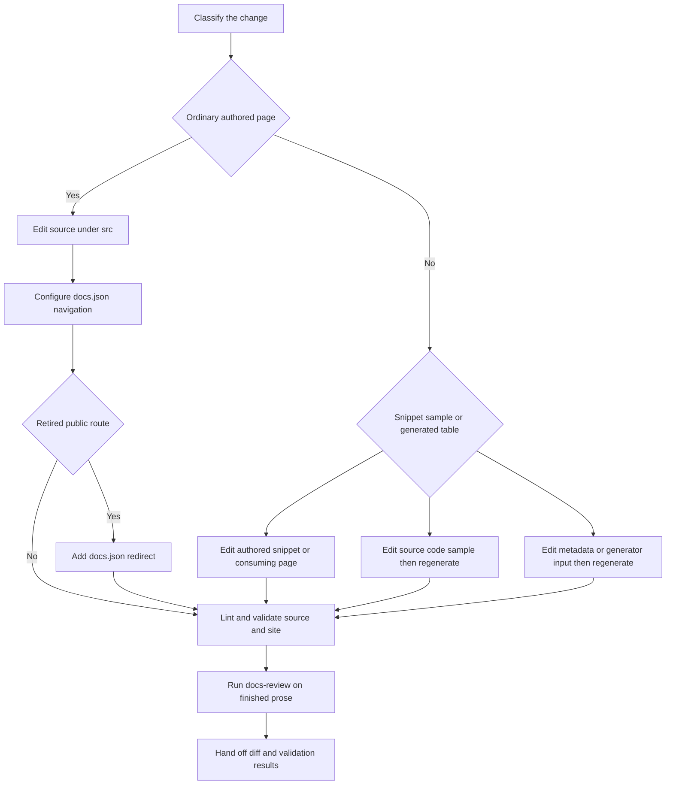

# Adding and Modifying Documentation Pages

A documentation change is safe only when it updates the surface that owns the content. Ordinary pages own authored prose under `src/`, while `src/docs.json` owns published navigation and redirects. Reusable snippets, testable code samples, and generated integration tables have separate owners and lifecycles. Never repair a result by editing `build/`, a generated artifact, or another build output by hand.



This flow separates authored inputs from generated results and makes review the final handoff step.

## Use the canonical authoring procedure

Use the `add-docs-page` skill for an addition, move, rename, deletion, navigation entry, or redirect. It supplies the repository procedure for source selection, frontmatter, navigation, redirects, and verification. The repository publishes skills in `.agents/skills/`; Claude Code users run `make skills` once to link them into `.claude/skills`.

After finishing prose, use the `docs-review` skill in working-tree mode on the files changed by this pass. It reviews the diff, not pre-existing text, and pairs its style review with the deterministic Vale check. Do not run it on a draft or widen it to unrelated branch changes. A redirect-only or navigation-only change has no prose to review.

## Choose the source owner and route model

Choose a source directory from the intended public route and language behavior, not from a navigation label. Labels and directories intentionally diverge: for example, Fleet appears as **No-code agents**, and lifecycle menus combine OSS and LangSmith content.

| Content | Owner and source location | Published behavior | Safe change |
| --- | --- | --- | --- |
| Shared OSS page | Most of `src/oss/`, including LangChain, LangGraph, and Deep Agents outside `code/` | One source builds to `/oss/python/...` and `/oss/javascript/...` | Keep language differences in one page using `:::python` and `:::js` fences. |
| Language-specific OSS page | `src/oss/python/` or `src/oss/javascript/` | One corresponding language route | Add it only to the matching language navigation location. |
| OpenWiki | `src/oss/openwiki/` | One unversioned `/oss/openwiki/...` route | Do not add a language segment. |
| Deep Agents Code | `src/oss/deepagents/code/` | One unversioned `/oss/deepagents/code/...` route | Do not add a language segment. |
| Ordinary LangSmith page | `src/langsmith/` | One `/langsmith/...` route | Find its actual lifecycle or setup menu entry in `docs.json`. |
| Managed Deep Agents page | Direct `src/langsmith/managed-deep-agents*.mdx` file | Python and JavaScript LangSmith routes | Configure both language routes and retain applicable default redirects. |
| Reusable snippet | `src/snippets/` | Imported content, not an ordinary page route | Edit only when it is an authored snippet; import it from the consuming page. |
| Executable sample | `src/code-samples/` | Test input that can generate snippets | Edit the sample, test it, and regenerate derived snippet MDX. |
| Integration component table | Hosted-guide frontmatter and `scripts/data/integration_external_docs.yaml` | Generated snippets in `src/snippets/oss/` | Change the guide metadata or external record, then run the refresh script. |

For a shared OSS link that follows the selected language, use an unqualified route such as `/oss/langgraph/overview`; preprocessing inserts `python` or `javascript` in each artifact. Links to OpenWiki and Deep Agents Code are exemptions and remain `/oss/openwiki/...` or `/oss/deepagents/code/...`. Unversioned OSS pages resolve conditional fences with the Python branch, so an unqualified link from one to ordinary shared OSS content resolves to Python.

### Respect generated-input boundaries

`build/` is cleared and reconstructed from `src/`; it is validation output, never an authoring target. The same rule applies to generated snippet MDX. `make code-snippets` extracts marked regions from `src/code-samples/` into `src/code-samples-generated/` and generates importable MDX under `src/snippets/code-samples/`. Change the sample source, not either derived directory, then run `make code-snippets` and the focused `make test-code-samples FILES="..."` command when appropriate.

Integration tables use a different generator. Hosted integration guides contribute their `integration` frontmatter. Third-party rows come from `scripts/data/integration_external_docs.yaml` and link through `docs_url`; they are not locally authored guides. Regenerate tables after changing these inputs:

```bash
uv run python scripts/refresh_integration_downloads.py --write
```

Before changing an external listing URL, run the offline safety check:

```bash
uv run python scripts/refresh_integration_downloads.py --check-docs-urls
```

It accepts `https://`, `http://`, or a single-slash site-relative URL and rejects protocol-relative and unsafe schemes. Do not patch the generated component-table snippet.

The Managed Deep Agents OAuth catalog is also generated. `src/langsmith/managed-deep-agents-connections.mdx` owns the prose and imports `src/snippets/langsmith/mda-oauth-catalog.mdx`; the installed `mda` CLI owns catalog data. Upgrade the CLI, regenerate the table, and inspect it through the authored page:

```bash
uv tool upgrade --pre managed-deepagents
uv run python scripts/refresh_mda_oauth_catalog.py --write
```

The generator queries `mda connections catalog --json`, requires no LangSmith API key or workspace ID for that query, and writes the table only. Resolve a missing executable, command failure, timeout, or invalid JSON rather than editing its output.

## Add an ordinary authored page

To add a page:

1. **Find its navigation home.** Inspect nearby `src/docs.json` entries. Navigation is organized as product, menu item, optional dropdown, tab, and nested group; labels do not determine the source directory. For a new group, place its index page first.
2. **Create the source file under the selected `src/` domain.** Use the local `.mdx` conventions and plain-text `title` and `description` frontmatter. Markdown, links, and backticks in `description` break SEO. Do not add OpenWiki-owned control fields such as `generated`, `verified`, `sources`, or `timestamp`.

   ```mdx
   ---
   title: Your Page Title
   description: A concise plain-text summary of what readers learn on this page.
   ---

   # Your Page Title
   ```

3. **Register the extensionless emitted route in `src/docs.json`.** Omit `src/` and `.mdx`: `src/oss/openwiki/deployment.mdx` becomes `"oss/openwiki/deployment"`. A shared OSS source can appear as language-prefixed navigation paths backed by a single source file. A versioned page needs entries in both Python and TypeScript dropdowns. Integration pages are an exception: add them to their component `index.mdx`, touching `docs.json` only for a new component group.
4. **Use published internal routes in links.** Preserve anchors where needed. Use `@[Name]` only for eligible API-reference links, and validate it with `make check-cross-refs`.

## Move, rename, or remove a page

A filesystem move is also a public-route migration. Start with the preferred installed CLI entry point and preview its changes:

```bash
uv run docs mv src/langsmith/evaluation.mdx src/langsmith/deploy/evaluation.mdx --dry-run
```

After reviewing the preview, rerun without `--dry-run`:

```bash
uv run docs mv src/langsmith/evaluation.mdx src/langsmith/deploy/evaluation.mdx
```

The `docs` script invokes `pipeline.cli:main`. Its mover scans Markdown, MDX, and notebook Markdown cells below `src/`, updates relative links that resolve to the moved file, moves the file, and recalculates relative links within it. It intentionally leaves external, mail, absolute, and in-page-only links alone. It does not update `src/docs.json`, redirects, or arbitrary textual route mentions, so review the diff and search for the retired public path.

Update the navigation entry in the same change. If the old source is deleted and its navigation path disappears, add a redirect to the top-level `redirects` array using public paths:

```json
{
  "source": "/langsmith/evaluation",
  "destination": "/langsmith/deploy/evaluation"
}
```

Include language prefixes for retired versioned OSS routes. A regrouping that retains both source and emitted route does not need a redirect. For an actual removal, point at the closest useful successor.

`scripts/check_removed_pages_redirects.py` validates every configured page against an existing `.mdx` or `.md` source, including shared-source mappings for Python and JavaScript OSS paths. It compares base and proposed navigation and requires a redirect when a removed page's source no longer exists; a `:path*` redirect can cover a route family. Keeping the source present is the only removal case that does not require the redirect.

## Validate, review, and hand off

Use generated output to verify the source change, not to fix it. Select the narrowest meaningful check, then use a clean build for changes that affect routes, navigation, preprocessing, or generated structure.

1. Run Vale on every prose edit:

   ```bash
   make lint_prose FILES="src/path/to/page.mdx"
   ```

2. Preview rendering and navigation with `make dev`, then inspect <http://localhost:3000>. It performs an initial build, watches `src/`, and runs Mint from `build/`. For versioned content, inspect both language routes.
3. Run `make build` for a clean whole-tree result. It clears `build/`, preventing stale files from masking a routing issue.
4. Run `make broken-links` for route or link changes, or `make broken-links-with-anchors` when fragments changed. These targets build first, run Mint from `build/`, and filter known deployment-generated OpenAPI and standalone-snippet noise; remaining reported link lines are actionable failures.
5. Run change-specific checks: `make check-cross-refs` for `@[...]`, `uv run python scripts/refresh_integration_downloads.py --check-docs-urls` for external integration records, `make test-code-samples FILES="..."` for samples, and focused pytest for changed builders, generators, or redirect behavior.
6. Invoke `docs-review` after the edit is complete. Address its findings, then hand off the source/configuration diff with the commands run and their results. Call out any check not run and why.

## Completion checklist

- [ ] The content type was classified before editing, and the owning source rather than generated output was changed.
- [ ] An ordinary page has plain-text frontmatter and the correct route-domain and language behavior.
- [ ] `src/docs.json` places the emitted extensionless route in the correct navigation hierarchy, with both entries for a versioned page.
- [ ] Snippets, code samples, and integration tables were changed through their respective authored inputs or generators.
- [ ] A move updated relative links and navigation, and every retired route has an appropriate redirect.
- [ ] Vale, a local rendering/build check, built-link checks, and applicable focused checks have passed.
- [ ] `docs-review` reviewed finished changed prose, and the handoff identifies validation results and exceptions.

## See also

- [Source directory map](/openwiki/architecture/source-map.md)
- [Agent skills](/openwiki/operations/agent-skills.md)
- [Documentation CLI tools](/openwiki/operations/cli-tools.md)
- [Cross-reference links](/openwiki/operations/cross-references.md)
- [Testing overview](/openwiki/testing/test-overview.md)
- [Code sample lifecycle](/openwiki/workflows/code-sample-lifecycle.md)
