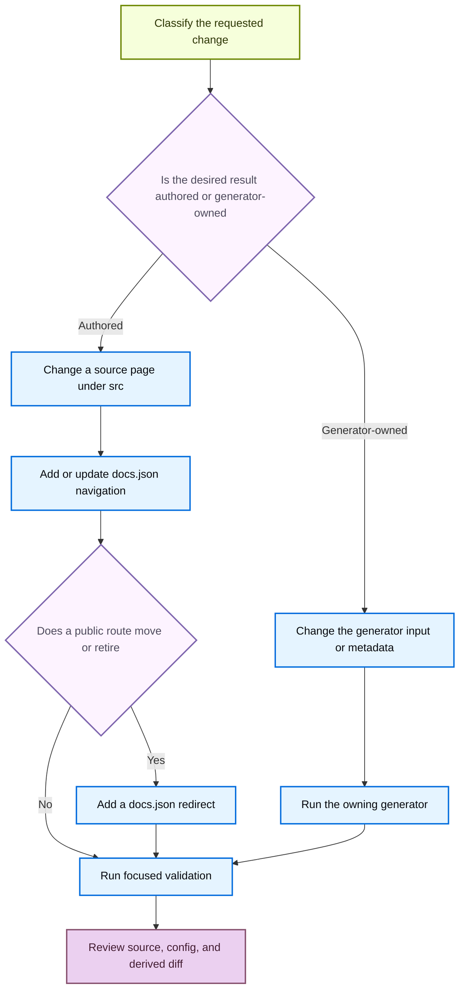

# Adding and maintaining documentation pages

A documentation change is complete only when its owning input, public route, and validation are correct. `AGENTS.md` is the active repository guidance, and `CLAUDE.md` points to it. Author manually maintained content in `src/`; **never edit generated files**, including `build/`, generated snippets, generated tables, or generated OpenAPI output. The builder clears and recreates `build/`, so a durable fix belongs in an authored source or a generator input.

Every new authored page requires a `src/docs.json` navigation entry. Every moved or retired public route requires a redirect in `src/docs.json` to the closest maintained destination. Navigation labels are not a reliable directory map, so select the source owner before selecting the nav location.



This flow distinguishes a durable authored change from a regeneration and makes route compatibility an explicit release decision.

## Select the owner and route model

The build produces several route families. Choose the source directory based on subject ownership, then add the route to the matching `docs.json` location.

| Content | Source owner | Resulting route model |
| --- | --- | --- |
| Most OSS content, such as LangChain, LangGraph, and Deep Agents | `src/oss/` | One source builds to `/oss/python/...` and `/oss/javascript/...`. Use `:::python` and `:::js` only for language-specific material. |
| Language-specific integrations and similar material | `src/oss/python/` or `src/oss/javascript/` | One language route. |
| OpenWiki and Deep Agents Code | `src/oss/openwiki/` or `src/oss/deepagents/code/` | One unversioned route: `/oss/openwiki/...` or `/oss/deepagents/code/...`. |
| Ordinary LangSmith pages | `src/langsmith/` | One unversioned `/langsmith/...` route. |
| Managed Deep Agents pages | Direct `src/langsmith/managed-deep-agents*.mdx` files | Python and JavaScript routes under `/langsmith/python/...` and `/langsmith/javascript/...`. |

For versioned OSS output, preprocessing keeps the matching conditional fence, resolves `@[...]` cross-references in the target language, rewrites snippet imports, and rewrites ordinary unprefixed `/oss/...` links for that language. Do not manually prefix ordinary versioned OSS links with `/python/` or `/javascript/`. OpenWiki and Deep Agents Code are intentional exceptions: link to `/oss/openwiki/...` and `/oss/deepagents/code/...` without a language prefix, because the builder does not duplicate them.

Unversioned products resolve conditional blocks as Python. Managed Deep Agents is a different exception: its direct source files do not emit ordinary unversioned LangSmith pages. Existing unversioned Managed Deep Agents URLs redirect to the Python route; do not create a duplicate unversioned page to preserve an old URL.

## Add an authored page to navigation

`src/docs.json` is the authoritative navigation and route configuration. Its navigation hierarchy is product → menu item → dropdown or tab → nested `pages` group. Find a neighboring entry in the target `pages` array; do not infer placement from a menu label. For example, lifecycle menus can mix `src/oss/` and `src/langsmith/`, and Fleet appears in navigation as “No-code agents.”

For an authored page:

1. Select the source owner and inspect a neighboring page. Create an `.md` or `.mdx` file under `src/` with required frontmatter. Keep `description` plain text: Markdown in that field breaks SEO.
2. Add the extensionless route, relative to `src`, to the exact `src/docs.json` `pages` array. For example, `src/langsmith/sandboxes.mdx` becomes `langsmith/sandboxes`.
3. Add all emitted routes: normally both Python and JavaScript entries for shared versioned OSS content, one entry for a language-specific page, and one unversioned entry for OpenWiki or Deep Agents Code. Add both entries for Managed Deep Agents.
4. If adding a group, place its index route first. Integration pages within an existing component normally belong in that component’s `index.mdx`; alter `docs.json` only when creating a component group.
5. Before changing a heading, search for inbound fragment links. A changed heading changes its generated anchor.

The removed-pages checker enforces that every navigation page resolves to an existing `.mdx` or `.md` source. A source file that lacks navigation is therefore not a complete new public page.

## Move or retire a page safely

Use the documentation mover for a filesystem move, then explicitly update navigation, route links, and redirects. Start with a preview:

```bash
uv run docs mv src/langsmith/evaluation.mdx src/langsmith/deploy/evaluation.mdx --dry-run
```

The installed `docs` console script invokes `pipeline.cli:main`. The mover scans Markdown, MDX, and notebook Markdown cells beneath `src/` and updates links that resolve to the moved file; if the directory changes, it also recalculates relative links inside the moved document. `--dry-run` reports these changes without moving or rewriting anything. A real move records the operation in `link_changes.jsonl` before moving the file and applying internal-link changes.

The mover does not make the public route decision for you. After reviewing the preview:

1. Run the move without `--dry-run`.
2. Update the affected `docs.json` navigation entries and search for root-relative links containing the old public URL.
3. Add a redirect for every published route that changed or was retired. Shared OSS and Managed Deep Agents changes can need one redirect per language route.

```json
{
  "source": "/langsmith/evaluation",
  "destination": "/langsmith/deploy/evaluation"
}
```

Redirect sources are site paths and normally start with `/`. The removal checker compares base and proposed navigation. When a navigation page disappears and its source file no longer exists, it requires a matching redirect; a `:path*` redirect source may cover a route family. Keeping a source file while removing it from navigation avoids that specific check, but it does not replace an intentional compatibility decision for a published URL.

Run the check whenever navigation or redirects change:

```bash
python3 scripts/check_removed_pages_redirects.py --base-ref origin/main src/docs.json
```

## Regenerate derived surfaces through their inputs

Do not edit generated files. Change their owning source, metadata, or processor, then run the generator and review its output.

### Reusable snippets

Put reusable MDX in `src/snippets/` and import it with `from '/snippets/...'`. This import form is significant: versioned builds rewrite it to a language-specific snippet copy, whereas Mintlify’s `<Snippet file="..." />` form is not rewritten. Extract a block repeated across several pages rather than maintaining copies, and confirm both language outputs when versioned OSS content consumes it.

### Testable code samples

Author runnable samples in `src/code-samples/`, test a changed sample, then generate its display artifacts:

```bash
make test-code-samples FILES="src/code-samples/path/to/sample.py"
make code-snippets
```

`make code-snippets` extracts marked sample regions into `src/code-samples-generated/` and renders MDX into `src/snippets/code-samples/`. The renderer supports Python, TypeScript, Java, Kotlin, Go, and shell snippets, can create Deep Agents provider CodeGroups, and appends trace links from the trace manifest. Do not hand-edit either derived surface. If a local sample cannot run because of unavailable credentials or dependencies, report that limitation instead of modifying generated display code.

### Integration tables and OpenAPI references

Integration component tables derive from hosted guide `integration:` frontmatter and `scripts/data/integration_external_docs.yaml`. External entries use `docs_url`; the refresh process rejects unsafe schemes. Update those inputs, then validate and regenerate rather than editing the rendered table:

```bash
uv run python scripts/refresh_integration_downloads.py --check-docs-urls
uv run python scripts/refresh_integration_downloads.py --write
```

OpenAPI entries in `docs.json` configure Mintlify-generated endpoint pages, not authored endpoint MDX. The LangSmith REST processor only fetches the allow-listed LangSmith API host by default, hides selected operations, standardizes operation titles, groups and orders tags, and writes the transformed spec only with `--write`:

```bash
uv run python scripts/process_langsmith_openapi.py --write
```

For the Agent Server specification, use `make check-openapi`. It builds first and validates `langsmith/agent-server-openapi.json` in `build/`. Never hand-author deployment-generated endpoint pages or edit transformed specifications as if they were the source.

## Validate the change

Choose focused checks for the owner changed, then run rendering and link checks for pages, navigation, links, redirects, or route changes:

1. Run `make lint_prose FILES="src/path/to/page.mdx"`. The target installs the pinned Vale binary; omit `FILES` to lint `src/`.
2. Run `make check-cross-refs` after adding or changing `@[...]` references.
3. Run the relevant sample, generator, integration URL, or OpenAPI validation after changing an input to a derived surface.
4. Run `make dev` to inspect output. It performs an initial build, watches `src/`, and serves `build/` through `mint dev` on port 3000. Check both versions of versioned OSS pages.
5. Run `make build` for a clean generated result. Run `make broken-links` after route or link changes, and `make broken-links-with-anchors` after fragment changes. These invoke Mint link and redirect checks, filtering known deployment-time OpenAPI and standalone-snippet reports before failing on remaining broken links.
6. Review the final authored source, `src/docs.json`, and generated diff. A `build/` change is evidence of output, never the durable fix.

## Completion checklist

- [ ] The change was made at its actual authored owner or generator input.
- [ ] Every new authored page has valid frontmatter and a `src/docs.json` navigation entry.
- [ ] Navigation includes every route emitted by the selected versioning model.
- [ ] Every moved or retired public route has a redirect to a maintained destination.
- [ ] Generated snippets, tables, and OpenAPI artifacts were regenerated, not hand-edited.
- [ ] Focused lint, cross-reference, generator, sample, build, and link checks ran where applicable.
- [ ] Rendered output and the final source/configuration diff were reviewed.

## See also

- [Source directory map](/openwiki/architecture/source-map.md)
- [Versioning](/openwiki/concepts/versioning.md)
- [Mintlify integration](/openwiki/integrations/mintlify.md)
- [Quickstart](/openwiki/quickstart.md)
- [Testing overview](/openwiki/testing/test-overview.md)
