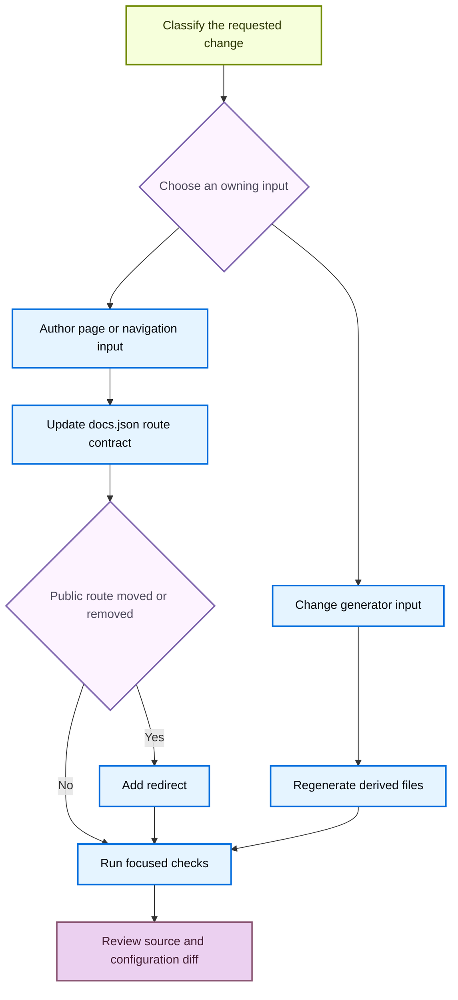

# Adding and Maintaining Documentation Pages

A safe documentation change starts at the input that owns it. `src/` contains authored pages and configuration; `build/` is cleared and recreated by the builder. `src/docs.json` is the public site contract for navigation and redirects. Therefore, every new authored page must be navigated, while a moved or removed public route must retain a redirect to its maintained successor.



This change flow separates authored inputs from derived output and makes URL compatibility an explicit decision.

## Choose the source and route model

The builder has three route models:

| Content | Authoring location | Emitted routes |
| --- | --- | --- |
| Shared OSS content, including LangChain, LangGraph, and most Deep Agents content | `src/oss/` | One source produces `/oss/python/...` and `/oss/javascript/...`. Use `:::python` and `:::js` blocks only for language-specific material. |
| Language-specific integration content | `src/oss/python/` or `src/oss/javascript/` | Only that language's route. |
| OpenWiki and Deep Agents Code | `src/oss/openwiki/` or `src/oss/deepagents/code/` | A single unversioned `/oss/openwiki/...` or `/oss/deepagents/code/...` route. |
| Ordinary LangSmith documentation | `src/langsmith/` | A single `/langsmith/...` route. |
| Managed Deep Agents | Direct `src/langsmith/managed-deep-agents*.mdx` files | Both `/langsmith/python/...` and `/langsmith/javascript/...` routes. |

The full builder clears `build/`, renders both versioned OSS variants, renders the two language-agnostic OSS products once, then renders LangSmith and Managed Deep Agents. Conditional fences retain only their matching language; language-agnostic OSS pages resolve them as Python. During versioned output, unprefixed ordinary `/oss/...` links are rewritten to the selected language route. Links to OpenWiki and Deep Agents Code are exceptions: use `/oss/openwiki/...` and `/oss/deepagents/code/...` without a language prefix.

Managed Deep Agents is the LangSmith exception. Its direct files do not produce ordinary unversioned LangSmith output; legacy unversioned URLs redirect to the Python routes through `docs.json`. Do not create an unversioned duplicate to preserve an old URL.

## Place every authored page in current navigation

`src/docs.json` is authoritative for navigation, routing, redirects, and configured generated API references. The current top-level navigation contains two products: **AGENT DEVELOPMENT LIFECYCLE**, whose menu has Home, Build, Test, Deploy, and Monitor; and **PRODUCTS AND SETUP**, whose menu includes LangSmith setup, LLM Gateway, No-code agents, Engine, and Deep Agents Code. A Build menu item has Python and TypeScript dropdowns with tabs and nested groups; other menu items can use their own page or group structure. Labels are not directory names: Build combines `src/oss/` and `src/langsmith/`, while No-code agents is sourced from `src/langsmith/fleet/`.

Before adding a route, locate a neighboring entry in the relevant `docs.json` `pages` array rather than deriving placement from its label. Use an extensionless path relative to `src`; for example, `src/langsmith/sandboxes.mdx` is `"langsmith/sandboxes"`. A shared OSS source is valid for the matching Python and JavaScript entries. For a new group, put its index route first.

For a standard authored page:

1. Inspect neighboring source pages and the target `docs.json` group. Create a `.md` or `.mdx` file under the chosen owner with frontmatter. Keep `description` plain text: repository guidance prohibits Markdown there.
2. Add the emitted route or routes to the exact product, menu item, dropdown, tab, and group. A source file alone is not navigated.
3. For a shared OSS page, add both language routes; for language-specific content, add the applicable route; for OpenWiki or Deep Agents Code, add its one unversioned route. Add both Managed Deep Agents routes to their respective language navigation.
4. An integration guide inside an existing component is normally added to that component's `index.mdx`; update `docs.json` only when creating a new component group.
5. Use root-relative internal routes. Do not manually add `/python/` or `/javascript/` to ordinary versioned OSS links, because preprocessing adds the target prefix. Check inbound fragment links before changing a heading.

The removed-pages checker also requires every navigation page to resolve to an existing `.mdx` or `.md` source. That makes navigation an integrity constraint, not merely a sidebar preference.

## Move or retire a route without breaking it

Use the mover for the filesystem move and qualifying relative-link maintenance, then make navigation and redirect changes explicitly:

```bash
uv run docs mv src/langsmith/evaluation.mdx src/langsmith/deploy/evaluation.mdx --dry-run
```

The installed `docs` command routes to `pipeline.cli:main`. `--dry-run` reports changes without moving or rewriting files. A real move appends the operation to `link_changes.jsonl`, scans Markdown, MDX, and notebook Markdown cells under `src/`, moves the file, and recalculates relative links within the moved file. It does **not** update `docs.json`, public root-relative route strings, or redirects. Review the preview, perform the move, and search for the old public route.

Update the navigation entry in the same change. If a published route changes or disappears, add a redirect in `docs.json` to the closest maintained destination:

```json
{
  "source": "/langsmith/evaluation",
  "destination": "/langsmith/deploy/evaluation"
}
```

A shared OSS or Managed Deep Agents move can require redirects for each retired language route. The removed-pages check compares base and proposed navigation. If a route disappears from navigation **and** no corresponding source remains, it requires a redirect; a `:path*` source can cover a route family. Retaining source while removing navigation avoids that particular checker failure, but remains a deliberate reachability decision rather than a substitute for preserving a published URL.

Run the checker against the comparison ref when changing navigation or redirects:

```bash
python3 scripts/check_removed_pages_redirects.py --base-ref origin/main src/docs.json
```

## Change generated surfaces through their owners

Generated files are outputs, not alternate authoring surfaces. Change the input, run its generator, and review the derivative diff.

### Code samples and snippets

Runnable samples belong in `src/code-samples/`. `make code-snippets` extracts marked regions to `src/code-samples-generated/` and produces derivative MDX in `src/snippets/code-samples/`. The MDX generator supports Python, TypeScript, Java, Kotlin, Go, and shell intermediates; it can emit language fences or eligible Deep Agents provider CodeGroups and add trace links from the trace manifest. Do not hand-edit the derived snippets.

```bash
make test-code-samples FILES="src/code-samples/path/to/sample.py"
make code-snippets
```

Test a changed source sample before publishing it. If credentials or an unavailable dependency prevent local execution, report that limitation rather than editing generated display code.

### Integration discovery tables

A hosted integration guide's `integration:` frontmatter and `scripts/data/integration_external_docs.yaml` own generated component tables. Hosted guides provide internal links; external records link through `docs_url`. Change that metadata rather than `src/snippets/oss/*-downloads.mdx`, then validate and refresh:

```bash
uv run python scripts/refresh_integration_downloads.py --check-docs-urls
uv run python scripts/refresh_integration_downloads.py --write
```

The refresh script permits `https://`, `http://`, and single-slash site-relative URLs, and rejects protocol-relative and unsafe schemes before it renders external links.

### OpenAPI reference configuration

`docs.json` OpenAPI entries are Mintlify configuration, not authored endpoint MDX. Mintlify creates endpoint pages at deployment, so those routes are not normal local source pages. The committed Agent Server spec, configured remote Control Plane source, and committed LangSmith REST spec have separate lifecycles; do not hand-author their endpoint output.

For a LangSmith REST specification refresh, use the processor rather than editing the transformed spec:

```bash
uv run python scripts/process_langsmith_openapi.py --write
```

With its default input, the processor fetches only its allow-listed LangSmith API host, hides selected operations, normalizes titles, groups and orders sidebar tags, and writes only with `--write`. For an Agent Server spec change, use `make check-openapi`; this currently validates `langsmith/agent-server-openapi.json` from `build/`.

## Run focused checks

Select checks based on the changed owner, then add rendering and link checks for routes, navigation, preprocessing, moves, removals, or generated inputs:

1. Run `make lint_prose FILES="src/path/to/page.mdx"` for prose. It installs the repository-pinned Vale binary; without `FILES`, it lints `src/`.
2. Run `make check-cross-refs` after adding or changing `@[...]` references.
3. Run focused sample, generator, integration URL, or OpenAPI checks for the owner you changed.
4. Run `make dev` to inspect rendered output. It builds first, watches `src/`, and starts `mint dev` from `build/` on port 3000. Inspect both language variants for versioned content.
5. Run `make build` for a clean result, then `make broken-links` after route or link work. Use `make broken-links-with-anchors` when fragments changed. These targets invoke Mint's redirect validation and filter expected reports from deployment-time OpenAPI pages and standalone snippets.
6. Review the completed source and `docs.json` diff; never accept a `build/` edit as the durable fix.

## Completion checklist

- [ ] The page, metadata, sample, listing input, or specification changed at its actual owner.
- [ ] Every new authored page has plain-text frontmatter and the correct extensionless `docs.json` navigation entry.
- [ ] The selected route model has every required language-specific or unversioned navigation entry.
- [ ] A move or removal updates navigation and preserves each retired public route with an appropriate redirect.
- [ ] Derived snippets, integration tables, and OpenAPI specifications were regenerated rather than hand-edited.
- [ ] Focused lint, cross-reference, generator, source-sample, OpenAPI, build, and link checks ran where applicable.
- [ ] The rendered route and final source/configuration diff were reviewed.

## See also

- [Source directory map](/openwiki/architecture/source-map.md)
- [Versioned content](/openwiki/concepts/versioning.md)
- [Mintlify integration](/openwiki/integrations/mintlify.md)
- [Cross-references](/openwiki/operations/cross-references.md)
- [Testing overview](/openwiki/testing/test-overview.md)
- [Versioned content workflow](/openwiki/workflows/versioned-content.md)
