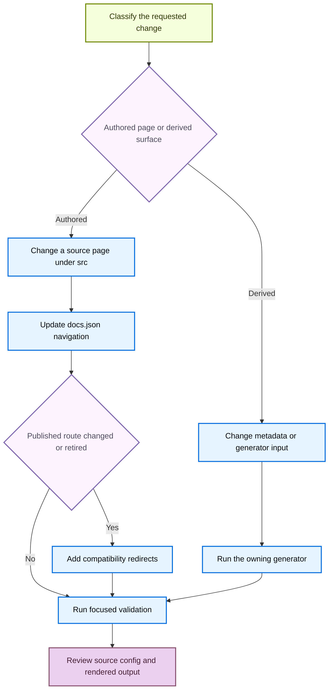

# Adding and Maintaining Documentation Pages

A documentation change is complete only when its owning input, public route, navigation, and validation are correct. `AGENTS.md` is the repository's active authoring guidance; `CLAUDE.md` directs readers there. Make manual changes under `src/`, never in `build/`: a build clears and recreates that directory. Likewise, do not hand-edit generated snippets, integration tables, or transformed OpenAPI output—change their declared inputs and regenerate.

Every new public authored page needs a `src/docs.json` navigation entry. A move or retirement needs a separate compatibility decision: preserve each published route with a redirect to the closest maintained destination.



This flow separates durable source changes from regeneration and makes route compatibility explicit.

## Select the source owner and route family

Choose the source directory by subject ownership, not from a navigation label. Build, for example, mixes OSS and LangSmith sources; Fleet appears as **No-code agents** in navigation. The builder produces these route families:

| Content | Authored source | Emitted routes |
| --- | --- | --- |
| Shared OSS content, including LangChain, LangGraph, and most Deep Agents | `src/oss/` outside language-specific directories | One source is built at both `/oss/python/...` and `/oss/javascript/...`. |
| Language-specific OSS content, including integrations | `src/oss/python/` or `src/oss/javascript/` | Only the matching language route. |
| OpenWiki and Deep Agents Code | `src/oss/openwiki/` or `src/oss/deepagents/code/` | One unversioned route, respectively `/oss/openwiki/...` or `/oss/deepagents/code/...`. |
| Ordinary LangSmith content | `src/langsmith/` | One unversioned `/langsmith/...` route. |
| Managed Deep Agents | Direct `src/langsmith/managed-deep-agents*.mdx` files | Both `/langsmith/python/...` and `/langsmith/javascript/...` routes. |

Shared OSS pages use one source file and can use `:::python` and `:::js` fences for language-specific material. The preprocessing pass retains the matching block, resolves cross-references in that language, rewrites supported snippet imports, and rewrites ordinary root-relative `/oss/...` links to the target language. Do not manually insert `/python/` or `/javascript/` into ordinary shared OSS links.

OpenWiki and Deep Agents Code deliberately remain unversioned. From versioned OSS content, link to `/oss/openwiki/...` or `/oss/deepagents/code/...` without a language segment: the builder explicitly skips those paths when rewriting OSS links. Their conditional fences resolve as Python.

Managed Deep Agents is different from ordinary LangSmith content. The builder excludes its direct source files from ordinary unversioned output and emits language variants instead. Use unversioned `/langsmith/managed-deep-agents...` links in source where a language-specific build should choose the corresponding variant; the builder rewrites them for Python or JavaScript. Existing unversioned public routes remain compatibility aliases in `docs.json` and redirect to Python routes—do not restore a duplicate unversioned source page.

## Add an authored page to current navigation

`src/docs.json` is the route and navigation authority. Its current top-level shape is `navigation.products[]`, where each product has a `menu[]` of items. A menu item can contain direct `pages`, `tabs`, `groups`, or—for Build—`dropdowns[]` containing `tabs[]`; each `pages` array can hold route strings and nested `{ "group": ..., "pages": [...] }` objects. Do not assume every page follows a product → tab → group chain. Find the neighboring route in the intended array and mirror its shape and optional presentation fields such as `root`, `expanded`, or `tag` only when they are needed.

For an authored page:

1. Inspect a neighboring source page and create the `.md` or `.mdx` file under the selected `src/` owner. Give it required frontmatter and keep `description` plain text—Markdown breaks SEO.
2. Add an extensionless route relative to `src` to the exact `pages` array. For example, `src/langsmith/sandboxes.mdx` becomes `langsmith/sandboxes`.
3. Add entries for the routes the selected owner emits: shared OSS pages require a Python and a TypeScript navigation entry; a language-specific page has one; OpenWiki and Deep Agents Code have one unversioned entry; and a Managed Deep Agents page needs one entry in each language dropdown.
4. For a new nested group, put its index route first when that group has an index. For an integration inside an existing component, add the page to that component's `index.mdx`; change `docs.json` only for a new component group.
5. Before renaming a heading, search for inbound fragment links, because its generated anchor changes with the heading text.

The removed-pages checker recursively understands direct pages, tabs, dropdown tabs, and groups. It requires every configured navigation route to map to an existing source `.mdx` or `.md` file; for `/oss/python/` and `/oss/javascript/` routes it also accepts the corresponding shared `src/oss/` source.

## Move or retire a page safely

Use the mover for the filesystem operation, then update navigation and make the public-route decision yourself. Begin with a preview:

```bash
uv run docs mv src/langsmith/evaluation.mdx src/langsmith/deploy/evaluation.mdx --dry-run
```

The installed `docs` console script routes to `pipeline.cli:main`. Its mover scans Markdown, MDX, and notebook Markdown cells below `src/` for links resolving to the moved file; when the parent directory changes, it also recalculates relative links inside the moved document. `--dry-run` reports the prospective rewrites without moving or editing files. A real run appends the move to `link_changes.jsonl`, relocates the source, and then updates internal relative links.

After reviewing the preview:

1. Run the move without `--dry-run`.
2. Change the affected route strings in their actual `docs.json` `pages` arrays and search for root-relative uses of the old public URL. The mover handles file-resolved links, not this navigation or compatibility work.
3. Add a redirect for every public route that moved or retired. Shared OSS and Managed Deep Agents commonly require a redirect for each language route.

```json
{
  "source": "/langsmith/evaluation",
  "destination": "/langsmith/deploy/evaluation"
}
```

Redirects belong in the top-level `redirects` array and use site paths. The checker compares navigation in a base `docs.json` against the proposed one. If a removed navigation route's source no longer exists, it requires an exact redirect source or a covering `:path*` wildcard. Retaining a source file bypasses that narrow check, but does not by itself preserve a published URL intentionally.

### Managed Deep Agents compatibility redirects

Treat a Managed Deep Agents move as a two-language route change plus an old unversioned compatibility surface. Its pages appear in the Python and TypeScript Build dropdowns under `langsmith/python/managed-deep-agents-*` and `langsmith/javascript/managed-deep-agents-*`. The existing `redirects` array maps legacy unversioned routes, including `/langsmith/managed-deep-agents-channels-http`, to the matching Python page. Preserve or replace that compatibility redirect when changing a page such as `src/langsmith/managed-deep-agents-channels-http.mdx`; add redirects for changed Python and JavaScript public routes as well.

Run the structural check whenever navigation or redirects change:

```bash
python3 scripts/check_removed_pages_redirects.py --base-ref origin/main src/docs.json
```

## Regenerate derived surfaces through their inputs

Generated content has an owner. Edit the source metadata or generator input, run its generation command, and review the resulting change rather than changing the derivative.

### Reusable snippets and testable samples

Put reusable MDX in `src/snippets/` and import it using `from '/snippets/...'`. The builder recognizes and rewrites that import into a language-specific copy for versioned pages; Mintlify's `<Snippet file="..." />` form is not rewritten.

Author runnable examples in `src/code-samples/`. Test a changed sample and regenerate its extracted and rendered forms:

```bash
make test-code-samples FILES="src/code-samples/path/to/sample.py"
make code-snippets
```

The extraction pipeline creates intermediate content under `src/code-samples-generated/` and MDX under `src/snippets/code-samples/`. Do not hand-edit either output. If a sample cannot run locally because required credentials or dependencies are unavailable, report that limitation rather than modifying generated display code.

### Integration listings

Integration listing snippets are generated from `integration:` frontmatter on hosted integration guides and external records in `scripts/data/integration_external_docs.yaml`. A component index such as `src/oss/python/integrations/tools/index.mdx` imports its derived downloads snippet; adding a hosted integration with appropriate frontmatter can therefore alter the shared listing. External rows link through `docs_url`, and the refresh script only permits `https://`, `http://`, or a single-slash site-relative URL to prevent unsafe rendered hrefs.

```bash
uv run python scripts/refresh_integration_downloads.py --check-docs-urls
uv run python scripts/refresh_integration_downloads.py --write
```

### OpenAPI references

OpenAPI navigation entries configure Mintlify-generated endpoint pages rather than authored endpoint MDX. The LangSmith processor fetches its default input only from the allow-listed LangSmith API host; it removes selected operations, normalizes titles, assigns and orders sidebar tag groups, and writes the transformed specification only with `--write`.

```bash
uv run python scripts/process_langsmith_openapi.py --write
make check-openapi
```

`make check-openapi` builds first and validates `langsmith/agent-server-openapi.json` in `build/`. Do not hand-edit deployment-generated endpoint pages or transformed specifications as if they were their source.

## Validate the change

Run focused checks for the owner you changed, then render and check routes where applicable:

1. Run `make lint_prose FILES="src/path/to/page.mdx"`; omit `FILES` to lint all of `src/`.
2. Run `make check-cross-refs` after changing `@[...]` references.
3. Run the relevant sample, generator, integration URL, or OpenAPI check after changing a generator input.
4. Use `make dev` to inspect the rendered result. It performs an initial build, watches `src/`, and serves `build/` with `mint dev` on port 3000. Inspect both language outputs for shared OSS and Managed Deep Agents pages.
5. Run `make build` for a clean output. After route or link changes, run `make broken-links`; after fragment changes, run `make broken-links-with-anchors`. Both invoke Mint checks with redirect validation and filter known deployment-time OpenAPI and standalone-snippet reports before failing remaining broken links.
6. Review authored source, `src/docs.json`, generator inputs and output. A `build/` diff is validation evidence, not the durable edit.

## Completion checklist

- [ ] The change was made in an authored owner or generator input, never a generated output.
- [ ] Every new authored page has valid plain-text-description frontmatter and an entry in the correct current `docs.json` shape.
- [ ] Navigation includes all routes emitted by its selected route family.
- [ ] Each moved or retired public URL, including applicable Managed Deep Agents aliases, redirects to a maintained destination.
- [ ] Snippets, samples, integration listings, and OpenAPI surfaces were regenerated from their owners.
- [ ] Focused lint, cross-reference, generator, build, and link checks ran where applicable.
- [ ] Rendered output and the final source/configuration diff were reviewed.

## See also

- [Source directory map](/openwiki/architecture/source-map.md)
- [Versioning](/openwiki/concepts/versioning.md)
- [Mintlify integration](/openwiki/integrations/mintlify.md)
- [Integration listing automation](/openwiki/workflows/integration-listing-automation.md)
- [Versioned content](/openwiki/workflows/versioned-content.md)
