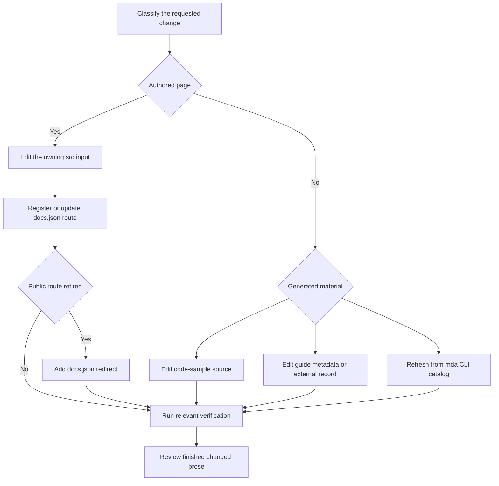

Documentation changes span authored source, route configuration, and generated output. Start with the repository-wide requirements in [`AGENTS.md`](../../AGENTS.md), including its source-directory map, frontmatter rules, style guide, and code-example requirements. This page describes the change procedure and ownership boundaries; it does not replace those universal instructions.



This flow shows that route configuration and the true generator input are part of a safe documentation change, while generated output is evidence to inspect.

## Start with the repository procedure

Use the [`add-docs-page`](../../.agents/skills/add-docs-page/SKILL.md) skill for an addition, move, rename, deletion, navigation change, or redirect. It deliberately points back to `AGENTS.md` for universal authoring policy. When the prose is complete, use [`docs-review`](../../.agents/skills/docs-review/SKILL.md) in working-tree mode on the Markdown or MDX files changed by this pass. That review is scoped to the diff; a redirect-only or navigation-only change has no prose to review.

## Choose the source and route model

Select the source directory from the intended route and build behavior—not from its visible navigation label. `src/docs.json` is the navigation contract: it organizes pages under `navigation.products`, whose menu items can contain direct pages, tabs, dropdowns and nested page groups. The source-directory map in `AGENTS.md` resolves the intentional mismatch between those labels and physical directories.

| Content | Authoritative input | Published behavior and change boundary |
| --- | --- | --- |
| Shared OSS content | Most `src/oss/` content | One source emits Python and JavaScript artifacts. Put language-specific material in `:::python` and `:::js` blocks in that source. |
| Language-specific OSS content | `src/oss/python/` or `src/oss/javascript/` | Emits only the corresponding route. Register it in the matching navigation location. |
| OpenWiki | `src/oss/openwiki/` | Emits once at `/oss/openwiki/...`, without a language segment. |
| Deep Agents Code | `src/oss/deepagents/code/` | Emits once at `/oss/deepagents/code/...`, without a language segment. |
| Ordinary LangSmith content | `src/langsmith/` | Emits at `/langsmith/...`; find its lifecycle or setup placement in `docs.json`. |
| Managed Deep Agents | Direct `src/langsmith/managed-deep-agents*.mdx` files | Emits Python and JavaScript LangSmith routes. Unversioned legacy routes redirect to Python routes. |
| Reusable snippet | `src/snippets/` | Imported material rather than a normal navigable page. Edit only an authored snippet and import it from the consumer. |

For links inside versioned OSS output, an unqualified `/oss/...` route is rewritten for the target language. Do not language-prefix links to OpenWiki or Deep Agents Code: those products are deliberately excluded from rewriting. Their conditional blocks resolve using the Python branch, so a link from either unversioned product to shared OSS content resolves to the Python route.

### Add a navigable authored page

After following `AGENTS.md` for the page’s contents and frontmatter, make the route discoverable:

1. Inspect nearby `src/docs.json` entries and select the correct product, menu item, dropdown or tab, and nested group. A new group should lead with its index page.
2. Add the extensionless source-relative path to the relevant `pages` array. For example, `src/oss/openwiki/deployment.mdx` is `oss/openwiki/deployment`.
3. For shared versioned OSS content, add the Python and JavaScript navigation paths that map to its one source file. For an integration page, update the component `index.mdx`; change `docs.json` only when creating a component group.
4. Use published root-relative routes for ordinary internal links, preserving anchors when required. Validate symbolic `@[...]` API-reference links independently with `make check-cross-refs`.

## Move, rename, or remove a page

A file move is a public-route migration. First preview the repository mover, then repeat it without `--dry-run` after reviewing the result:

```bash
uv run docs mv src/langsmith/evaluation.mdx src/langsmith/deploy/evaluation.mdx --dry-run
uv run docs mv src/langsmith/evaluation.mdx src/langsmith/deploy/evaluation.mdx
```

The installed `docs` command moves the file and updates relative Markdown, MDX, and notebook links that point to it; after a directory move it also recalculates relative links inside the moved file. It does not update `src/docs.json`, redirects, or arbitrary textual mentions of the old public route. Update the navigation entry yourself, inspect the diff, and search for the retired route.

When a public route no longer resolves, add a public-path redirect in the top-level `redirects` array in `src/docs.json`:

```json
{
  "source": "/langsmith/evaluation",
  "destination": "/langsmith/deploy/evaluation"
}
```

Add language-specific redirects for retired versioned routes. `scripts/check_removed_pages_redirects.py` validates that configured navigation paths have source files and compares base and proposed navigation. If removal also deletes the source, the checker requires an exact or `:path*` wildcard redirect; retaining the source is the case where that redirect requirement does not apply.

## Change generated material at its input

`build/` is rebuilt from `src` and is not an authoring surface. The same input-first rule applies to generated documentation fragments.

- **Testable samples**: Author and test the source in `src/code-samples/`. `make code-snippets` regenerates `src/code-samples-generated/` and importable MDX in `src/snippets/code-samples/`; do not hand-edit either derivative directory.
- **Integration tables**: Hosted integration-guide `integration` frontmatter and external records in `scripts/data/integration_external_docs.yaml` are the inputs. Change one of those inputs, then regenerate:

  ```bash
  uv run python scripts/refresh_integration_downloads.py --write
  uv run python scripts/refresh_integration_downloads.py --check-docs-urls
  ```

  External rows use `docs_url`. The safety check permits `https://`, `http://`, and single-slash site-relative URLs, rejecting protocol-relative and unsafe schemes.
- **Managed Deep Agents OAuth catalog**: Keep explanatory content in `src/langsmith/managed-deep-agents-connections.mdx`. It imports a table generated into `src/snippets/langsmith/mda-oauth-catalog.mdx` from the locally installed `mda connections catalog --json` data. Upgrade the CLI and refresh rather than editing the table:

  ```bash
  uv tool upgrade --pre managed-deepagents
  uv run python scripts/refresh_mda_oauth_catalog.py --write
  ```

  The generator fails for a missing executable, command failure, timeout, or invalid catalog JSON; resolve that input problem. It writes only the table, not the consuming page’s prose.

## Verify the source and rendered result

Use focused checks first, then a build-backed check when a change affects routes, navigation, links, preprocessing, or generated structure:

1. Run `make lint_prose FILES="src/path/to/page.mdx"` for changed prose.
2. Use `make dev` to inspect rendering and navigation locally. It performs an initial build, watches `src`, and serves Mint from `build`; inspect both language routes for versioned content.
3. Run `make build` for a clean full-tree build. The builder clears `build/` first, so old output cannot hide a route problem.
4. Run `make broken-links` for route or ordinary-link changes, or `make broken-links-with-anchors` when headings or fragments changed. These targets build first, run Mint from `build`, and filter known OpenAPI and standalone-snippet false positives.
5. Add the focused gate implied by the edit: `make check-cross-refs` for `@[...]`, `make test-code-samples FILES="..."` for samples, the integration URL check for external records, and targeted tests for builder, generator, or redirect code.
6. Run `docs-review` once writing is complete, address findings, and hand off the source/configuration diff with commands run and any checks intentionally skipped.

## See also

- [Source directory map](/openwiki/architecture/source-map.md)
- [Versioning](/openwiki/concepts/versioning.md)
- [Agent skills](/openwiki/operations/agent-skills.md)
- [Cross-reference links](/openwiki/operations/cross-references.md)
- [Testing overview](/openwiki/testing/test-overview.md)
- [Integration listing automation](/openwiki/workflows/integration-listing-automation.md)
