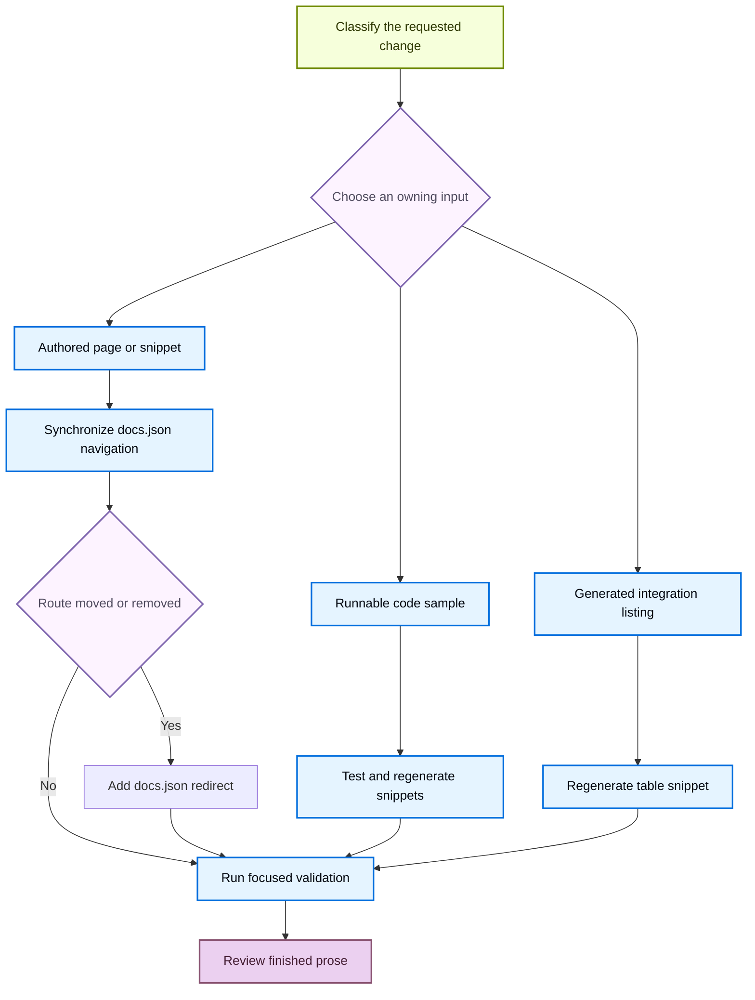

# Adding and Maintaining Documentation Pages

A documentation change is complete only when its authored input, public route, generated derivatives, and validation results agree. Author prose and configuration under `src/`; `src/docs.json` owns navigation and redirects; the build pipeline recreates `build/`. Never edit `build/`. Correct its input and regenerate it.



This lifecycle distinguishes editable sources from outputs and treats a route change as a public compatibility change.

## Select the matching procedure

Use the repository skill that fits the work:

| Situation | Procedure |
| --- | --- |
| Add, move, rename, delete, navigate, or redirect a page | Use `add-docs-page`. It defines the source-location, navigation, redirect, and validation sequence. |
| Revise a page on an existing pull request | Use `docs-edit`. Work on the pull request head branch, inspect its actual diff, and do not create a second branch for another author's PR. |
| Draft or substantially revise prose | Use `docs-team-voice` with the repository style rules. Use precise identifiers, concise active sentences, first-mention links, and only verified facts. |
| Verify a behavior claim or code example | Use `verify-against-source`. Run the sample where possible, then prefer product source, installed packages, or API signatures over sibling documentation. Record anything that remains unverified. |
| Review completed prose | Use `docs-review` after editing. It scopes working-tree review to changed Markdown and MDX under `src/`, not the whole page or `build/`. |

Repository-wide authoring rules live in `AGENTS.md`; task-specific procedures live in `.agents/skills/`. Claude Code reads the linked `.claude/skills/` tree after `make skills`; the other listed agents read `.agents/skills/` directly.

## Choose the owner and route model

Choose a directory from the requested route and language behavior, not from a navigation label. `src/docs.json` is the authoritative navigation and routing configuration. Its two `navigation.products` entries contain menu items; a menu can contain direct pages, tabs, dropdowns with tabs, and nested page groups. Labels intentionally differ from source names, such as `src/langsmith/fleet/` appearing as **No-code agents**.

| Content | Authoritative input | Emitted routes | Authoring rule |
| --- | --- | --- | --- |
| Shared OSS documentation | Most of `src/oss/`, including LangChain, LangGraph, and Deep Agents outside `code/` | `/oss/python/...` and `/oss/javascript/...` | Keep shared material in one source file. Use `:::python` and `:::js` blocks only where content differs. |
| Language-specific OSS documentation | `src/oss/python/` or `src/oss/javascript/` | The corresponding language route | Add only the matching navigation entry. |
| OpenWiki | `src/oss/openwiki/` | One `/oss/openwiki/...` route | Use its unprefixed route in links and navigation. |
| Deep Agents Code | `src/oss/deepagents/code/` | One `/oss/deepagents/code/...` route | Use its unprefixed route in links and navigation. |
| Ordinary LangSmith documentation | `src/langsmith/` | One `/langsmith/...` route | Place it in the lifecycle or setup location appropriate to its subject. |
| Managed Deep Agents | Direct `src/langsmith/managed-deep-agents*.mdx` files | `/langsmith/python/...` and `/langsmith/javascript/...` | Add both language navigation entries and retain redirects for legacy unversioned routes. |
| Reusable content | `src/snippets/` | Imported content, not a page route | Extract repeated content that occurs on three or more pages, then validate generated targets. |
| Runnable example | `src/code-samples/` | Input to generated code-snippet MDX | Test the sample before publishing it, then regenerate derivatives. |

The builder clears `build/` and emits the two language variants for ordinary shared OSS source. It resolves conditional blocks for the target language and rewrites ordinary unprefixed `/oss/...` links to that variant. OpenWiki and Deep Agents Code are deliberate exceptions: they build once, resolve conditional blocks as Python, and are excluded from that link rewrite. An unprefixed ordinary OSS link from an unversioned product consequently resolves to the Python route.

## Add or revise an authored page

Inspect adjacent files and the target location in `src/docs.json` before changing either. Add a page in this order:

1. Create or revise the `.mdx` or `.md` file under the selected owner. Preserve nearby conventions and avoid restructuring unrelated content.
2. Give a new MDX page plain-text `title` and `description` frontmatter. Do not put Markdown, links, or backticks in `description`. Do not invent examples, fields, UI labels, defaults, or behavior claims.
3. Add the extensionless route to `src/docs.json`; navigation entries omit both `src/` and the source extension. For example, `src/langsmith/sandboxes.mdx` becomes `"langsmith/sandboxes"`.
4. Add both language entries for shared OSS or Managed Deep Agents pages. Add only the relevant entry for language-specific source. An unversioned OpenWiki route is listed under both Build dropdowns even though it produces one artifact.
5. Start each new group with its index route. Integration pages are the exception: add a page to that component's `index.mdx`; alter `docs.json` only when creating a component group.
6. Use root-relative public routes for internal links. Do not manually insert `/python/` or `/javascript/` into ordinary OSS links. Use `@[Name]` only for eligible first API-reference mentions and run `make check-cross-refs` when adding one.

Changing a heading also changes its derived anchor. Before rewording one, search `src/` for inbound fragment links and update them or preserve the landing location with an explicit component `id` where appropriate.

## Change generator inputs, not generated files

Committed MDX can still be generated output. Change the owning input, run its generator, and review the result.

- **Code samples:** `make code-snippets` extracts from `src/code-samples/` into `src/code-samples-generated/` and `src/snippets/code-samples/`. Run `make test-code-samples FILES="..."` for the changed source when possible, then regenerate. A model-dependent sample can require provider credentials, so report that CI still needs to exercise it when local execution is unavailable.
- **Integration tables:** hosted integration pages provide `integration` frontmatter and external rows come from `scripts/data/integration_external_docs.yaml`. Regenerate after changing either input:

  ```bash
  uv run python scripts/refresh_integration_downloads.py --write
  ```

  Validate an external `docs_url` before editing it:

  ```bash
  uv run python scripts/refresh_integration_downloads.py --check-docs-urls
  ```

  The generator accepts `https://`, `http://`, and single-slash site-relative URLs; it rejects protocol-relative and unsafe schemes. External rows link through `docs_url`, while hosted rows use their generated internal path.
- **Managed Deep Agents OAuth catalog:** `src/langsmith/managed-deep-agents-connections.mdx` owns the page prose and imports `src/snippets/langsmith/mda-oauth-catalog.mdx`. The generator reads `mda connections catalog --json` from the installed CLI and writes the table only. Upgrade the CLI and regenerate rather than editing the snippet:

  ```bash
  uv tool upgrade --pre managed-deepagents
  uv run python scripts/refresh_mda_oauth_catalog.py --write
  ```

## Move, rename, or retire a page

A source-file move does not itself preserve a public URL. Preview the repository mover first:

```bash
uv run docs mv src/langsmith/evaluation.mdx src/langsmith/deploy/evaluation.mdx --dry-run
```

After reviewing the preview, rerun without `--dry-run`. The `docs` console script invokes the pipeline mover. It scans Markdown, MDX, and notebook Markdown cells under `src/` for links to the old file and updates qualifying relative links. It then moves the file and recomputes its own qualifying relative links from the new directory. The preview performs no writes; a non-dry run logs the move in `link_changes.jsonl` before relocation. The mover does not update `src/docs.json`, redirects, or arbitrary route strings, so search for the former public route and inspect the diff.

Update the matching navigation entry in the same change. If a public route is retired, add a site-path redirect in the `redirects` array:

```json
{
  "source": "/langsmith/evaluation",
  "destination": "/langsmith/deploy/evaluation"
}
```

A versioned route needs its language prefix. A shared OSS or Managed Deep Agents move can need one redirect for each prior language route. A regrouping that keeps the emitted route does not need a redirect; a deletion should point to the closest useful successor.

The removed-pages checker compares base and proposed navigation, verifies each navigation path resolves to an existing `.mdx` or `.md` source, and requires a redirect when a removed page no longer has source. Shared source can satisfy Python or JavaScript navigation paths, and a `:path*` redirect can cover a route family. The pull-request workflow runs this check for PRs targeting `main`.

## Gate prose version claims

A minimum version is both a package specifier and a claim that the named release exists. Put a version-added note near the feature it governs. Use a package form such as `package>=x.y.z` when appropriate; write CLI, runtime, and chart requirements as prose such as “vX.Y.Z or later.” Verify when the feature actually landed from the owning product source or changelog—publication existence alone does not establish the correct minimum.

`scripts/check_version_claims.py` scans MDX pages for `>=` floors and `==` pins. It determines PyPI versus npm from, in order, package syntax, nearby language labels, an enclosing `:::python` or `:::js` block, the page path, then a Python default. It checks the named version against the registry, treats lookup failures as unresolved rather than nonexistent, and allows documented exceptions in `scripts/version_claims_ignore.txt`.

Run the focused command when an MDX change contains a version specifier:

```bash
uv run python scripts/check_version_claims.py --files src/path/to/page.mdx
```

The `check-version-claims` pull-request workflow selects changed `src/**/*.mdx` files and fails only if a named version was never published. It does not determine whether the floor is sufficiently new. The scheduled full sweep uses advisory mode, so source verification remains the author responsibility.

## Validate the affected surface

Start with the narrowest relevant check, then use a clean build for route, navigation, preprocessing, generated-content, or deletion changes:

1. Lint prose changes:

   ```bash
   make lint_prose FILES="src/path/to/page.mdx"
   ```

2. Use `make dev` to inspect rendered content at <http://localhost:3000>. It performs an initial build, watches `src/`, and starts Mint from `build/`. Inspect both emitted routes for versioned content.
3. Run `make build` for a clean full-tree result. The builder removes `build/` first, preventing stale artifacts from masking a route or deletion error.
4. Run `make broken-links` after link, navigation, or route changes; use `make broken-links-with-anchors` when fragments changed. The targets build first, run Mint against `build/`, and filter expected noise from deploy-time OpenAPI pages and standalone snippets. Indented link lines remaining after filtering are failures.
5. Run focused checks as applicable: `make check-cross-refs` for `@[...]`; `make test-code-samples FILES="..."` and `make code-snippets` for runnable samples; the integration URL check and refresh for table metadata; and focused pytest for pipeline, generator, redirect-checker, or version-checker changes.
6. Invoke `docs-review` once finished prose has changed. Hand off the source and configuration diff, commands run, their results, and any checks that could not run.

## Completion checklist

- [ ] The matching agent skill was used, and the owner and route model were selected before editing.
- [ ] Author-owned changes are under `src/`; `build/` and generated outputs were not hand-edited.
- [ ] Every new page has the correct extensionless `src/docs.json` entry in its product, menu, dropdown or tab, and group.
- [ ] Shared, language-specific, and unversioned content has the required route entries.
- [ ] Every retired public route has an appropriate `docs.json` redirect.
- [ ] Samples and generated snippets changed through verified inputs and were regenerated.
- [ ] New package version specifiers passed the focused registry check and their feature floor was verified against an owning source.
- [ ] Prose, output, links, fragments, API references, and focused behavior checks passed as applicable.
- [ ] Finished prose received a diff-scoped `docs-review` pass.

## See also

- [Source directory map](/openwiki/architecture/source-map.md)
- [Language versioning strategy](/openwiki/concepts/versioning.md)
- [Agent authoring skills](/openwiki/operations/agent-skills.md)
- [Testing overview](/openwiki/testing/test-overview.md)
- [Code sample lifecycle](/openwiki/workflows/code-sample-lifecycle.md)
- [Versioned content workflow](/openwiki/workflows/versioned-content.md)
