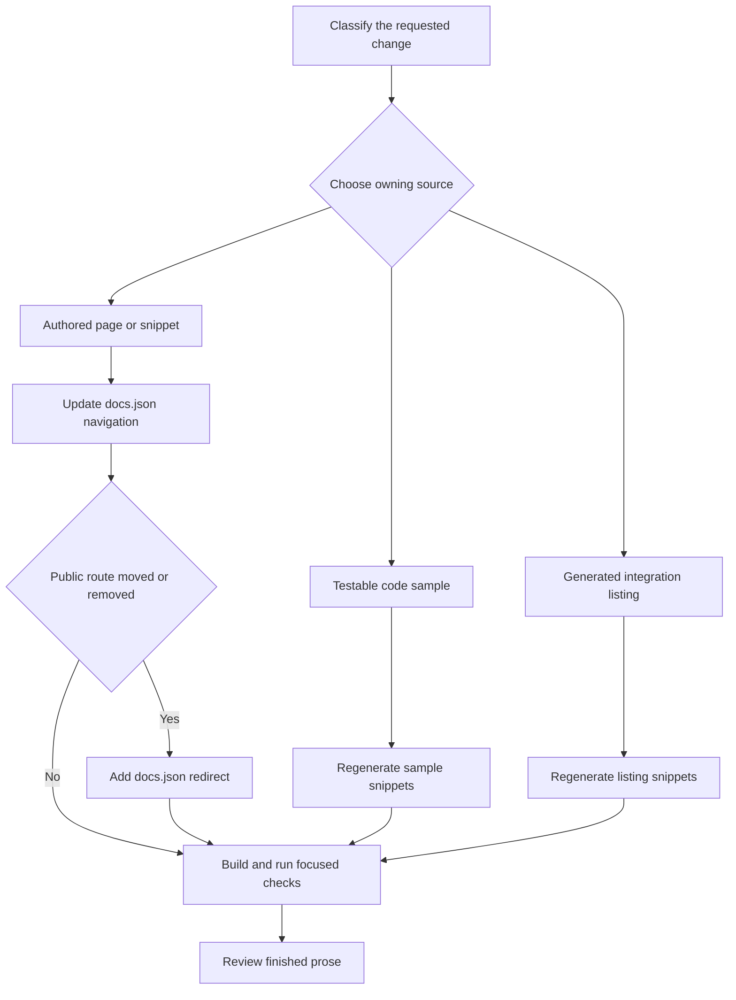

# Adding and Maintaining Documentation Pages

A documentation change is complete only when every owning surface agrees. Authored prose and assets live under `src/`; `src/docs.json` owns visible navigation and redirects; the pipeline derives `build/`. Never edit `build/` to repair a preview or validation result. Fix its source input, then regenerate it.



This flow separates editable inputs from generated artifacts and keeps a route migration from becoming a broken public link.

## Select the procedure before editing

Use the repository skills that match the task:

| Situation | Procedure |
| --- | --- |
| Add, move, rename, delete, navigate, or redirect a page | Use `add-docs-page`. It defines the required navigation, redirect, and validation sequence. |
| Revise a page on an existing pull request | Use `docs-edit`. Check out the pull request's head branch rather than creating a second branch, inspect its real diff, and run prose and link checks appropriate to the change. |
| Draft or substantially revise prose | Use `docs-team-voice` with the repository style rules. Keep sentences focused, use exact identifiers, link a term on first mention, and remove unverified claims. |
| Review completed prose | Use `docs-review` after editing, and only for Markdown or MDX changed in this pass. A navigation-only or redirect-only change has no prose to review. |

Repository-wide rules live in `AGENTS.md`; task procedures live in `.agents/skills/`. Most supported agents read that tree directly. Claude Code users run `make skills` once to link it into `.claude/skills`.

## Choose the content owner and route model

Choose the source directory from the desired route and language behavior, not from a menu label. Navigation labels and directories intentionally differ. For example, `src/langsmith/fleet/` appears as **No-code agents**, and lifecycle menus can contain both OSS and LangSmith content.

| Content | Authoritative input | Emitted route behavior | Change rule |
| --- | --- | --- | --- |
| Shared OSS content | Most of `src/oss/`, including LangChain, LangGraph, and Deep Agents outside `code/` | Python and JavaScript routes | Keep shared prose in one file; use `:::python` and `:::js` only for material that differs. |
| Language-specific OSS content | `src/oss/python/` or `src/oss/javascript/` | Only the matching language route | Add navigation only in its matching language dropdown. |
| OpenWiki | `src/oss/openwiki/` | One `/oss/openwiki/...` route | Use unprefixed OpenWiki routes in navigation and links. |
| Deep Agents Code | `src/oss/deepagents/code/` | One `/oss/deepagents/code/...` route | Use unprefixed Deep Agents Code routes in navigation and links. |
| Ordinary LangSmith content | `src/langsmith/` | One `/langsmith/...` route | Place it in the applicable lifecycle or setup area in `docs.json`. |
| Managed Deep Agents | Direct `src/langsmith/managed-deep-agents*.mdx` files | Python and JavaScript LangSmith routes | Add both language navigation entries and retain relevant legacy redirects. |
| Reusable snippet | `src/snippets/` | Imported content, not a standalone page route | Edit only authored snippets and import them from consuming MDX. |
| Runnable example | `src/code-samples/` | Generator input for code snippet MDX | Test the sample, then regenerate its derivative artifacts. |
| Integration component table | Hosted-guide `integration` frontmatter and `scripts/data/integration_external_docs.yaml` | Generated `src/snippets/oss/` table snippets | Change metadata, then run the listing generator. |

The build pipeline clears and reconstructs `build/` from `src/`. Shared OSS pages build twice, with conditional blocks resolved for each target and unqualified OSS links rewritten to the active language route. OpenWiki and Deep Agents Code are intentional exceptions: they build once without a language segment, resolving conditionals with the Python target. Their unprefixed routes are also excluded from OSS link rewriting. An unqualified link from either unversioned product to ordinary shared OSS content therefore resolves to the Python route.

## Add or revise an authored page

For an ordinary page, first inspect neighboring entries in `src/docs.json` and the applicable source directory. Navigation is hierarchical: product, menu item, optional dropdown, tab, and nested group. `docs.json` is the authority for public navigation and routing, even when its labels diverge from the source tree.

1. Create or revise the `.mdx` or `.md` source under the selected owner. Preserve local conventions rather than restructuring unaffected content.
2. Give a new MDX page plain-text `title` and `description` frontmatter. Markdown, links, and backticks in `description` break SEO. Verify factual prose against the source it describes; do not invent examples, field names, UI labels, or policy details.
3. Add the extensionless emitted route to `src/docs.json`. Do not put `src/` or `.mdx` in a navigation path. For example, `src/langsmith/sandboxes.mdx` is `"langsmith/sandboxes"`.
4. Add both language entries for a shared OSS or Managed Deep Agents page. Add only the matching entry for a language-specific source. OpenWiki has one emitted artifact, but its same unprefixed route is listed in both Build dropdowns.
5. Put an index route first when creating a group. Integration pages are the exception: add them to their component `index.mdx`; change `docs.json` only when creating a component group.
6. Use public routes for internal links. An unqualified `/oss/...` link follows the target language except for OpenWiki and Deep Agents Code. Use `@[Name]` only for eligible API-reference links and run `make check-cross-refs` when adding one.

## Change generated-content inputs, not results

Generated MDX is still generated even when it is committed under `src/`. Do not patch it by hand.

- **Code samples:** `make code-snippets` extracts content from `src/code-samples/` into `src/code-samples-generated/` and `src/snippets/code-samples/`. Edit and test the sample source, then regenerate.
- **Integration tables:** hosted guides provide `integration` frontmatter; third-party rows come from `scripts/data/integration_external_docs.yaml`. Regenerate after changing either input:

  ```bash
  uv run python scripts/refresh_integration_downloads.py --write
  ```

  Before changing an external `docs_url`, run the offline validation:

  ```bash
  uv run python scripts/refresh_integration_downloads.py --check-docs-urls
  ```

  It allows `https://`, `http://`, and a single-slash site-relative path, but rejects protocol-relative and unsafe schemes. Full generation may fetch npm or PyPI download data; an unsafe external URL is a metadata error, not a reason to edit the rendered table.
- **Managed Deep Agents OAuth catalog:** `src/langsmith/managed-deep-agents-connections.mdx` owns prose and imports `src/snippets/langsmith/mda-oauth-catalog.mdx`. The installed `mda` CLI supplies catalog data. Upgrade the CLI and regenerate rather than editing the table:

  ```bash
  uv tool upgrade --pre managed-deepagents
  uv run python scripts/refresh_mda_oauth_catalog.py --write
  ```

## Move, rename, or remove a page

A source move is also a public-route migration. Start with the mover preview:

```bash
uv run docs mv src/langsmith/evaluation.mdx src/langsmith/deploy/evaluation.mdx --dry-run
```

After reviewing the result, rerun without `--dry-run`. The installed `docs` console script routes to `pipeline.cli:main`. Its mover scans Markdown, MDX, and notebook Markdown cells under `src/`, rewrites relative links that point to the moved file, moves the file, and recalculates relative links inside it. It leaves external, mail, absolute, and in-page-only links untouched. It does not update `src/docs.json`, redirects, or arbitrary public-route text, so search for the old route and review the diff.

Update the applicable `src/docs.json` navigation entry in the same change. When a public route is retired, add a redirect to its `redirects` array using site paths:

```json
{
  "source": "/langsmith/evaluation",
  "destination": "/langsmith/deploy/evaluation"
}
```

A retired versioned OSS route needs its language prefix. A shared OSS or Managed Deep Agents move can require a redirect for each former language route. A regrouping that retains the emitted route does not need a redirect. For a deletion, redirect to the closest useful successor.

`scripts/check_removed_pages_redirects.py` protects both sides of this contract. It verifies that navigation paths resolve to an existing `.mdx` or `.md` source, including shared-source mappings for Python and JavaScript routes. It compares base and proposed navigation and, if a removed page no longer has a source, requires a matching redirect. A `:path*` source can cover a route family. Leaving a source in place is the only removed-navigation case that does not require a redirect.

## Regenerate and validate the correct surface

Use generated output to validate inputs, never as an editable source of truth. Start with the narrowest check that covers the change, and use a clean build for navigation, routing, preprocessing, generated structure, or deletion changes.

1. Lint prose edits:

   ```bash
   make lint_prose FILES="src/path/to/page.mdx"
   ```

2. Preview a page with `make dev` and inspect <http://localhost:3000>. It performs an initial build, watches `src/`, and serves Mintlify from `build/`. Inspect both routes for versioned content. Do not rely on the watcher after structural changes: its incremental path does not recreate the full tree.
3. Run `make build` for a clean full-tree result. It clears `build/`, so stale artifacts cannot hide a route or deletion problem.
4. Run `make broken-links` for route or link changes, or `make broken-links-with-anchors` when fragments change. These targets build first, run Mint from `build/`, and filter known OpenAPI-generated and standalone-snippet noise. Remaining indented link lines are failures.
5. Run focused checks when applicable: `make check-cross-refs` for `@[...]`; `make test-code-samples FILES="..."` and `make code-snippets` for examples; `--check-docs-urls` and the integration refresh for listing metadata; and focused pytest when changing builder, generator, watcher, mover, or redirect behavior.
6. Invoke `docs-review` when finished prose changed. Hand off the source/configuration diff with the commands run, their results, and any check not run.

## Completion checklist

- [ ] The requested change used the matching authoring skill and selected the owner before editing.
- [ ] Authored content changed under `src/`; neither `build/` nor another generated result was hand-edited.
- [ ] A new or moved page has the correct extensionless `src/docs.json` navigation path.
- [ ] Shared and special route models have their required language or unversioned entries.
- [ ] A retired public route has an appropriate `docs.json` redirect.
- [ ] Samples, snippets, and integration tables were changed through their inputs and regenerated.
- [ ] Prose, rendering, links, references, and focused behavior were validated as appropriate.
- [ ] Completed prose received a diff-scoped `docs-review` review.

## See also

- [Source directory map](/openwiki/architecture/source-map.md)
- [Language versioning strategy](/openwiki/concepts/versioning.md)
- [Agent authoring skills](/openwiki/operations/agent-skills.md)
- [Testing overview](/openwiki/testing/test-overview.md)
- [Integration listing automation](/openwiki/workflows/integration-listing-automation.md)
- [Local development workflow](/openwiki/workflows/local-development.md)
