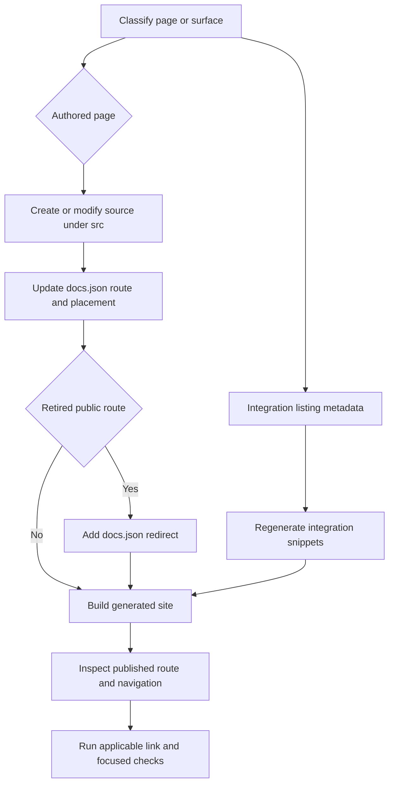

# Adding and Modifying Documentation Pages

A documentation change has two authored sources of truth: the Markdown/MDX file under `src/` supplies content, while `src/docs.json` supplies the published route and navigation placement. `build/` is disposable output. Make content and configuration changes in `src/`, then regenerate; never patch `build/`.



This flow separates authored page changes from generated integration-listing updates, then validates the deployable output.

## 1. Choose the source and route domain

Choose the domain from the intended route and language behavior, not from the visible navigation label. Navigation labels can differ from directories, and lifecycle menus can contain both OSS and LangSmith pages.

| Content | Authoritative source location | Emitted public route(s) | Authoring rule |
| --- | --- | --- | --- |
| Shared OSS material | Most of `src/oss/`, including LangChain, LangGraph, and Deep Agents other than `code/` | `/oss/python/...` and `/oss/javascript/...` | Author one shared page; fence genuinely different material with `:::python` and `:::js`. |
| Language-specific OSS material | `src/oss/python/` or `src/oss/javascript/` | The corresponding one of `/oss/python/...` or `/oss/javascript/...` | Add it only to the matching language dropdown. |
| OpenWiki | `src/oss/openwiki/` | `/oss/openwiki/...` | Build once; do not add a language segment. |
| Deep Agents Code | `src/oss/deepagents/code/` | `/oss/deepagents/code/...` | Build once; do not add a language segment. |
| Ordinary LangSmith material | `src/langsmith/`, including `fleet/` | `/langsmith/...` | Build once and locate its actual lifecycle/setup menu entry in `docs.json`. |
| Managed Deep Agents | A direct `src/langsmith/managed-deep-agents*.mdx` file | `/langsmith/python/...` and `/langsmith/javascript/...` | Add both emitted routes to their respective Build dropdowns; retain the unversioned default redirects. |
| Reusable snippet or executable example | `src/snippets/` or `src/code-samples/` | Imported input or test fixture, not an ordinary page route | Do not add these files as page entries. |

For a shared OSS link that should follow the active language, author an unqualified route such as `/oss/langgraph/overview`; preprocessing inserts `python` or `javascript` in each artifact. Links to OpenWiki and Deep Agents Code are deliberate exemptions and must remain `/oss/openwiki/...` or `/oss/deepagents/code/...`. An unversioned page is processed with the Python conditional branch, so a link from it to ordinary shared OSS content resolves to the Python variant unless it is explicitly qualified.

### Do not confuse an authored guide with an integration listing

A hosted integration guide is an authored page beneath `src/oss/python/integrations/` or `src/oss/javascript/integrations/`; create it in the appropriate component directory and add its intended navigation route. Its `integration` frontmatter also supplies data for component tables.

The component-table snippets in `src/snippets/oss/` are generated and must not be edited by hand. The refresh operation reads hosted-guide frontmatter, merges external discovery records from `scripts/data/integration_external_docs.yaml`, and writes those snippets. An external record is not a hosted guide: its table row links to `docs_url`. Add a hosted guide when that is the desired outcome; otherwise update the external record and validate its URL. Regenerate tables with:

```bash
uv run python scripts/refresh_integration_downloads.py --write
```

Use `uv run python scripts/refresh_integration_downloads.py --check-docs-urls` when changing external listing URLs. This distinction also applies to broad provider-overview surfaces: do not mistake a generated or externally linked listing entry for a new locally authored documentation page.

## 2. Add an authored page

1. **Find its navigation home first.** Inspect adjacent entries in `src/docs.json` and follow the existing product → menu item → dropdown when applicable → tab → group nesting and ordering. `src/docs.json` is authoritative; a directory name does not determine visible placement.
2. **Create the source file beneath the selected `src/` domain.** Use a route-oriented `.mdx` filename and the repository's existing local conventions. Provide frontmatter with plain-text `title` and `description`; Markdown in a description is invalid. Do not add OpenWiki control fields such as `generated`, `verified`, `sources`, or `timestamp`.

   ```mdx
   ---
   title: Your Page Title
   description: A concise plain-text summary of what readers learn on this page.
   ---

   # Your Page Title
   ```

3. **Add the emitted extensionless route to `src/docs.json`.** Do not include `/src/` or `.mdx`. For example, `src/oss/openwiki/deployment.mdx` is `"oss/openwiki/deployment"`. A shared source may instead be exposed by a language-prefixed entry: `oss/python/langgraph/overview` is backed by `src/oss/langgraph/overview.mdx`. Do not create redundant `src/oss/python/` copies just to resemble an emitted route.
4. **Add links using published routes.** Preserve anchors where needed. Use `@[Name]` only for eligible API-reference links, then run `make check-cross-refs`. The cross-reference guide explains scope and resolution behavior.

## 3. Move, rename, or remove a page

Treat a move as a public URL migration, not merely a filesystem rename.

### Use the mover for relative Markdown links

From the repository root, preview the built-in mover before changing files:

```bash
python pipeline/cli.py mv src/langsmith/evaluation.mdx src/langsmith/deploy/evaluation.mdx --dry-run
```

Then run it without `--dry-run` after reviewing the output:

```bash
python pipeline/cli.py mv src/langsmith/evaluation.mdx src/langsmith/deploy/evaluation.mdx
```

The mover recursively scans `src/` Markdown, MDX, and notebook Markdown cells for links resolving to the old file, updates those relative links, moves the file, and recalculates relative links inside it. It deliberately skips external, mail, absolute, and in-page-only links in the relevant cases. It does **not** update `docs.json`, redirects, arbitrary textual route references, or every possible URL representation. Review the diff and search for the old public route after it runs.

### Update navigation and redirects together

Change or remove the matching `src/docs.json` page entry in the same change. When an old source is deleted and its navigation path disappears, add a redirect object to the top-level `redirects` array using published paths:

```json
{
  "source": "/langsmith/evaluation",
  "destination": "/langsmith/deploy/evaluation"
}
```

Include language prefixes for retired versioned OSS routes. A simple regrouping that keeps the same emitted route and source does not need a redirect. For a true removal, redirect to the closest useful successor rather than a generic page.

The redirect checker compares base and proposed navigation. Every configured page must resolve to an existing `.mdx` or `.md` source (including shared-source mappings for `oss/python/` and `oss/javascript/` routes). For a removed navigation entry whose source no longer exists, a matching redirect is required; a `:path*` source can cover a route family. It permits removal without a redirect only while the source remains present.

## 4. Verify the generated route

Use generated output only as validation, not as a repair target.

1. Run `make dev` and inspect `http://localhost:3000`. It builds initially, watches `src/`, and runs Mintlify from `build/`. Confirm the page title and rendering, exact navigation location, and public route. Check both Python and JavaScript routes for versioned content.
2. Run `make build` for a clean, reproducible output. The builder clears and recreates `build/`, so a full build also eliminates stale artifacts.
3. Run `make broken-links`. It builds first, runs Mintlify's checker against `build/`, and filters known non-actionable reports from deployment-generated OpenAPI areas and standalone snippets. Use `make broken-links-with-anchors` if the change added or changed fragments.
4. Run focused checks that match the change:

   ```bash
   make check-cross-refs
   uv run pytest tests/unit_tests/test_check_removed_pages_redirects.py -vv
   ```

   The cross-reference check is appropriate when `@[...]` syntax changed. The redirect-checker test covers its base-reference loading and error handling; use the checker itself in CI or the project workflow to validate the actual navigation diff. Route, preprocessing, or link-rewrite rule changes also warrant the focused builder tests.

## Completion checklist

- [ ] The source domain matches the route and language model.
- [ ] An authored page has plain-text `title` and `description` frontmatter, without OpenWiki-owned control fields.
- [ ] `src/docs.json` contains the extensionless emitted route at the exact product/menu/dropdown/tab/group location.
- [ ] Integration guides, external discovery records, and generated table snippets were changed at their respective ownership surfaces.
- [ ] A move updated relative links, navigation, direct route references, and redirects for retired URLs.
- [ ] The local route and navigation were inspected; both variants were inspected for versioned pages.
- [ ] `make build` and `make broken-links` pass, with anchor, cross-reference, redirect, or builder checks run when applicable.

## See also

- [Source directory map](/openwiki/architecture/source-map.md)
- [Language versioning strategy](/openwiki/concepts/versioning.md)
- [CLI tools reference](/openwiki/operations/cli-tools.md)
- [Cross-reference links](/openwiki/operations/cross-references.md)
- [Testing overview](/openwiki/testing/test-overview.md)
- [Local development workflow](/openwiki/workflows/local-development.md)
- [Writing versioned content](/openwiki/workflows/versioned-content.md)
