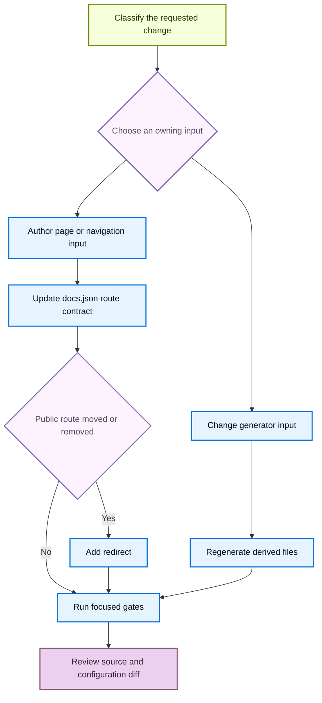

# Adding and Maintaining Documentation Pages

A safe documentation change begins with the input that owns the content. `src/` contains manually authored pages and configuration, while `build/` is a disposable rendering result. Navigation and redirects in `src/docs.json` define public-route contracts, so a move or removal is incomplete until both source ownership and route compatibility have been addressed.



This flow separates editable inputs from generated artifacts and makes a public-route change an explicit compatibility decision.

## Choose the owning input

`src/docs.json` is the navigation authority. Its current structure is product → menu item → dropdown or tab → nested page group; labels are not reliable directory names. For example, the **No-code agents** menu is sourced from `src/langsmith/fleet/`. Find the neighboring route in `docs.json` before selecting a directory or navigation group.

| Requested content | Owning input and route rule |
| --- | --- |
| Shared OSS material, including LangChain, LangGraph, and most Deep Agents pages | Author under the shared part of `src/oss/`. One source is emitted at `/oss/python/...` and `/oss/javascript/...`; use `:::python` and `:::js` only for content that differs. |
| Python- or TypeScript-only OSS material | Author under `src/oss/python/` or `src/oss/javascript/`. The builder removes that leading source-language directory when producing the corresponding language route. |
| OpenWiki or Deep Agents Code | Author under `src/oss/openwiki/` or `src/oss/deepagents/code/`. Each produces a single unversioned route. |
| Ordinary LangSmith documentation | Author under `src/langsmith/`; it produces `/langsmith/...`. Choose the lifecycle or setup menu by subject, not by directory name. |
| Managed Deep Agents | Use direct `src/langsmith/managed-deep-agents*.mdx` pages. They produce both `/langsmith/python/...` and `/langsmith/javascript/...` routes. |
| Provider or component integration guide | Use the applicable directory below `src/oss/python/integrations/` or `src/oss/javascript/integrations/`. Add a page to its component's `index.mdx`; alter `docs.json` only when creating a component group. |
| Reusable prose or runnable code | Use authored reusable content under `src/snippets/` or an executable source under `src/code-samples/`. Do not use derived snippet MDX as an authoring surface. |

The builder clears `build/`, emits the Python and JavaScript OSS trees, then emits Deep Agents Code, OpenWiki, ordinary LangSmith content, Managed Deep Agents variants, and shared inputs. Conditional fences in shared OSS resolve for the target language, and ordinary unprefixed `/oss/...` links are rewritten to that target. OpenWiki and Deep Agents Code are excluded from that rewrite and resolve conditional content as Python; link to them as `/oss/openwiki/...` and `/oss/deepagents/code/...`, without a language prefix. Do not edit `build/` to repair any result.

Managed Deep Agents is the LangSmith exception: the builder excludes those direct source files from ordinary LangSmith output and emits the two language routes. `docs.json` retains redirects from legacy unversioned Managed Deep Agents URLs to Python routes.

## Add or revise an authored route

1. Inspect adjacent source files and the intended `docs.json` group. Create the `.md` or `.mdx` source under its selected owner with `title` and plain-text `description` frontmatter. A frontmatter description must not contain Markdown.
2. Add the extensionless source-relative path to the matching `pages` array. For example, `src/langsmith/sandboxes.mdx` becomes `"langsmith/sandboxes"`. Preserve the actual product, menu, dropdown, tab, and group placement rather than inferring it from a visible label.
3. Add every output route required by the owner: entries in both Build language dropdowns for shared OSS and Managed Deep Agents, one applicable entry for language-specific content, or the one unversioned entry for OpenWiki and Deep Agents Code.
4. When adding a group, put its index route first. For integration guides, update the component index instead of adding a new navigation item unless the component group itself is new.
5. Use root-relative internal routes. Do not manually insert `/python/` or `/javascript/` in an ordinary shared-OSS link; preprocessing supplies the target prefix. Before renaming a heading, search for inbound fragment links because its generated anchor can change.

The repository requires a `src/docs.json` update for a new page. Its removed-pages check also verifies that every declared page resolves to a `.mdx` or `.md` source; a shared OSS source satisfies the matching Python or JavaScript navigation path.

## Move or retire pages without losing routes

Use the mover to relocate a source file and repair qualifying relative file links, but do not mistake it for public-route migration:

```bash
uv run docs mv src/langsmith/evaluation.mdx src/langsmith/deploy/evaluation.mdx --dry-run
```

`--dry-run` previews without writes. A non-dry run first records the move in `link_changes.jsonl`, scans Markdown, MDX, and notebook Markdown cells below `src/`, moves the source, and recalculates relative links inside the moved file. It does not update `src/docs.json`, root-relative public route strings, navigation, or redirects. Review the preview, then search for the old route and update the navigation entry yourself.

When a published route changes or disappears, add a redirect in `docs.json` to the closest maintained successor:

```json
{
  "source": "/langsmith/evaluation",
  "destination": "/langsmith/deploy/evaluation"
}
```

A shared OSS or Managed Deep Agents move can need a redirect for every old language route. The removed-pages checker compares base and proposed navigation. If a removed navigation page no longer has source, it requires a matching redirect; a `:path*` source can cover a route family. Removing a page from navigation while retaining its source does not trigger that redirect requirement, but remains a reachability decision.

## Change generated content through its owner

### Code samples and snippet MDX

Runnable samples belong in `src/code-samples/`. `make code-snippets` extracts marked regions to `src/code-samples-generated/`, then `scripts/generate_code_snippet_mdx.py` reads supported Python, TypeScript, Java, Kotlin, Go, and shell intermediates and writes MDX below `src/snippets/code-samples/`. The generator can emit language fences or an eligible Deep Agents provider `CodeGroup` and adds a trace link resolved from the trace manifest. Those results are derivative artifacts: test the sample, regenerate, and review the resulting MDX diff rather than hand-editing it.

```bash
make test-code-samples FILES="src/code-samples/path/to/sample.py"
make code-snippets
```

A sample that needs unavailable credentials or dependencies may not be locally executable. Record that limitation rather than changing generated display code to make it appear to pass.

### LangSmith OpenAPI surfaces

OpenAPI entries in `src/docs.json` are Mintlify configuration inputs, not authored endpoint pages. Mintlify generates endpoint documentation at deployment, so those pages are absent from local `build/`; the broken-link target filters their expected reports.

The configured sections have distinct ownership: Agent Server uses committed `src/langsmith/agent-server-openapi.json`; Control Plane uses the deployment-fetched `https://api.host.langchain.com/openapi.json`; and LangSmith REST uses committed `src/langsmith/langsmith-platform-openapi.json`. Do not hand-author endpoint output or copy the remote Control Plane specification into the repository.

Do not hand-edit the LangSmith REST specification. Preview or regenerate it through its processor:

```bash
uv run python scripts/process_langsmith_openapi.py --write
```

Without `--input`, the processor fetches only the allow-listed `api.smith.langchain.com` host. It marks selected operations hidden, normalizes titles, groups and orders sidebar tags, and writes only with `--write`. Change the selection or grouping policy in the processor, then regenerate. For an Agent Server specification change, run `make check-openapi`; this target currently validates the Agent Server input from `build/`.

## Run focused validation

Choose the narrowest gate that covers the change, then run rendering checks for route, navigation, preprocessing, deletion, or generated-input work.

1. Run `make lint_prose FILES="src/path/to/page.mdx"` for prose. It installs the repository-pinned Vale binary and accepts `FILES` or defaults to `src/`.
2. Run `make check-cross-refs` after adding `@[...]` references. This independently checks source references rather than rendered-site links.
3. Run the focused sample and generator commands for a sample change, and `make check-openapi` for an Agent Server specification change.
4. Use `make dev` to inspect the result. It performs an initial build unless skipped, watches `src/`, and runs `mint dev` from `build/` on port 3000. Inspect both language outputs for versioned pages.
5. Run `make build` for a clean output, then `make broken-links` after route or link changes. Use `make broken-links-with-anchors` after fragment changes. Both targets build first, check redirects, and filter expected deploy-time OpenAPI and standalone-snippet reports before treating remaining indented entries as failures.
6. For a pipeline or generator behavior change, add or run focused unit coverage with `make test TEST_FILE=tests/unit_tests/<test_file>.py`; the standard suite runs with sockets disabled.

## Completion checklist

- [ ] The page, snippet, sample, or OpenAPI input changed at its actual owner, never in `build/`.
- [ ] A new page has plain-text frontmatter and the correct extensionless `docs.json` navigation entry.
- [ ] The selected route model has all required language or unversioned entries.
- [ ] A move or deletion updates navigation and preserves retired public routes with appropriate redirects.
- [ ] Generated snippets and OpenAPI specifications were regenerated rather than hand-edited.
- [ ] Focused lint, cross-reference, generator, sample, OpenAPI, build, link, and unit checks ran where applicable.
- [ ] The rendered route and finished source/configuration diff were reviewed.

## See also

- [Source directory map](/openwiki/architecture/source-map.md)
- [Reference documentation integration](/openwiki/integrations/reference-docs.md)
- [Testing overview](/openwiki/testing/test-overview.md)
- [Code sample lifecycle](/openwiki/workflows/code-sample-lifecycle.md)
- [Versioned content](/openwiki/workflows/versioned-content.md)
