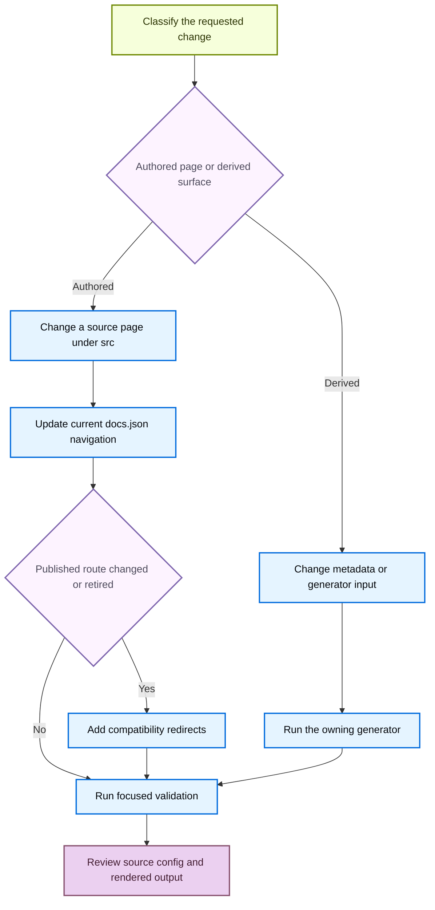

# Adding and Maintaining Documentation Pages

A documentation change is complete only when its durable owner, public route, navigation, and validation agree. `AGENTS.md` is the active authoring guide. Edit manual content under `src/`, never `build/`: a full build removes and recreates `build/`. Change generator inputs rather than generated snippets, integration listings, transformed specifications, or Mintlify deployment-generated endpoint pages.


```mermaid
flowchart TD
    Start["Classify the requested change"] --> Owner{"Authored page or derived surface"}
    Owner -->|"Authored"| Source["Change a source page under src"]
    Owner -->|"Derived"| Input["Change metadata or generator input"]
    Source --> Nav["Update current docs.json navigation"]
    Input --> Generate["Run the owning generator"]
    Nav --> Route{"Published route changed or retired"}
    Route -->|"Yes"| Redirect["Add compatibility redirects"]
    Route -->|"No"| Check["Run focused validation"]
    Redirect --> Check
    Generate --> Check
    Check --> Review["Review source config and rendered output"]
    classDef process fill:#E5F4FF,stroke:#006DDD,stroke-width:2px,color:#030710
    classDef trigger fill:#F6FFDB,stroke:#6E8900,stroke-width:2px,color:#2E3900
    classDef decision fill:#FDF3FF,stroke:#7E65AE,stroke-width:2px,color:#504B5F
    classDef output fill:#EBD0F0,stroke:#885270,stroke-width:2px,color:#441E33
    class Start trigger
    class Owner,Route decision
    class Source,Input,Nav,Generate,Redirect,Check process
    class Review output
```

This flow shows the ownership and compatibility decisions required for a page change.

## Choose the source family before adding a route

Choose a directory by source ownership, not a visible menu label. Build mixes OSS and LangSmith sources, and the **No-code agents** navigation label is backed by `src/langsmith/fleet/`. The builder produces these families:

| Content | Authored source | Emitted routes |
| --- | --- | --- |
| Shared OSS, including LangChain, LangGraph, and most Deep Agents | `src/oss/` outside language-specific directories | One source builds to `/oss/python/...` and `/oss/javascript/...`. |
| Language-specific OSS, including integrations | `src/oss/python/` or `src/oss/javascript/` | The matching language route only. |
| OpenWiki and Deep Agents Code | `src/oss/openwiki/` or `src/oss/deepagents/code/` | One unversioned route: `/oss/openwiki/...` or `/oss/deepagents/code/...`. |
| Ordinary LangSmith | `src/langsmith/` | One unversioned `/langsmith/...` route. |
| Managed Deep Agents | Direct `src/langsmith/managed-deep-agents*.mdx` files | Both `/langsmith/python/...` and `/langsmith/javascript/...`. |

Shared OSS pages use one source file. Use `:::python` and `:::js` fences for divergent material; preprocessing retains the selected branch, resolves `@[ref]` references, and rewrites supported links and snippet imports. Write ordinary unprefixed `/oss/...` source links rather than manually adding `/python/` or `/javascript/`.

OpenWiki and Deep Agents Code remain unversioned. From versioned OSS content, link to `/oss/openwiki/...` or `/oss/deepagents/code/...` without a language segment; the builder excludes these paths from OSS link rewriting. Conditional fences on these pages resolve against the Python branch.

Managed Deep Agents is the exception to ordinary LangSmith output. Direct matching files are omitted from the unversioned build and emitted for both languages. An unversioned `/langsmith/managed-deep-agents...` source link is rewritten to the matching language route for language-targeted output. Existing unversioned routes are compatibility redirects to Python pages; do not create a duplicate unversioned page.

## Add an authored page to navigation

`src/docs.json` is the authoritative site configuration and navigation source. The current shape is `navigation.products[]` → `menu[]`. A menu item can contain direct `pages`, `tabs`, or Build's `dropdowns[]` containing `tabs[]`. A `pages` array can mix route strings with recursively nested `{ "group": ..., "pages": [...] }` objects. Locate the neighboring route in its actual array and preserve presentation fields such as `root`, `expanded`, and `tag` only when they are needed.

To add an authored page:

1. Inspect a neighboring file and create the `.md` or `.mdx` page beneath the selected `src/` owner. Supply the required frontmatter and keep `description` plain text.
2. Add the extensionless route relative to `src` to the matching `pages` array. For example, `src/langsmith/sandboxes.mdx` maps to `langsmith/sandboxes`.
3. Add every route that the selected source family emits. Shared OSS needs Python and TypeScript entries; language-specific content needs one; OpenWiki and Deep Agents Code need one unversioned entry; Managed Deep Agents needs one entry in each language dropdown.
4. Put a new group's index route first when it has an index. For an integration in an existing component, add it to that component's `index.mdx`; change `docs.json` for a new component group.
5. Search inbound fragment links before changing a heading because its anchor changes with the heading.

Navigation can deliberately offer multiple discovery paths. For example, `bind-evaluator-to-dataset-link.mdx` is a navigation wrapper whose `url` points to the canonical `bind-evaluator-to-dataset` route. Keep a wrapper and its canonical page consistent rather than treating duplicate titles as accidental routes.

### Treat the removal checker as limited coverage

Use `scripts/check_removed_pages_redirects.py` as a focused source and redirect guard, but do not mistake it for validation of the current menu-shaped navigation. Its extractor walks direct product pages, legacy tabs, dropdown tabs, and groups, but does not descend through `products[].menu`. With the current `docs.json` layout, it cannot establish that a newly added menu route maps to a source file or that a removed menu route has a redirect. Manually review the exact `menu` branch and use a clean build plus link checks for navigation changes.

## Move or retire a page safely

Start a filesystem move with the mover in preview mode:

```bash
uv run docs mv src/langsmith/evaluation.mdx src/langsmith/deploy/evaluation.mdx --dry-run
```

The installed `docs` console script routes to `pipeline.cli:main`. The mover scans `src/` Markdown, MDX, and notebook Markdown cells for links resolving to the moved file. When its directory changes, it recalculates relative links in the moved document. `--dry-run` reports prospective rewrites without moving or editing; a real run writes the move to `link_changes.jsonl`, moves the source, and updates internal relative links.

Then update route strings in their actual `docs.json` arrays, search for root-relative references to the old public path, and make the compatibility decision separately. The mover does not update navigation or redirects. Add a redirect for every published route that moved or retired, including both language routes where relevant:

```json
{ "source": "/langsmith/evaluation", "destination": "/langsmith/deploy/evaluation" }
```

Redirects are top-level `redirects` entries and use site paths. The checker accepts an exact `source` or a covering `:path*` redirect only for navigation shapes it extracts, so retaining a source or passing that checker is not a substitute for intentionally preserving a public URL. For Managed Deep Agents, preserve or replace legacy unversioned aliases to Python routes and add redirects for changed Python and JavaScript paths.

```bash
python3 scripts/check_removed_pages_redirects.py --base-ref origin/main src/docs.json
```

## Regenerate derived surfaces through their inputs

### Snippets and testable samples

Reusable blocks belong in `src/snippets/` and must use an import such as `from '/snippets/...'`; the builder rewrites this form to language-specific copies, unlike Mintlify's `<Snippet file="..." />`. Runnable examples belong in `src/code-samples/`, not generated display files.

```bash
make test-code-samples FILES="src/code-samples/path/to/sample.py"
make code-snippets
```

The extraction pipeline writes derivative files under `src/code-samples-generated/` and `src/snippets/code-samples/`. Regenerate them rather than hand-editing them.

### Integration listings and OpenAPI references

The integration download-table generator combines hosted integration-guide `integration:` frontmatter with third-party discovery records. External records link through `docs_url`, and the refresh script rejects unsafe URL schemes before rendering. Run the owning refresh command when editing an input.

`docs.json` `openapi` group entries configure Mintlify-generated endpoint pages. Agent Server and LangSmith REST use committed specifications and explicit directories, while Control Plane uses a deployment-time remote specification. These endpoint pages are absent from local build output and must not become authored MDX or manual edit targets.

The LangSmith OpenAPI processor fetches default input only from the allow-listed `api.smith.langchain.com`, hides selected operations, normalizes operation titles, assigns and orders sidebar tag groups, and writes only with `--write`.

```bash
uv run python scripts/process_langsmith_openapi.py --write
make check-openapi
```

`make check-openapi` builds first and currently invokes `mint openapi-check` only for `build/langsmith/agent-server-openapi.json`. Inspect the generated diff and use focused tooling when changing the LangSmith REST processor.

## Validate the change

Choose checks by what changed:

1. Run `make lint_prose FILES="src/path/to/page.mdx"`; omit `FILES` to lint all of `src/`.
2. Run `make check-cross-refs` after changing `@[...]` references.
3. Run the affected sample, generator, integration URL check, or OpenAPI command after changing its inputs.
4. Use `make dev` to inspect rendered content. It performs an initial build unless skipped, watches `src`, and runs `mint dev` from `build/` on port 3000. Review both language outputs for shared OSS and Managed Deep Agents.
5. Run `make build` for clean output. For route or link changes run `make broken-links`; for anchor changes run `make broken-links-with-anchors`. Both ask Mint to validate redirects and links, then filter expected deployment-time OpenAPI and standalone-snippet reports before failing on remaining broken-link output.
6. Review source, `src/docs.json`, generator input, and regenerated output. A `build/` diff is rendering evidence, never the durable change.

## Completion checklist

- [ ] The edit is in authored source or a generator input, never `build/` or deployment-generated output.
- [ ] New pages have frontmatter with a plain-text description and the correct `docs.json` menu entry.
- [ ] Navigation contains every route emitted by the selected source family.
- [ ] Moved and retired public URLs, including Managed Deep Agents aliases, redirect to maintained destinations.
- [ ] Generated snippets, samples, listings, and specifications were regenerated through their owners.
- [ ] Focused checks, a clean build, and relevant link checks ran.
- [ ] The final source configuration and rendered output were reviewed, including manual review of menu navigation.

## See also

- [Source directory map](/openwiki/architecture/source-map.md)
- [Versioning](/openwiki/concepts/versioning.md)
- [Cross-references](/openwiki/operations/cross-references.md)
- [Documentation quickstart](/openwiki/quickstart.md)
- [Test overview](/openwiki/testing/test-overview.md)
