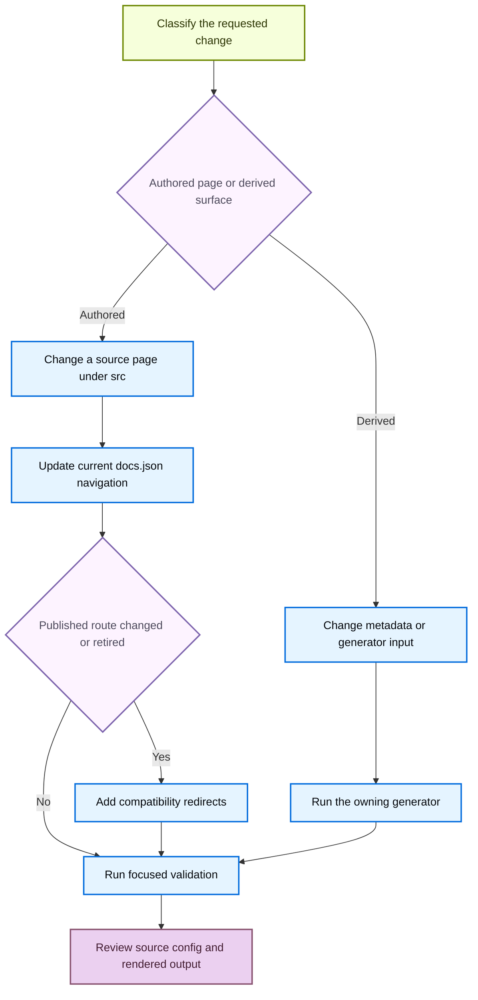

# Adding and Maintaining Documentation Pages

A page change is complete only when its source owner, emitted public route, `src/docs.json` navigation, redirects, and rendered output agree. Manual content belongs under `src/`; never edit `build/`, because a full build removes and recreates it. Change generator inputs, not generated snippets, integration listings, transformed specifications, or deployment-generated endpoints.


```mermaid
flowchart TD
    Start["Classify the requested change"] --> Owner{"Authored page or derived surface"}
    Owner -->|"Authored"| Source["Change a source page under src"]
    Owner -->|"Derived"| Input["Change metadata or generator input"]
    Source --> Nav["Update current docs.json navigation"]
    Input --> Generate["Run the owning generator"]
    Nav --> Route{"Published route changed or retired"}
    Route -->|"Yes"| Redirect["Add compatibility redirects"]
    Route -->|"No"| Check["Run focused validation"]
    Redirect --> Check
    Generate --> Check
    Check --> Review["Review source config and rendered output"]
    classDef process fill:#E5F4FF,stroke:#006DDD,stroke-width:2px,color:#030710
    classDef trigger fill:#F6FFDB,stroke:#6E8900,stroke-width:2px,color:#2E3900
    classDef decision fill:#FDF3FF,stroke:#7E65AE,stroke-width:2px,color:#504B5F
    classDef output fill:#EBD0F0,stroke:#885270,stroke-width:2px,color:#441E33
    class Start trigger
    class Owner,Route decision
    class Source,Input,Nav,Generate,Redirect,Check process
    class Review output
```

This flow separates durable authored input from generated surfaces and makes route compatibility an explicit decision.

## Choose source ownership before choosing a menu

Choose a directory by the page's source family, not by a reader-facing menu label. Navigation labels and source locations intentionally diverge: **No-code agents** is sourced from `src/langsmith/fleet/`, and the Build menu mixes OSS and LangSmith content.

| Source family | Authored location | Emitted public routes | Navigation implication |
| --- | --- | --- | --- |
| Shared OSS | `src/oss/`, outside language-owned subdirectories | `/oss/python/...` and `/oss/javascript/...` | Add the corresponding route in both language menu branches. |
| Language-owned OSS | `src/oss/python/` or `src/oss/javascript/` | Matching language route only | Add one entry in the matching language branch. |
| OpenWiki and Deep Agents Code | `src/oss/openwiki/` or `src/oss/deepagents/code/` | One unversioned `/oss/openwiki/...` or `/oss/deepagents/code/...` route | Add the single emitted route where that product is presented. |
| Ordinary LangSmith | `src/langsmith/` | One `/langsmith/...` route | Place it in the lifecycle or product menu that owns the reader journey. |
| Managed Deep Agents | Direct `src/langsmith/managed-deep-agents*.mdx` files | `/langsmith/python/...` and `/langsmith/javascript/...` | Add matching routes in both Managed Deep Agents language tabs. |

Shared OSS uses one source file, not two copies. Put target-specific material in `:::python` and `:::js` fences. Preprocessing retains the active conditional content and resolves `@[ref]` references. Write ordinary internal OSS links as `/oss/...`; the builder supplies the active language segment.

OpenWiki and Deep Agents Code are exceptions: both remain unversioned and use Python as the conditional-rendering fallback. From versioned OSS content, link to them with `/oss/openwiki/...` or `/oss/deepagents/code/...`, without a language segment; those roots are excluded from OSS link rewriting.

Managed Deep Agents is the opposite exception. Direct matching source files are omitted from ordinary unversioned LangSmith output and emitted for both languages. A bare `/langsmith/managed-deep-agents...` source link follows the target language during a language-targeted build. Existing unversioned URLs are compatibility redirects to Python, so do not create a duplicate unversioned source page.

## Add an authored page and its menu route

`src/docs.json` is the authoritative site configuration for navigation, route declarations, and redirects. Its current navigation hierarchy is `navigation.products[]` → `menu[]`. A menu item may hold direct `pages`, `tabs`, or, under Build, `dropdowns[]` containing `tabs[]`. A `pages` array can mix route strings with nested `{ "group": ..., "pages": [...] }` objects. Find the neighboring route in its actual branch; do not assume that a directory scan or similarly named menu provides discovery.

1. Inspect a nearby source page, then create the `.md` or `.mdx` file under the selected source owner. Include required frontmatter and keep `description` plain text: no Markdown, links, or backticks.
2. Add the extensionless path relative to `src` to the relevant `pages` array. For example, `src/langsmith/sandboxes.mdx` is `langsmith/sandboxes`.
3. Add every navigation entry required by the emitted family: two for shared OSS and Managed Deep Agents, one for language-owned or unversioned content, except where the same unversioned route is deliberately projected in more than one menu location.
4. Put an index route first in a new group. For a page within an existing integration component, update that component's `index.mdx`; change `docs.json` only for a new component group.
5. Before rewording a heading, search for inbound fragment links. The heading slug is a public landing target even when the page route is unchanged.

Navigation can intentionally expose a route through more than one discovery path. For example, `bind-evaluator-to-dataset-link.mdx` is a navigation wrapper whose `url` targets the canonical `bind-evaluator-to-dataset` route. Keep a wrapper and canonical page coherent rather than deleting one merely because their titles overlap.

### Do not over-trust the removed-pages checker

`scripts/check_removed_pages_redirects.py` compares navigation against a base revision, verifies source files for page shapes it extracts, and accepts exact or covering `:path*` redirects for deleted routes. However, its traversal covers direct product pages, legacy tabs, dropdown tabs, and nested groups; it does **not** enter the current `navigation.products[].menu[]` layer. It therefore cannot establish source existence or redirect coverage for routes inside the current menu-shaped navigation.

Use it as an additional guard, not proof that a current menu change is correct. Inspect the exact `menu` branch, build clean output, and run Mint link checks after a route, navigation, or redirect change.

## Move or retire a published page

Start a source-file move with the repository mover in preview mode:

```bash
uv run docs mv src/langsmith/evaluation.mdx src/langsmith/deploy/evaluation.mdx --dry-run
```

The installed `docs` console script dispatches to `pipeline.cli:main`. Its mover scans `src/` Markdown, MDX, and notebook Markdown cells for links resolving to the moved file. If a directory changes, it recalculates relative links within the moved document. Dry-run reports prospective changes without moving or writing; a real invocation appends a move record to `link_changes.jsonl`, relocates the file, then updates its internal links.

The mover does not update public navigation or redirects. After a move or retirement:

1. Update or remove route strings in their actual `docs.json` menu arrays.
2. Search root-relative and fragment references to the old public route or heading.
3. Add a compatibility redirect for every published route that moved or retired, including each language route where applicable.

```json
{ "source": "/langsmith/evaluation", "destination": "/langsmith/deploy/evaluation" }
```

Redirects are top-level `redirects` entries and use site paths. For Managed Deep Agents, preserve or replace legacy unversioned aliases to a Python route, and add redirects for changed Python and JavaScript routes.

```bash
python3 scripts/check_removed_pages_redirects.py --base-ref origin/main src/docs.json
```

## Regenerate surfaces owned by tooling

### Snippets and testable samples

Reusable MDX blocks belong in `src/snippets/` and are imported with `from '/snippets/...'`; the builder rewrites that import form to language-specific snippet copies. Do not substitute Mintlify's `<Snippet file="..." />` form when a language-aware import is needed.

Runnable examples belong in `src/code-samples/`. The code-sample pipeline derives display artifacts below `src/code-samples-generated/` and `src/snippets/code-samples/`; edit and test the runnable source, then regenerate rather than hand-editing derivatives. The MCP overview is an example of the consumption boundary: it imports generated `McpQuickstartPy`, `McpQuickstartJs`, and transport snippets from `/snippets/code-samples/...` rather than embedding a second copy of the programs.

```bash
make test-code-samples FILES="src/code-samples/path/to/sample.py"
make code-snippets
```

The extraction stage recognizes language-specific `:snippet-start:` and `:snippet-end:` marker comments, removes presentation-only `:remove-start:` regions, and writes intermediate files. Generation turns those intermediates into MDX imports. A malformed unclosed marker fails extraction; a test pass validates the executable program, while reviewing regenerated MDX validates the reader-facing excerpt.

### Integration listings and OpenAPI reference

Integration component tables are generated from hosted integration-guide `integration:` frontmatter and external discovery records. External rows use their `docs_url`; the refresh script rejects unsafe URL schemes before rendering. Change the input and run its owning refresh procedure.

`docs.json` `openapi` groups configure Mintlify endpoint generation. Agent Server and LangSmith REST use committed specifications with explicit directories; Control Plane points to a remote specification fetched at deployment. The generated endpoint pages are absent from local build output. Do not create authored MDX endpoints or edit deployment-generated pages to change them.

The LangSmith OpenAPI processor accepts its default remote input only from allow-listed `api.smith.langchain.com`, hides selected operations, normalizes titles, assigns and orders tag groups, and writes a file only with `--write`.

```bash
uv run python scripts/process_langsmith_openapi.py --write
make check-openapi
```

`make check-openapi` builds first and currently runs `mint openapi-check` only for `build/langsmith/agent-server-openapi.json`. Review the generated specification diff and use targeted processor checks when changing the LangSmith REST source.

## Validate the changed contract

Select checks according to the change rather than treating a successful source edit as a route test. For an added, moved, renamed, or retired page, the repository procedure calls for the focused prose lint, a clean build, and an anchor-aware link check:

```bash
make lint_prose FILES="src/path/to/page.mdx"
make build
make broken-links-with-anchors
```

Add the checks that correspond to the input you changed:

1. Run `make check-cross-refs` after modifying `@[...]` references.
2. Run the affected sample, generator, integration refresh, or OpenAPI command after changing its input.
3. Use `make dev` to inspect the rendered result. It performs an initial build before watching `src` and running `mint dev` from `build/`. Inspect both outputs for shared OSS and Managed Deep Agents.
4. For route or non-fragment link changes, `make broken-links` builds, asks Mint to validate redirects and links, and filters known deployment-time OpenAPI and standalone-snippet reports before failing on remaining broken-link output. Use `make broken-links-with-anchors` when anchors changed; it adds anchor validation and also checks redirects.
5. When changing mover, builder, or checker behavior itself, run its focused suite through the Makefile, for example `make test TEST_FILE=tests/unit_tests/tools/test_move_files.py`, `make test TEST_FILE=tests/unit_tests/test_builder.py`, or `make test TEST_FILE=tests/unit_tests/test_check_removed_pages_redirects.py`, as well as the relevant end-to-end command.
6. Review authored source, `src/docs.json`, generator inputs, regenerated artifacts, and rendered routes. A `build/` diff is validation evidence, never the durable change.

## Completion checklist

- [ ] The change is in authored source or a generator input, never `build/` or deployment-generated output.
- [ ] The page has frontmatter with a plain-text description and the required `src/docs.json` navigation update.
- [ ] Navigation lists every required emitted route in the correct current `menu` branch.
- [ ] Moved and retired public URLs, including Managed Deep Agents aliases, redirect to maintained destinations.
- [ ] Snippets, samples, listings, and specifications were regenerated by their owners.
- [ ] Focused checks, a clean build, and appropriate link checks ran.
- [ ] Source configuration and rendered output were reviewed, including manual review of menu navigation.

## See also

- [Source directory map](/openwiki/architecture/source-map.md)
- [Versioning](/openwiki/concepts/versioning.md)
- [CLI tools](/openwiki/operations/cli-tools.md)
- [Testing overview](/openwiki/testing/test-overview.md)
- [Code sample lifecycle](/openwiki/workflows/code-sample-lifecycle.md)
