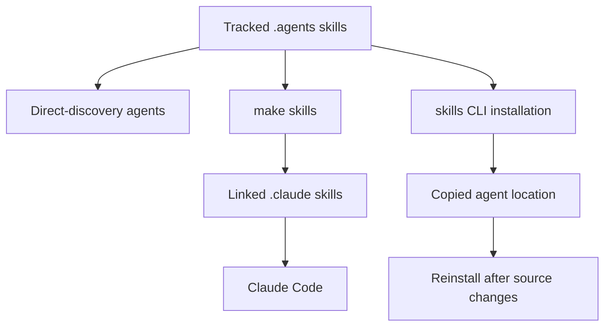

# Agent authoring skills

Repository skills are conditional, task-specific procedures. The tracked `.agents/skills/` tree is the canonical source; repository-wide rules remain in `AGENTS.md`. This boundary keeps global constraints always available while agents load a detailed procedure only when a task calls for it.

## Understand the skill model

A skill is a directory under `.agents/skills/` containing `SKILL.md`. Its [Agent Skills](https://agentskills.io) YAML frontmatter provides a `name` and request-oriented `description`; its Markdown body provides the procedure and may reference supporting files. Agents match the description first and load the body only after invoking the skill. Keep one cohesive workflow per skill, and link to `AGENTS.md` for shared policy rather than copying it.

| Surface | Responsibility |
| --- | --- |
| `AGENTS.md` | Always-on repository rules, including style, frontmatter, navigation, and the Skills catalog. |
| `.agents/skills/<name>/SKILL.md` | A conditional workflow with decisions, commands, verification, and handoff expectations. |
| `.agents/skills/README.md` | The canonical catalog and distribution guidance. |
| `.cursor/rules/docs-style.mdc`, `.github/instructions/docs-style.instructions.md`, `.cursorrules`, and `.github/copilot-instructions.md` | Derived or scoped instruction surfaces for agents that do not consume the full root guide. |

When changing a section covered by a derived instruction surface, update its copies in the same pull request. This requirement does not make the derived files independent policy sources: `AGENTS.md` owns the repository-wide rules. In this checkout, `CLAUDE.md` is only an OpenWiki pointer to `AGENTS.md`, not a second full guide.

## Use the canonical tree and distribution paths

Cursor, Codex, GitHub Copilot, Gemini CLI, OpenCode, Deep Agents, Droid, Kilo Code, and other supported agents read `.agents/skills/` directly. Claude Code reads the gitignored `.claude/skills/` directory instead. Create or reconcile Claude's linked distribution after cloning, pulling a new skill, or renaming one:

```bash
make skills
```

The target creates `.claude/skills/`, links canonical skill directories, preserves an existing personal entry that is not a symlink, and removes stale symlinks. A managed link sees canonical content edits immediately. For an agent that uses another installation path, use the `skills` CLI:

```bash
npx skills add ./.agents/skills --skill '*' --agent <agent> --yes
```

A local-source CLI installation copies files. `npx skills update` does not refresh that copy, so rerun the installation after canonical-source changes or use a symlink.



The canonical tree can reach consumers directly, through live Claude symlinks, or through a copy that requires explicit refresh.

## Choose the narrow procedure

Invoke a skill when the request matches its procedure. Do not use a broad editing workflow to bypass a lifecycle, review, source-verification, or automation-specific requirement.

| Skill | Invoke for | Key boundary or outcome |
| --- | --- | --- |
| `add-docs-page` | Adding, moving, renaming, or deleting a page | Owns navigation, redirects, anchor checks, and page verification; invokes `docs-review` after finished prose. |
| `docs-edit` | Revising an existing page or an open documentation PR | Lands changes on the PR head branch, checks related pages, and reports facts that remain unverified. |
| `docs-restructure` | Consolidating, splitting, or removing content across a page family | Builds a duplication map and assigns one topic owner before delegating page mechanics to `add-docs-page`. |
| `docs-team-voice` | Drafting or revising prose | Supplements Vale with editorial guidance and a focused revision pass. |
| `docs-review` | Reviewing changed documentation | Reviews the source diff, not generated output, and labels merge blockers separately from suggestions. |
| `docs-code-samples` | Moving visible MDX examples into runnable samples | Owns snippet delimiters, executable harnesses, extraction, and sample testing. |
| `verify-against-source` | Checking behavioral, default, signature, or sample claims | Ranks evidence and records both checked evidence and gaps. |
| `docs-tooling-notion` | Recording tracked tooling changes in Docs Team Notion | Routes a topic to one owner page and updates it safely through the Notion MCP server. |
| `submit-integration` | Processing a new structured integration-listing issue | Runs unattended in the integration-submission workflow and leaves changes for CI to open as a PR. |
| `update-integrations-prs` | Updating an existing integration PR | Applies the hosted-guide eligibility policy to an existing contributor branch. |

### Author, restructure, and review docs safely

For a named PR, `docs-edit` requires work on its head branch. It checks that the tree is clean, verifies `HEAD` and its upstream, uses `gh pr checkout` for a cross-repository PR, and prefers `gh pr diff` to a local comparison that may include unrelated commits. Before handoff, inspect related pages, lint changed prose, and run link checks when links, page names, or navigation changed.

`docs-restructure` is for the prior question: whether content belongs on a page at all. Build and report a page-family duplication map before editing, choose one owner per topic, replace duplicated material with a concise pointer, and resolve conflicting facts against implementation source. It hands navigation, redirects, and anchor mechanics to `add-docs-page`.

`add-docs-page` treats those mechanics as part of the page lifecycle. A moved, renamed, or deleted page needs redirects; changing a heading requires checking inbound anchor links. Its normal verification sequence is `make lint_prose`, `make build`, and `make broken-links-with-anchors`, followed by `docs-review` for completed prose.

`docs-review` first resolves whether its target is a PR, branch, working tree, or current branch. It limits review to changed source Markdown or MDX, excludes `build/`, runs Vale, and manually checks MDX locations that Vale does not scan, such as JSX components and table cells. Its report gives every finding its rule and ends with a merge-blocker versus suggestion verdict.

`docs-team-voice` complements the root style guide and Vale. It uses a 13-to-15-word median as a target, asks for review at 25 words and treats 35 as a defect. It directs authors to state conditions before behavior, link first mentions, use exact identifiers, avoid invented examples, then make a targeted revision pass and run `make lint_prose`.

### Keep samples and factual claims testable

`docs-code-samples` places testable samples under `src/code-samples/`, surrounds visible regions with snippet delimiters, and keeps harness-only code in `:remove-start:` blocks. The harness must execute the snippet rather than exit before it. Related Python snippets can share a file, but TypeScript samples must split when duplicate imports or top-level bindings would collide in the shared module scope. Test changed samples before extraction:

```bash
make test-code-samples FILES="src/code-samples/langchain/return-a-string.py"
```

`verify-against-source` ranks evidence from running the full sample, to running a non-credentialed portion, implementation source, installed-package imports, and reference signature lookup. It maps each claim to the product repository that owns it. Record the file and symbol checked, plus unresolved gaps, in the handoff or pull request; a source file alone cannot prove an unobserved UI label, and a Helm value alone cannot establish backend precedence.

### Handle tooling and integrations

A tracked tooling change has a required documentation follow-up. Adding or changing a script, GitHub Actions workflow, Make target, PR check, scheduled job, agent, skill, or MCP server requires invoking `docs-tooling-notion` before handing off the pull request, even if nobody explicitly requested it. The skill routes each topic to exactly one of five Docs Team Notion pages, keeps repository-owned instructions and complete skill procedures in the repository, and requires the Notion MCP fetch and update tools.

Fetch the Notion page before every edit and use narrow `update_content` replacements. Do not rewrite image-bearing pages with `replace_content`; fetch and verify before retrying a timed-out or asynchronous update because it may have already applied. New tracked workflows, scripts, skills, agents, MCP servers, and git hooks also need a single Detailed list discovery row. Query that database first, and update its `Source` value when a tool moves or is renamed.

The integration listing procedures are intentionally separate. `submit-integration` consumes structured issue-form data in an unattended GitHub Actions job only after a maintainer-authorized trigger; it treats issue fields as untrusted, applies the download-threshold policy, leaves working-tree changes uncommitted, and lets the workflow open the PR. `update-integrations-prs` handles the distinct task of rebasing or converting an existing contributor PR.

## Add or change a skill

Create `.agents/skills/<name>/SKILL.md` with a kebab-case directory and matching frontmatter `name`. Provide a nonempty, request-oriented description of at most 1,024 characters, use only supported frontmatter keys, and keep the body focused on one workflow. Validate the canonical tree, not the Claude distribution:

```bash
claude plugin validate .agents/skills --strict
```

The validator does not follow `.claude/skills/` symlinks. A skill-tree change must also update `.agents/skills/README.md` and the `AGENTS.md` Skills table, then complete the required `docs-tooling-notion` follow-up. Update any affected derived instruction surfaces as well, and run `make skills` when Claude Code's linked surface needs reconciliation.

`tests/unit_tests/test_skills.py` is the structural contract for the canonical tree. It verifies each skill has parseable frontmatter, a matching kebab-case name, required and recognized metadata, valid referenced repository paths and Make targets, and an inventory exactly matching both README and `AGENTS.md`. Run the focused check through the normal target:

```bash
make test TEST_FILE=tests/unit_tests/test_skills.py
```

Repair a stale procedure, referenced path, Make target, or catalog rather than weakening this check.

## Reload skills in Deep Agents

The authoring tree describes repository workflows. Separately, Deep Agents runtime skills load once per thread when a checkpointer is configured and remain in agent state. Additions, edits, and deletions do not reach that thread until stored skill metadata is reset. Without a checkpointer, state does not survive between runs, so the next run loads skills again.

Use `None` in Python or `null` in JavaScript to request a reload, not an empty list. An empty list means that sources loaded successfully with no skills and remains the thread's skill set. A changed reload changes the system prompt and invalidates that thread's prompt cache; an identical reload does not. Python loads at the next run, while JavaScript loads before the next model call.

## See also

- [Adding and Modifying Documentation Pages](/openwiki/operations/adding-pages.md)
- [Quickstart](/openwiki/quickstart.md)
- [Testing Overview](/openwiki/testing/test-overview.md)
- [GitHub Actions and CI/CD](/openwiki/integrations/github-actions.md)
