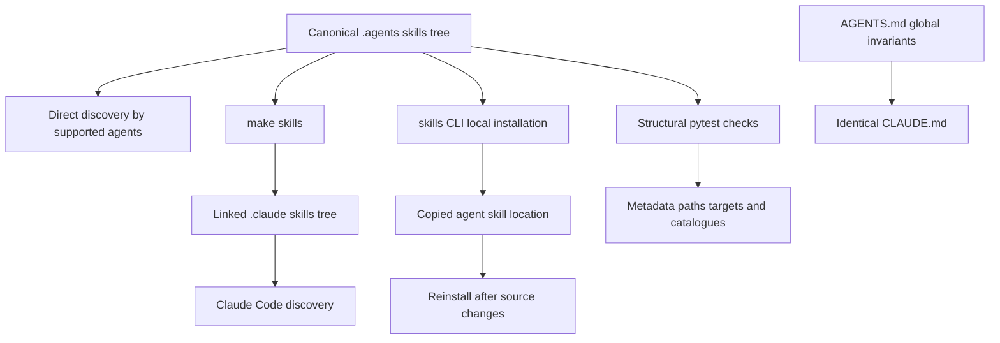

# Agent Authoring Skills

Repository skills are task-specific, on-demand procedures stored in `.agents/skills/`. They make documentation work repeatable without loading every procedure for every task. Repository-wide invariants belong in `AGENTS.md` and `CLAUDE.md`; when their shared guidance changes, the two files must remain identical.

## Understand the source and distribution model

`.agents/skills/` is the canonical tracked skill tree. Each skill is a directory containing `SKILL.md` in the [Agent Skills](https://agentskills.io) format: YAML frontmatter, including a discovery `name` and `description`, followed by Markdown instructions. The directory name and frontmatter `name` identify the same skill.

Cursor, Codex, GitHub Copilot, Gemini CLI, OpenCode, Deep Agents, Droid, Kilo Code, and other supported agents read the canonical tree directly after a clone. Claude Code instead reads `.claude/skills/`, a gitignored local distribution surface. It is not a second source of truth. Create or reconcile that linked surface with:

```bash
make skills
```

The target creates `.claude/skills/` if needed, symlinks each canonical skill directory, preserves a personal entry that already exists and is not a symlink, and removes symlinks whose canonical sources disappeared. Links keep edits to `.agents/skills/` live; run the target after pulling when a skill was added or renamed. For an agent that uses another location, the `skills` CLI copies local-source files. Its update command does not refresh those copies, so reinstall after source changes or use symlinks.



This flow separates the tracked skill source from its linked and copied distribution paths.

### Keep instruction surfaces synchronized

`AGENTS.md` is the global repository guide. `CLAUDE.md` supplies the same guidance for tools that recognize that filename, not an alternative policy source. The `check-agents-sync` workflow runs on pull requests and pushes to `main` when either file changes. It uses `diff` and fails if the files differ.

The root guide also identifies manually maintained derived surfaces:

- `.cursor/rules/docs-style.mdc` and `.github/instructions/docs-style.instructions.md` mirror the style-guide section and are path-scoped to `src/**/*.mdx`.
- `.cursorrules` and `.github/copilot-instructions.md` summarize critical rules, repository structure, quick reference, frontmatter, and syntax.
- `.claude/skills/` distributes links to skills locally; it does not own skill content.

Update every applicable copy in the same pull request. The workflow enforces only the `AGENTS.md`/`CLAUDE.md` equality, so it cannot detect drift in the summaries or scoped style files.

## Keep global rules separate from procedures

Always-on instruction files cost context on every task. A skill exposes its `description` for matching, then loads its body when invoked. Put rules that apply to every edit in `AGENTS.md` and `CLAUDE.md`; put one conditional, multi-step workflow in a skill. Link from skills to shared guidance rather than duplicating it.

| Surface | Owns | Example |
| --- | --- | --- |
| `AGENTS.md` and `CLAUDE.md` | Global constraints and orientation | Source layout, frontmatter rules, navigation, and style guidance. |
| `.agents/skills/<name>/SKILL.md` | A focused task procedure | Editing an existing PR, drafting prose, or updating internal tooling. |
| Scoped or compatibility instructions | A derived view for one agent or file scope | Style rules while editing MDX. |

This boundary prevents duplicated style rules from silently diverging and leaves skills free to specify task ordering, decision points, commands, and reporting.

## Choose the procedure that matches the task

The catalog covers page lifecycle, editing, prose authoring and review, code samples, internal tooling, and integration listings.

| Skill | Use it for | Boundary or handoff |
| --- | --- | --- |
| `add-docs-page` | Adding, moving, renaming, or deleting a page | Updates navigation and redirects, validates the result, then invokes `docs-review` for finished prose. |
| `docs-edit` | Revising an existing page or a page with an open PR | Works on the existing PR branch rather than creating a competing PR. |
| `docs-team-voice` | Drafting or revising prose in the docs team's shared voice | Covers editorial judgment that Vale cannot fully assess. |
| `docs-review` | Reviewing changed documentation prose | Reviews the diff and reports the applicable rule for each finding. |
| `docs-tooling-notion` | Recording changes to team tooling in Notion | Routes a topic to one Notion owner and retains skills as their own authority. |
| `docs-code-samples` | Moving inline MDX examples into external runnable samples | Tests source samples and generates snippet artifacts. |
| `submit-integration` | Creating a listing from a structured integration issue | Runs non-interactively inside the maintainer-gated workflow. |
| `update-integrations-prs` | Reconciling an existing integration PR with policy | Is distinct from new issue intake. |

Deep Agents resolves `submit-integration` from `.agents/skills/` at higher precedence than the former `.deepagents/skills/` location. Its GitHub Actions workflow runs only after a maintainer-authorized label event or manual dispatch, parses the form, supplies the JSON as untrusted metadata, and asks the skill to leave changes uncommitted. The workflow, rather than the skill, handles blockers, failures, and pull-request creation.

## Edit an existing page or pull request in place

Use `docs-edit` when the task names an existing page, branch, or pull request. Its primary invariant is ownership: a wording change for an open PR belongs on that PR's head branch, not on a fresh branch that produces a second PR. Start from a clean working tree, inspect PR metadata, fetch and check out the named head branch, confirm that `HEAD` matches the PR head commit, and verify that the branch has an upstream. For a cross-repository PR, use `gh pr checkout <n>` so the fork remote is configured and confirm that push access exists.

Read the live PR change with `gh pr diff <n>`. This avoids the unrelated changes a stale local `main` or an already-merged base can add to `git diff main...HEAD`. Make only the requested in-place edit: do not restructure, split, or combine pages unless asked, and verify factual prose against its source.

Before handoff, lint changed prose and run the link check when links, navigation, or page names changed:

```bash
make lint_prose FILES="<changed files>"
make broken-links
```

Use `docs-team-voice` while writing and `docs-review` for a diff-scoped review. Report the branch that contains the edit and anything that could not be verified. Do not push or force-push unless requested.

## Write in the docs team's voice

`docs-team-voice` complements, rather than replaces, the root style guide and Vale. The root guide supplies mechanical rules, and `make lint_prose` is the gate. This skill directs the editorial decisions that require reading: information density, rhythm, cross-links, defaults and conditions, concrete examples, exact identifiers, and a deliberate revision pass.

Keep one idea per sentence. The skill uses the repository's 13-to-15-word median as a target, treats 25 words as a cue to split, and treats 35 words as a defect. Link a term on its first mention and avoid repeatedly linking it. State conditions before their behavior and state defaults as direct facts. Backtick exact fields, flags, values, environment variables, and statuses. Use a real example early when it clarifies the topic; cut an unsupported example rather than inventing one.

The revision pass checks long sentences, filler and hedging, vague identifiers, missing or repeated first-mention links, unsupported claims, and unnecessary feature lists or horizontal rules. It then runs:

```bash
make lint_prose FILES="<changed files>"
```

For a review that ties findings to the style guide and scopes them to changed prose, invoke `docs-review` after the edit is finished.

## Document tooling in Notion without duplicating ownership

`docs-tooling-notion` governs internal Notion documentation for a new or changed script, workflow, agent, skill, or MCP server. It requires the Notion MCP server tools `notion-fetch` and `notion-update-page`. The procedure has two ownership rules: every topic has exactly one home among the five Docs Team tooling pages, and repository documentation stays in the repository where people already find it.

Route a topic before writing. The parent **Docs tooling and agents** page owns the page table, owned-elsewhere list, and quick answers. **Docs tech stack** owns production-site architecture; **Local setup and quality gates** owns contributor-run tools and gates; **Docs automation and agents** owns scheduled automation, tracked skills, instruction files, and MCP servers; and **Reference docs** owns API-source and reference-link material. Most new tooling belongs to either Local setup and quality gates or Docs automation and agents. Search the other four pages first; update an existing home instead of creating a duplicate.

A skill remains its own authoritative reference. Name it in Notion and give only the facts needed to decide whether to open it. Do not duplicate the procedure. Do not create Notion copies of repository-owned materials such as `IDE_SETUP.md`, contribution and issue templates, or the navigation map; do not document gitignored tooling as team infrastructure. The release-notes system is also owned elsewhere, so these pages retain only its runbook details.

Fetch the target page before every update. Apply narrow `content_updates` with `command: "update_content"` rather than rewriting the page. Exact stored indentation is required for `old_str`. Never use `replace_content` on a page containing an uploaded image because the fetched signed image URL can break on rewrite. Updates can time out or apply asynchronously, so fetch and verify before retrying. Avoid bold containing mid-sentence inline code, and refer to sections by name because Notion heading-anchor links do not resolve. Finally, update the parent page table or stale See also references, and report both the edited page and deliberately omitted content.

## Add or change a skill safely

Create `.agents/skills/<name>/SKILL.md`. Use a kebab-case verb-noun directory name and make its frontmatter `name` exactly match. Write the `description` in request-oriented language because it is the matching signal. Keep the body to one cohesive workflow; split unrelated tasks rather than adding branches that weaken discovery.

Use only supported frontmatter keys. A description is required and cannot exceed 1,024 characters. Repository paths and `make` targets named in the body must remain valid because an agent can follow stale instructions confidently. Validate the canonical tree, not the Claude symlink surface:

```bash
claude plugin validate .agents/skills --strict
```

The validator does not follow the Claude symlinks. After adding or removing a skill, reconcile the README table and the `AGENTS.md` Skills table. Update `CLAUDE.md` identically whenever its shared `AGENTS.md` guidance changes.

## Validate contracts and diagnose failures

`tests/unit_tests/test_skills.py` checks the canonical tree structurally. It discovers every child directory and requires a `SKILL.md` with parseable frontmatter, a matching kebab-case name, a nonempty bounded description, and only recognized keys. It checks backticked repository paths under known roots and named root files when they are not placeholders, globs, variables, home-directory paths, or gitignored paths. It also verifies that every referenced `make` target is defined and that the README and `AGENTS.md` catalogues equal the set of canonical skill directories.

Run the focused test while changing skills or their catalogues:

```bash
make test TEST_FILE=tests/unit_tests/test_skills.py
```

A frontmatter failure normally identifies a missing `SKILL.md`, malformed YAML, unsupported key, mismatched name, or absent description. A path or target failure means the procedure references a renamed repository interface; repair the skill rather than weakening the check. A catalogue mismatch means direct discovery may still work, but the human-facing or global-instruction inventory is stale. Run `make skills` as well when validating Claude Code distribution.

## See also

- [Quickstart](/openwiki/quickstart.md)
- [Adding and Modifying Documentation Pages](/openwiki/operations/adding-pages.md)
- [Testing Overview](/openwiki/testing/test-overview.md)
- [Integration Listing Automation](/openwiki/workflows/integration-listing-automation.md)
- [GitHub Actions and CI/CD](/openwiki/integrations/github-actions.md)
