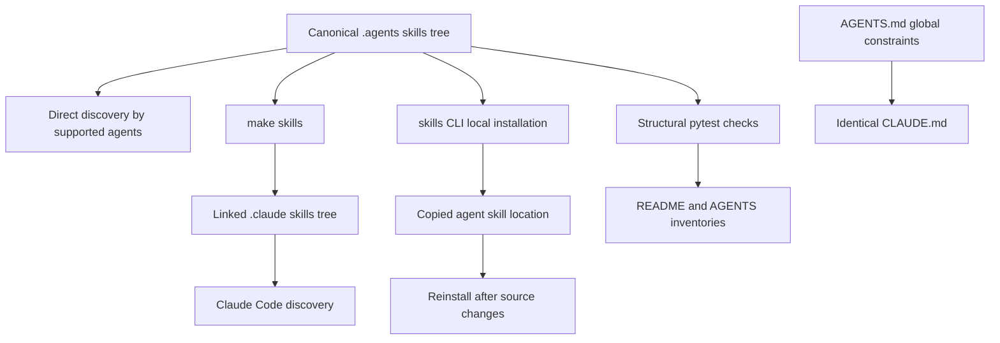

# Agent Authoring Skills

Repository skills are task-specific, on-demand procedures in `.agents/skills/`. They keep multi-step work discoverable without loading every procedure for every task. Treat each `SKILL.md` as the authoritative procedure for its task, and treat `AGENTS.md` and its identical `CLAUDE.md` counterpart as the universal constraints. Do not duplicate either body into this page or into a skill.

## Use the canonical skill tree

`.agents/skills/` is the version-controlled canonical tree. Each skill is a directory with a `SKILL.md` in the [Agent Skills](https://agentskills.io) format: YAML frontmatter containing discovery metadata, followed by Markdown instructions. The directory name and frontmatter `name` are the same skill identifier.

Cursor, Codex, GitHub Copilot, Gemini CLI, OpenCode, Deep Agents, Droid, Kilo Code, and other supported agents read this tree directly after a clone. Claude Code instead reads the gitignored `.claude/skills/` directory. Set up Claude Code, and repeat after pulling an added or renamed skill:

```bash
make skills
```

The target creates `.claude/skills/`, links each canonical skill into it, preserves a personal entry that is not a symlink, and removes a stale symlink. Linked skills reflect edits to `.agents/skills/` immediately. For agents that use another location, the `skills` CLI can copy the canonical tree, but `npx skills update` does not refresh a local source copy. Re-run the local-source installation command after changes, or use symlinks.



This diagram shows the canonical source, its direct, linked, and copied discovery paths, and the separate contracts that guard skills and global instructions.

## Select the procedure before acting

The skill catalog has deliberately narrow task boundaries. Use the matching skill, then read its `SKILL.md` before performing its procedure.

| Skill | Select it for |
| --- | --- |
| `add-docs-page` | Adding, moving, renaming, or deleting a documentation page, including navigation, redirects, and verification. It hands finished prose to `docs-review`. |
| `docs-edit` | Editing an existing page or an open pull request. It is the branch and PR safety entrypoint, including existing branch checkout, fork handling, and diff selection. |
| `docs-team-voice` | Drafting or revising prose in the docs team's voice, including revision choices that linting cannot decide. |
| `docs-review` | Reviewing changed documentation prose in a PR, branch, or working tree after authoring. |
| `docs-code-samples` | Extracting inline MDX code into runnable source samples and generated snippet includes. |
| `docs-tooling-notion` | Deciding whether an internal tooling change belongs in Notion and routing it to its one owning Notion page. |
| `submit-integration` | Processing a new structured integration issue through the unattended GitHub Actions path. |
| `update-integrations-prs` | Maintaining an existing contributor integration PR against the featuring policy. |

This table is selection guidance, not the procedure. In particular, choose `docs-edit` when a request names an open PR or existing branch, and choose `docs-tooling-notion` for Notion routing, then open the selected skill rather than treating this page as a substitute. The two integration skills also have different entrypoints: issue intake uses `submit-integration`; an existing PR uses `update-integrations-prs`.

The unattended integration path is bounded by its workflow. A maintainer-authorized `integration-run` label or manual dispatch starts it; the workflow parses the issue form, supplies the JSON to Deep Agents as untrusted metadata, invokes `submit-integration`, and handles blocker reporting or pull-request creation outside the skill. The skill leaves changes uncommitted and does not push, open a pull request, or comment on GitHub.

For page lifecycle, local setup, test expectations, and CI context, see [Adding and Modifying Documentation Pages](/openwiki/operations/adding-pages.md), [Local Development](/openwiki/workflows/local-development.md), [Testing Overview](/openwiki/testing/test-overview.md), and [GitHub Actions and CI/CD](/openwiki/integrations/github-actions.md).

## Keep ownership boundaries intact

`AGENTS.md` and `CLAUDE.md` are always-on context. Skill descriptions are available for matching, and their bodies load when invoked. Put constraints that apply to every edit in the root guides, and put decisions, tools, sequencing, and verification that only apply to one task in a skill.

| Owner | Appropriate content |
| --- | --- |
| `AGENTS.md` and `CLAUDE.md` | Universal editing rules, navigation orientation, required frontmatter and syntax, and the Skills inventory. |
| `.agents/skills/<name>/SKILL.md` | One focused conditional procedure, its decision points, tool calls, handoffs, and task-specific verification. |
| Scoped or compatibility instruction files | A derived view for a particular agent or file scope. |

Skills link to shared guidance rather than copying it. For example, `add-docs-page` refers to the root guide for navigation, style, and frontmatter while owning the page lifecycle. This limits drift and keeps always-on context small.

`AGENTS.md` is the canonical global guide, and `CLAUDE.md` must remain byte-identical. The `check-agents-sync` workflow runs for pull requests and pushes to `main` that change either file, and fails when `diff` finds a difference. The root guide also identifies derived instruction surfaces: the style guide is mirrored into the path-scoped Cursor and GitHub instruction files, while `.cursorrules` and `.github/copilot-instructions.md` summarize specified root-guide sections. Update a covered copy in the same PR; the CI sync check enforces only the root-file pair.

## Add or change a skill

Create one directory at `.agents/skills/<name>/` containing `SKILL.md`. Use a kebab-case name that exactly matches frontmatter `name`. Make the required `description` request-oriented, because agents use it to recognize relevant work. Keep the body to one cohesive workflow; split unrelated procedures.

Use only supported frontmatter keys. The description must be nonempty and no longer than 1,024 characters. Repository paths and `make` targets named in a skill are part of its executable contract, so keep them current. Validate the canonical path, not Claude's linked distribution directory:

```bash
claude plugin validate .agents/skills --strict
```

The validator does not follow the Claude symlinks. After adding or removing a skill, update both the table in `.agents/skills/README.md` and the Skills table in `AGENTS.md`; then make the identical `CLAUDE.md` update. Personal Claude skills belong outside the canonical repository tree.

## Validate the structural contract

`tests/unit_tests/test_skills.py` discovers each canonical skill directory and verifies the contracts that make procedures safe to discover and execute:

- Every directory has `SKILL.md` with parseable YAML, a matching kebab-case `name`, a required bounded `description`, and no unsupported frontmatter key.
- Backticked repository paths under recognized roots and named root files resolve unless they are recognized placeholders, globs, variables, home-directory paths, or gitignored paths.
- Every referenced `make <target>` exists in the root `Makefile`.
- The skill names in the README and `AGENTS.md` tables exactly match the directories in `.agents/skills/`.

Run the focused contract test while changing skills or their inventories:

```bash
make test TEST_FILE=tests/unit_tests/test_skills.py
```

A frontmatter failure points to malformed metadata, an absent `SKILL.md`, a name mismatch, or an unsupported key. A path or target failure means the procedure points at a removed repository interface; correct the procedure. A catalog mismatch means direct discovery can still work while humans and global instructions advertise stale skills; repair the catalogues in the same change. Run `make skills` as well when checking Claude Code's local distribution.

## See also

- [Quickstart](/openwiki/quickstart.md)
- [Adding and Modifying Documentation Pages](/openwiki/operations/adding-pages.md)
- [Local Development](/openwiki/workflows/local-development.md)
- [Testing Overview](/openwiki/testing/test-overview.md)
- [GitHub Actions and CI/CD](/openwiki/integrations/github-actions.md)
