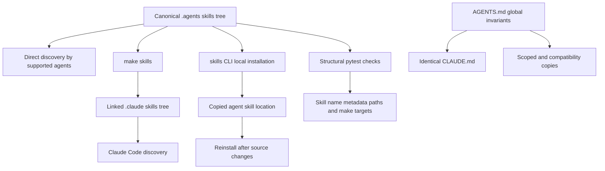

# Agent Authoring Skills

Repository skills are task-specific, on-demand procedures stored in `.agents/skills/`. They make complex documentation work repeatable without putting every procedure into the context of every agent task. Repository-wide invariants belong in `AGENTS.md` and its identical `CLAUDE.md` counterpart; skill bodies link to those rules instead of copying them.

## Understand the source and distribution model

`.agents/skills/` is the canonical, version-controlled skill tree. Each skill is a directory containing `SKILL.md` in the Agent Skills format: YAML frontmatter, including a discovery `name` and `description`, followed by Markdown instructions. The directory name and frontmatter `name` identify the same skill.

Most supported agents discover this tree directly after a clone, including Cursor, Codex, GitHub Copilot, Gemini CLI, OpenCode, and Deep Agents. Claude Code is the exception: it reads `.claude/skills/`, which is gitignored. Run the following command once, and again after a pull that adds or renames a skill:

```bash
make skills
```

The target creates `.claude/skills/` as needed, symlinks each canonical skill directory into it, preserves personal non-symlink entries, and removes a symlink whose source no longer exists. Because the result is a link rather than a copy, edits to `.agents/skills/` are live in Claude Code. For agents with another skill location, the `skills` CLI command copies local files, and its local-source update command does not refresh those copies. Re-run the install command after changes or use symlinks to avoid stale procedures.



This diagram shows canonical skill discovery, the linked and copied distribution paths, and the independent contracts that keep skills and global instructions usable.

### Canonical and derived instruction surfaces

`AGENTS.md` is the canonical repository guide for global invariants: critical editing rules, source layout, frontmatter and syntax conventions, navigation guidance, and the inventory of available skills. `CLAUDE.md` is not an alternative policy source; it must have identical bytes so agents that recognize its filename receive the same rules. The `check-agents-sync` workflow runs for changes to either file on pull requests and pushes to `main`, and fails if `diff` finds a difference.

Several instruction files are derived surfaces for tools that do not consume the root files:

- `.cursor/rules/docs-style.mdc` and `.github/instructions/docs-style.instructions.md` mirror the style-guide portion and apply only to `src/**/*.mdx` edits.
- `.cursorrules` and `.github/copilot-instructions.md` summarize the critical rules, repository structure, quick reference, frontmatter, and syntax for their respective agents.
- `.claude/skills/` is a local linked distribution surface, not a second skill source.

When changing a section that has copies, update all listed copies in the same pull request. The CI sync check only enforces the `AGENTS.md`/`CLAUDE.md` pair; it does not prove that summaries and path-scoped style copies still express the intended rule. Conversely, do not copy global guidance into a skill: an additional copy can drift without this check.

## Keep global invariants separate from procedures

Always-on instruction files consume context for every task. A skill initially exposes its `description` for matching, while its body is loaded when the skill is invoked. Keep universal constraints and orientation in `AGENTS.md`/`CLAUDE.md`, and reserve the body of a skill for one task's decisions, tool use, ordering, and verification.

| Put it in | Content | Example responsibility |
| --- | --- | --- |
| `AGENTS.md` and `CLAUDE.md` | Rules that apply to any edit | Never edit generated `build/` output, preserve required frontmatter, and use the navigation map. |
| `.agents/skills/<name>/SKILL.md` | A focused, conditional workflow | Add or move a page, extract and test a code sample, review changed prose, or process an integration request. |
| A scoped or compatibility instruction copy | A derived view for an agent or file scope | Load prose-style rules only while editing MDX. |

Skills should link back to the root guide for shared rules. For example, `add-docs-page` relies on it for the navigation map, style guide, and frontmatter rules, then adds the page-specific sequence of navigation, redirects, and validation. `docs-review` similarly combines the global style guide with diff-scoped review behavior. This separation keeps universal safety rules consistent while letting a procedure evolve with its specialized workflow.

## Discover and invoke the available procedures

The skill directory currently covers these task boundaries:

| Skill | Use it when | Important handoff or boundary |
| --- | --- | --- |
| `add-docs-page` | Adding, moving, renaming, or deleting pages | Updates navigation and redirects, validates the result, then invokes `docs-review` for finished prose. |
| `docs-review` | Reviewing authored documentation changes | Reviews the changed diff rather than existing prose, and uses Vale plus rules that require human judgment. |
| `docs-code-samples` | Externalizing runnable documentation snippets | Tests source samples before extraction and generates the MDX include artifacts. |
| `document-tooling-in-notion` | Recording changes to team tooling in Notion | Routes a topic to one owning Notion page and treats a skill as its own authoritative reference rather than duplicating it. |
| `submit-integration` | Turning a structured integration issue into listing changes | Runs non-interactively under the maintainer-gated workflow and leaves changes for the workflow to turn into a pull request. |
| `update-integrations-prs` | Reconciling an existing integration PR with policy | Handles the interactive PR-maintenance path, distinct from new issue intake. |

Deep Agents resolves `submit-integration` from `.agents/skills/` at higher precedence than the former `.deepagents/skills/` location. The integration-submission workflow explicitly requests that skill after a maintainer-authorized issue event, passes parsed issue JSON as untrusted metadata, and lets the workflow handle blockers and pull-request creation. That makes the skill body a controlled procedure inside a broader GitHub Actions trust boundary, not a general permission to mutate GitHub.

For the related operational flows, see [Adding and Modifying Documentation Pages](/openwiki/operations/adding-pages.md), [Testing Overview](/openwiki/testing/test-overview.md), [Integration Listing Automation](/openwiki/workflows/integration-listing-automation.md), and [GitHub Actions and CI/CD](/openwiki/integrations/github-actions.md).

## Add or change a skill safely

Create one directory at `.agents/skills/<name>/` with a `SKILL.md`. Use a kebab-case verb-noun directory name and make the frontmatter `name` exactly match it. Write the `description` in the language of a user request because it is the discovery signal; name the task and likely triggers rather than using a broad topic label. Keep the body to one cohesive workflow. Split unrelated procedures rather than building a skill with unrelated branches.

Use supported frontmatter keys only. A description is required and must be no more than 1,024 characters. The body can reference real repository paths and `make` targets, but stale references are operational failures because an agent may follow them confidently. Validate the canonical tree, not the Claude symlink path:

```bash
claude plugin validate .agents/skills --strict
```

The validator does not follow symlinks, so validating `.claude/skills` warns rather than checking the real contracts. After adding or removing a skill, add or remove its row in both `.agents/skills/README.md` and the `AGENTS.md` Skills table. Since `CLAUDE.md` mirrors `AGENTS.md`, update it identically as part of the same change.

## Validate contracts and diagnose failures

`tests/unit_tests/test_skills.py` supplies repository-level structural validation. It discovers every child directory of the canonical tree and checks the following contracts:

- Every skill directory has a `SKILL.md` with parseable YAML frontmatter, a matching kebab-case name, a nonempty bounded description, and no unrecognized frontmatter keys.
- Backticked repository paths under known roots and named root files exist unless they are explicitly recognized placeholders, globs, variable expressions, home-directory paths, or gitignored paths.
- Every `make <target>` mentioned by a skill names a target defined in the root `Makefile`.
- The skills listed in the README table and the `AGENTS.md` Skills table exactly equal the directories present in `.agents/skills/`.

Run the focused test while changing skill contracts:

```bash
make test TEST_FILE=tests/unit_tests/test_skills.py
```

A frontmatter failure usually means a missing `SKILL.md`, mismatched name, malformed YAML, unsupported key, or absent description. A path or make-target failure means the procedure references a renamed or removed repository interface; update the procedure, not the test. A table mismatch means skill discovery may work while the human and global-instruction inventories are stale, so repair the catalogues as part of the same change. Run `make skills` locally when Claude Code distribution also needs verification.

## See also

- [Quickstart](/openwiki/quickstart.md)
- [Adding and Modifying Documentation Pages](/openwiki/operations/adding-pages.md)
- [Testing Overview](/openwiki/testing/test-overview.md)
- [Integration Listing Automation](/openwiki/workflows/integration-listing-automation.md)
- [GitHub Actions and CI/CD](/openwiki/integrations/github-actions.md)
