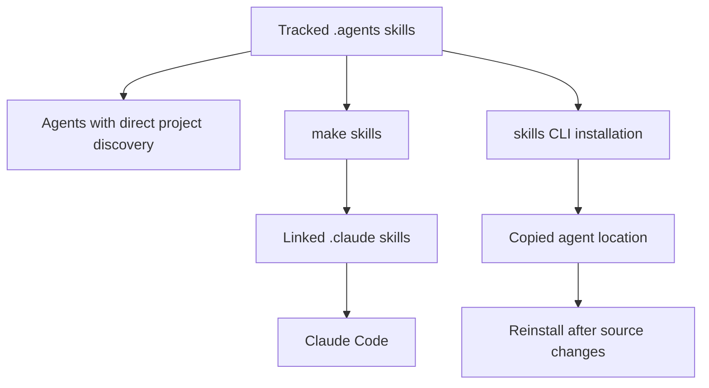

# Agent Authoring Skills

Repository skills are conditional, task-specific procedures. The tracked `.agents/skills/` tree is the source of truth; global rules belong in `AGENTS.md`. This separation lets an agent discover a relevant workflow without loading every procedure for every task.

## Skill model and distribution

A canonical skill is a directory below `.agents/skills/` that contains `SKILL.md`. The file follows the [Agent Skills](https://agentskills.io) format: YAML frontmatter supplies at least `name` and `description`, then Markdown supplies the instructions. A skill may also contain referenced supporting files.

The directory name is the stable skill name. Cursor, Codex, GitHub Copilot, Gemini CLI, OpenCode, Deep Agents, Droid, Kilo Code, and other supported agents read this project tree directly. Claude Code instead reads the gitignored `.claude/skills/` distribution directory. Reconcile that directory after cloning or after a skill is added or renamed:

```bash
make skills
```

The target creates `.claude/skills/`, links each canonical skill, leaves a pre-existing non-symlink personal entry alone, and removes dangling symlinks. A canonical edit is consequently visible through a managed Claude link immediately. The `skills` CLI is an alternative for agents with another destination:

```bash
npx skills add ./.agents/skills --skill '*' --agent <agent> --yes
```

That local-source installation copies files; `npx skills update` does not refresh such a copy. Reinstall after source changes or use a symlink.



This diagram distinguishes the canonical source, a live link distribution, and a copy distribution that can drift.

## Progressive disclosure and ownership boundaries

A description is the discovery surface: agents use it to match a request, then load the full `SKILL.md` when invoking the matching skill. Supporting files are read only when the invoked instructions reference them. Write request-oriented descriptions and keep each skill to one cohesive workflow so selection remains meaningful.

| Surface | Owns | Use it for |
| --- | --- | --- |
| `AGENTS.md` | Repository-wide constraints, style, navigation, and orientation | Rules that apply to every edit. |
| `CLAUDE.md` | An OpenWiki pointer only in this checkout | Direct a Claude-oriented reader to `AGENTS.md`. |
| `.agents/skills/<name>/SKILL.md` | Conditional procedure, choices, tool calls, verification, and handoff | A named multi-step task. |
| Scoped instruction files | Derived agent- or path-specific guidance | Tool-specific context, not an independent policy. |

`AGENTS.md` says it and `CLAUDE.md` should contain identical guidelines, and says which root-guide sections have mirrored Cursor and GitHub instruction surfaces. The current files do not implement that as two equal sources: `CLAUDE.md` contains only an OpenWiki-delimited link to `AGENTS.md`. Treat `AGENTS.md` as the operative guide and do not copy its global guidance into skills.

The repository instructs authors to update the two path-scoped style files and the Cursor and Copilot summaries when their covered root-guide sections change. However, this checkout contains no `check-agents-sync` workflow. The scheduled OpenWiki workflow copies `AGENTS.md` to `CLAUDE.md` after an OpenWiki run and comments that this is for a sync check, but that reference is not evidence of an implemented synchronization gate. Manual synchronization remains an instruction, not a demonstrated enforcement mechanism.

## Choose the narrow workflow

The catalog divides responsibilities rather than providing one general documentation skill.

| Skill | Primary responsibility | Boundary or handoff |
| --- | --- | --- |
| `add-docs-page` | Add, move, rename, or delete pages | Owns navigation, redirects, anchors, and page verification; invokes `docs-review` after completed prose. |
| `docs-edit` | Revise an existing page or open PR | Works on the PR head branch and reports unverified facts. |
| `docs-restructure` | Resolve duplication across a page family | Establishes topic ownership before edit mechanics; delegates lifecycle work to `add-docs-page`. |
| `docs-team-voice` | Draft or revise prose | Supplies editorial judgment beyond Vale. |
| `docs-review` | Review changed documentation | Reviews only the diff and separates merge blockers from suggestions. |
| `docs-code-samples` | Convert inline examples into runnable external samples | Owns tags, extraction, harnesses, and sample testing. |
| `verify-against-source` | Verify behavior, signatures, defaults, and samples | Records evidence and unresolved gaps. |
| `docs-tooling-notion` | Record tracked tooling in the Docs Team Notion system | Routes one topic to one page without duplicating repository procedures. |
| `submit-integration` | Convert a structured integration submission into a listing | Called by the integration-submission workflow. |
| `update-integrations-prs` | Process existing integration PRs against featuring policy | Is distinct from new submission intake. |

The final three skills moved from `.deepagents/skills/`. Deep Agents Code gives `.agents/skills/` higher project-skill precedence, and the integration workflow requests `submit-integration` by name, so no shim is needed.

### Documentation authoring and review

`docs-edit` protects PR ownership. For a named PR, it requires a clean tree, checks out the PR head branch, verifies that `HEAD` and its upstream match the PR, and uses `gh pr checkout` for cross-repository PRs so the fork remote is usable. It prefers `gh pr diff` over a potentially inflated local comparison, then requires changed-prose linting and, when applicable, link checks before handoff.

`docs-restructure` begins with a page-family duplication map, built by searching distinctive content rather than just headings. It reports the map before edits, chooses one owner per topic—usually the page readers would seek and often the more-linked URL—and deletes duplicate content in favor of a concise pointer. Conflicting copies must be resolved against source first. Redirects, navigation, anchors, and lifecycle checks remain `add-docs-page` responsibilities.

`docs-review` resolves a PR, branch, working tree, or current-branch target before reading it. It limits scope to changed source Markdown or MDX and excludes generated `build/` output. Vale is a CI-relevant result, but reviewers also inspect changed JSX and tables where Vale does not scan. Findings identify the applicable rule and end with a blocker-versus-suggestion verdict.

`docs-team-voice` complements the root style guide and Vale. It uses a 13-to-15-word median as a target, flags 25 words for review and 35 as a defect, asks authors to state conditions before behavior, link first mentions, name exact identifiers, and avoid invented examples. Its focused revision pass ends with `make lint_prose`.

### Code samples and fact verification

`docs-code-samples` moves visible MDX code to `src/code-samples/`, marks extractable regions with snippet delimiters, and keeps test-only setup in `:remove-start:` blocks. A harness must execute the visible snippet rather than exiting before it. It favors related snippets in one Python file but requires separately runnable TypeScript files when imports or top-level bindings would collide in the shared module scope. Test a selected file or the suite with `make test-code-samples` before extraction.

`verify-against-source` ranks evidence: run the full sample when possible, run a non-credentialed portion, read implementation source, check the pinned installed package, then use reference signature lookup only for API shape. It maps claims to the owning product repository and requires the PR or handoff to name the checked file and symbol as well as remaining gaps. In particular, a Helm value alone does not establish self-hosted LangSmith precedence; chart and backend evidence can both be needed.

### Tooling records

`docs-tooling-notion` is triggered by tracked scripts, workflows, Make targets, PR checks, scheduled jobs, agents, skills, and MCP servers. It routes each topic to exactly one of five Docs Team Notion pages, searches for an existing owner first, and keeps repository-owned material and full skill procedures out of Notion. It requires the Notion MCP fetch and update tools.

Before every Notion edit, fetch the page and make narrow `update_content` replacements with exact stored indentation. Do not rewrite an image-bearing page with `replace_content`; signed image URLs can be broken. A timeout or asynchronous result may already be applied, so fetch and verify before retrying. For new tracked tooling, query the parent Detailed list database before adding its one discovery row; when a tool moves or is renamed, update that row's `Source` value.

## Add or change a skill safely

Use a kebab-case directory and an identical frontmatter `name`; the test enforces both. Make the `description` a request a user would make, require it, and keep it at or below 1,024 characters. Use only supported frontmatter keys and one focused workflow. Validate the canonical tree, not the Claude distribution:

```bash
claude plugin validate .agents/skills --strict
```

The validator does not follow `.claude/skills/` symlinks. When the tree changes, update both `.agents/skills/README.md` and the `AGENTS.md` Skills table. Also apply the root-guide policy for `CLAUDE.md` and derived instruction surfaces, recognizing that the checkout's structural test does not test those copies.

`tests/unit_tests/test_skills.py` is a structural contract, not a behavior test. It verifies that every skill directory has a parseable `SKILL.md`; its name matches a kebab-case directory; required metadata and known frontmatter keys are valid; referenced checked repository paths and Make targets exist; and the README and `AGENTS.md` inventories exactly equal the canonical tree. Run it through the normal test target:

```bash
make test TEST_FILE=tests/unit_tests/test_skills.py
```

A failure means the agent-facing procedure, its reference, or a catalog has drifted. Repair the procedure or the inventory rather than weakening the check. Run `make skills` if the Claude Code link surface must also reflect a tree change.

## Reloading skills in Deep Agents

The project skill tree describes authoring workflows, while the Deep Agents product documentation describes runtime skill state. With a checkpointer, Deep Agents loads skills once per thread and stores the set in agent state: edits, additions, and deletions do not reach later calls on that thread until stored metadata is reset. Without a checkpointer, state does not survive between runs, so the next run loads skills again.

For a reset, use `None` in Python or `null` in JavaScript—not an empty list, which represents a successfully loaded empty skill set for the rest of the thread. A changed skill set changes the system prompt and invalidates that thread's prompt cache; an identical reload does not. Python reloads at the next run, whereas JavaScript reloads before the next model call. Reload support requires `deepagents>=0.7.16` for Python and `deepagents>=1.14.0` for JavaScript.

## See also

- [Adding and Modifying Documentation Pages](/openwiki/operations/adding-pages.md)
- [Command-line tools](/openwiki/operations/cli-tools.md)
- [Quickstart](/openwiki/quickstart.md)
- [Testing Overview](/openwiki/testing/test-overview.md)
- [Code Sample Lifecycle](/openwiki/workflows/code-sample-lifecycle.md)
- [GitHub Actions and CI/CD](/openwiki/integrations/github-actions.md)
