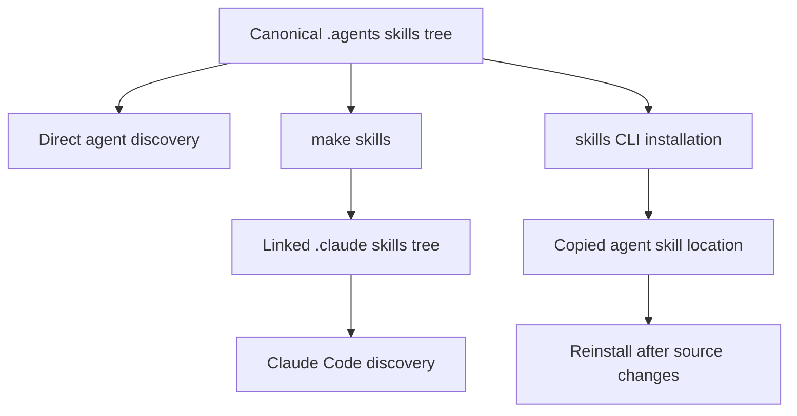

# Agent Authoring Skills

Repository skills are task-specific procedures stored in `.agents/skills/`. They make documentation work repeatable without making every task load every procedure. Repository-wide constraints remain in `AGENTS.md` and its identical compatibility copy, `CLAUDE.md`.

## Understand the skill source and distribution model

`.agents/skills/` is the canonical tracked skill tree. Each skill directory contains a `SKILL.md` in the [Agent Skills](https://agentskills.io) format: YAML frontmatter, including a discovery `name` and `description`, followed by Markdown instructions. The directory name and the frontmatter `name` must agree.

Cursor, Codex, GitHub Copilot, Gemini CLI, OpenCode, Deep Agents, Droid, Kilo Code, and other supported agents discover this canonical tree directly. Claude Code is the exception: it reads the gitignored `.claude/skills/` distribution surface. Create or reconcile that surface with:

```bash
make skills
```

The target creates `.claude/skills/` when necessary, symlinks each canonical skill, preserves a pre-existing personal entry that is not a symlink, and removes a dangling symlink. Because these are links, canonical edits are immediately visible. Run the target after pulling when a skill was added or renamed.

For agents using another skill location, the `skills` CLI can install from the local source:

```bash
npx skills add ./.agents/skills --skill '*' --agent <agent> --yes
```

That installation copies files. `npx skills update` does not refresh a local source copy, so reinstall after source changes or use a symlink.



This flow distinguishes the tracked source from linked Claude Code distribution and copy-based installations.

## Keep global instructions separate and synchronized

`AGENTS.md` is the authoritative global guide. `CLAUDE.md` contains the same guidance for tools that recognize that filename; it is not an alternative policy source. The `check-agents-sync` workflow runs for pull requests and pushes to `main` when either file changes, and fails when `diff` finds a difference.

The root guide also identifies derived instruction surfaces that require manual synchronization in the same pull request:

- `.cursor/rules/docs-style.mdc` and `.github/instructions/docs-style.instructions.md` mirror the style guide through product and feature capitalization. Both are scoped to `src/**/*.mdx`.
- `.cursorrules` and `.github/copilot-instructions.md` summarize critical rules, repository structure, quick reference, frontmatter, and syntax.
- `.claude/skills/` distributes local links but never owns skill content.

The workflow enforces only equality between `AGENTS.md` and `CLAUDE.md`. It does not detect drift in the scoped style files or the compatibility summaries.

This synchronization rule follows the ownership boundary:

| Surface | Owns | Load behavior |
| --- | --- | --- |
| `AGENTS.md` and `CLAUDE.md` | Rules and orientation that apply to every task | Always-on context. |
| `.agents/skills/<name>/SKILL.md` | One conditional, multi-step workflow | The `description` is used for matching; the body loads when invoked. |
| Scoped and compatibility instruction files | A derived view for one agent or file scope | Depends on the consuming tool and path. |

Keep shared invariants in the root guides, then link to them from a skill. A copied style guide creates another independently drifting instruction surface. Skills should instead provide task order, decisions, tool calls, verification, and handoff reporting that only their matching task needs.

## Select the matching procedure

The catalog covers page lifecycle, in-place editing, page-family restructuring, drafting and reviewing prose, external code samples, internal tooling records, source verification, and integration listing workflows.

| Skill | Use it for | Important boundary or handoff |
| --- | --- | --- |
| `add-docs-page` | Adding, moving, renaming, or deleting a page | Updates navigation and redirects, runs page checks, then invokes `docs-review` on finished prose. |
| `docs-edit` | Revising an existing page or a page with an open PR | Keeps work on the PR head branch and hands unverified facts forward explicitly. |
| `docs-restructure` | Consolidating, splitting, retiring, or moving content across a page family | Builds a duplication map and assigns one owner per topic before edits. |
| `docs-team-voice` | Drafting or revising prose | Supplies editorial guidance that Vale cannot decide. |
| `docs-review` | Reviewing changed prose | Reviews the diff, not pre-existing prose, and distinguishes blockers from suggestions. |
| `docs-code-samples` | Moving inline examples to runnable samples | Owns sample extraction and testing mechanics. |
| `verify-against-source` | Checking a sample, signature, default, or behavior claim | Establishes evidence and reports remaining verification gaps. |
| `docs-tooling-notion` | Recording team tooling changes in Notion | Routes the topic to one Notion owner without duplicating repository procedures. |
| `submit-integration` | Creating a listing from a structured integration issue | Is invoked by the integration-submission workflow. |
| `update-integrations-prs` | Reconciling an existing integration PR with featuring policy | Is separate from new integration intake. |

Use the narrowest skill that owns the decision. For example, `docs-edit` owns a single page or PR branch, whereas `docs-restructure` first asks whether content belongs on that page at all. When a change produces factual product prose, hand the fact-checking portion to `verify-against-source`; a style review cannot establish runtime behavior.

## Preserve pull-request ownership and review only the change

`docs-edit` prevents a common failure: an edit requested on an existing PR is made on a new branch, creating a competing PR. Start with a clean tree. For a named PR, inspect its metadata, fetch and check out its head branch, confirm `HEAD` matches the PR head commit, and confirm an upstream exists. For a cross-repository PR, use `gh pr checkout <n>` so the fork remote is configured and verify push access.

Read the live PR diff with `gh pr diff <n>`. It avoids unrelated commits that a stale local `main` or a branch which previously merged `main` can include in `git diff main...HEAD`. Make the requested in-place change, rather than restructuring or combining pages without a request. Before handoff, lint changed prose and check links when links, page names, or navigation changed:

```bash
make lint_prose FILES="<changed files>"
make broken-links
```

`docs-review` accepts a PR, branch, or working tree. It resolves the target before inspection, scopes itself to changed `src/**/*.mdx` or `src/**/*.md` files, and excludes generated `build/` content. Vale output is a CI-relevant result, but the skill also checks changed JSX and table content that Vale does not scan, then applies only clearly relevant root style-guide rules. Its report groups findings by file, names the violated rule, and ends by separating merge blockers from suggestions.

## Restructure a page family before changing its prose

Use `docs-restructure` when a request spans page boundaries or a page keeps growing despite revisions. It establishes the page family from navigation and siblings, inventories headings, and searches for distinctive terms rather than only matching headings. The resulting duplication map is the decision artifact: it identifies topics that already have a home and documents disagreements between copies before an edit silently chooses one.

Assign one owner per topic, preferring a page readers would search for and, when merging pages, the better-linked URL. Delete duplicate sections and leave a concise pointer to the owner; move only content with no established home. Resolve conflicting facts against source before deletion. For page lifecycle mechanics, anchor stability, redirects, and navigation updates, hand off to `add-docs-page`. Finish with lint, build and anchor checks, redirect validation, a diff-scoped review, and a per-page report of deletions, moves, additions, and before/after line counts.

## Verify behavior against the owning source

`verify-against-source` exists because structural and prose checks cannot prove that a default, API signature, precedence rule, or code sample is true. Published documentation, a README, and recollection are secondary sources. Prefer evidence created in the current session, using the strongest reachable rung:

1. Run the full sample with `make test-code-samples` when credentials permit.
2. Run the part that requires no model or API key in a scratch script.
3. Read the implementation source, using GitHub API content or code search to locate it.
4. Confirm an installed import against the repository-pinned package version.
5. Use the reference MCP signature lookup only for API shape, not runtime behavior.

The skill maps products to their owning repositories, including private LangSmith platform and Agent Server repositories that remain accessible through `gh` with suitable credentials. A self-hosted LangSmith statement can require both Helm chart and backend evidence: the chart supplies a value, but backend code establishes precedence and behavior.

Verify the branch that produces the claimed behavior, not merely a settings table or a similarly named symbol. Record the checked file and symbol in the PR description or handoff. State gaps, such as an unobserved UI label, a model-dependent test that CI has not run, or a moving beta API, rather than retaining an unverified assertion. `docs-edit` and `docs-restructure` use this handoff when their work encounters conflicting or new factual prose.

## Apply the writing and Notion procedures

`docs-team-voice` complements the root style guide and Vale. It targets a 13-to-15-word median sentence, treats 25 words as a prompt to split, and treats 35 words as a defect. It directs authors to link first mentions, state conditions before behavior, write defaults as facts, use exact backticked identifiers, and omit invented examples. Its revision pass looks for long sentences, filler, vague identifiers, link mistakes, unsupported claims, and unnecessary feature lists or horizontal rules before running `make lint_prose`.

`docs-tooling-notion` makes shipping a script, workflow, Make target, PR check, scheduled job, agent, skill, or MCP server a documentation trigger. It routes each topic to exactly one of five Docs Team Notion pages, searches the other pages before adding content, and keeps repository-owned documents and full skill procedures in the repository. A new tooling record also needs a non-duplicated Detailed list database row.

For each Notion edit, fetch the target page first and use narrow `update_content` replacements. `old_str` must preserve stored indentation. Do not use `replace_content` on a page with uploaded images, because rewriting fetched signed image URLs can break them. A timeout or asynchronous update may already have applied, so fetch and verify before retrying. The procedure also avoids bold mixed with mid-sentence inline code and heading-anchor links that Notion cannot resolve.

## Add or change a skill safely

Create `.agents/skills/<name>/SKILL.md` with a kebab-case directory and matching `name`. Write a request-oriented description because discovery uses it, and keep the body to one cohesive workflow. Use supported frontmatter keys; a description is mandatory and limited to 1,024 characters. Validate the canonical tree rather than Claude Code links:

```bash
claude plugin validate .agents/skills --strict
```

The validator does not follow the Claude symlinks. When the tree changes, update the `.agents/skills/README.md` catalog and the `AGENTS.md` Skills table, then make the identical `CLAUDE.md` change and update every derived instruction surface whose mirrored root section changed.

The focused contract test validates every canonical skill's frontmatter and supported keys, matching kebab-case names, bounded descriptions, referenced repository paths, referenced Make targets, and equality between the tree and both catalogues:

```bash
make test TEST_FILE=tests/unit_tests/test_skills.py
```

A failure identifies a stale agent-facing contract: malformed metadata, a missing path or target, or an inventory that no longer describes direct discovery. Repair the skill or its catalogue rather than weakening the check. Run `make skills` when Claude Code distribution also needs verification.

## See also

- [Adding and Modifying Documentation Pages](/openwiki/operations/adding-pages.md)
- [Quickstart](/openwiki/quickstart.md)
- [Testing Overview](/openwiki/testing/test-overview.md)
- [Code Sample Lifecycle](/openwiki/workflows/code-sample-lifecycle.md)
- [GitHub Actions and CI/CD](/openwiki/integrations/github-actions.md)
