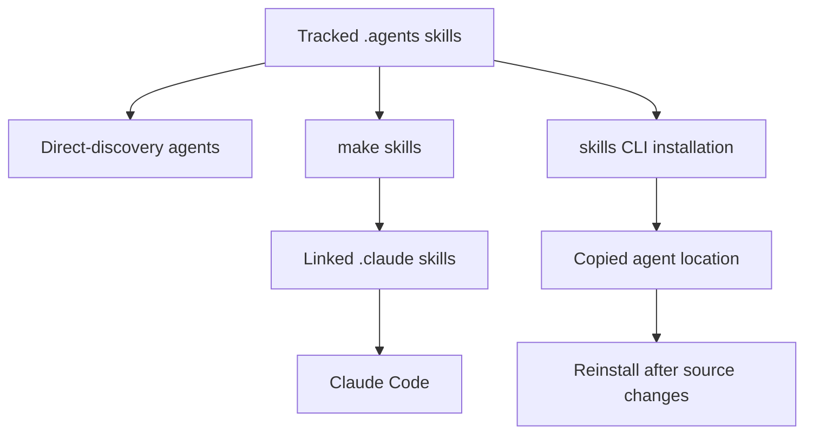

# Agent Authoring Skills

Repository skills are conditional, task-specific procedures. The tracked `.agents/skills/` tree is the canonical source, while `AGENTS.md` owns repository-wide rules. This boundary makes global constraints available for every task and loads detailed procedure only when the task needs it. In this checkout, `CLAUDE.md` is an OpenWiki-delimited pointer to `AGENTS.md`, rather than a second repository guide.

## Separate global rules from procedures

A skill is a directory under `.agents/skills/` containing `SKILL.md`. Its [Agent Skills](https://agentskills.io) YAML frontmatter provides a `name` and request-oriented `description`; its Markdown body supplies the procedure and may reference supporting files. Descriptions are the discovery surface. An agent matches the description first and loads the full body when it invokes the skill.

| Surface | Responsibility |
| --- | --- |
| `AGENTS.md` | Always-on invariants, including style, frontmatter, navigation, and the Skills catalog. |
| `.agents/skills/<name>/SKILL.md` | Conditional workflow with decisions, commands, verification, and handoff expectations. |
| `.agents/skills/README.md` | Canonical catalog, distribution instructions, and guidance for adding skills. |
| `.cursor/rules/docs-style.mdc`, `.github/instructions/docs-style.instructions.md`, `.cursorrules`, and `.github/copilot-instructions.md` | Derived or scoped instruction surfaces for agents that do not consume the whole root guide. |

Keep one cohesive workflow in each skill. Link to `AGENTS.md` for shared policy instead of copying rules such as style or navigation into skills. When a change affects a section represented in a derived instruction surface, update its copies in the same pull request. Those files remain derived surfaces, not independent policy sources.

## Distribute the canonical tree

Cursor, Codex, GitHub Copilot, Gemini CLI, OpenCode, Deep Agents, Droid, Kilo Code, and other supported agents discover `.agents/skills/` directly. Claude Code instead reads the gitignored `.claude/skills/` directory. Reconcile its linked distribution after cloning, pulling a new skill, or renaming one:

```bash
make skills
```

The target creates `.claude/skills/`, symlinks every canonical skill directory, preserves a pre-existing personal entry that is not a symlink, and removes stale symlinks. A managed link sees canonical edits immediately.

For an agent that needs another location, install from the local tree with the `skills` CLI:

```bash
npx skills add ./.agents/skills --skill '*' --agent <agent> --yes
```

This local-source installation copies files. `npx skills update` does not refresh that copy, so rerun the installation after source changes or use a symlink.


```mermaid
flowchart TD
  Canonical["Tracked .agents skills"] --> Direct["Direct-discovery agents"]
  Canonical --> Make["make skills"]
  Make --> Claude["Linked .claude skills"]
  Claude --> ClaudeCode["Claude Code"]
  Canonical --> CLI["skills CLI installation"]
  CLI --> Copy["Copied agent location"]
  Copy --> Refresh["Reinstall after source changes"]
```

This diagram shows the canonical skill tree's direct, symlinked, and copied distribution paths.

## Select the narrow workflow

Invoke a skill when the request matches its procedure. Do not use broad editing guidance to bypass a page lifecycle, review, source-verification, or automation-specific requirement.

| Skill | Use it for | Boundary or outcome |
| --- | --- | --- |
| `add-docs-page` | Adding, moving, renaming, or deleting a page | Owns navigation, redirects, anchor checks, and page verification; invokes `docs-review` after finished prose. |
| `docs-edit` | Revising an existing page or documentation PR | Lands edits on the PR head branch, checks related pages, and reports facts that remain unverified. |
| `docs-restructure` | Consolidating, splitting, or removing a page family | Builds a duplication map and assigns one owner per topic before passing page mechanics to `add-docs-page`. |
| `docs-team-voice` | Drafting or revising prose | Supplements Vale and the global style guide with editorial guidance and a revision pass. |
| `docs-review` | Reviewing changed documentation | Reviews source diffs rather than generated output and distinguishes merge blockers from suggestions. |
| `docs-code-samples` | Moving visible MDX examples into runnable samples | Owns snippet delimiters, executable harnesses, extraction, and sample testing. |
| `verify-against-source` | Checking behavioral, default, signature, or sample claims | Ranks available evidence and records both checked evidence and gaps. |
| `docs-tooling-notion` | Recording tracked tooling changes in Docs Team Notion | Routes a topic to one owner page and updates it safely through Notion MCP. |
| `submit-integration` | Processing a new structured integration-listing issue | Runs unattended in the integration-submission workflow and leaves changes for CI to turn into a pull request. |
| `update-integrations-prs` | Updating an existing integration pull request | Applies the hosted-guide eligibility policy to an existing contributor branch. |

### Edit, restructure, and review safely

For a named PR, `docs-edit` requires work on its head branch. It checks for a clean tree, verifies `HEAD` and its upstream, uses `gh pr checkout` for a cross-repository PR, and prefers `gh pr diff` to a local comparison that may include unrelated commits. Before handoff, inspect related pages, lint changed prose, and check links when links, page names, or navigation changed.

`docs-restructure` answers the prior question: whether content belongs on a page at all. Build and report a page-family duplication map before editing, choose one owner per topic, replace duplicate material with a concise pointer, and resolve conflicting facts against source. It delegates navigation, redirects, and anchor mechanics to `add-docs-page`.

`add-docs-page` treats those mechanics as page lifecycle requirements. A moved, renamed, or deleted page needs redirects; changing a heading requires checking inbound anchor links. Its verification sequence is `make lint_prose`, `make build`, and `make broken-links-with-anchors`, followed by `docs-review` for completed prose.

`docs-review` resolves whether its target is a PR, branch, working tree, or current branch before inspection. It limits review to changed source Markdown or MDX, excludes `build/`, runs Vale, checks MDX areas Vale misses such as JSX components and table cells, and reports each finding with its rule and merge-blocking status.

`docs-team-voice` complements the root style guide and Vale. It targets a 13-to-15-word median sentence length, calls for review at 25 words, treats 35 words as a defect, directs authors to state conditions before behavior and link first mentions, requires exact identifiers and verified examples, and ends with a targeted revision pass and `make lint_prose`.

### Keep examples and claims testable

`docs-code-samples` places testable samples under `src/code-samples/`, surrounds visible regions with snippet delimiters, and keeps harness-only code in `:remove-start:` blocks. The harness must execute the snippet rather than exit before it. Related Python snippets can share a file, but TypeScript samples must split when shared module-scope imports or bindings would collide. Test changed samples before extraction:

```bash
make test-code-samples FILES="src/code-samples/langchain/return-a-string.py"
```

`verify-against-source` ranks evidence from running a full sample, through running its non-credentialed portion, implementation source, installed-package imports, and reference signature lookup. It maps every claim to the product repository that owns it. Record the checked file and symbol plus unresolved gaps in the handoff or pull request: source alone cannot prove an unobserved UI label, and a Helm value alone cannot establish backend precedence.

### Complete tracked-tooling and integration work

Changing tracked tooling has a mandatory documentation follow-up. Adding or changing a script, GitHub Actions workflow, Make target, PR check, scheduled job, agent, skill, or MCP server requires `docs-tooling-notion` before PR handoff, whether or not the request mentioned it. The skill routes each topic to exactly one of five Docs Team Notion pages, keeps repository-owned instructions and complete skill procedures in the repository, and requires the Notion MCP fetch and update tools.

Fetch the Notion page before every edit and use narrow `update_content` replacements. Do not rewrite image-bearing pages with `replace_content`. Fetch and verify before retrying a timed-out or asynchronous update because it may already have applied. New workflows, scripts, skills, agents, MCP servers, and git hooks also need one Detailed list discovery row. Query that database first, and update a row's `Source` value when a tool moves or is renamed.

The integration procedures are deliberately separate. The integration-submission workflow runs its agent only on manual dispatch or a maintainer-applied `integration-run` label. It parses the issue form to JSON, gives it to `submit-integration` as untrusted listing metadata, requires uncommitted working-tree changes, and opens the resulting pull request after the agent finishes. `update-integrations-prs` instead handles an existing contributor PR.

## Add or change a skill

Create `.agents/skills/<name>/SKILL.md` with a kebab-case directory and matching frontmatter `name`. Provide a nonempty, request-oriented description of no more than 1,024 characters, use only supported frontmatter keys, and keep the body focused on one workflow. Validate the canonical tree, not the Claude distribution:

```bash
claude plugin validate .agents/skills --strict
```

The validator does not follow `.claude/skills/` symlinks. A skill-tree change must update `.agents/skills/README.md` and the `AGENTS.md` Skills table, then complete the required `docs-tooling-notion` follow-up. Update affected derived instruction surfaces too, and run `make skills` when Claude Code's linked surface needs reconciliation.

`tests/unit_tests/test_skills.py` is the canonical-tree structural contract. It validates each skill's parseable frontmatter, matching kebab-case name, required and recognized metadata, referenced repository paths, referenced Make targets, and exact agreement between the tree and the README and `AGENTS.md` inventories. Run the focused test through the normal target:

```bash
make test TEST_FILE=tests/unit_tests/test_skills.py
```

Repair a stale procedure, referenced path, Make target, or catalog rather than weakening the contract.

## Reload runtime skills in Deep Agents

The authoring tree defines repository workflows. Separately, Deep Agents runtime skills load once per thread when a checkpointer is configured and persist in agent state. Additions, edits, and deletions do not reach that thread until stored skill metadata is reset. Without a checkpointer, state does not survive between runs, so the next run loads skills again.

Use `None` in Python or `null` in JavaScript to request a reload, not an empty list. An empty list means sources loaded successfully with no skills and remains the thread's skill set. A changed reload updates the system prompt and invalidates the thread's prompt cache; an identical reload does not. Python loads at the next run, while JavaScript loads before the next model call.

## See also

- [Adding and Modifying Documentation Pages](/openwiki/operations/adding-pages.md)
- [Quickstart](/openwiki/quickstart.md)
- [Testing Overview](/openwiki/testing/test-overview.md)
- [GitHub Actions and CI/CD](/openwiki/integrations/github-actions.md)
