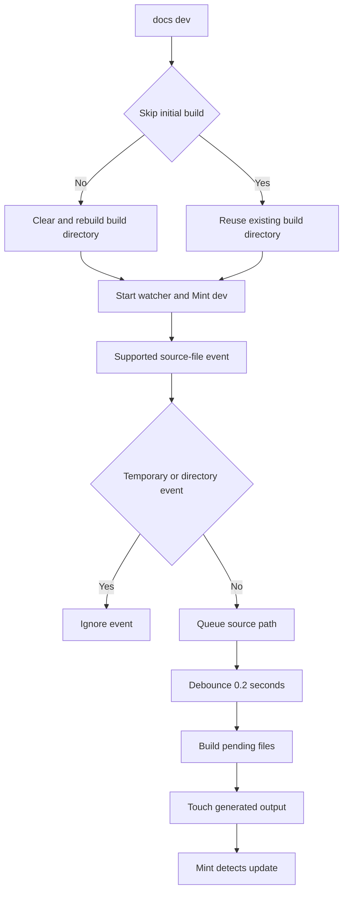

# CLI Tools and Make Targets

This repository has two contributor-facing layers: the `docs` Python CLI owns documentation build, preview, migration, and link-aware move behavior; Make supplies checkout-friendly setup, validation, sample, export, and skills targets. Author in `src/`, not `build/`: the latter is disposable Mintlify input regenerated by the pipeline.

## Entry points and setup

The project registers `docs = "pipeline.cli:main"`. From a checkout, use `uv run pipeline <command>`; after installation, `docs <command>` invokes the same CLI. `make dev` and `make build` run `npm install`, set `PYTHONPATH=$(CURDIR)`, and invoke the Python command.

```bash
make install
make build
make dev
uv run pipeline migrate legacy/guide.md --dry-run
uv run pipeline mv old.mdx new.mdx --dry-run
```

`make install` synchronizes all uv dependency groups, installs local npm dependencies and the global Mint CLI, then runs `make skills`. Mint is an npm global binary, separate from the Python CLI. The CLI logs consistently to stderr as `LEVELNAME - message`; `make help` prints the maintained target list.

## Generated-output boundary: rebuilding versus validation

A target with `: build` is **not** a validator of a pre-existing tree: because `build` is phony, it performs a clean rebuild first. `make broken-links`, `make broken-links-with-anchors`, `make check-openapi`, and `make export` therefore validate fresh output. `make export-htmltest` runs export and then htmltest.

Conversely, `make htmltest` does **not** build or export. It validates the already-existing `EXPORT_ZIP` archive (default `build/export.zip`). Source checks such as `make test`, `make lint*`, `make check-cross-refs`, `make code-snippets`, and sample targets also do not build the site. This distinction matters when diagnosing a failure: use a rebuild-owning target for current generated routes, but do not infer that an existing archive or a source-only check represents a fresh Mint build.

| Boundary | Commands | What they read or produce | Main failure boundary |
| --- | --- | --- | --- |
| Clean generated site | `make build`, `docs build` | Replaces `build/` from `src/` | Missing `src/` or build processing failure |
| Preview | `make dev`, `docs dev` | Initial full build unless skipped, then incremental output | Initial build, watcher, or global `mint` process |
| Fresh generated-tree checks | `make broken-links*`, `make check-openapi`, `make export` | Rebuild `build/` before invoking Mint | Mint availability and checker/export requirements |
| Existing export archive | `make htmltest` | Unpacks `EXPORT_ZIP` | Missing archive, `htmltest`, or `unzip` |
| Source and tooling checks | `make test`, `make lint*`, `make check-cross-refs` | Source and test/tool state; no site build | Tool availability and the checked source contract |
| Generated snippets and live samples | `make code-snippets`, `make test-code-samples`, `make update-code-sample-traces` | Snippet trees, live programs, optionally trace manifest | Markers, language tools, credentials, services, or tracing |

## Build and local preview

### `make build` / `docs build`

Use a full build after changes to navigation, routing, shared files, generated snippets, deletions, or whenever output may be stale:

```bash
make build
# Direct CLI equivalent
uv run pipeline build
```

`docs build` requires `src/`, creates `build/` if necessary, and delegates to `DocumentationBuilder`. A full `build_all()` deletes and recreates `build/`, emits versioned and unversioned documentation, copies shared files and npm snippet components, and generates LLM artifacts. Thus it is the clean reset for generated output; hand edits in `build/` are lost.

Although the argument parser accepts `docs build --watch`, the build command does not consume the option: it builds once and exits. Use development mode for supported watching.

### `make dev` / `docs dev`

Development mode normally full-builds, creates a watcher for `src/`, and starts `mint dev --port 3000` in `build/`. `--skip-build` deliberately reuses an existing tree and merely warns if `build/` is absent. It is appropriate after a brief interruption, not after a whole-tree change.



This shows why an incremental preview is not a replacement for the clean build: it processes queued files rather than rerunning the full-tree generation lifecycle.

The watcher ignores directories, editor backups ending in `~`, `.bak`, or `.orig`, and hidden temporary files ending in `.tmp`, `.temp`, or `.swp`. It asynchronously batches pending supported files for 0.2 seconds, builds them, and touches output for Mint reload. If the initial build fails, dev returns 1 before starting services. After startup, Mint output is forwarded to logging; a nonzero Mint exit or an unexpectedly stopped watcher fails the command. Ctrl+C shuts down the watcher and terminates Mint, escalating to kill after five seconds; a missing `mint` executable returns 1 with installation guidance.

## Migration and source refactoring

These commands operate on the supplied source paths, not `build/`. Prefer `--dry-run`, review output, then make the real change.

### `docs migrate <path>` and `docs migrate-docusaurus <path>`

`migrate` handles MkDocs-oriented `.md`, `.markdown`, and `.ipynb` paths; directories are searched recursively. `migrate-docusaurus` additionally accepts `.mdx` and applies Docusaurus component and frontmatter conversion. Both parse content into Mintlify-oriented Markdown, remove `.md`/`.mdx` suffixes from relative links, print converted text for `--dry-run`, or create output parents and write results.

```bash
uv run pipeline migrate legacy/ --output converted/
uv run pipeline migrate-docusaurus legacy/guide.mdx --dry-run
```

With directory `--output`, the relative layout is retained; ordinary conversion writes `.md`, while Docusaurus `.mdx` remains `.mdx`. Without `--output`, Markdown keeps its extension. A successful in-place notebook conversion writes a sibling `.md` and deletes the original `.ipynb`. Missing input exits 1. A `ParseError` is reported without a traceback, processing continues for other batch files, and the summary records successes and failures; unexpected exceptions include traceback context.

### `docs mv <old_path> <new_path>`

Run the mover from this Git repository when relocating a document with relative links:

```bash
uv run pipeline mv src/langsmith/evaluation.mdx src/langsmith/deploy/evaluation.mdx --dry-run
```

It finds the Git root, scans `.md`, `.mdx`, and notebook Markdown beneath `<root>/src`, rewrites inbound relative links while preserving anchors, and recalculates internal links in the moved Markdown/MDX file or notebook. Dry run previews without writes. A real run creates destination parents, appends absolute old/new paths to root-level `link_changes.jsonl`, rewrites inbound links, moves the file, and updates links inside it. It does not update navigation, redirects, or arbitrary prose references; reconcile those authored surfaces and run a built-site check afterwards.

## Make target reference

| Target | Behavior and output ownership | Use it when |
| --- | --- | --- |
| `make clean` | Removes `build/` and Python cache artifacts. | Discard generated and Python cache state. |
| `make broken-links` | **Rebuilds**, then runs `mint broken-links --check-redirects` in `build/`. | Validate current generated routes, links, and redirects. |
| `make broken-links-with-anchors` | **Rebuilds**, then also passes `--check-anchors`. | Headings or fragment links changed. |
| `make check-openapi` | **Rebuilds**, then validates `build/langsmith/agent-server-openapi.json` with Mint. | Agent Server OpenAPI input changed. |
| `make export` | **Rebuilds**, then writes a Mint export archive from `build/`. | Produce a fresh offline export. |
| `make htmltest` | Validates an existing archive only; unpacks it to `HTMLTEST_UNPACK_DIR`. | Check external URLs in a prior export. |
| `make test` | Runs pytest with sockets disabled except Unix sockets; `TEST_FILE` defaults to `tests/unit_tests`. | Pipeline and script behavior. |
| `make lint`, `make format`, `make format-check` | Respectively check, modify, or check Python formatting/lint/type/spelling state. | Python or tooling changes. |
| `make lint_md`, `make lint_md_fix`, `make lint_prose` | Lint Markdown, apply Markdown fixes, or install/use pinned Vale. | Markdown and prose changes. |
| `make check-cross-refs` | Checks source `@[ref]` references without building Mint output. | Cross-reference changes. |
| `make skills` | Links canonical agent skills into `.claude/skills/`. | Claude Code setup or a skills-tree change. |

Mint link checks filter full standalone snippet report sections, deployment-only OpenAPI paths, and selected known false positives; they fail only when filtered output still contains indented reported entries. The anchor variant supplies its filtering mode too. See [Mintlify Integration](/openwiki/integrations/mintlify.md) for why local output cannot contain every deployment-generated route.

`make export` requires a Mint CLI supporting `mint export`, Node below 25 (the documented supported LTS choices are 20 or 22), and an Enterprise Mintlify plan. `make htmltest` requires `htmltest`, `unzip`, and an existing archive. Its configuration checks external URLs only, so it does not replace Mint route or anchor validation.

Focused inputs avoid unnecessarily broad checks: `TEST_FILE` narrows pytest, `FILES` narrows executable samples, and `lint_prose` uses `FILES` when supplied or `src/` otherwise.

## Code samples, snippets, and traces

`make code-snippets` owns a two-stage generated pipeline:

```text
src/code-samples/ -- extraction --> src/code-samples-generated/ -- MDX generation --> src/snippets/code-samples/
```

Extraction runs first. It accepts marked Python, TypeScript, Java, Kotlin, Go, and shell samples; a full extraction clears prior generated supported files, while `CODE_SNIPPET_SOURCES` selects only space-separated eligible source files beneath `src/code-samples/` and clears only their previous outputs. Invalid, out-of-root, missing, or unsupported selections fail. Generation then writes importable MDX from extracted files. Treat both downstream trees as generated: edit samples and rerun the target rather than hand-editing output.

`make test-code-samples` runs all eligible samples or focused `FILES="path ..."`. The runner preserves the caller environment for credentials and services and dispatches Python via `uv`, TypeScript via `npx tsx`, Go via `go run`, shell via `bash`, and Java/Kotlin via JBang with Java 21. Ordinary failures fail the target. A persistent LangSmith rate limit is retried three times and then recorded as skipped, so a successful result with skips is not proof that every example executed.

`make update-code-sample-traces` enables `CODE_SAMPLE_TRACING=1`, defaults `LANGSMITH_PROJECT` to `docs-code-samples`, runs the selected samples, then regenerates MDX. It requires `LANGSMITH_API_KEY` to publish trace links. For each successful single-snippet sample, collection seeks an agent-like LangSmith root run, shares it publicly, and records it in `src/code-samples/trace-links.json`. Files with no or multiple snippet markers do not receive a link; a trace-collection failure fails the sample run. This command can publish public URLs: use deliberate credentials and review the manifest diff.

For marker conventions and sample authoring, use the `docs-code-samples` skill. See [Agent Authoring Skills](/openwiki/operations/agent-skills.md) for skill discovery and the canonical skill tree.

## Focused validation sequence

Select the smallest command that establishes the contract, then add a full rebuild when a change crosses generated-tree boundaries:

1. For a source-only pipeline or watcher regression, run `make test TEST_FILE=tests/unit_tests/test_watcher.py`.
2. For an `@[ref]` edit, run `make check-cross-refs`; it is distinct from Mint link checks.
3. For a runnable example, use `make test-code-samples FILES="path ..."`, accounting for live provider and service dependencies.
4. After a route, navigation, redirect, snippet, or reference change, run `make broken-links-with-anchors`; it rebuilds first.
5. Use `make export-htmltest` only for its separate external-resource coverage.

See [Local Development Workflow](/openwiki/workflows/local-development.md), [Mintlify Integration](/openwiki/integrations/mintlify.md), [Cross References](/openwiki/operations/cross-references.md), and [Testing Overview](/openwiki/testing/test-overview.md) for setup and wider validation guidance.
