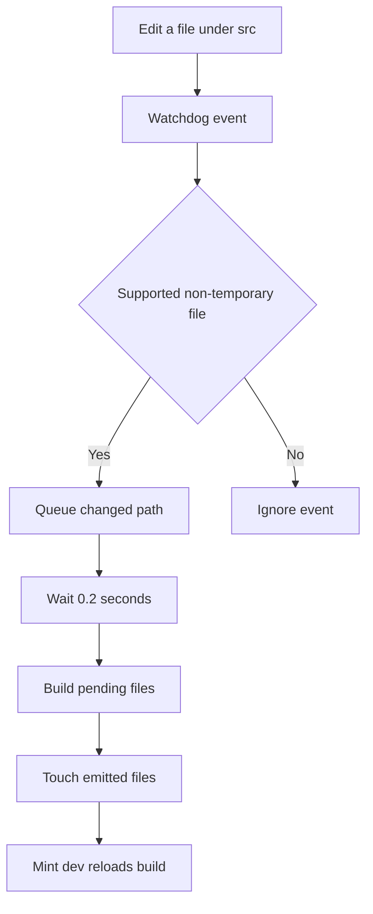

# Documentation CLI Tools

The contributor command surface has two layers: Make targets provide repository-aware setup, build, lint, validation, and sample workflows; the Python CLI provides the documentation build, development server, migration, and safe file-move operations. Author content and configuration in `src/`; `build/` is regenerated output for Mintlify and must never be edited.

## Start with the right entry point

The project script `docs = "pipeline.cli:main"` installs the `docs` command. The package module entry point calls the same `main`, so use either `uv run pipeline <command>` from a checkout or `uv run docs <command>`/`docs <command>` when the script is available. `make dev` and `make build` additionally run `npm install`, set `PYTHONPATH` to the repository root, and invoke the module form.

```bash
make install                 # first-time Python, Node, and Mint CLI setup
make dev                     # edit-preview loop
make build                   # clean generated documentation tree
uv run pipeline migrate path/to/docs --dry-run
uv run pipeline mv old.mdx new.mdx --dry-run
```

`make install` runs `uv sync --all-groups`, `npm install`, and `npm install -g mint@latest`. Mint is a separate global npm executable: it is not bundled in the Python CLI. Use `make help` to print the maintained target list.

## Build and preview commands

### `make dev` / `docs dev`

Use development mode while editing `src/`. Without `--skip-build`, it performs a **full** build first; a failed initial build returns exit code 1 and does not start Mint. It then watches `src/` recursively and runs `mint dev --port 3000` with `build/` as its working directory. Browse <http://localhost:3000>.



This flow shows the focused rebuild path used after the initial full build in development mode.

`--skip-build` only skips that initial full build and reuses the existing `build/` directory. It is useful after interruption, but merely warns—not fails—when the directory is absent. Do not use it to avoid rebuilding after structural changes; run a normal development start or `make build` first.

The watcher accepts the builder's supported content and asset extensions, ignores directories, backup suffixes (`~`, `.bak`, `.orig`), and hidden temporary names ending in `.tmp`, `.temp`, or `.swp`. Events are coalesced for 0.2 seconds; changed paths are built incrementally, and output files are touched so Mint observes the update. A deleted source removes its corresponding output when present.

The development command forwards Mint stdout as info logs and stderr as error logs. It waits for either the watcher or Mint process: a nonzero Mint exit or an unexpected watcher stop fails the command. On interruption it stops the watcher, terminates Mint, waits up to five seconds, then kills the process if necessary. If `mint` cannot be found, it returns 1 and recommends installation.

### `make build` / `docs build`

Use a build for a reproducible, whole-tree result before site checks, after navigation/configuration changes, or whenever stale output is suspected:

```bash
make build
# equivalent CLI operation
uv run pipeline build
```

The command requires `src/`, creates `build/` as needed, then calls `DocumentationBuilder.build_all()`. The builder clears and recreates `build/` before producing language-versioned and unversioned content and copying shared inputs. Consequently, a successful full build is the reset operation for stale artifacts, and any local modification under `build/` is discarded.

Although argument parsing exposes `docs build --watch`, the build implementation does not read that argument; it still performs one full build and exits. Use `docs dev` for supported file watching.

## Migration and refactoring commands

These commands modify the path supplied to them (unless previewed or directed elsewhere). Run `--dry-run` first and review the output or diff. They are conversion/refactoring tools, not normal authoring operations for the repository's generated `build/` tree.

### `docs migrate <path>`

`migrate` converts MkDocs-oriented `.md`, `.markdown`, and `.ipynb` files. A file path is processed directly; a directory is searched recursively. For Markdown it uses `to_mint()`; for notebooks it first converts the notebook to Markdown. It then removes `.md` and `.mdx` suffixes from relative Markdown links while preserving external, mail, absolute, and in-page links.

```bash
# inspect one conversion without writing
uv run pipeline migrate legacy/guide.md --dry-run

# convert a directory while retaining its relative layout below the output directory
uv run pipeline migrate legacy/ --output converted/

# in-place conversion
uv run pipeline migrate legacy/
```

`--dry-run` prints a header and converted content to stdout instead of writing. With `--output`, a directory input preserves relative paths below the output directory and emits `.md` names; a single-file input writes exactly to the supplied output path. Without `--output`, Markdown retains its extension, while an in-place `.ipynb` conversion writes a sibling `.md` and deletes the original notebook only after successful processing.

### `docs migrate-docusaurus <path>`

`migrate-docusaurus` has the same path, preview, output, and notebook behavior, adding `.mdx` to directory discovery. It sends Markdown/MDX (or converted notebook Markdown) through `convert_docusaurus_to_mintlify()`, which handles Docusaurus-specific constructs and emits Mintlify-compatible frontmatter before relative-link suffix cleanup. For a directory sent to `--output`, Docusaurus `.mdx` files retain `.mdx`; other discovered formats become `.md`.

For either migration, a missing input path exits with code 1. A `ParseError` is logged without a full traceback, processing continues with later files, and a multi-file run reports successful and failed counts. Other unexpected per-file errors are logged with a traceback and likewise count as failures.

### `docs mv <old_path> <new_path>`

Use the mover from within this Git repository when relocating a source document with relative Markdown links:

```bash
uv run pipeline mv src/langsmith/evaluation.mdx src/langsmith/deploy/evaluation.mdx --dry-run
uv run pipeline mv src/langsmith/evaluation.mdx src/langsmith/deploy/evaluation.mdx
```

The command locates the Git root and treats `<root>/src` as the documentation root. It scans `.md` and `.mdx` files plus Markdown cells in `.ipynb` notebooks, rewrites relative links that resolve to the moved file, preserves anchors, moves the file, and recalculates links inside the moved Markdown/MDX file or notebook for its new parent directory. It skips external, `mailto:`, and in-page-only links; the scan does not cover `.markdown` files.

A dry run reports both inbound and internal-link changes without writing or moving. A real run rewrites links before moving, creates destination parents, appends `[old_path, new_path]` to `link_changes.jsonl` at the Git root, moves the file, then updates its internal links. It does not update `src/docs.json`, published-route redirects, or arbitrary textual references: update those authored configuration surfaces and inspect the diff separately.

## Make target catalog

| Target | Inputs and action | When to use |
| --- | --- | --- |
| `make install` | Synchronizes all uv groups, installs local npm dependencies, and globally installs Mint. | Initial setup or dependency reset. |
| `make dev` | Runs npm installation and `uv run pipeline dev`. | Continuous edit/preview loop. |
| `make build` | Runs npm installation and a full pipeline build into `build/`. | Clean whole-site output. |
| `make clean` | Deletes `build/`, Python bytecode, and `__pycache__` directories. | Remove disposable local artifacts; rebuild afterward. |
| `make broken-links` | Builds, runs `mint broken-links` from `build/`, and filters known deployment/snippet noise. | Route or link changes without fragment changes. |
| `make broken-links-with-anchors` | As above, with `mint broken-links --check-anchors`. | Links that add or alter anchors. |
| `make check-openapi` | Builds and runs `mint openapi-check langsmith/agent-server-openapi.json` from `build/`. | Agent Server OpenAPI changes. |
| `make export` | Builds then runs `mint export` from `build/`. `MINT_EXPORT_ARGS` passes extra export arguments. | Offline Mintlify export on an eligible plan and Node version. |
| `make htmltest` | Unpacks `EXPORT_ZIP` (default `build/export.zip`) and runs htmltest using `htmltest-mint-export.yml`; `HTMLTEST_UNPACK_DIR` and `HTMLTEST_ARGS` are configurable. | External-link validation of an already exported archive. |
| `make export-htmltest` | Runs export then htmltest sequentially. | One-shot offline export and external-link check. |
| `make check-cross-refs` | Checks source `@[ref]` references. | API cross-reference changes. |
| `make test` | Runs pytest with socket isolation. Set `TEST_FILE` (default `tests/unit_tests`) for focused tests. | Pipeline or script behavior changes. |
| `make test-code-samples` | Optionally installs `src/code-samples` npm dependencies, then runs sample programs. Set `FILES="path ..."` for a focused subset. | Changes beneath `src/code-samples/`. |
| `make code-snippets` | Extracts marked sample regions, then generates MDX snippet files. | After changing `:snippet-start:` sample regions; do not hand-edit its generated outputs. |
| `make lint` / `make format` / `make format-check` | Check Python formatting, Ruff, typing, and spelling; apply formatting; or check formatting without applying. | Python/tooling changes. |
| `make lint_md` / `make lint_md_fix` | Run markdownlint over `src` Markdown/MDX, or apply its fixes. | Markdown style changes. |
| `make lint_prose` | Installs the pinned Vale binary and lints `FILES` when set, otherwise `src/`. | Prose changes. |

`make broken-links` and its anchor variant require a global `mint` binary. They run it from `build/`, not the repository root, because Mint would otherwise parse unrelated files such as a virtual environment. The wrapper deliberately filters reports for deployment-generated OpenAPI areas and standalone snippets; it fails only when actionable reported link lines remain. Use the anchor variant for fragments. These checks establish generated-site link behavior; `make check-cross-refs` is a separate source-level validation.

`make export` checks for `mint export` support and rejects Node 25 or later; it requires Node LTS 20 or 22 and an Enterprise Mintlify plan. `make htmltest` requires `htmltest`, `unzip`, and an existing archive. Its configuration checks external URLs only because Mint exports omit pages, so it is not a substitute for the built-site link checks.

## Code snippet generation boundary

`make code-snippets` runs two scripts in order. `scripts/extract_code_snippets.py` scans supported source files under `src/code-samples/` for comment-line `:snippet-start:`/`:snippet-end:` markers, strips nested `:remove-start:` regions, dedents bodies, and writes Bluehawk-compatible extracted files to `src/code-samples-generated/`. It supports Python, TypeScript, Java, Kotlin, Go, shell, and Bash marker forms.

A full extraction first deletes extracted files with supported code extensions. For a focused update, set `CODE_SNIPPET_SOURCES` to space-separated repository-relative eligible files below `src/code-samples/`; only prior outputs for those source stems are replaced. Invalid paths, paths outside that root, unsupported extensions, or unclosed snippet/remove regions make extraction fail.

`scripts/generate_code_snippet_mdx.py` reads the extracted files and writes importable MDX to `src/snippets/code-samples/`. It recognizes optional tab and fence-modifier markers, and can expand recognized Deep Agents Python or TypeScript model strings into Mintlify `<CodeGroup>` variants. These outputs are generated source inputs: change the source sample and rerun the target rather than patching the generated files.

## Focused versus full operations

Use the narrowest command that proves the change, then run a full build for changes that affect generated structure:

- **One source edit while previewing:** keep `make dev` running; its watcher does focused, debounced file builds.
- **Navigation, route, shared preprocessing, or suspected stale output:** run `make build`; it clears and regenerates the complete tree.
- **A moved source page:** preview with `docs mv ... --dry-run`, run it, then update `src/docs.json` and redirects and run `make broken-links-with-anchors` if links/fragments changed.
- **A changed `@[ref]`:** run `make check-cross-refs`, independent of built-site link checking.
- **A pipeline/builder/watcher change:** run a focused pytest path such as `make test TEST_FILE=tests/unit_tests/test_watcher.py`, then the relevant broader suite.
- **A code-sample change:** pass only affected paths through `FILES` before a full sample run when appropriate; sample execution may require toolchains, credentials, or services.

See [Mintlify Integration](/openwiki/integrations/mintlify.md) for renderer/export boundaries, [Adding and Modifying Documentation Pages](/openwiki/operations/adding-pages.md) for routes and redirects, [Testing Overview](/openwiki/testing/test-overview.md) for validation scope, and [Local Development Workflow](/openwiki/workflows/local-development.md) for setup and the edit loop.
