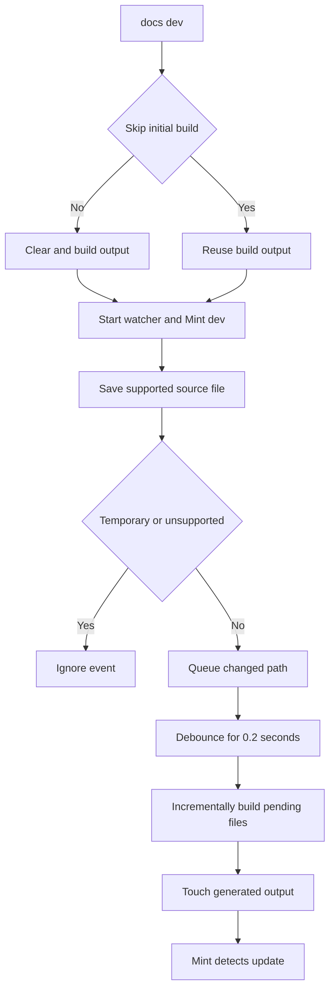

# Documentation CLI Tools

The repository has two command layers. Make targets are the normal checkout-facing interface for setup, building, validation, sample workflows, and skill linking. The Python CLI supplies the underlying documentation build, preview, migration, and link-aware move operations. Author in `src/`; `build/` is disposable Mintlify input generated by the pipeline and must not be edited.

## Entry points and operational boundaries

The project registers `docs = "pipeline.cli:main"`. From a checkout, use the canonical module invocation `uv run pipeline <command>`; after installation, `docs <command>` invokes the same entry point. `make dev` and `make build` install local npm dependencies, set the repository on `PYTHONPATH`, and call the module CLI.

```bash
make install
make dev
make build
uv run pipeline migrate legacy/guide.md --dry-run
uv run pipeline mv old.mdx new.mdx --dry-run
```

`make install` runs `uv sync --all-groups`, `npm install`, and `npm install -g mint@latest`. The Mint CLI is a global npm tool outside the Python package. Run `make help` for the maintained target list.

### Local, deterministic commands versus external dependencies

| Boundary | Commands | Operational expectation |
| --- | --- | --- |
| Local pipeline and source checks | `uv run pipeline build`, `make test`, `make check-cross-refs`, `make code-snippets`, `make lint*` | Operate on the checkout and tool dependencies. `make test` disables network sockets except Unix sockets. |
| Local preview or Mint validation | `make dev`, `make broken-links*`, `make check-openapi`, `make export` | Require the separately installed global `mint`; preview also requires a local port. Export additionally requires a Mint plan and supported Node version. |
| Executable samples | `make test-code-samples` | Runs real programs and may require language toolchains, provider credentials, network access, or local services. |
| Trace publication | `make update-code-sample-traces` | Executes samples with LangSmith tracing, queries and publicly shares runs, and requires `LANGSMITH_API_KEY`. |

## Build and preview

### `make build` / `docs build`

Use a full build before generated-site checks and after navigation, routing, shared preprocessing, deletions, or suspected stale output:

```bash
make build
# direct CLI equivalent
uv run pipeline build
```

The command requires `src/` and calls `DocumentationBuilder.build_all()`. That operation deletes and recreates `build/`, emits language-versioned and unversioned documentation, copies shared files and snippet components, and generates LLM artifacts. A full build is therefore the clean reset for generated output; changes made under `build/` are intentionally lost.

Although parsing accepts `docs build --watch`, the build implementation ignores the option and exits after one build. Use `docs dev` for watching.

### `make dev` / `docs dev`

Development mode normally performs the full build first, then recursively watches `src/` and runs `mint dev --port 3000` with `build/` as its working directory. Open <http://localhost:3000>. `--skip-build` reuses an existing `build/` tree and only warns if it is missing; use it after a brief interruption, not after structural changes.



This watcher lifecycle distinguishes the clean initial build from focused updates used by the local preview.

The watcher ignores directories, editor backups ending in `~`, `.bak`, or `.orig`, and hidden temporary files ending in `.tmp`, `.temp`, or `.swp`. It batches supported changes for 0.2 seconds, builds changed paths asynchronously, and touches emitted output for Mint reload. A source deletion removes its source-relative output when present, but incremental work does not rerun the full routing, shared-file, npm-overlay, or LLM-output process—run `make build` to reconcile whole-tree output.

If the initial build fails, development mode returns 1 without starting services. Once started, Mint stdout is forwarded as info and stderr as error; a nonzero Mint exit or an unexpected watcher stop fails the command. Ctrl+C shuts down the watcher and terminates Mint, killing it after five seconds if necessary. A missing `mint` executable returns 1 with installation guidance.

## Migration and source refactoring

Migration and move commands modify the supplied source paths, not the generated `build/` tree. Preview with `--dry-run`, then inspect the diff.

### `docs migrate <path>` and `docs migrate-docusaurus <path>`

`migrate` processes MkDocs-oriented `.md`, `.markdown`, and `.ipynb` files; directory inputs are recursive. `migrate-docusaurus` adds `.mdx` and converts Docusaurus components and frontmatter. Both convert notebooks through Markdown, remove relative Markdown link suffixes, support stdout preview and `--output`, and continue batch processing after parse failures while reporting totals.

```bash
uv run pipeline migrate legacy/ --output converted/
uv run pipeline migrate-docusaurus legacy/guide.mdx --dry-run
```

For directory output, relative layout is preserved; MkDocs conversion emits `.md`, while Docusaurus `.mdx` remains `.mdx`. Without `--output`, Markdown retains its extension. A successful in-place notebook conversion writes a sibling `.md` and removes the original `.ipynb`. Missing input exits 1. `ParseError` messages are logged without a full traceback; unexpected errors are logged with traceback context.

### `docs mv <old_path> <new_path>`

Run the mover inside this Git repository when relocating a source document with relative links:

```bash
uv run pipeline mv src/langsmith/evaluation.mdx src/langsmith/deploy/evaluation.mdx --dry-run
```

It finds the Git root, scans Markdown, MDX, and notebook Markdown cells beneath `src`, updates inbound relative links while preserving anchors, and recalculates internal relative links in the moved file. The dry run writes nothing. A real run creates destination parents, records absolute old/new paths in root-level `link_changes.jsonl`, rewrites inbound links, moves the document, then updates its internal links. It does not update navigation, redirects, or arbitrary textual references; update those authored surfaces separately and run a generated-site link check.

## Make target reference

| Target | Action and output ownership | Use it when |
| --- | --- | --- |
| `make clean` | Removes `build/` and Python cache artifacts. | Discard local generated artifacts. |
| `make broken-links` | Builds, then runs `mint broken-links` from `build/`; filters known deployment/OpenAPI and standalone-snippet noise. | Check generated routes and links. |
| `make broken-links-with-anchors` | The same generated-tree check with `--check-anchors`. | A change affects fragments or headings. |
| `make check-openapi` | Builds, then calls `mint openapi-check` from `build/`. | Agent Server OpenAPI changes. |
| `make export` / `make htmltest` | Export writes a Mint archive; htmltest unpacks `EXPORT_ZIP` and checks it with configurable paths and flags. | External-link checking of an eligible offline export. |
| `make test` | Runs pytest with socket isolation; `TEST_FILE` defaults to `tests/unit_tests`. | Pipeline and script behavior; narrow with `TEST_FILE`. |
| `make lint`, `make format`, `make format-check` | Check or change Python formatting/lint/type/spelling state. | Tooling or Python changes. |
| `make lint_md`, `make lint_md_fix`, `make lint_prose` | Markdownlint or apply Markdown fixes; Vale installs its pinned binary and checks `FILES` or `src/`. | Markdown and prose changes. |
| `make check-cross-refs` | Checks source `@[ref]` references independently of Mint. | Cross-reference changes. |
| `make skills` | Links canonical skills to `.claude/skills/`; it preserves personal non-link entries and removes stale links. | Claude Code setup or after skills change. |

`make broken-links*`, `check-openapi`, and export commands require global Mint. Raw Mint operations must run in `build/`, which is why the wrappers build first and change directory. `make export` requires a Mint CLI that supports `mint export`, Node below 25, and an Enterprise Mintlify plan. `make htmltest` additionally requires `htmltest`, `unzip`, and an existing archive; its configuration checks external URLs only, so it does not replace built-site navigation validation.

## Code samples, snippets, and traces

`make code-snippets` is a deterministic generation pipeline with two owned output trees:

```text
src/code-samples/ -- extraction --> src/code-samples-generated/ -- MDX generation --> src/snippets/code-samples/
```

Extraction reads marked `.py`, `.ts`, `.java`, `.kt`, `.go`, and `.sh` samples. It extracts `:snippet-start:`/`:snippet-end:` bodies, removes nested `:remove-start:` regions, dedents content, and writes Bluehawk-compatible files. A full run removes prior supported extracted files. `CODE_SNIPPET_SOURCES` accepts only space-separated eligible files below `src/code-samples/` and replaces outputs for those sources; invalid, unsupported, or out-of-root inputs fail.

Generation reads extracted snippets and writes importable MDX. It consumes optional code-group tab and fence-modifier markers, can expand recognized Deep Agents Python or TypeScript model strings into provider `<CodeGroup>` variants, and appends a trace card when the trace manifest has a URL. Both `src/code-samples-generated/` and `src/snippets/code-samples/` are generated artifacts: edit samples and rerun the target rather than hand-editing either tree.

`make test-code-samples` runs all eligible source samples or a focused space-separated `FILES` selection. It preserves the caller environment and dispatches Python through `uv`, TypeScript through `npx tsx`, Go through `go run`, shell through `bash`, and Java/Kotlin through JBang with Java 21. Each sample has a configurable `CODE_SAMPLE_TIMEOUT_SECONDS` timeout (default 1200 seconds). Ordinary failures fail the command; persistent LangSmith API rate limits are retried three times and then reported as skipped, so a successful exit with skips does not prove every live example executed.

`make update-code-sample-traces` first executes selected samples with `CODE_SAMPLE_TRACING=1`, defaults `LANGSMITH_PROJECT` to `docs-code-samples`, then regenerates snippets. The runner enables `LANGSMITH_TRACING`; trace collection polls LangSmith for an agent-like root run, creates or reuses a public share URL, and writes metadata to `src/code-samples/trace-links.json`. Only source files with exactly one snippet can receive a trace link. Files with no marker or multiple snippets are skipped; a trace-collection error after a successful sample fails the run. This command can publish public links, so run it deliberately with appropriate credentials and review the manifest diff.

For marker conventions, sample layout, and authoring procedure, use the `docs-code-samples` skill rather than duplicating its task steps here. See [Agent Authoring Skills](/openwiki/operations/agent-skills.md) for canonical skill discovery and `make skills` behavior.

## Focused validation and related guides

Use the narrowest check that establishes the changed contract, then use a full build for cross-file or generated-tree changes:

- Keep `make dev` running for a single supported source edit; use `make build` for routing, shared generation, deletion, or stale-output recovery.
- Test a pipeline or watcher regression with `make test TEST_FILE=tests/unit_tests/test_watcher.py` before broader tests.
- Use `make test-code-samples FILES="path ..."` for a targeted live sample, recognizing its provider/service dependency boundary.
- After a move, update navigation and redirects, then use `make broken-links-with-anchors` when relevant.
- Use `make check-cross-refs` for `@[ref]` changes; it is separate from generated-site link checking.

See [Quickstart](/openwiki/quickstart.md), [Mintlify Integration](/openwiki/integrations/mintlify.md), [Local Development Workflow](/openwiki/workflows/local-development.md), and [Testing Overview](/openwiki/testing/test-overview.md) for setup, renderer boundaries, preview mechanics, and the broader validation matrix.
