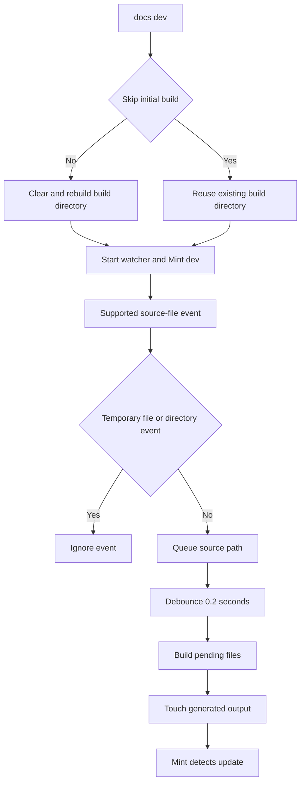

# CLI Tools

This repository has two contributor-facing layers. The `docs` Python CLI owns documentation transformation operations: build, preview, migration, and link-aware moves. The `Makefile` provides checkout-oriented setup, validation, export, sample, and generated-content workflows. Author in `src/`; treat `build/` as disposable Mintlify input produced by the pipeline.

## Entry points and setup

The project script is `docs = "pipeline.cli:main"`. From a checkout, use `uv run pipeline <command>`; after installation, `docs <command>` invokes the same entry point. `make dev` and `make build` are convenience wrappers that run `npm install`, set `PYTHONPATH=$(CURDIR)`, and invoke the corresponding pipeline command.

```bash
make install
make build
make dev
uv run pipeline migrate legacy/guide.md --dry-run
uv run pipeline mv old.mdx new.mdx --dry-run
```

`make install` synchronizes all uv dependency groups, installs local npm dependencies and the global Mint CLI, and links skills. Mint is a separate npm global executable, not part of the Python CLI. CLI logging goes to stderr at INFO level in `LEVELNAME - message` form, so command progress and errors have a common interface.

## Choose the boundary before choosing a command

A full build replaces `build/`; an incremental preview changes only queued files; source checks do not prove that Mint can render generated output. Start with the narrowest operation that owns the relevant boundary, then run the broader generated-site check when a change crosses it.

| Boundary | Command | Reads and produces | Use it when |
| --- | --- | --- | --- |
| Clean generated site | `make build` or `docs build` | `src/` → replacement `build/` | Routing, navigation, shared files, deletions, generated snippets, or stale preview state changed. |
| Local preview | `make dev` or `docs dev` | Initial full build by default, then changed source paths → `build/` | Editing a supported source file and inspecting Mint locally. |
| Source structural check | `make check-cross-refs` | Authored `@[ref]` usages and link map; no site build | Changing semantic cross-references or their map. |
| Fresh rendered-site check | `make broken-links-with-anchors` | Fresh `build/`, then Mint link, redirect, and anchor reports | Changing routes, ordinary links, redirects, headings, or generated output. |
| Existing export archive | `make htmltest` | An existing `EXPORT_ZIP` unpacked for external-link testing | An export was already created and external-resource coverage is wanted. |
| Live examples | `make test-code-samples` | Programs in `src/code-samples/` | Changing a runnable sample; account for credentials and services. |
| Generated snippets | `make code-snippets` | Samples → extracted snippets → importable MDX | Changing snippet markers or code-sample content. |

Targets with a `build` prerequisite are not validators of a pre-existing tree: `build` is phony, so `make broken-links`, `make broken-links-with-anchors`, `make check-openapi`, and `make export` rebuild first. Conversely, `make htmltest`, source linters, `make test`, `make check-cross-refs`, and sample targets do not build the site.

## Build and preview

### Full build: `make build` / `docs build`

```bash
make build
# Direct CLI equivalent
uv run pipeline build
```

`docs build` requires `src/`, ensures `build/` exists, and delegates to `DocumentationBuilder`. Its `build_all()` lifecycle then deletes and recreates `build/` before emitting the versioned and unversioned documentation trees, copying shared files and npm snippet components. A full build is therefore the reset operation: manual edits under `build/` will be lost.

Although argument parsing accepts `docs build --watch`, `build_command()` does not consume its arguments. It builds once and exits; `docs dev` is the supported watch command.

### Local preview: `make dev` / `docs dev`

Development mode normally runs that full build, starts a recursive watcher on `src/`, and starts `mint dev --port 3000` with `build/` as its working directory. Use `--skip-build` only to resume with a suitable existing generated tree; it merely warns when `build/` is absent.


```mermaid
flowchart TD
    Start["docs dev"] --> Choice{"Skip initial build"}
    Choice -->|"No"| Full["Clear and rebuild build directory"]
    Choice -->|"Yes"| Reuse["Reuse existing build directory"]
    Full --> Services["Start watcher and Mint dev"]
    Reuse --> Services
    Services --> Change["Supported source-file event"]
    Change --> Filter{"Temporary file or directory event"}
    Filter -->|"Yes"| Ignore["Ignore event"]
    Filter -->|"No"| Queue["Queue source path"]
    Queue --> Delay["Debounce 0.2 seconds"]
    Delay --> Incremental["Build pending files"]
    Incremental --> Touch["Touch generated output"]
    Touch --> Reload["Mint detects update"]
```

This is the `docs dev` control flow: a full build establishes the tree, while later supported changes are incremental.

The watcher ignores directories, editor backups ending in `~`, `.bak`, or `.orig`, and hidden temporary files ending in `.tmp`, `.temp`, or `.swp`. It deduplicates queued supported paths, waits 0.2 seconds, asynchronously builds the batch, then touches output so Mint reloads. This is not a substitute for a full build: whole-tree work is not repeated by the watcher, and deletion handling removes only the source-relative output path.

If the initial build fails, dev returns 1 before starting services. After startup, Mint stdout/stderr is forwarded to logging; a nonzero Mint exit or an unexpectedly stopped watcher fails the command. Ctrl+C shuts down the watcher and terminates Mint, killing it after five seconds if necessary. A missing `mint` executable also returns 1 with installation guidance.

## Migration and source refactoring

Migration and move commands operate on the paths supplied in source control, not on `build/`. Prefer `--dry-run`, review the proposed result, then run the modifying command.

### `docs migrate <path>` and `docs migrate-docusaurus <path>`

`migrate` accepts MkDocs-oriented `.md`, `.markdown`, and `.ipynb` files; a directory is searched recursively. `migrate-docusaurus` also accepts `.mdx` and converts Docusaurus-specific admonitions, tabs, imports, and frontmatter to Mintlify-oriented forms.

```bash
uv run pipeline migrate legacy/ --output converted/
uv run pipeline migrate-docusaurus legacy/guide.mdx --dry-run
```

For each eligible file, the command reads content, converts Markdown through the selected parser, removes `.md`/`.mdx` suffixes from relative links, then either prints converted content for `--dry-run` or creates output parents and writes it. For directory output, the relative layout is retained; regular migration produces `.md`, whereas Docusaurus `.mdx` remains `.mdx`. Without `--output`, Markdown retains its extension, while a successful in-place notebook conversion writes a sibling `.md` and deletes the original notebook.

A missing path exits 1. A `ParseError` reports file and line context without a full traceback, marks that file failed, and permits the rest of a batch to continue; batch processing reports success and failure totals. Unexpected exceptions are logged with traceback context.

### `docs mv <old_path> <new_path>`

```bash
uv run pipeline mv src/langsmith/evaluation.mdx src/langsmith/deploy/evaluation.mdx --dry-run
```

The mover finds the Git root and scans `<root>/src` Markdown, MDX, and notebook Markdown. It rewrites inbound relative cross-references to the new location while preserving anchors, and recalculates internal relative links in the moved Markdown/MDX document or notebook. A dry run reports the planned changes without writing or moving anything.

A real move creates destination parents, appends absolute old and new paths to root-level `link_changes.jsonl`, rewrites inbound links, moves the file, and then updates links within it. It does not update navigation, redirects, or arbitrary prose references; reconcile those authored surfaces and follow a move with a built-site check.

## Make workflows

| Target | Behavior | Operational note |
| --- | --- | --- |
| `make clean` | Removes `build/` and Python cache artifacts. | Discard generated and cache state. |
| `make broken-links` | Rebuilds, then runs `mint broken-links --check-redirects` in `build/`. | Checks current generated links and redirect destinations. |
| `make broken-links-with-anchors` | Same, adding `--check-anchors`. | Use after heading or fragment-link changes. |
| `make check-openapi` | Rebuilds, then runs Mint OpenAPI validation for `build/langsmith/agent-server-openapi.json`. | Use after changing that OpenAPI input. |
| `make export` | Rebuilds and runs `mint export` in `build/`. | Needs a Mint CLI with export support, Node below 25, and the required Mintlify plan. |
| `make htmltest` | Requires an existing `EXPORT_ZIP`, `htmltest`, and `unzip`; unpacks before testing. | It checks the configured external URLs and does not replace Mint route or anchor validation. |
| `make test` | Runs pytest with network sockets disabled except Unix sockets. | Set `TEST_FILE` to focus its default `tests/unit_tests` scope. |
| `make lint`, `make format`, `make format-check` | Check, change, or check Python formatting/lint/type/spelling state. | `format` modifies files; the others should not. |
| `make lint_md`, `make lint_md_fix`, `make lint_prose` | Lint Markdown, apply Markdown fixes, or install/use pinned Vale. | `lint_prose` checks `FILES` when set, otherwise `src/`. |
| `make check-cross-refs` | Validates source `@[ref]` references without a Mint build. | Complementary to, not a replacement for, built-site checks. |
| `make skills` | Links canonical `.agents/skills/` directories into `.claude/skills/`. | Retains pre-existing non-symlink entries and removes stale symlinks. |

The Mint link targets filter deployment-generated OpenAPI and standalone-snippet report noise; they fail only when filtered output still contains reported link entries. `make export-htmltest` is the sequential convenience operation that runs export and then htmltest.

## Samples, snippets, and trace refreshes

`make code-snippets` is a two-stage generated-content refresh:

```text
src/code-samples/ -- extraction --> src/code-samples-generated/ -- MDX generation --> src/snippets/code-samples/
```

Extraction processes marked supported Python, TypeScript, Java, Kotlin, Go, and shell samples. A full run clears prior generated supported outputs. Set `CODE_SNIPPET_SOURCES` to a space-separated list of eligible files beneath `src/code-samples/` to replace only those files' prior outputs; missing, out-of-root, or unsupported selections are errors. Generation writes importable MDX from the extracted files. Edit samples, not either generated directory.

`make test-code-samples` runs all eligible samples or a focused `FILES="path ..."` subset. It preserves the caller environment for credentials and services and dispatches Python, TypeScript, Go, shell, Java, and Kotlin through their respective toolchains. Ordinary failures fail the command. A persistent LangSmith rate limit is retried three times and then recorded as skipped, so a green result with skips is not proof that every sample executed.

`make update-code-sample-traces` enables `CODE_SAMPLE_TRACING=1`, defaults `LANGSMITH_PROJECT` to `docs-code-samples`, runs the chosen samples, and regenerates snippet MDX. It requires `LANGSMITH_API_KEY` to publish trace links. For a successful single-snippet sample, trace collection finds a LangSmith agent-like root run, shares it publicly, and records it in `src/code-samples/trace-links.json`. Files with no or multiple snippet markers receive no link; a trace-collection failure fails the run. Because it publishes public URLs, use intentional credentials and review the manifest diff.

## Served LLM-index validation

`python3 scripts/check_llms_urls.py` is deliberately separate from local builds. It crawls the deployed site's `llms.txt` and nested `/_llms/` indexes, normalizes listed Markdown URLs, fetches the deployed sitemap, and exits nonzero when sitemap pages are absent from the reachable LLM index. It retries dropped connections but not HTTP errors, and accepts `--base-url` for another served Mintlify site. A reported gap is a served-output issue: the repository does not generate those index files, so first verify no custom `llms.txt` was added to the build and then report a Mintlify problem if the served index remains incomplete.

## Focused command sequence

1. For pipeline, parser, or watcher behavior, run `make test TEST_FILE=tests/unit_tests/test_watcher.py` or the closest focused unit test.
2. For `@[ref]` edits, run `make check-cross-refs`.
3. For a prose-only document, use `make lint_prose FILES="src/path/page.mdx"`.
4. For a runnable example, use `make test-code-samples FILES="src/code-samples/..."` and account for live dependencies.
5. After a route, navigation, redirect, snippet, or ordinary-reference change, run `make broken-links-with-anchors`; it rebuilds first.
6. Use `make export-htmltest` only for its distinct export and external-resource coverage.

See [Adding Pages](/openwiki/operations/adding-pages.md), [Cross-References](/openwiki/operations/cross-references.md), [Testing Overview](/openwiki/testing/test-overview.md), and [Local Development Workflow](/openwiki/workflows/local-development.md) for authoring and broader validation guidance.
