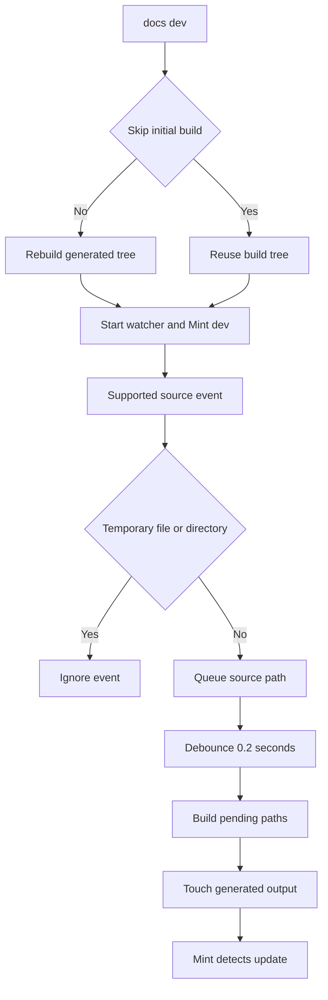

# CLI Tools and Make Targets

The Python `docs` CLI owns documentation transformation and local preview. The `Makefile` supplies checkout-oriented setup, validation, export, sample, and generated-content workflows. Author in `src/`; `build/` is disposable Mintlify input, not an authoring surface. A full build deletes and recreates it, so never hand-edit build artifacts.

## Entry points and setup

The project script is `docs = "pipeline.cli:main"`. From a checkout, use `uv run pipeline <command>`; after installation, `docs <command>` reaches the same entry point. `make build` and `make dev` install local npm dependencies and invoke the corresponding pipeline command with the checkout on `PYTHONPATH`.

```bash
make install
make build
make dev
uv run pipeline migrate legacy/guide.md --dry-run
uv run pipeline mv old.mdx new.mdx --dry-run
```

`make install` synchronizes all uv dependency groups, installs local npm dependencies and the global Mint CLI, then links agent skills. `mint` is a separate npm global binary rather than part of the Python CLI. CLI logs use stderr at INFO level with `LEVELNAME - message` formatting. See [Local Development](/openwiki/workflows/local-development.md) for environment setup and recovery guidance.

## Select the right boundary

| Need | Command | Inputs and outputs | Safety boundary |
| --- | --- | --- | --- |
| Reset generated site | `make build` or `docs build` | `src/` → regenerated `build/` | Destroys prior build output; do not rely on manual files there. |
| Preview changes | `make dev` or `docs dev` | source changes → incremental build output → Mint preview | A preview tree can become stale; run a full build after broad changes. |
| Check source references | `make check-cross-refs` | source `@[ref]` usages and map | Does not render or validate the Mint site. |
| Check generated links | `make broken-links-with-anchors` | fresh `build/` → Mint report | Checks generated output; appropriate after route, redirect, heading, or link changes. |
| Run examples | `make test-code-samples` | executable programs in `src/code-samples/` | Programs inherit credentials and can call live services. |
| Regenerate snippets | `make code-snippets` | samples → intermediate extraction → MDX | Generated directories are outputs, not files to edit. |

`build` is phony. Therefore `make broken-links`, `make broken-links-with-anchors`, `make check-openapi`, and `make export` rebuild before their Mint operation. `make htmltest` instead checks an already-existing export archive; source linters, `make test`, `make check-cross-refs`, and sample targets do not build the site.

## Build and preview

### Full build: `make build` / `docs build`

```bash
make build
# Direct CLI equivalent
uv run pipeline build
```

`docs build` requires `src/`, ensures `build/` exists, and delegates to `DocumentationBuilder`. `build_all()` clears the output directory, emits versioned and unversioned documentation trees, copies shared files, and copies npm snippet components. Treat a full build as the reset operation.

Although argument parsing accepts `docs build --watch`, `build_command()` does not consume its arguments: it builds once and exits. Use `docs dev` for supported watch behavior.

### Local preview: `make dev` / `docs dev`

Development normally performs a full build, watches `src/` recursively, and starts `mint dev --port 3000` with `build/` as its working directory. `--skip-build` is only for resuming with an already suitable build tree; it merely warns if `build/` does not exist.


```mermaid
flowchart TD
  Start["docs dev"] --> Decide{"Skip initial build"}
  Decide -->|"No"| Full["Rebuild generated tree"]
  Decide -->|"Yes"| Reuse["Reuse build tree"]
  Full --> Services["Start watcher and Mint dev"]
  Reuse --> Services
  Services --> Change["Supported source event"]
  Change --> Filter{"Temporary file or directory"}
  Filter -->|"Yes"| Ignore["Ignore event"]
  Filter -->|"No"| Queue["Queue source path"]
  Queue --> Delay["Debounce 0.2 seconds"]
  Delay --> Build["Build pending paths"]
  Build --> Touch["Touch generated output"]
  Touch --> Reload["Mint detects update"]
```

This is the development control flow: an initial full build establishes the generated tree, then supported changes are rebuilt incrementally.

The watcher ignores directories, backup files ending in `~`, `.bak`, or `.orig`, and hidden temporary files ending in `.tmp`, `.temp`, or `.swp`. It deduplicates queued paths, builds the pending batch asynchronously, then touches output for Mint. Deleting a source file removes its corresponding source-relative output path. This incremental loop does not replace a full build for whole-tree changes.

If the initial build fails, development returns 1 before starting services. After startup, Mint stdout and stderr are forwarded to logging; a nonzero Mint exit or unexpectedly stopped watcher fails the command. Ctrl+C shuts down the watcher and terminates Mint, killing it after five seconds if necessary. A missing `mint` executable returns 1 with installation guidance.

## Migration and source refactoring

Migration and move commands operate on supplied source paths, never on `build/`. Prefer `--dry-run`, review the result, then perform the modifying command.

### `docs migrate <path>` and `docs migrate-docusaurus <path>`

`migrate` accepts `.md`, `.markdown`, and `.ipynb` files and searches a directory recursively. `migrate-docusaurus` also accepts `.mdx` and converts Docusaurus admonitions, tabs, imports, and frontmatter to Mintlify-oriented forms.

```bash
uv run pipeline migrate legacy/ --output converted/
uv run pipeline migrate-docusaurus legacy/guide.mdx --dry-run
```

For each file, the command reads content, converts it through the selected parser, removes `.md` and `.mdx` link suffixes, then prints to stdout for `--dry-run` or creates parent directories and writes output. Directory output preserves relative layout; ordinary migration produces `.md`, while Docusaurus `.mdx` remains `.mdx`. Without `--output`, Markdown retains its extension; a successful in-place notebook conversion writes `.md` and deletes the original notebook.

A missing path exits 1. A `ParseError` is reported without a full traceback, marks only that file failed, and lets the remaining batch continue; batches report success and failure totals. Unexpected exceptions include traceback context.

### `docs mv <old_path> <new_path>`

The mover finds the Git root and scans `<root>/src` Markdown, MDX, and notebook Markdown. It rewrites inbound relative cross-references while preserving anchors and recalculates internal relative links in the moved Markdown/MDX file or notebook. `--dry-run` previews without writes or a move.

A real move creates destination parents, records absolute old and new paths in root-level `link_changes.jsonl`, rewrites inbound links, moves the file, then updates links within it. It does not update navigation, redirects, or arbitrary prose references; reconcile those authored surfaces and run a generated-site link check afterward. See [Adding Pages](/openwiki/operations/adding-pages.md) for authoring considerations.

## Make targets for validation and export

| Target | Behavior and requirements |
| --- | --- |
| `make broken-links` | Rebuilds, then runs `mint broken-links --check-redirects` from `build/`. Deployment-generated OpenAPI and standalone-snippet noise are filtered; remaining reported link entries fail the target. |
| `make broken-links-with-anchors` | The same check with `--check-anchors`; use after heading or fragment-link changes. |
| `make check-openapi` | Rebuilds, then validates `build/langsmith/agent-server-openapi.json` with Mint. |
| `make export` | Rebuilds then runs `mint export` in `build/`. Requires a Mint CLI that supports `mint export`, Node 20 or 22 rather than Node 25+, and an Enterprise Mintlify plan. |
| `make htmltest` | Requires a pre-existing `EXPORT_ZIP`, `htmltest`, and `unzip`; it unpacks and runs the configured external-URL check. `make export-htmltest` runs export then this check. |
| `make test` | Runs pytest with network sockets disabled except Unix sockets. `TEST_FILE` narrows its default `tests/unit_tests` scope. |
| `make lint`, `make format`, `make format-check` | Check, modify, or check Python format/lint/type/spelling state. `format` modifies files. |
| `make lint_md`, `make lint_md_fix`, `make lint_prose` | Lint Markdown, apply Markdown fixes, or install and invoke Vale. `lint_prose` uses `FILES` when supplied, otherwise `src/`. |
| `make skills` | Links `.agents/skills/` directories into `.claude/skills/`, retaining non-symlink entries and removing stale symlinks. |

For broader validation selection, see [Testing Overview](/openwiki/testing/test-overview.md) and [Mintlify Integration](/openwiki/integrations/mintlify.md).

## Samples, snippets, and trace refreshes

`make code-snippets` is a two-stage generated-content refresh:

```text
src/code-samples/ -- extraction --> src/code-samples-generated/ -- MDX generation --> src/snippets/code-samples/
```

Extraction processes marked Python, TypeScript, Java, Kotlin, Go, and shell samples. A full run removes prior generated supported intermediate outputs. `CODE_SNIPPET_SOURCES` can restrict extraction to space-separated eligible files beneath `src/code-samples/`, replacing only those files’ prior generated outputs; missing, out-of-root, or unsupported selections fail. Generation scans the intermediate files and writes importable MDX. Edit the sample source, never the intermediate or generated MDX as an authoring shortcut. See [Code Sample Lifecycle](/openwiki/workflows/code-sample-lifecycle.md) for marker and dependency rules.

`make test-code-samples` executes all eligible samples or a focused `FILES="path ..."` set. It preserves the caller environment, including service and credential variables, and dispatches each supported language through its toolchain. Ordinary failures fail the command. A persistent LangSmith rate limit is retried three times and then reported as skipped rather than failed, so successful completion with skips is not proof every sample ran.

`make update-code-sample-traces` sets `CODE_SAMPLE_TRACING=1`, defaults `LANGSMITH_PROJECT` to `docs-code-samples`, executes the chosen samples, and regenerates snippet MDX. It requires `LANGSMITH_API_KEY`: tracing creates or reuses public LangSmith share URLs. For a successful single-snippet sample, collection selects an agent-like root run and records its public URL in `src/code-samples/trace-links.json`; no-marker and multi-marker sources receive no trace link. Trace collection errors fail the sample run. Use intentional credentials and review the manifest and generated-MDX diffs because this workflow publishes links.

## Served LLM-index validation

`python3 scripts/check_llms_urls.py` checks deployed output, not a local build. It crawls the served root `llms.txt` and reachable nested `/_llms/` indexes, compares normalized page URLs with the deployed sitemap, and exits 1 for sitemap pages missing from the index. `--base-url` chooses a served site. It retries dropped connections but not HTTP errors. Since the repository does not generate these index files, first check that no custom `llms.txt` entered the build; report a remaining served-index gap to Mintlify.

## Focused command sequence

1. For pipeline or watcher changes, run the closest focused unit test, for example `make test TEST_FILE=tests/unit_tests/test_watcher.py`.
2. For `@[ref]` edits, run `make check-cross-refs`.
3. For a prose-only page, use `make lint_prose FILES="src/path/page.mdx"`.
4. For a runnable example, run `make test-code-samples FILES="src/code-samples/..."` and provide only the credentials and services it intentionally needs.
5. After route, navigation, redirect, snippet, heading, or ordinary-reference changes, run `make broken-links-with-anchors`; it builds first.
6. Use `make export-htmltest` for its separate exported-site external-link coverage.
