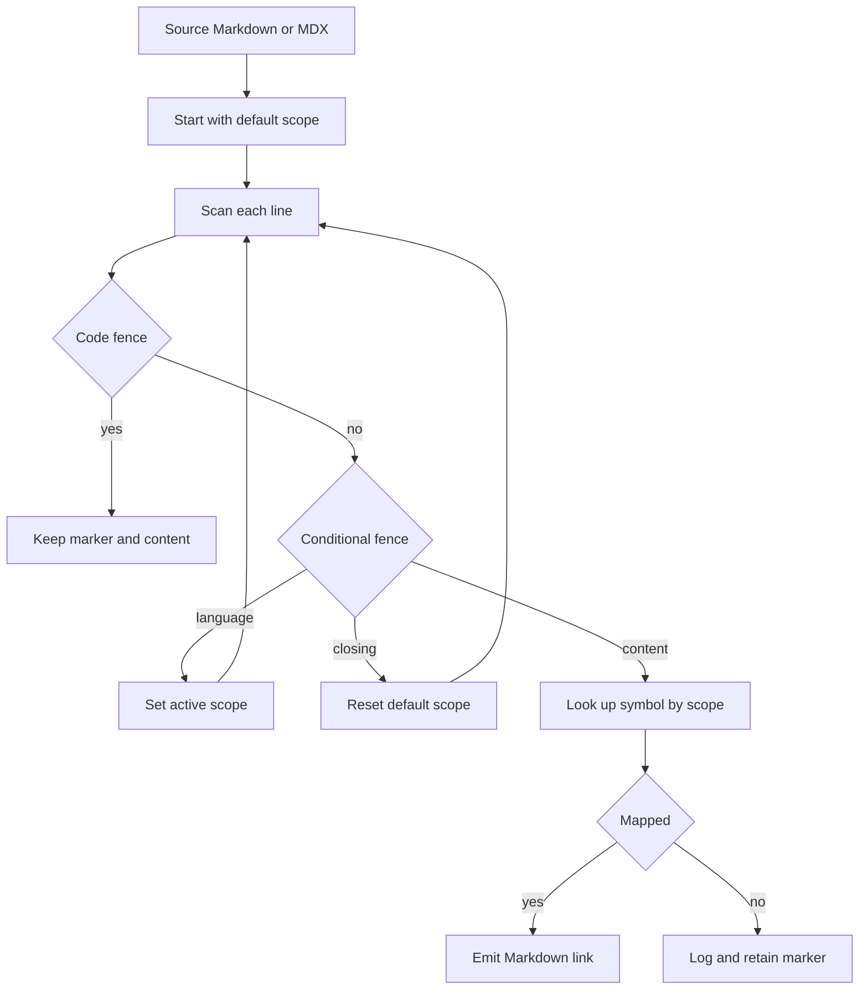

# Cross-References

`@[ref]` is source-level Markdown/MDX syntax for a semantic API-reference link. Rather than hard-coding a destination URL into every page, authors name the API symbol and the preprocessing pipeline resolves it from the map for the active language scope. This keeps destination ownership in `pipeline/preprocessors/link_map.py` and lets shared content point at different Python and JavaScript reference sites.

Cross-reference validation and rendered-site link checking answer different questions:

- `make check-cross-refs` verifies that authored symbolic references in `src/` exist in every scope in which that source can be built.
- `make broken-links` builds the generated `build/` tree and runs `mint broken-links --check-redirects` there. It validates rendered links and redirect destinations after filtering documented exclusions; it does not replace symbolic-map validation.

Run the first command whenever `@[...]` usage or map entries change. Run the Mintlify check when changing ordinary links, routes, redirects, or anchors; use `make broken-links-with-anchors` when anchors also matter. See [Mintlify Integration](/openwiki/integrations/mintlify.md) for the generated-tree boundary.

## Authoring references

Outside a regular fenced code block, the resolver recognizes these forms:

```markdown
Use @[StateGraph] to define a graph.
Read @[the graph reference][StateGraph].
Pass @[`StateGraph`] to make code formatting part of the link text.
```

<!-- openwiki: broken internal link [url] file "url" does not exist. Fix the href or restore the target, then delete this comment. -->
<!-- openwiki: broken internal link [url] file "url" does not exist. Fix the href or restore the target, then delete this comment. -->
A successful lookup emits `[title](url)`. The first form uses `StateGraph` as its title; the second uses the supplied title; the simple backticked form emits ``[`StateGraph`](url)``. A titled reference may wrap its lookup name in backticks, but that does not add backticks to its custom title.

Use a backslash when the marker itself must be shown rather than resolved:

```markdown
Write \@[StateGraph] when documenting the syntax.
```

The resolver does not transform an escaped marker, then its final unescape pass removes the backslash. The rendered result is literal `@[StateGraph]`, including when the escaped marker occurs in a fenced code block.

## Resolution lifecycle and scopes

`preprocess_markdown()` determines a target language (the explicit argument, otherwise `TARGET_LANGUAGE`, otherwise `python`) and uses it as the default reference scope unless a separate `default_scope` is supplied. It resolves references **before** CTA UTM decoration and conditional rendering, because the resolver must see the conditional fences before rendering removes them.



This shows the line-oriented resolver before conditional rendering selects content for one language.

A line matching `:::python` or `:::js` changes the scope for following lines; a bare `:::` resets it to the default. The fence remains in the content for the later conditional-rendering pass. Therefore the same source name may resolve differently inside Python and JavaScript blocks:

```markdown
:::python
@[StateGraph]
:::

:::js
@[StateGraph]
:::
```

Do not author a `global` scope. If it reaches the resolver, it logs an error and falls back to the Python map; a combined global resolver is not implemented.

### Code-fence boundary

The resolver checks for a stripped line beginning with three or more backticks or tildes and toggles an in-code state for every such line. It leaves the fence lines and all enclosed content unchanged, so a conditional-looking line in a code sample cannot alter the active scope. This is a simple toggle rather than full fence matching: delimiters need not match by character or length, and an unclosed recognized fence prevents resolution for the rest of the file. Keep fences balanced.

## Link-map ownership

`LINK_MAPS` is the editable registry, not the individual document. Each entry supplies a `scope`, a `host`, and a `links` dictionary of author-facing names to paths or URLs. At import time, `_enumerate_links()` combines all entries for each supported scope into `SCOPE_LINK_MAPS`: it prefixes a relative value with that entry's host and retains values beginning with `http` as absolute URLs. The resolver reads only the flattened Python or JS map.

To add or correct a destination:

1. Determine the API destination and the scope or scopes that should resolve it.
2. Add the exact symbolic name under the applicable `LINK_MAPS` entry in `pipeline/preprocessors/link_map.py`. Prefer a path relative to that entry's host; use an absolute URL only for a destination outside it.
3. For an unfenced shared `oss/` page, ensure the name exists in both language maps. If it is language-specific, put the use inside the corresponding `:::python` or `:::js` block.
4. Run the validator and focused tests below.

Lookup is an exact dictionary lookup, so spelling and case must match the map key. Different scope maps may intentionally associate one name with different URLs. Repair a moved API destination in the map rather than replacing semantic references across consumer pages.

## Missing references and the authoring gate

An unresolved reference does not stop preprocessing. `_transform_link()` writes an info-level log containing the file path, line, name, and active scope, then leaves the original marker unchanged. This makes the build inspectable but is not a successful documentation change.

Use the strict source check before merge:

```bash
make check-cross-refs
```

The target runs `scripts/check_cross_refs.py`, which recursively scans `.md` and `.mdx` files under `src/`. It reports each unresolved item with source-relative file, line, reference name, and applicable scopes, then exits 1; with no errors it exits 0. The `check-cross-refs` CI job installs the test dependency group and runs this command.

### Checker scope rules

The checker derives defaults from the source-relative path rather than a build environment:

| Location | Required scope for an unfenced reference |
| --- | --- |
| `oss/python/` | `python` |
| `oss/javascript/` | `js` |
| Other `oss/` content | both `python` and `js` |
| Non-OSS content | `python` |

A `:::python` or `:::js` fence narrows checking to that supported scope. A closing or unsupported conditional fence restores the file's default scopes. Shared unfenced OSS content must resolve in **all** of its applicable maps—not merely one—because it is built for both variants.

The checker reuses the resolver's reference and code-fence patterns. It ignores escaped markers and content inside recognized regular code fences, skips `snippets/code-samples/` and paths containing `node_modules`, and warns then skips files that are not valid UTF-8. An unclosed recognized code fence therefore excludes the rest of that file from validation as well. Put deliberately unknown example markers in a code fence or escape them.

## Focused checks and troubleshooting

When changing the resolver, map, fence behavior, or validator, run:

```bash
uv run pytest tests/unit_tests/test_handle_auto_links.py tests/unit_tests/test_check_cross_refs.py -vv
make check-cross-refs
```

The resolver tests exercise replacement outside fences, preservation inside backtick and tilde fences, conditional-looking text in code, escapes, and the unclosed-fence behavior. The checker tests cover path and fenced scope selection, shared-OSS all-scope checking, titled and backticked syntax, multiple references on one line, and exclusions.

| Symptom | Action |
| --- | --- |
| Literal `@[Name]` and an info log after preprocessing | Correct the name, select the intended scope, or add the scoped map entry. |
| Shared OSS reference fails validation | Add the name to both maps or place language-specific use in a language fence. |
| Example marker linked or failed validation | Escape it as `\@[Name]` or place it in a recognized code fence. |
| Later markers were not resolved | Look for an unclosed regular code fence earlier in the file. |
| A name resolves to the wrong destination | Correct the scoped `LINK_MAPS` entry; do not hard-code URLs in consuming pages. |
| Mintlify passes but a symbolic name fails | Run `make check-cross-refs`; rendered-link checking and map validation are separate gates. |

For pipeline ordering and conditional-content semantics, see [Documentation Preprocessing](/openwiki/concepts/preprocessing.md). For authoring workflow, see [Adding and Modifying Documentation Pages](/openwiki/operations/adding-pages.md). For the complete test strategy, see [Test Overview](/openwiki/testing/test-overview.md).
