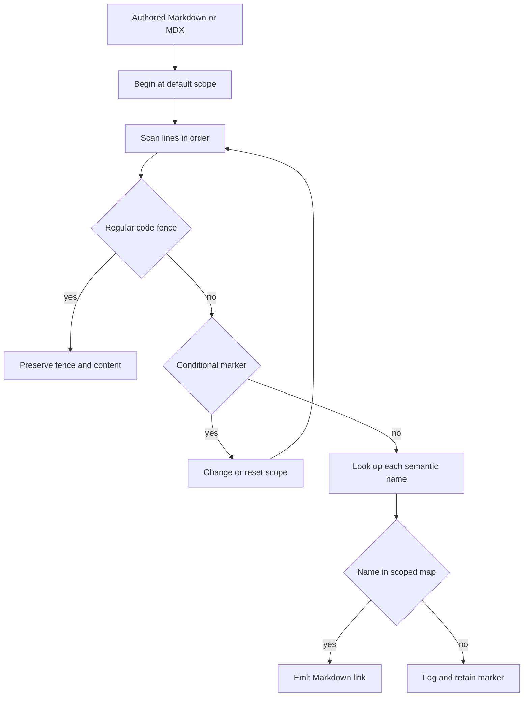

# Cross-Reference Links

`@[ref]` is authoring syntax for a semantic link to an API-reference symbol. It lets Markdown and MDX name a class, method, function, or module without embedding its destination URL. Build preprocessing resolves a known name using the active language scope; the registry owns the destination rather than every document.

This is separate from rendered-link checking. `make check-cross-refs` verifies symbolic names directly against the local scoped map. `make broken-links` first builds the documentation, then runs Mintlify against generated output with redirect checks and filters known non-actionable reports. Run the cross-reference check whenever `@[...]` syntax or map entries change; run a rendered-site check when routes, ordinary links, anchors, or redirects also change.

## Authoring syntax

Use these forms outside a regular fenced code block:

````markdown
Use @[StateGraph] to define a graph.
Read @[the graph reference][StateGraph].
Pass @[`StateGraph`] to make code formatting part of the link text.
````

<!-- openwiki: broken internal link [url] file "url" does not exist. Fix the href or restore the target, then delete this comment. -->
A resolved marker becomes an ordinary Markdown `[title](url)` link. The custom-title form is `@[title][ref]`. Backticks can wrap the reference in either form, but they are automatically retained in the rendered title only for the simple backticked form.

To show the marker rather than link it, escape the at sign:

```markdown
Write \@[StateGraph] when documenting the syntax.
```

The matcher does not replace an escaped marker. Its final unescape pass removes the backslash, so the generated output shows literal `@[StateGraph]`; that unescape also occurs when the escaped marker is inside a regular code fence.

## Resolution in the build

`DocumentationBuilder` sends regular Markdown through `preprocess_markdown()` and sends each Markdown snippet through the same preprocessor for its language-specific copies. `preprocess_markdown()` determines `target_language` from its argument or `TARGET_LANGUAGE` (defaulting to `python`), uses that as `default_scope` unless supplied separately, then runs cross-reference resolution before CTA decoration and conditional rendering. This ordering is required: the resolver must see conditional fences before rendering removes or retains their content.



This flow shows the line-oriented autolink pass, which runs before conditional rendering.

A line matching `:::language` changes the resolver's current scope to the lowercased identifier; a bare `:::` resets it to `default_scope`. The marker is retained for later conditional rendering, and the changed scope applies to following lines. In normal authoring, use only the supported `:::python` and `:::js` branches:

````markdown
:::python
@[StateGraph]
:::

:::js
@[StateGraph]
:::
````

The same name can therefore produce Python and JavaScript destinations. Do not use an unsupported conditional label for cross-references: the resolver will attempt that label as a map scope, whereas conditional rendering preserves unsupported blocks and the validator resets to the file's default scopes. This mismatch can leave a literal marker in generated output even when the source check passes. Likewise, do not use `global`: runtime resolution logs an error and falls back to the Python map rather than combining both maps.

### Regular code-fence boundary

The resolver treats a stripped line that begins with at least three backticks or tildes as a fence marker and toggles one `in_code_block_fence` state. It copies the marker and all enclosed lines unchanged, so a conditional-looking line inside code cannot change scope. An unclosed recognized fence leaves the remaining document untransformed.

This is a simple toggle, not full CommonMark delimiter matching: it does not check that closing delimiter type or length matches the opening delimiter. Keep fenced examples balanced. The strict source validator uses the same fence pattern and toggle behavior, so an unclosed fence also excludes the remaining source from cross-reference validation.

## Link-map ownership

`pipeline/preprocessors/link_map.py` is the editable registry. Each `LINK_MAPS` entry has a `scope`, `host`, and `links` mapping from authored symbol to destination path. `_enumerate_links()` merges entries for a scope into `SCOPE_LINK_MAPS`, prefixing relative values with the entry host while retaining values beginning with `http` as absolute URLs. The resolver and validator consume the flattened map.

To add or repair a target:

1. Identify the reference destination and the scope or scopes where it exists.
2. Add the exact authored name under the appropriate `LINK_MAPS` entry. Use a relative target under that entry's `host` unless the target is external to that host.
3. For an unfenced shared `src/oss/` page, ensure the name exists in both Python and JavaScript maps. Otherwise place a language-specific use inside its matching `:::python` or `:::js` branch.
4. Run the source validator and focused tests. If a reference destination moves, update the map rather than hard-coding its URL in consuming documents.

Lookup is exact dictionary lookup. A name may intentionally have different destinations in each scope, and map keys may include supported punctuation such as method or decorator names.

## Source validation versus rendered links

Preprocessing is intentionally non-fatal for a missing name. `_transform_link()` logs an info-level message containing the file path, line number, name, and active scope, then leaves the original marker in the artifact. Treat that as an authoring defect even though the build can continue.

Use the strict source gate before merge:

```bash
make check-cross-refs
```

The target sets `PYTHONPATH` to the checkout and runs `uv run python scripts/check_cross_refs.py`. The script recursively scans `.md` and `.mdx` files below `src/`; it exits 1 for unresolved eligible references and reports the source-relative file, line, marker name, and required scope list. It skips invalid UTF-8 files with a warning, `snippets/code-samples/`, and paths containing `node_modules`.

The validator selects default scopes from the source-relative path:

| Location | Required scope or scopes for an unfenced reference |
| --- | --- |
| `oss/python/` | `python` |
| `oss/javascript/` | `js` |
| Other `oss/` content | `python` and `js` |
| Content outside `oss/` | `python` |

A `:::python` or `:::js` marker narrows validation to that one scope. Any other conditional marker, including a closing `:::`, restores the path-derived defaults. For shared `oss/` content, every unfenced name must resolve in **all** applicable maps—not merely one—because shared content is emitted for each language.

The checker ignores escaped markers and references inside recognized regular fences. Put intentionally unknown examples in such a fence or escape them; otherwise they fail the source gate. CI has a dedicated `check-cross-refs` job that installs the test dependency group and runs this Make target.

For a generated-site check, use `make broken-links` or `make broken-links-with-anchors`. These targets build first and run Mintlify from `build/`; the latter additionally checks anchors. The reusable CI link workflow runs the anchor-aware target. Passing either rendered check does not prove that all symbolic references exist in every relevant scope, and passing the source check does not verify routes, redirects, or rendered anchors.

## Focused verification and troubleshooting

When changing resolver, map, fence, or checker behavior, run:

```bash
uv run pytest tests/unit_tests/test_handle_auto_links.py tests/unit_tests/test_check_cross_refs.py -vv
make check-cross-refs
```

Resolver tests cover replacement outside fences, preservation in backtick, tilde, extended, indented, labelled, and unclosed fences; scope stability when a conditional-looking line occurs in code; whitespace; escapes; and regex-like code text. Checker tests cover Python and JavaScript selection, the all-scopes invariant for shared OSS pages, titled and backticked forms, multiple markers on one line, and code-fence, escaped-marker, and code-sample exclusions.

| Symptom | Meaning and action |
| --- | --- |
| Literal `@[Name]` plus an info log after preprocessing | `Name` is absent from the active map. Correct spelling, use the intended supported branch, or add the scoped entry. |
| Shared OSS reference fails validation | It is absent from at least one required map. Add both mappings or move language-specific content into a supported branch. |
| An example unexpectedly linked or failed validation | Use a recognized backtick or tilde fence, or write `\@[Name]` in prose. |
| A later reference was not linked or checked | Find and close an earlier regular code fence. |
| Destination is wrong but the name resolves | Repair the scoped `LINK_MAPS` value, rather than replacing semantic references with hard-coded URLs. |
| `make broken-links` passes but cross-reference validation fails | The checks cover different contracts. Run `make check-cross-refs` to validate symbolic names and scopes. |

For the broader pipeline order, see [Markdown Preprocessing Pipeline](/openwiki/concepts/preprocessing.md). [Reference Documentation Integration](/openwiki/integrations/reference-docs.md) describes the boundary between this registry and external API-reference sites. [Documentation CLI Tools](/openwiki/operations/cli-tools.md) covers Make target prerequisites, and [Versioned Content](/openwiki/workflows/versioned-content.md) explains shared language branches.
