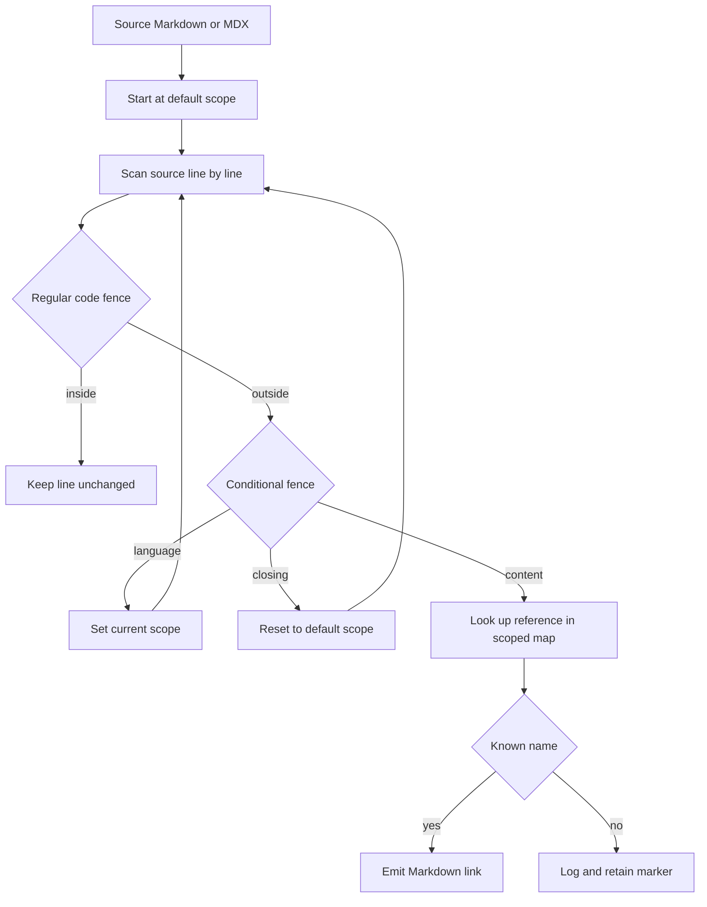

# Cross-Reference Links

`@[ref]` is authoring syntax for a semantic link to an API reference symbol. It lets source Markdown and MDX name an API class, method, function, or module without embedding its destination URL. During preprocessing, a known name becomes an ordinary Markdown link using the active API scope; the registry, rather than every document, owns the destination.

This is not the same as a site link. `@[...]` targets are generally external SDK/API-reference URLs assembled from `pipeline/preprocessors/link_map.py`; `make check-cross-refs` verifies that the symbolic name exists in every applicable map. In contrast, `make broken-links` builds the documentation and asks Mintlify to check rendered links. Run the cross-reference check whenever `@[...]` syntax or map entries change; run the built-site check when routes, ordinary links, or anchors also need verification.

## Authoring syntax

Use one of these forms outside a regular fenced code block:

```markdown
Use @[StateGraph] to define a graph.
Read @[the graph reference][StateGraph].
Pass @[`StateGraph`] to make code formatting part of the link text.
```

<!-- openwiki: broken internal link [url] file "url" does not exist. Fix the href or restore the target, then delete this comment. -->
<!-- openwiki: broken internal link [url] file "url" does not exist. Fix the href or restore the target, then delete this comment. -->
<!-- openwiki: broken internal link [url] file "url" does not exist. Fix the href or restore the target, then delete this comment. -->
They render respectively as `[StateGraph](url)`, `[the graph reference](url)`, and ``[`StateGraph`](url)`` when `StateGraph` resolves in the active scope. The custom-title form is `@[title][ref]`; backticks may also wrap the reference name in that form, but backticks are only added automatically to the title for the simple backticked form.

To show the marker itself rather than link it, escape the at sign:

```markdown
Write \@[StateGraph] when documenting the syntax.
```

The resolver skips the escaped marker and its final unescape pass removes the backslash, leaving literal `@[StateGraph]` in output. That final unescape also applies to escaped markers inside a fenced code block.

## Resolution and scope

`replace_autolinks()` is invoked by `preprocess_markdown()` for pages and language-specific snippet copies. It starts with `default_scope`, which defaults to the selected `target_language`; absent an explicit target, that target comes from `TARGET_LANGUAGE` and defaults to `python`. It then scans source line by line, replacing every recognized marker using the current scope. The later conditional-rendering pass removes or retains supported language blocks, so references must be resolved while their fences are still present.



This diagram shows the autolink resolver's line-oriented scope and fence decisions before conditional rendering.

A top-level `:::python` or `:::js` line changes the current scope, and a bare closing `:::` resets it to the default scope. The conditional marker itself is retained for the later rendering pass. Scope therefore remains in effect on subsequent lines until another matching conditional marker changes or resets it.

```markdown
:::python
@[StateGraph]
:::

:::js
@[StateGraph]
:::
```

The same name can produce distinct Python and JavaScript destinations. Do not use `global` as an authoring scope: the resolver currently logs an error and falls back to the Python map rather than combining both maps.

### Fenced-code behavior

This behavior is implementation-specific rather than general Markdown advice. The resolver treats a stripped line beginning with at least three backticks or tildes as a code-fence marker, toggles a single in-code state, and copies both markers and enclosed lines unchanged. Thus references in three-or-more backtick or tilde fences—including indented or language-labelled fences—are not transformed, and a conditional-looking line inside one cannot change scope. An unclosed recognized fence suppresses autolinking for the remainder of the document.

Because that state is only a toggle, keep fence delimiters balanced and consistent. The resolver does not validate matching delimiter type or length; it simply toggles whenever a line matches the fence pattern.

## The link-map boundary

`LINK_MAPS` is the editable registry. Each `LinkMap` has a `scope`, a `host`, and a `links` mapping from author-facing symbol name to destination path. Multiple entries may contribute to the same scope. At import time, `_enumerate_links()` merges those entries into `SCOPE_LINK_MAPS`: relative paths receive that entry's host, while values beginning with `http` are kept as absolute URLs. The resolver only consults this flattened map.

To add or repair a link:

1. Find the intended reference destination and choose the applicable scope or scopes.
2. Add the exact authored name and a relative path under the relevant `LINK_MAPS` entry in `pipeline/preprocessors/link_map.py`. Use an absolute URL only when the target is outside that map's host.
3. For shared OSS content, add the name to both maps when it is used outside a language fence. Otherwise, place a language-specific use inside `:::python` or `:::js` and map it only where it exists.
4. Run the validator and focused tests below. If a reference site moved, update the registry entry rather than hard-coded document URLs.

Name matching is exact and case-sensitive dictionary lookup. A map can deliberately send the same symbol to different destinations in the two scopes; it can also contain keys with punctuation, such as a method name or a decorator-style name, when the authoring pattern permits that name.

## Unresolved references and validation

Preprocessing is intentionally non-fatal for an unresolved reference. When a key is absent from the current map, `_transform_link()` writes an info-level message with the file path, line number, name, and scope, and retains the original `@[...]` text. This makes build output inspectable but is not a passing authoring result.

Use the strict source validator before merge:

```bash
make check-cross-refs
```

The target runs `scripts/check_cross_refs.py`. It scans `src/` recursively for `.md` and `.mdx` files, shares the resolver's cross-reference and fence patterns, and exits 1 if any eligible reference is unresolved. Its report identifies the source-relative file, line, marker name, and scope list. Invalid UTF-8 files are skipped with a warning; `snippets/code-samples/` and paths containing `node_modules` are excluded.

The validator assigns default scopes from path, independently of the build invocation:

| Source-relative location | Scope(s) required for an unfenced reference |
| --- | --- |
| `oss/python/` | `python` |
| `oss/javascript/` | `js` |
| Other `oss/` content | `python` and `js` |
| Non-OSS content | `python` |

Within a top-level `:::python` or `:::js` region it checks only that named scope; an unsupported or closing conditional marker restores the file's default scope list. In shared `oss/` content, an unfenced name must resolve in **all** applicable maps, not merely one—otherwise one emitted language version would retain the unresolved marker.

The checker deliberately ignores references inside recognized regular fenced code blocks and ignores escaped `\@[...]` markers. Like the resolver, an unclosed recognized code fence causes the remaining source to be ignored by this check. This exclusion is why an example containing an intentionally unknown marker belongs in a code fence or should be escaped, not left as an ordinary prose marker.

The `check-cross-refs` CI job runs this command with Python dependencies installed, so an unresolved eligible reference fails that job even though preprocessing itself only logs it.

## Maintenance and focused tests

Use these focused tests when changing resolver, map, fence, or validator behavior:

```bash
uv run pytest tests/unit_tests/test_handle_auto_links.py tests/unit_tests/test_check_cross_refs.py -vv
```

The resolver tests cover replacement outside fences; preservation in backtick, tilde, extended, indented, labelled, and unclosed fences; scope stability when a conditional-looking line occurs in code; whitespace preservation; escaped markers; and regex-like code text. The validator tests cover Python and JavaScript scope selection, the all-scopes invariant for shared OSS pages, titled and backticked syntax, multiple markers on one line, and the code-fence, escaped-marker, and code-sample exclusions.

For a documentation change, follow the page-authoring workflow in [Adding and Modifying Documentation Pages](/openwiki/operations/adding-pages.md). For pipeline ordering and the broader build lifecycle, see [Markdown Preprocessing Pipeline](/openwiki/concepts/preprocessing.md). The [Reference Documentation Integration](/openwiki/integrations/reference-docs.md) page explains the ownership boundary between this semantic-link registry and separately generated API-reference sites.

## Troubleshooting

| Symptom | Meaning and action |
| --- | --- |
| Literal `@[Name]` after preprocessing with an info log | `Name` is absent from the active map. Correct the spelling, select the intended fence scope, or add the map entry. |
| Validator reports an unfenced shared OSS reference | It is missing from at least one of the Python and JavaScript maps. Add both entries or fence language-specific content. |
| A marker in an example unexpectedly linked or failed validation | Put the example in a recognized backtick/tilde fence, or escape it as `\@[Name]` when it must remain prose. |
| A later reference was not linked | Check for an unclosed regular code fence; it protects all remaining lines from resolver and validator processing. |
| Link destination is wrong but the name resolves | Repair the scoped `LINK_MAPS` value. Do not substitute a hard-coded URL in each consuming page. |
| `make broken-links` passes but semantic references fail | These are separate gates. Run `make check-cross-refs` to validate symbolic names and their applicable scopes. |
